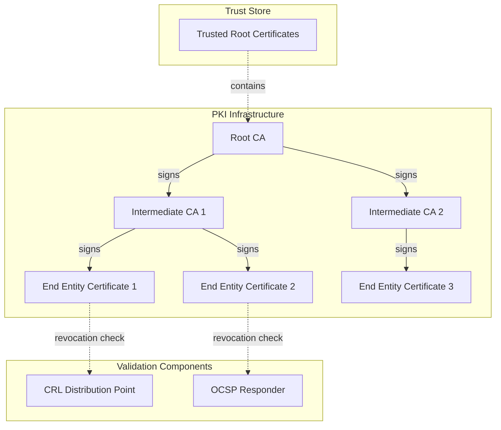
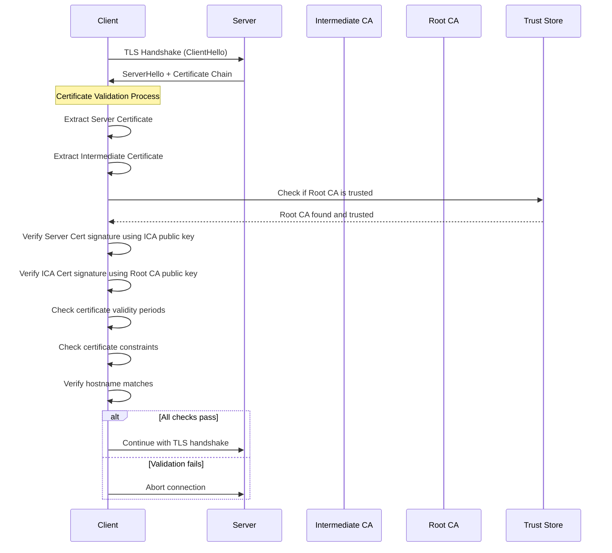

# PKI (Public Key Infrastructure)

PKI（公開鍵基盤）は、公開鍵暗号方式を用いてデジタル証明書の発行、管理、配布、使用、保存、失効を行うための包括的なシステムである。インターネット上での安全な通信を実現する上で不可欠な技術基盤として、HTTPSをはじめとする様々なセキュアプロトコルの根幹を支えている。

## 公開鍵暗号方式とPKIの必要性

公開鍵暗号方式では、数学的に関連付けられた鍵ペア（公開鍵と秘密鍵）を使用して暗号化と復号化を行う。この方式は共通鍵暗号方式が抱える鍵配送問題を解決する画期的な仕組みだが、新たな問題を生み出した。それは「公開鍵の真正性をどのように保証するか」という問題である。

攻撃者が正規のサーバーになりすまして偽の公開鍵を配布した場合、通信内容が盗聴される可能性がある。この中間者攻撃（Man-in-the-Middle Attack）を防ぐためには、公開鍵が確かに意図した通信相手のものであることを検証する仕組みが必要となる。PKIはまさにこの問題を解決するために設計された。

## デジタル証明書の構造と仕組み

PKIの中核を成すのがデジタル証明書である。最も広く使用されているX.509証明書^[1]は、ITU-T（国際電気通信連合電気通信標準化部門）によって標準化された形式で、以下の主要な情報を含んでいる。

証明書の基本構造は、証明書本体（TBSCertificate: To Be Signed Certificate）、署名アルゴリズム識別子、そして署名値の3つの部分から構成される。証明書本体には、バージョン番号、シリアル番号、署名アルゴリズム、発行者識別名（Issuer DN）、有効期間、サブジェクト識別名（Subject DN）、公開鍵情報、そして拡張領域が含まれる。

特に重要なのは拡張領域で、ここにはキー使用目的（Key Usage）、拡張キー使用目的（Extended Key Usage）、サブジェクト代替名（Subject Alternative Name）などの追加情報が格納される。これらの拡張は証明書の用途を制限し、セキュリティを向上させる役割を果たす。

証明書の署名プロセスは以下の手順で行われる。まず、証明書本体のDERエンコードされたバイト列に対してハッシュ関数（SHA-256など）を適用し、ハッシュ値を計算する。次に、認証局の秘密鍵を使用してこのハッシュ値に対してデジタル署名を生成する。この署名が証明書に付加されることで、証明書の完全性と真正性が保証される。

## 認証局の階層構造と信頼チェーン

PKIは階層的な信頼モデルを採用している。最上位にはルート認証局（Root CA）が位置し、その下に中間認証局（Intermediate CA）が配置される。エンドエンティティ証明書は通常、中間認証局によって発行される。

この階層構造には重要な理由がある。ルート認証局の秘密鍵は極めて重要であり、その漏洩は信頼チェーン全体の崩壊を意味する。そのため、ルート認証局の秘密鍵はオフラインで厳重に管理され、日常的な証明書発行業務には使用されない。代わりに、中間認証局が実際の証明書発行を担当することで、セキュリティリスクを分散している。

信頼チェーンの検証は、エンドエンティティ証明書から始まり、ルート認証局まで遡る形で行われる。各段階で、下位の証明書が上位の認証局によって正しく署名されていることを確認する。この過程で、証明書の有効期限、使用目的の制約、名前制約などもチェックされる。

## 証明書の失効メカニズム

証明書は発行時に有効期限が設定されるが、秘密鍵の漏洩や組織の変更などにより、有効期限前に失効させる必要が生じることがある。PKIは主に2つの失効確認メカニズムを提供している。

CRL（Certificate Revocation List）^[2]は、失効した証明書のシリアル番号のリストを含む、認証局によって定期的に発行される署名付きデータ構造である。クライアントは証明書を検証する際に、最新のCRLをダウンロードして失効状態を確認する。しかし、CRLは時間の経過とともにサイズが増大し、ダウンロードに時間がかかるという問題がある。

OCSP（Online Certificate Status Protocol）^[3]は、CRLの問題を解決するために設計されたプロトコルである。クライアントは特定の証明書の状態についてOCSPレスポンダーに問い合わせ、リアルタイムで応答を得ることができる。OCSPは効率的だが、プライバシーの懸念（アクセス先がOCSPレスポンダーに知られる）や可用性の問題（OCSPレスポンダーがダウンしていると検証できない）がある。

これらの問題に対処するため、OCSP Staplingという技術が開発された。サーバーが事前にOCSP応答を取得し、TLSハンドシェイク時にクライアントに提供することで、クライアントが直接OCSPレスポンダーに問い合わせる必要をなくしている。

## 実装における課題とトレードオフ

PKIの実装と運用には様々な課題が存在する。まず、証明書の検証に関するトレードオフがある。厳密な検証（CRL/OCSPチェックを含む）はセキュリティを向上させるが、パフォーマンスの低下やネットワーク障害時の可用性の問題を引き起こす。多くのブラウザは「ソフトフェイル」アプローチを採用し、失効確認が失敗した場合でも接続を許可している。

証明書の有効期限も重要な設計上の決定事項である。短い有効期限は、鍵の漏洩時の影響を限定し、暗号アルゴリズムの移行を容易にする。一方で、頻繁な更新作業が必要となり、運用負荷が増大する。Let's Encryptのような自動化されたCAの登場により、90日という短い有効期限の証明書が実用的になった。

ルート証明書の管理も大きな課題である。新しいルート証明書をトラストストアに追加するには、OSやブラウザベンダーとの調整が必要で、数年単位の時間がかかることがある。また、古いルート証明書の削除も、互換性の問題から慎重に行う必要がある。

## 暗号アルゴリズムの移行

PKIで使用される暗号アルゴリズムは、計算能力の向上や新しい攻撃手法の発見により、定期的に更新する必要がある。RSA 1024ビットからRSA 2048ビット、さらにはECDSAへの移行が進んでいる。SHA-1からSHA-256への移行は特に困難で、多くのレガシーシステムとの互換性問題を引き起こした。

量子コンピュータの実用化が近づく中、ポスト量子暗号への移行も視野に入ってきている。NIST（米国国立標準技術研究所）は2022年にポスト量子暗号の標準化候補を発表し^[4]、PKIインフラストラクチャの大規模な更新が必要になることが予想される。

## 実践的な実装指針

PKIを実装する際には、以下の点に注意する必要がある。証明書の検証では、信頼チェーンの完全な検証に加えて、ホスト名の検証、有効期限のチェック、キー使用目的の確認を確実に行う。特にホスト名検証は、RFC 6125^[5]に従って実装する必要がある。

証明書ピンニングは、特定の証明書または公開鍵を事前に登録し、それ以外を拒否することで、不正な証明書の使用を防ぐ技術である。モバイルアプリケーションなど、更新が困難な環境では慎重に使用する必要がある。ピンの更新戦略を事前に計画し、バックアップピンを設定することが重要である。

証明書の透明性（Certificate Transparency）^[6]は、すべての証明書発行をパブリックログに記録することで、不正な証明書の発行を検出可能にする仕組みである。2018年以降、主要なブラウザはCT対応を必須としており、証明書発行時にはSCT（Signed Certificate Timestamp）の取得が必要となっている。

PKIは現代のインターネットセキュリティの基盤として機能しているが、その複雑性ゆえに正しい実装と運用には深い理解が必要である。暗号技術の進化、新しい脅威の出現、そして量子コンピュータの登場により、PKIも継続的に進化していく必要がある。エンジニアとしては、これらの動向を注視しながら、セキュリティと実用性のバランスを取った実装を心がけることが重要である。

---

^[1]: ITU-T Recommendation X.509 (10/2019) - Information technology - Open Systems Interconnection - The Directory: Public-key and attribute certificate frameworks

^[2]: RFC 5280 - Internet X.509 Public Key Infrastructure Certificate and Certificate Revocation List (CRL) Profile

^[3]: RFC 6960 - X.509 Internet Public Key Infrastructure Online Certificate Status Protocol - OCSP

^[4]: NIST Post-Quantum Cryptography Standardization - https://csrc.nist.gov/projects/post-quantum-cryptography

^[5]: RFC 6125 - Representation and Verification of Domain-Based Application Service Identity within Internet Public Key Infrastructure Using X.509 (PKIX) Certificates in the Context of Transport Layer Security (TLS)

^[6]: RFC 9162 - Certificate Transparency Version 2.0