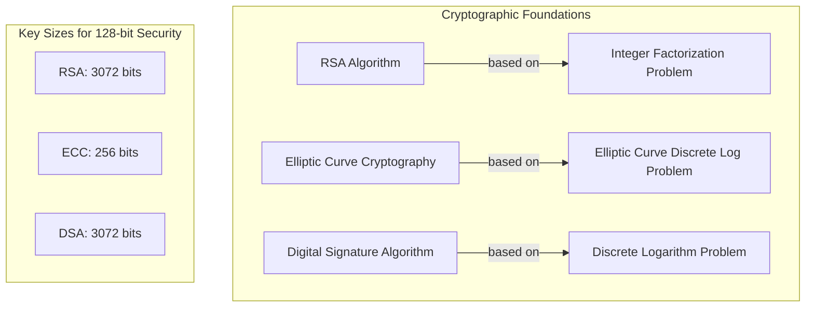
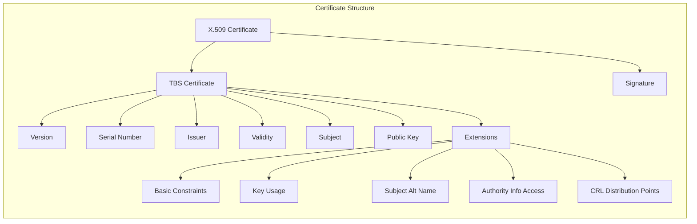
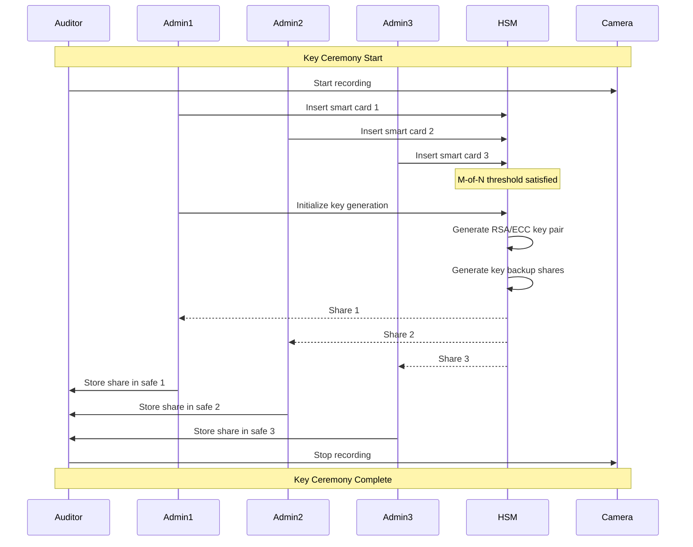
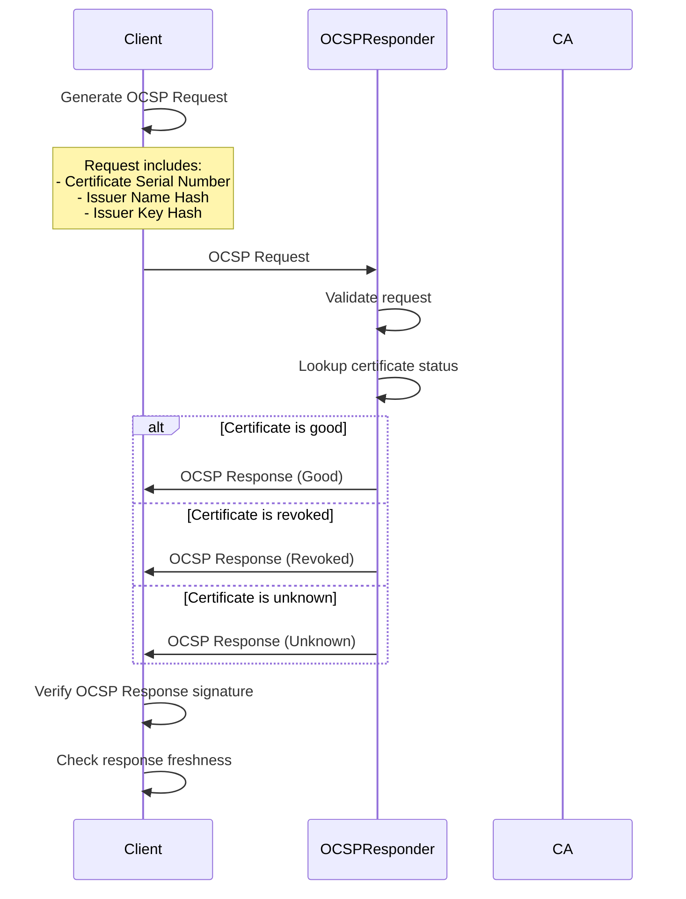
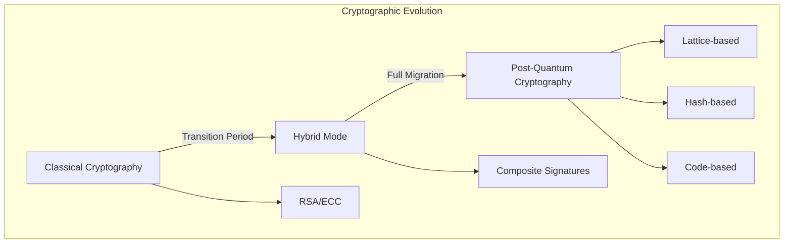
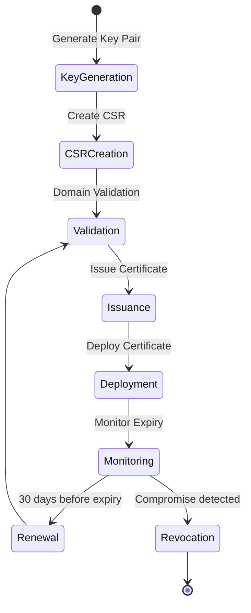

# PKI (Public Key Infrastructure)

PKI（公開鍵基盤）は、公開鍵暗号方式を用いてデジタル証明書の発行、管理、配布、使用、保存、失効を行うための包括的なシステムである。インターネット上での安全な通信を実現する上で不可欠な技術基盤として、HTTPSをはじめとする様々なセキュアプロトコルの根幹を支えている。PKIは単なる技術的な仕組みではなく、技術、プロセス、ポリシー、そして人的要素を含む総合的な信頼基盤である。

## 公開鍵暗号方式の数学的基盤

PKIの理解には、その基礎となる公開鍵暗号方式の数学的原理を理解することが不可欠である。公開鍵暗号は、1976年にWhitfield DiffieとMartin Hellmanによって提案された概念[^1]であり、それまでの対称鍵暗号が抱えていた鍵配送問題を革新的に解決した。

[^1]: Diffie, W., & Hellman, M. (1976). New directions in cryptography. IEEE Transactions on Information Theory, 22(6), 644-654.

### RSA暗号の数学的構造

RSA暗号は、1977年にRivest、Shamir、Adlemanによって発明された[^2]、最も広く使用される公開鍵暗号アルゴリズムである。その安全性は大きな合成数の素因数分解の計算量的困難性に基づいている。

[^2]: Rivest, R. L., Shamir, A., & Adleman, L. (1978). A method for obtaining digital signatures and public-key cryptosystems. Communications of the ACM, 21(2), 120-126.

RSAの鍵生成プロセスは以下の手順で行われる：

1. 二つの大きな素数 $p$ と $q$ を選ぶ（現在は各2048ビット以上が推奨）
2. $n = p \times q$ を計算（これがモジュラスとなる）
3. オイラーのトーシェント関数 $\phi(n) = (p-1)(q-1)$ を計算
4. $1 < e < \phi(n)$ かつ $\gcd(e, \phi(n)) = 1$ となる $e$ を選ぶ（通常は65537）
5. $e \times d \equiv 1 \pmod{\phi(n)}$ となる $d$ を計算

公開鍵は $(n, e)$、秘密鍵は $(n, d)$ となる。暗号化は $C = M^e \bmod n$、復号は $M = C^d \bmod n$ で行われる。

### 楕円曲線暗号（ECC）

楕円曲線暗号は、より小さな鍵サイズで同等のセキュリティを提供する。楕円曲線は以下の形式で定義される：

$$y^2 = x^3 + ax + b \pmod{p}$$

ここで、$4a^3 + 27b^2 \neq 0$ という条件を満たす必要がある（特異点を避けるため）。



ECDSAにおける署名生成は以下のプロセスで行われる：

1. ランダムな整数 $k$ を選ぶ（$1 \leq k \leq n-1$、$n$ は楕円曲線の位数）
2. 点 $(x_1, y_1) = k \times G$ を計算（$G$ はベースポイント）
3. $r = x_1 \bmod n$ を計算。$r = 0$ なら手順1に戻る
4. $s = k^{-1}(z + rd_A) \bmod n$ を計算。$s = 0$ なら手順1に戻る
5. 署名は $(r, s)$

## X.509証明書の詳細構造

X.509証明書[^3]は、ITU-Tによって標準化された証明書フォーマットであり、PKIの中核を成す。証明書はASN.1（Abstract Syntax Notation One）で定義され、DER（Distinguished Encoding Rules）でエンコードされる。

[^3]: ITU-T Recommendation X.509 (10/2019) - Information technology - Open Systems Interconnection - The Directory: Public-key and attribute certificate frameworks

### 証明書の基本構造

```
Certificate ::= SEQUENCE {
    tbsCertificate      TBSCertificate,
    signatureAlgorithm  AlgorithmIdentifier,
    signatureValue      BIT STRING
}

TBSCertificate ::= SEQUENCE {
    version         [0] EXPLICIT Version DEFAULT v1,
    serialNumber        CertificateSerialNumber,
    signature           AlgorithmIdentifier,
    issuer              Name,
    validity            Validity,
    subject             Name,
    subjectPublicKeyInfo SubjectPublicKeyInfo,
    issuerUniqueID  [1] IMPLICIT UniqueIdentifier OPTIONAL,
    subjectUniqueID [2] IMPLICIT UniqueIdentifier OPTIONAL,
    extensions      [3] EXPLICIT Extensions OPTIONAL
}
```

### 重要な証明書拡張

X.509 v3では、証明書の機能を拡張するための拡張フィールドが導入された。主要な拡張には以下がある：

**基本制約（Basic Constraints）**: 証明書がCA証明書かエンドエンティティ証明書かを示し、証明書チェーンの最大深さを制限する。

```
BasicConstraints ::= SEQUENCE {
    cA                  BOOLEAN DEFAULT FALSE,
    pathLenConstraint   INTEGER (0..MAX) OPTIONAL
}
```

**キー使用目的（Key Usage）**: 鍵の使用目的を制限するビットフィールド。

```
KeyUsage ::= BIT STRING {
    digitalSignature    (0),
    nonRepudiation      (1),
    keyEncipherment     (2),
    dataEncipherment    (3),
    keyAgreement        (4),
    keyCertSign         (5),
    cRLSign             (6),
    encipherOnly        (7),
    decipherOnly        (8)
}
```

**サブジェクト代替名（Subject Alternative Name）**: 証明書が有効なホスト名やIPアドレスを指定。



## 認証局の実装と運用

認証局（Certificate Authority, CA）は、PKIの信頼の要となる組織であり、その実装と運用には最高レベルのセキュリティが要求される。

### ルートCAの物理的セキュリティ

ルートCAの秘密鍵は、Hardware Security Module（HSM）と呼ばれる専用のハードウェアデバイスに格納される。HSMはFIPS 140-2 Level 3以上[^4]の認証を受けた製品が使用され、物理的な攻撃に対する耐性を持つ。

[^4]: FIPS 140-2: Security Requirements for Cryptographic Modules, NIST, 2001

ルートCAの運用環境は以下のような多層防御で保護される：

1. **物理的セキュリティ**: 生体認証、監視カメラ、モーションセンサー
2. **環境制御**: 温度・湿度管理、火災検知・消火システム
3. **電磁波シールド**: TEMPEST対策による電磁波漏洩防止
4. **冗長性**: 電源、ネットワーク、HSMの冗長構成

### 鍵セレモニー

ルートCAの鍵生成は「鍵セレモニー」と呼ばれる厳格な手続きに従って行われる。このプロセスには複数の信頼できる個人（Trusted Persons）が参加し、相互監視の下で実施される。



### 中間CAの階層設計

中間CAは、ルートCAの負荷を軽減し、リスクを分散するために使用される。典型的な階層構造では、用途別に中間CAを分離する：

1. **TLS証明書用CA**: ウェブサーバー証明書の発行
2. **コードサイニング用CA**: ソフトウェア署名証明書の発行
3. **メール用CA**: S/MIME証明書の発行
4. **デバイス用CA**: IoTデバイスなどの証明書発行

## 証明書の検証プロセス

証明書の検証は、PKIの信頼性を保証する重要なプロセスである。RFC 5280[^5]に従った完全な証明書パス検証には、以下のステップが含まれる。

[^5]: RFC 5280 - Internet X.509 Public Key Infrastructure Certificate and Certificate Revocation List (CRL) Profile

### パス構築アルゴリズム

証明書チェーンの構築は、エンドエンティティ証明書から開始し、信頼されたルートCAまでのパスを見つける必要がある。

```python
def build_cert_path(end_entity_cert, trusted_roots, intermediate_certs):
    """
    Build a certification path from end entity to trusted root
    """
    path = [end_entity_cert]
    current = end_entity_cert
    
    while current.issuer not in [root.subject for root in trusted_roots]:
        # Find issuer certificate
        issuer_cert = find_issuer(current, intermediate_certs)
        if not issuer_cert:
            raise PathBuildingError("Cannot find issuer certificate")
        
        # Check for loops
        if issuer_cert in path:
            raise PathBuildingError("Certificate loop detected")
        
        path.append(issuer_cert)
        current = issuer_cert
    
    # Find the root certificate
    root = find_root(current, trusted_roots)
    if not root:
        raise PathBuildingError("No trusted root found")
    
    path.append(root)
    return path
```

### パス検証アルゴリズム

構築されたパスの検証では、各証明書ペアに対して以下のチェックを行う：

```python
def validate_cert_path(path, validation_time, initial_policies):
    """
    Validate a certification path according to RFC 5280
    """
    # Initialize state variables
    valid_policy_tree = initialize_policy_tree(initial_policies)
    max_path_length = len(path) - 1
    working_public_key = None
    working_issuer_name = None
    
    for i, cert in enumerate(path):
        # Basic certificate checks
        if not is_valid_period(cert, validation_time):
            raise ValidationError(f"Certificate {i} expired or not yet valid")
        
        if i > 0:  # Not trust anchor
            # Verify signature
            if not verify_signature(cert, working_public_key):
                raise ValidationError(f"Certificate {i} signature verification failed")
            
            # Check issuer/subject chaining
            if cert.issuer != working_issuer_name:
                raise ValidationError(f"Certificate {i} issuer mismatch")
        
        # Process extensions
        process_basic_constraints(cert, i, max_path_length)
        process_key_usage(cert, i == len(path) - 1)
        process_name_constraints(cert)
        valid_policy_tree = process_policy_constraints(cert, valid_policy_tree)
        
        # Update working variables
        working_public_key = cert.public_key
        working_issuer_name = cert.subject
    
    return True
```

## 証明書失効メカニズムの詳細実装

証明書の失効は、PKIの動的な側面を担う重要な機能である。主要な失効メカニズムには、CRL（Certificate Revocation List）とOCSP（Online Certificate Status Protocol）がある。

### CRLの構造と処理

CRL[^6]は、失効した証明書のリストを含む署名付きデータ構造である。

[^6]: RFC 5280, Section 5 - CRL and CRL Extensions Profile

```
CertificateList ::= SEQUENCE {
    tbsCertList          TBSCertList,
    signatureAlgorithm   AlgorithmIdentifier,
    signatureValue       BIT STRING
}

TBSCertList ::= SEQUENCE {
    version              Version OPTIONAL,
    signature            AlgorithmIdentifier,
    issuer               Name,
    thisUpdate           Time,
    nextUpdate           Time OPTIONAL,
    revokedCertificates  SEQUENCE OF SEQUENCE {
        userCertificate      CertificateSerialNumber,
        revocationDate       Time,
        crlEntryExtensions   Extensions OPTIONAL
    } OPTIONAL,
    crlExtensions        [0] EXPLICIT Extensions OPTIONAL
}
```

### OCSPの実装

OCSP[^7]は、特定の証明書の状態をリアルタイムで確認するプロトコルである。

[^7]: RFC 6960 - X.509 Internet Public Key Infrastructure Online Certificate Status Protocol - OCSP



### OCSP Staplingの実装

OCSP Stapling[^8]は、TLSハンドシェイクの一部としてOCSP応答を配信する仕組みである。

[^8]: RFC 6066, Section 8 - Certificate Status Request

```
struct {
    CertificateStatusType status_type;
    select (status_type) {
        case ocsp: OCSPResponse;
    } response;
} CertificateStatus;
```

## 証明書透明性（Certificate Transparency）

Certificate Transparency（CT）[^9]は、証明書の発行を監査可能にするための仕組みである。すべての証明書はパブリックログに記録され、誰でも監視できる。

[^9]: RFC 9162 - Certificate Transparency Version 2.0

### Merkle Tree構造

CTログは、Merkle Treeというデータ構造を使用して証明書を格納する。これにより、効率的な包含証明と一貫性証明が可能になる。

```python
class MerkleTree:
    def __init__(self):
        self.leaves = []
        self.tree = []
    
    def add_leaf(self, data):
        """Add a certificate to the tree"""
        leaf_hash = hashlib.sha256(b'\x00' + data).digest()
        self.leaves.append(leaf_hash)
        self._rebuild_tree()
    
    def _rebuild_tree(self):
        """Rebuild the tree from leaves"""
        if not self.leaves:
            return
        
        level = self.leaves[:]
        self.tree = [level]
        
        while len(level) > 1:
            next_level = []
            for i in range(0, len(level), 2):
                if i + 1 < len(level):
                    combined = b'\x01' + level[i] + level[i + 1]
                else:
                    combined = level[i]
                next_level.append(hashlib.sha256(combined).digest())
            level = next_level
            self.tree.append(level)
    
    def get_root(self):
        """Get the Merkle tree root"""
        if self.tree:
            return self.tree[-1][0]
        return None
    
    def get_inclusion_proof(self, index):
        """Generate inclusion proof for a leaf"""
        if index >= len(self.leaves):
            raise ValueError("Index out of range")
        
        proof = []
        for level in self.tree[:-1]:
            if index % 2 == 0 and index + 1 < len(level):
                proof.append(('right', level[index + 1]))
            elif index % 2 == 1:
                proof.append(('left', level[index - 1]))
            index //= 2
        
        return proof
```

### SCT（Signed Certificate Timestamp）

SCTは、証明書がCTログに記録されたことを証明する署名付きタイムスタンプである。

```
SignedCertificateTimestamp ::= SEQUENCE {
    version             Version,
    logId               LogID,
    timestamp           uint64,
    extensions          CtExtensions,
    signature           DigitallySigned
}
```

## 暗号アルゴリズムの選択と移行

PKIで使用される暗号アルゴリズムは、セキュリティレベルと互換性のバランスを考慮して選択する必要がある。

### 現在の推奨アルゴリズム

NIST SP 800-57[^10]に基づく、2024年時点での推奨事項：

[^10]: NIST SP 800-57 Part 1 Rev. 5 - Recommendation for Key Management

| セキュリティ強度 | RSA/DSA | ECC | ハッシュ関数 |
|---------------|---------|-----|------------|
| 112ビット | 2048ビット | 224-255ビット | SHA-224 |
| 128ビット | 3072ビット | 256-383ビット | SHA-256 |
| 192ビット | 7680ビット | 384-511ビット | SHA-384 |
| 256ビット | 15360ビット | 512+ビット | SHA-512 |

### ポスト量子暗号への移行準備

量子コンピュータの脅威に備え、NISTは2022年にポスト量子暗号標準[^11]を発表した。PKIへの統合には以下の課題がある：

[^11]: NIST Post-Quantum Cryptography Standardization - https://csrc.nist.gov/projects/post-quantum-cryptography

1. **証明書サイズの増大**: ポスト量子暗号の公開鍵と署名は従来より大きい
2. **計算コストの増加**: 署名生成・検証により多くの計算資源が必要
3. **ハイブリッドモード**: 移行期間中は従来暗号とポスト量子暗号の両方をサポート



## 実装上のセキュリティ考慮事項

### タイミング攻撃への対策

RSA署名検証などの暗号処理では、タイミング攻撃を防ぐため、constant-time実装が必要である。

```c
// Constant-time comparison
int constant_time_compare(const uint8_t *a, const uint8_t *b, size_t len) {
    uint8_t result = 0;
    for (size_t i = 0; i < len; i++) {
        result |= a[i] ^ b[i];
    }
    return result == 0;
}
```

### 乱数生成の重要性

暗号学的に安全な乱数生成は、PKIのセキュリティの基盤である。/dev/urandomやWindows CryptGenRandomなど、OSが提供する暗号学的擬似乱数生成器（CSPRNG）を使用する。

### 証明書ピンニングの実装

証明書ピンニングは、特定の証明書または公開鍵のみを信頼することで、不正な証明書を防ぐ技術である。

```python
class CertificatePinner:
    def __init__(self, pins):
        """
        pins: List of base64-encoded SHA-256 hashes of public keys
        """
        self.pins = set(pins)
    
    def verify(self, cert_chain):
        """Verify that at least one certificate in the chain matches a pin"""
        for cert in cert_chain:
            # Extract public key and compute hash
            public_key = cert.public_key()
            public_key_der = public_key.public_bytes(
                encoding=serialization.Encoding.DER,
                format=serialization.PublicFormat.SubjectPublicKeyInfo
            )
            pin = base64.b64encode(
                hashlib.sha256(public_key_der).digest()
            ).decode('ascii')
            
            if pin in self.pins:
                return True
        
        return False
```

## PKIの運用とベストプラクティス

### 証明書ライフサイクル管理

証明書の効率的な管理には、自動化が不可欠である。ACME（Automatic Certificate Management Environment）[^12]プロトコルは、証明書の自動発行と更新を可能にする。

[^12]: RFC 8555 - Automatic Certificate Management Environment (ACME)



### HSMの選択と運用

Hardware Security Module（HSM）の選択基準：

1. **認証レベル**: FIPS 140-2 Level 3以上
2. **パフォーマンス**: 必要な署名/秒をサポート
3. **高可用性**: クラスタリング機能
4. **バックアップ**: セキュアなキーバックアップ機能
5. **API互換性**: PKCS#11、JCA/JCEサポート

### 監査とコンプライアンス

PKI運用には、定期的な監査が必要である。WebTrust for CA[^13]やETSI規格[^14]に基づく監査が一般的である。

[^13]: WebTrust Principles and Criteria for Certification Authorities
[^14]: ETSI EN 319 411-1 - Policy and security requirements for Trust Service Providers issuing certificates

監査項目の例：
- 物理的セキュリティ
- 論理的アクセス制御
- 鍵管理プロセス
- 証明書発行プロセス
- インシデント対応手順

## 実世界での課題と解決策

### スケーラビリティの課題

大規模PKIでは、以下のスケーラビリティ課題に直面する：

1. **CRLサイズの増大**: Delta CRLやCRL分割の使用
2. **OCSP負荷**: OCSP Staplingやキャッシング戦略
3. **証明書発行負荷**: 負荷分散と水平スケーリング

### レガシーシステムとの互換性

古いシステムとの互換性を保ちながら、セキュリティを向上させる戦略：

1. **暗号スイートの段階的無効化**: 弱い暗号の段階的廃止
2. **証明書チェーンの最適化**: 中間証明書の適切な配布
3. **プロトコルバージョンの管理**: TLS 1.0/1.1の段階的廃止

### クラウド環境でのPKI

クラウド環境特有の考慮事項：

1. **鍵管理サービスの活用**: AWS KMS、Azure Key Vault等
2. **証明書の自動ローテーション**: Infrastructure as Code
3. **マルチクラウド対応**: 統一的な証明書管理

```yaml
# Kubernetes cert-manager example
apiVersion: cert-manager.io/v1
kind: Certificate
metadata:
  name: example-com-tls
spec:
  secretName: example-com-tls
  issuerRef:
    name: letsencrypt-prod
    kind: ClusterIssuer
  dnsNames:
  - example.com
  - www.example.com
  renewBefore: 720h # 30 days
```

PKIは、現代のデジタル社会における信頼の基盤として機能している。その実装と運用には、暗号理論の深い理解、セキュリティベストプラクティスの遵守、そして継続的な技術革新への対応が求められる。量子コンピュータの脅威、IoTデバイスの爆発的増加、ゼロトラストアーキテクチャの普及など、PKIを取り巻く環境は急速に変化している。エンジニアとして、これらの変化に適応しながら、堅牢で拡張可能なPKIシステムを構築・運用していくことが重要である。