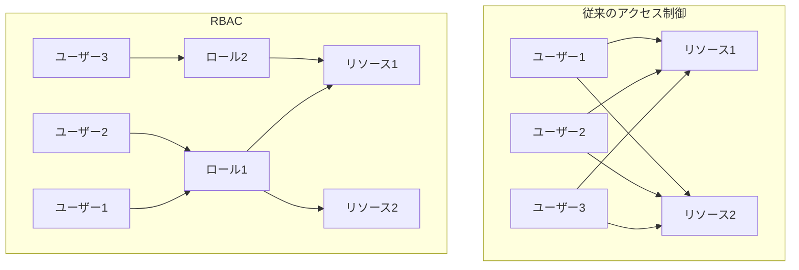
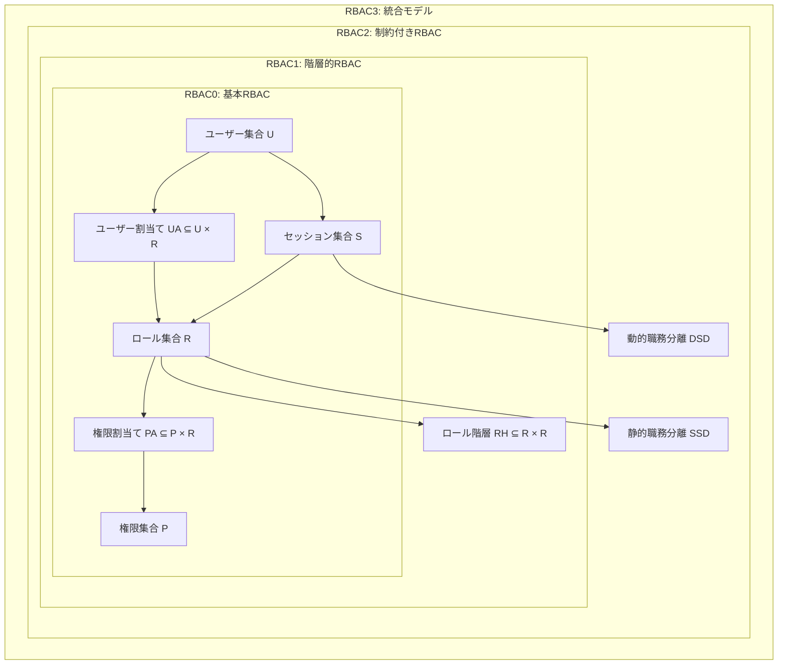
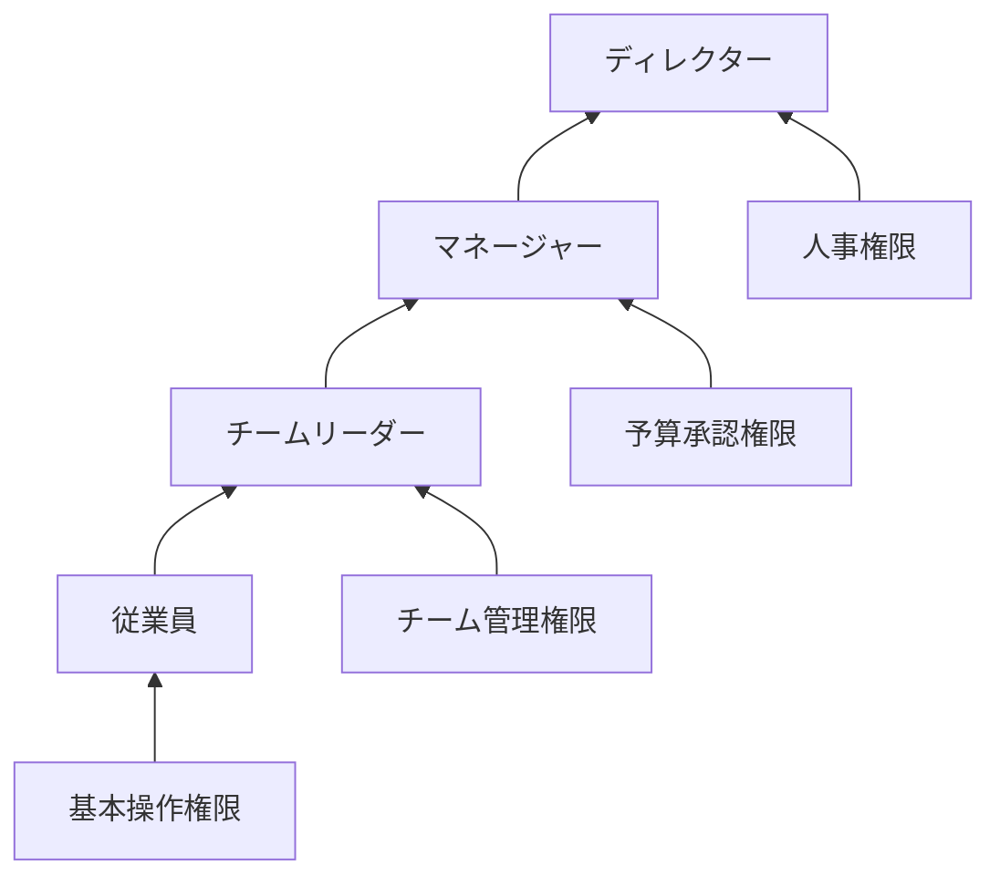
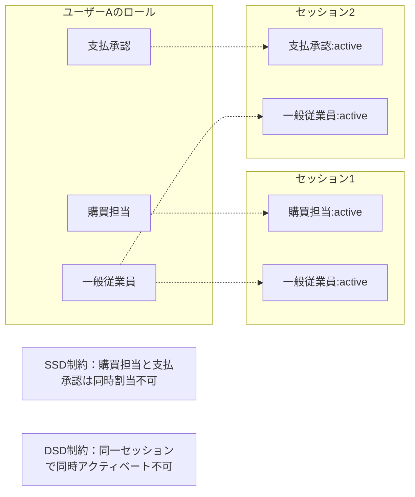
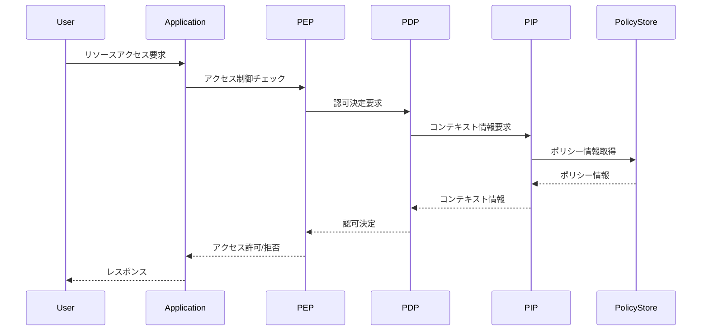
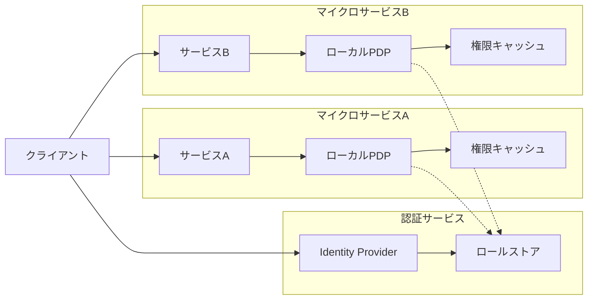
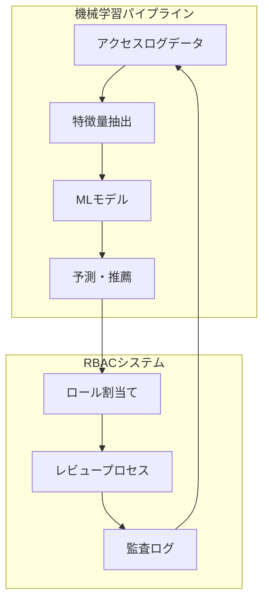

# RBAC（Role-Based Access Control）

## RBACの本質と理論的基盤

Role-Based Access Control（RBAC）は、組織における職務分掌の概念をアクセス制御モデルとして形式化したものである。1992年にFerraiolo and Kuhnによって最初に提案され[^1]、その後NISTによって標準化された参照モデル[^2]は、現代のアクセス制御システムの理論的基盤となっている。

RBACの中核的な洞察は、権限管理の複雑性が組織の規模に対して指数関数的に増大する問題を、「ロール」という抽象化層を導入することで線形的な関係に変換できる点にある。従来の識別ベースアクセス制御（Identity-Based Access Control）では、n人のユーザーとm個のリソースがある場合、最大n×mの関係を管理する必要があった。RBACでは、k個のロール（通常k << n）を介することで、管理すべき関係をn+k×mに削減できる。



この抽象化は単なる実装上の利便性を超えて、組織のガバナンス構造と情報システムのセキュリティポリシーを整合させる重要な役割を果たす。組織における職務（job function）は本質的に責任と権限の集合体であり、これをロールとして表現することで、ビジネスロジックとセキュリティロジックの統合が可能となる。

## NIST RBAC参照モデルの構成要素

NIST RBAC参照モデル（INCITS 359-2004）[^3]は、RBACシステムの標準的な構成要素と関係性を定義している。このモデルは4つのレベルで構成され、それぞれが累積的に機能を追加する設計となっている。



基本となるRBAC0モデルは、ユーザー（U）、ロール（R）、権限（P）、セッション（S）の4つの基本要素と、それらの間の関係を定義する。権限は操作（operations）とオブジェクト（objects）のペアとして表現され、P = 2^(operations × objects)となる。この形式化により、きめ細かなアクセス制御が可能となる。

ユーザー割当て（UA）関係は多対多の関係として定義され、一人のユーザーが複数のロールを持つことができ、一つのロールに複数のユーザーを割り当てることができる。この柔軟性により、組織の複雑な権限構造を表現できる。同様に、権限割当て（PA）関係も多対多として定義される。

セッションの概念は、RBACの動的な側面を表現する重要な要素である。ユーザーはログイン時にセッションを確立し、そのセッション内で利用可能なロールのサブセットをアクティベートする。この仕組みにより、最小権限の原則（principle of least privilege）を実装できる。例えば、システム管理者が通常業務では一般ユーザーロールで作業し、必要な時のみ管理者ロールをアクティベートするといった運用が可能となる。

## 階層的RBACの数学的基礎

RBAC1で導入されるロール階層は、組織構造の自然な表現を可能にする。ロール階層RHは、ロール集合R上の半順序関係として定義される。r1 ≥ r2（r1がr2の上位ロール）である場合、r1はr2のすべての権限を継承する。

この継承関係は推移的であり、r1 ≥ r2かつr2 ≥ r3ならば、r1 ≥ r3が成立する。形式的には、あるロールrの権限集合authorized_permissions(r)は次のように定義される：

```
authorized_permissions(r) = {p ∈ P | ∃r' ≤ r: (p, r') ∈ PA}
```

この定義により、上位ロールは下位ロールのすべての権限を自動的に取得する。例えば、組織において「部長」ロールが「課長」ロールの上位に位置する場合、部長は課長のすべての権限を継承しつつ、追加の権限を持つことができる。



階層的RBACの実装において重要な考慮事項は、循環参照の防止である。ロール階層は有向非循環グラフ（DAG）でなければならず、r1 ≥ r2かつr2 ≥ r1となるのは、r1 = r2の場合のみである。多くの実装では、ロール階層の変更時にトポロジカルソートを用いて循環を検出する。

## 制約付きRBACと職務分離の実装

RBAC2で導入される制約機能は、組織のコンプライアンス要件を満たすために不可欠である。特に重要なのが職務分離（Separation of Duty, SoD）制約である。SoDは内部統制の基本原則であり、不正や誤りのリスクを低減するために、相反する責任を異なる個人に分散させる。

静的職務分離（Static Separation of Duty, SSD）は、ユーザーへのロール割当て時に適用される制約である。SSD制約は、相互に排他的なロール集合と、同時に割り当て可能なロール数の上限（カーディナリティ）として表現される。

```
SSD ⊆ (2^R × N)
```

例えば、SSD = {({購買担当, 支払承認}, 2)}という制約は、購買担当と支払承認の両方のロールを同一ユーザーに割り当てることを禁止する。

動的職務分離（Dynamic Separation of Duty, DSD）は、セッション内でのロールアクティベーションに対する制約である。ユーザーが複数のロールを持っていても、単一セッション内では相反するロールを同時にアクティベートできない。

```
DSD ⊆ (2^R × N)
```

DSDはSSDよりも柔軟な制約であり、例えば監査のために一時的に複数の権限が必要な場合でも、異なるセッションで順次アクティベートすることで要件を満たせる。



## RBACの実装アーキテクチャ

RBACシステムの実装は、ポリシー管理コンポーネント（Policy Administration Point, PAP）、ポリシー決定コンポーネント（Policy Decision Point, PDP）、ポリシー実施コンポーネント（Policy Enforcement Point, PEP）、ポリシー情報コンポーネント（Policy Information Point, PIP）の4つの主要コンポーネントで構成される[^4]。

PAPは管理者インターフェースを提供し、ロール定義、ユーザー割当て、権限設定などのポリシー管理機能を実装する。PDPはアクセス要求に対して許可・拒否の決定を行う中核コンポーネントであり、PIPから提供される情報を基に判断を下す。PEPはアプリケーション内でPDPの決定を実施する。



実装において重要な性能最適化として、権限評価結果のキャッシングがある。ロール階層の展開や制約チェックは計算コストが高いため、多くの実装では権限の実効セットを事前計算してキャッシュする。ただし、ポリシー変更時のキャッシュ無効化戦略が重要となる。

データベース設計においては、ロール階層を効率的に格納・検索するために、Nested Set ModelやClosure Tableなどの手法が用いられる。Closure Tableは、すべての祖先-子孫関係を明示的に格納することで、階層のトラバーサルをO(1)で実現できる。

## 属性ベースアクセス制御との統合

純粋なRBACモデルの限界として、動的な条件に基づくアクセス制御の困難さがある。例えば、「自部門のデータのみアクセス可能」といったルールをRBACで表現するには、部門ごとに個別のロールを作成する必要があり、ロールの爆発的増加（role explosion）を招く。

この問題に対処するため、現代の実装では属性ベースアクセス制御（Attribute-Based Access Control, ABAC）との統合が進んでいる。RBAC-ABAC統合モデルでは、ロールに属性制約を付与することで、動的な権限評価を可能にする。

```
Permission = Role × Operation × Object × Constraint
```

ここで、Constraintは属性に基づく論理式として表現される。例えば：

```
Constraint = (user.department == resource.department) AND 
             (current_time >= 9:00 AND current_time <= 18:00)
```

この拡張により、RBACの管理の簡潔性とABACの表現力を両立できる。実装上は、PDPにルールエンジンを組み込み、XACML（eXtensible Access Control Markup Language）[^5]などの標準的なポリシー言語で制約を記述する。

## 分散環境におけるRBACの課題

マイクロサービスアーキテクチャやクラウドネイティブ環境では、RBACの実装に新たな課題が生じる。サービス間でのロール情報の伝播、一貫性の保証、性能のスケーラビリティなどが主要な技術的課題となる。

OAuth 2.0とOpenID Connect（OIDC）を用いた実装では、ロール情報をJWTクレームとして伝播させる。しかし、トークンサイズの制限により、詳細な権限情報をすべて含めることは現実的でない。このため、ロール名のみをトークンに含め、各サービスで権限を解決するアーキテクチャが一般的である。



分散トランザクションにおける権限の一貫性も重要な課題である。SAGAパターンを用いた長時間実行トランザクションでは、各ステップで異なるサービスが関与するため、トランザクション全体を通じた権限の検証が必要となる。補償トランザクションの実行権限も含めて設計する必要がある。

## ゼロトラストセキュリティモデルにおけるRBAC

ゼロトラストアーキテクチャの文脈では、RBACは継続的検証（continuous verification）の一部として実装される。従来の境界型セキュリティでは、一度認証されたユーザーは信頼されたが、ゼロトラストでは各リクエストで権限を再評価する。

リスクベース認証との統合により、ロールのアクティベーションに追加の認証要素を要求できる。例えば、通常業務では単一要素認証で十分だが、管理者ロールのアクティベーションには多要素認証を要求する。さらに、異常な振る舞いを検出した場合は、一時的に権限を制限する適応的セキュリティも実装可能である。

```python
def evaluate_access(user, resource, operation, context):
    # 基本的なRBAC評価
    roles = get_active_roles(user, context.session_id)
    permissions = get_permissions_for_roles(roles)
    
    if not has_permission(permissions, resource, operation):
        return DENY
    
    # リスクベース評価
    risk_score = calculate_risk_score(user, context)
    if risk_score > THRESHOLD:
        if not verify_mfa(user):
            return DENY
    
    # 適応的制約
    if is_anomalous_behavior(user, operation, context):
        apply_temporary_restrictions(user)
        return CONDITIONAL_ALLOW
    
    return ALLOW
```

## RBACのガバナンスとライフサイクル管理

RBACシステムの長期的な成功には、適切なガバナンスプロセスが不可欠である。ロールマイニング、定期的なアクセスレビュー、ロールのライフサイクル管理などが主要な運用タスクとなる。

ロールマイニングは、既存のアクセスパターンから適切なロール定義を発見する手法である。クラスタリングアルゴリズムやフォーマルコンセプト分析（Formal Concept Analysis, FCA）[^6]を用いて、ユーザーと権限の関係から最適なロール構造を導出する。

定期的なアクセスレビューでは、ロール割当ての妥当性を検証する。これは多くの規制要件（SOX法、GDPR等）で要求される。レビュープロセスの自動化により、大規模組織でも効率的な運用が可能となる。

ロールのライフサイクル管理では、組織変更に伴うロールの統廃合、権限の追加・削除、一時的なロールの管理などを扱う。特に、プロジェクトベースの一時的なロールは、有効期限管理が重要となる。

## 機械学習を用いたRBACの最適化

近年、機械学習技術をRBACに適用する研究が進んでいる。異常なアクセスパターンの検出、ロール推薦、権限予測などが主要な応用分野である。

異常検出では、ユーザーの通常のアクセスパターンを学習し、逸脱した行動を検出する。隠れマルコフモデル（HMM）やLSTMなどの時系列モデルを用いて、アクセスシーケンスの異常を検出できる。

ロール推薦システムは、新規ユーザーや異動者に対して適切なロールを提案する。協調フィルタリングや行列分解技術を用いて、類似したユーザーのロール割当てから推薦を生成する。



ただし、機械学習の適用には説明可能性の課題がある。セキュリティ関連の決定には監査可能性が要求されるため、ブラックボックスモデルの使用には慎重な検討が必要である。LIME（Local Interpretable Model-agnostic Explanations）やSHAP（SHapley Additive exPlanations）などの説明可能AI技術の活用が重要となる。

## 量子コンピューティング時代のRBAC

量子コンピューティングの発展は、RBACシステムのセキュリティ基盤に根本的な影響を与える可能性がある。現在の暗号化手法の多くが量子アルゴリズムによって破られる可能性があるため、ポスト量子暗号への移行が必要となる。

RBACシステムにおいては、認証トークンの署名、ロール情報の暗号化、監査ログの完全性保護などで暗号技術が使用される。NIST標準化プロセスで選定されたポスト量子暗号アルゴリズム（CRYSTALS-Kyber、CRYSTALS-Dilithium等）[^7]への移行計画が重要となる。

また、量子コンピューティングはRBACの最適化にも活用できる可能性がある。組合せ最適化問題として定式化されるロール最適化問題は、量子アニーリングによって効率的に解ける可能性がある。D-Waveなどの量子アニーラーを用いた初期的な研究が進められている。

## 実装における実践的考慮事項

RBACシステムの実装において、理論と実践のギャップを埋めるための考慮事項は多岐にわたる。性能、可用性、保守性、セキュリティのバランスを取りながら、組織の要件に合致したシステムを構築する必要がある。

性能面では、権限チェックのレイテンシが重要である。多くのアプリケーションでは、各APIコールで権限チェックが発生するため、ミリ秒単位の遅延も無視できない。インメモリキャッシュ、権限の事前計算、ビットマップを用いた高速評価などの技術が用いられる。

可用性の観点では、認証・認可サービスの単一障害点化を避ける必要がある。分散キャッシュ、レプリケーション、グレースフルデグラデーション（認可サービス障害時の限定的なアクセス許可）などの手法を組み合わせる。

保守性については、ロール定義の文書化、命名規則の統一、変更管理プロセスの確立が重要である。Infrastructure as Codeの考え方を適用し、ロール定義をバージョン管理することで、変更の追跡性を確保できる。

セキュリティ監査の要件を満たすため、すべてのアクセス決定を記録する必要がある。ただし、大量のログは保存コストと分析の困難さをもたらす。構造化ログ、ログ集約、異常検出の自動化により、実用的な監査システムを構築する。

これらの実践的考慮事項は、RBACシステムの成功に不可欠である。理論的に優れたモデルであっても、実装上の課題を適切に解決しなければ、組織のセキュリティ要件を満たすことはできない。継続的な改善と技術の進化への適応が、長期的な成功の鍵となる。

[^1]: Ferraiolo, D. F., & Kuhn, D. R. (1992). Role-based access controls. In 15th National Computer Security Conference (Vol. 563, p. 554).

[^2]: Sandhu, R., Ferraiolo, D., & Kuhn, R. (2000). The NIST model for role-based access control: towards a unified standard. In Proceedings of the fifth ACM workshop on Role-based access control (pp. 47-63).

[^3]: INCITS 359-2004, Information Technology - Role Based Access Control, InterNational Committee for Information Technology Standards, 2004.

[^4]: OASIS. (2013). eXtensible Access Control Markup Language (XACML) Version 3.0. OASIS Standard.

[^5]: Moses, T. (2005). eXtensible Access Control Markup Language (XACML) version 2.0. OASIS Standard, 200502.

[^6]: Priss, U. (2006). Formal concept analysis in information science. Annual review of information science and technology, 40(1), 521-543.

[^7]: Alagic, G., et al. (2022). Status Report on the Third Round of the NIST Post-Quantum Cryptography Standardization Process. NIST Internal Report 8413.