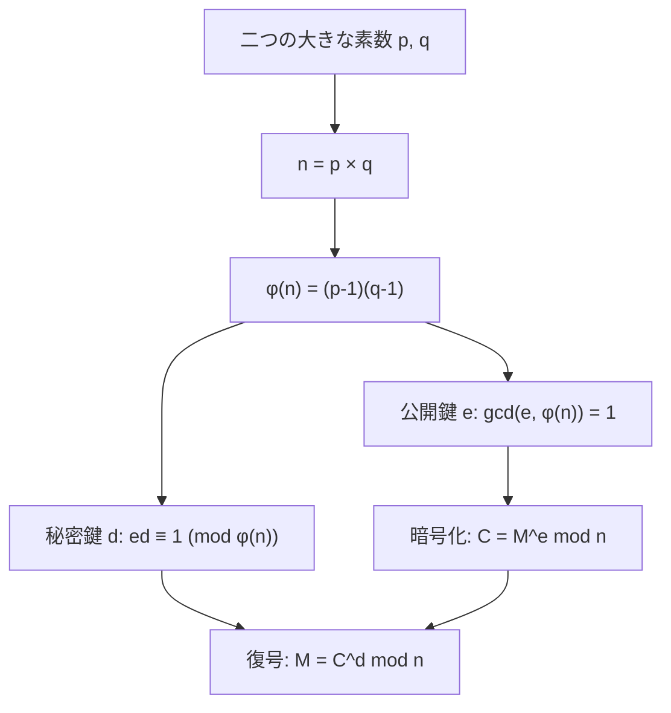
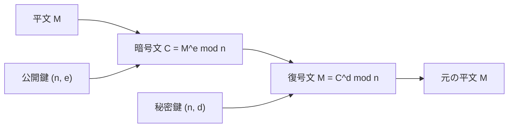
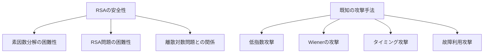
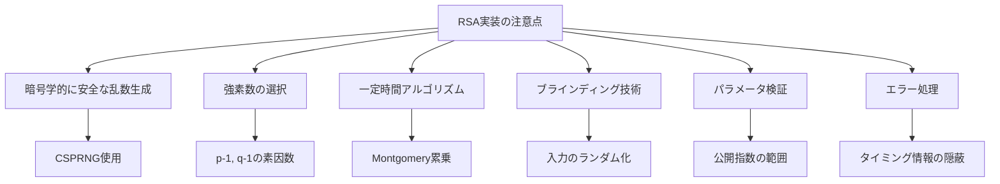
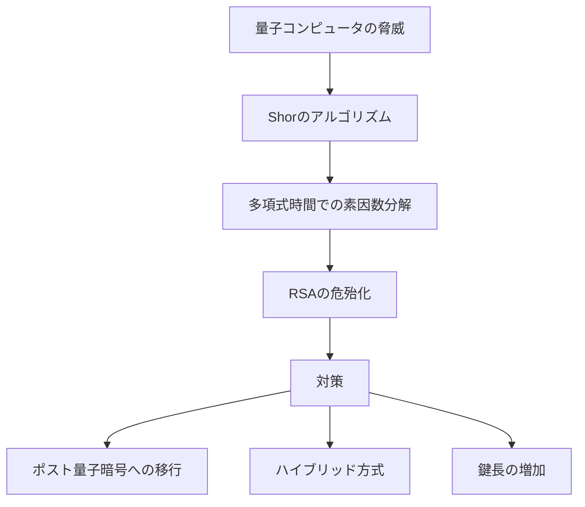

# RSA

RSAは、1977年にRon Rivest、Adi Shamir、Leonard Adlemanによって発表された公開鍵暗号方式である¹。その名前は彼らの姓の頭文字に由来している。RSAは素因数分解の計算困難性に基づいており、現在でも最も広く使用されている公開鍵暗号方式の一つである。RSAは暗号化と復号に異なる鍵を使用する非対称暗号であり、この特性により鍵配送問題を解決し、デジタル署名も実現可能にした。

## 歴史的背景

RSAの発表は暗号学の歴史において画期的な出来事であった。それ以前の暗号システムは対称鍵暗号であり、通信する両者が同じ秘密鍵を共有する必要があった。この鍵配送問題は、特に大規模なネットワークにおいて深刻な課題となっていた。1976年、Whitfield DiffieとMartin Hellmanが公開鍵暗号の概念を提案したが、具体的な実装方法は示されていなかった。

RSAの開発は、MITの研究者たちによる数ヶ月にわたる試行錯誤の結果である。RivestとShamirが様々なアプローチを試みる中、Adlemanは彼らのアイデアの弱点を見つける役割を担っていた。1977年4月、Passoverの祝いの後、Rivestは眠れぬ夜を過ごし、ついに素因数分解の困難性を利用したアルゴリズムを思いついた。翌朝、彼は同僚たちにアイデアを説明し、RSAが誕生した。

興味深いことに、RSAと同等のシステムは、イギリスの政府通信本部（GCHQ）でClifford Cocksによって1973年に既に発見されていた。しかし、この発見は機密扱いとされ、1997年まで公表されなかった。このため、RSAの発明者たちが公開鍵暗号の実用化において歴史的な功績を認められている。

## 数学的基礎

RSAの安全性は、大きな合成数の素因数分解が計算量的に困難であるという仮定に基づいている。より具体的には、二つの大きな素数の積から元の素数を見つけることの困難性を利用している。この計算困難性は、現在の計算機技術では十分大きな数に対して実用的な時間内で解くことができないと考えられている。

RSAの理論的基盤となるのは、フェルマーの小定理とオイラーの定理である。フェルマーの小定理は、pが素数でaがpで割り切れない整数のとき、a^(p-1) ≡ 1 (mod p) が成り立つというものである。オイラーの定理はこれを一般化したもので、gcd(a, n) = 1のとき、a^φ(n) ≡ 1 (mod n) が成り立つ。ここでφ(n)はオイラーのトーシェント関数で、n以下の正の整数のうちnと互いに素なものの個数を表す。

RSAでは、n = pqという形の合成数を使用する。ここでpとqは異なる大きな素数である。このとき、φ(n) = (p-1)(q-1)となる。これは、n以下の整数のうち、pでもqでも割り切れないものの個数が(p-1)(q-1)個であることから導かれる。



## 鍵生成アルゴリズム

RSAの鍵生成は、以下の手順で行われる。まず、十分に大きな二つの異なる素数pとqを選択する。現在の標準では、これらの素数は少なくとも1024ビット以上、推奨では2048ビット以上の長さを持つべきとされている²。素数の選択は暗号学的に安全な乱数生成器を使用して行われ、選択された数が素数であることの確認には確率的素数判定アルゴリズムが使用される。

素数判定には、Miller-Rabin素数判定法が広く使用されている。このアルゴリズムは確率的であり、合成数を素数と誤判定する確率を任意に小さくできる。実用的な実装では、64回のラウンドを実行することで、誤判定の確率を2^(-128)以下にすることができる。また、生成された素数pとqの差が十分に大きいことを確認する必要がある。|p-q|が小さい場合、Fermatの因数分解法により効率的に因数分解される可能性がある。

次に、n = pqを計算する。このnは公開鍵の一部となり、RSAモジュラスと呼ばれる。nのビット長は鍵長と呼ばれ、RSAの安全性を示す重要な指標となる。φ(n) = (p-1)(q-1)を計算し、これは秘密情報として保持される。

公開指数eの選択は重要なステップである。eはφ(n)と互いに素である必要があり、一般的には65537 (= 2^16 + 1)が使用される。この値は素数であり、ビット表現で1が少ないため暗号化の計算が効率的に行える。小さなeを使用することで暗号化は高速化されるが、特定の攻撃に対して脆弱になる可能性があるため、適切な選択が必要である。

秘密指数dは、ed ≡ 1 (mod φ(n))を満たすように計算される。これは拡張ユークリッドアルゴリズムを使用して効率的に求めることができる。dはeのφ(n)に関する逆元であり、この関係がRSAの暗号化と復号の可逆性を保証する。

最後に、公開鍵として(n, e)を公開し、秘密鍵として(n, d)を秘密に保持する。実装によっては、効率的な復号のために追加の情報（p、q、dp = d mod (p-1)、dq = d mod (q-1)、qInv = q^(-1) mod p）も秘密鍵に含める場合がある。

## 暗号化と復号

RSAによる暗号化は、平文Mを暗号文Cに変換する過程である。平文Mは0 ≤ M < nを満たす整数として表現される必要がある。暗号化は C = M^e mod n という単純な式で表される。この計算はモジュラー累乗演算と呼ばれ、効率的に計算するために二進法アルゴリズムが使用される。

復号は暗号文Cから平文Mを復元する過程で、M = C^d mod n によって行われる。この計算の正当性は以下のように証明される。C = M^e mod nを復号式に代入すると、C^d ≡ (M^e)^d ≡ M^(ed) (mod n)となる。ここで、ed ≡ 1 (mod φ(n))より、ed = 1 + kφ(n)と書ける。したがって、M^(ed) ≡ M^(1+kφ(n)) ≡ M · M^(kφ(n)) ≡ M · (M^φ(n))^k ≡ M · 1^k ≡ M (mod n)となる。最後の変形はオイラーの定理によるものである。



実際の暗号化では、平文を直接暗号化することは避けられる。これは、小さな平文や特定のパターンを持つ平文に対する攻撃を防ぐためである。代わりに、パディング方式が使用される。PKCS#1 v1.5パディングやOAEP（Optimal Asymmetric Encryption Padding）などの標準的なパディング方式により、平文にランダム性を加え、セキュリティを向上させる³。

## 中国人剰余定理による高速化

RSAの復号処理は、大きな指数を持つモジュラー累乗演算を含むため計算量が多い。中国人剰余定理（Chinese Remainder Theorem, CRT）を利用することで、この計算を大幅に高速化できる。CRTを使用した復号では、C^d mod nを直接計算する代わりに、C^d mod pとC^d mod qを別々に計算し、その結果を組み合わせて最終的な結果を得る。

具体的には、dp = d mod (p-1)、dq = d mod (q-1)を事前に計算しておき、復号時にはm1 = C^dp mod p、m2 = C^dq mod qを計算する。フェルマーの小定理により、これらの計算は正しい結果を与える。最後に、ガーナーのアルゴリズムを使用してm1とm2からM mod nを再構築する。この方法により、復号の計算量は約4分の1に削減される。

CRTを使用した実装では、秘密鍵にp、q、dp、dq、qInv（q^(-1) mod p）を含める必要がある。これらの追加情報は秘密鍵のサイズを増加させるが、得られる性能向上は実用上非常に重要である。特にサーバーサイドでの実装では、この高速化は必須と考えられている。

## セキュリティ考察

RSAの安全性は、複数の計算問題の困難性に依存している。最も基本的なものはRSA問題と呼ばれ、C = M^e mod nが与えられたときにMを求める問題である。この問題は素因数分解問題よりも易しい可能性があるが、現在のところ効率的な解法は知られていない。

素因数分解問題は、nが与えられたときにpとqを求める問題である。もしこの問題が効率的に解けるならば、φ(n)を計算でき、さらにdを求めることができるため、RSAは破られる。現在最も効率的な素因数分解アルゴリズムは数体篩法（Number Field Sieve）であり、その計算量は準指数的である。2048ビットのRSAモジュラスは、現在の技術では実用的な時間内に因数分解できないと考えられている。

RSAに対する様々な攻撃手法が研究されている。低指数攻撃は、小さな公開指数eを使用し、同じメッセージを複数の受信者に送信する場合に適用可能である。Wienerの攻撃は、秘密指数dが小さい場合に連分数を使用してdを効率的に求める方法である。これらの攻撃を防ぐため、パラメータの選択には注意が必要である。



サイドチャネル攻撃は、暗号アルゴリズムの実装から漏洩する情報を利用する攻撃である。タイミング攻撃は、暗号化や復号の処理時間の違いから秘密情報を推測する。電力解析攻撃は、デバイスの消費電力パターンから秘密鍵の情報を抽出する。これらの攻撃に対抗するため、一定時間で動作するアルゴリズムの実装や、計算にランダム性を導入するブラインディング技術が使用される。

## パディング方式

RSAを安全に使用するためには、適切なパディング方式が不可欠である。素のRSA（教科書的RSA）は決定的であり、同じ平文は常に同じ暗号文になるため、様々な攻撃に対して脆弱である。また、RSAは準同型性を持つため、暗号文に対する操作が平文に反映される可能性がある。

PKCS#1 v1.5パディングは、歴史的に広く使用されてきたパディング方式である。このパディングでは、平文の前にパディング文字列を付加し、メッセージ全体をRSAモジュラスと同じ長さにする。パディング文字列は、0x00 || 0x02 || PS || 0x00 || Mという形式を持つ。ここでPSは少なくとも8バイトの非ゼロランダムバイト列である。この方式は実装が簡単だが、Bleichenbacherの攻撃など、特定の条件下で脆弱性が存在する⁴。

OAEP（Optimal Asymmetric Encryption Padding）は、より安全なパディング方式として設計された。OAEPは、ランダムオラクルモデルにおいて証明可能な安全性を持つ。この方式では、平文にランダムシードを組み合わせ、マスク生成関数を使用して全体をランダム化する。PKCS#1 v2.1以降では、OAEPが推奨されている。

```python
# OAEPパディングの概念的な実装（簡略化）
def oaep_encode(M, seed, k):
    # k: RSAモジュラスのバイト長
    # M: 平文
    # seed: ランダムシード
    
    # Step 1: パディングとハッシュ
    lHash = hash(L)  # L: オプションのラベル
    PS = bytes(k - len(M) - 2*hLen - 2)  # ゼロパディング
    DB = lHash || PS || 0x01 || M
    
    # Step 2: マスク生成とXOR
    dbMask = MGF(seed, k - hLen - 1)
    maskedDB = DB ⊕ dbMask
    seedMask = MGF(maskedDB, hLen)
    maskedSeed = seed ⊕ seedMask
    
    # Step 3: 最終的なエンコード結果
    EM = 0x00 || maskedSeed || maskedDB
    return EM
```

## デジタル署名

RSAは暗号化だけでなく、デジタル署名にも使用される。デジタル署名は、メッセージの真正性と完全性を保証するメカニズムである。RSA署名では、署名者は秘密鍵を使用してメッセージに署名し、検証者は公開鍵を使用して署名を検証する。

基本的な署名生成は、メッセージMのハッシュ値Hに対して S = H^d mod n を計算することで行われる。署名検証は、S^e mod n を計算し、結果がHと一致することを確認する。実際の実装では、署名にもパディング方式が必要である。

PSS（Probabilistic Signature Scheme）は、OAEPと同様の考え方に基づく署名用のパディング方式である。PSSは確率的であり、同じメッセージに対しても毎回異なる署名が生成される。これにより、署名の偽造がより困難になる。PKCS#1 v2.1では、PSSが推奨される署名方式として規定されている⁵。

## 実装上の注意点

RSAの実装には多くの落とし穴が存在する。まず、素数生成は暗号学的に安全な乱数生成器を使用する必要がある。弱い乱数生成器を使用すると、生成される素数に偏りが生じ、攻撃者に有利な情報を与える可能性がある。また、生成された素数は強素数である必要があり、p-1とq-1が大きな素因数を持つことが望ましい。

モジュラー累乗演算の実装では、タイミング攻撃を防ぐための対策が必要である。単純な二進法アルゴリズムでは、秘密指数のビットパターンによって処理時間が変化するため、Montgomery累乗法などの一定時間アルゴリズムを使用すべきである。また、ブラインディング技術により、同じ入力に対しても異なる中間値で計算を行うことで、サイドチャネル攻撃への耐性を向上させることができる。



パラメータの検証も重要である。公開指数eは3以上の奇数である必要があり、一般的には65537が使用される。しかし、特定のアプリケーションでは異なる値が使用される場合があり、その際は追加のセキュリティ考慮が必要である。また、受信した公開鍵や署名の妥当性を検証することで、不正な入力による攻撃を防ぐことができる。

エラー処理においても注意が必要である。復号や署名検証が失敗した場合、その理由を詳細に返すことは避けるべきである。エラーメッセージから得られる情報を利用した攻撃（Bleichenbacherの攻撃など）が存在するため、エラーは一般的なメッセージで返すか、タイミングを一定にする必要がある。

## 標準規格と相互運用性

RSAは多くの標準規格で定義されており、相互運用性の確保が重要である。PKCS#1（Public Key Cryptography Standards #1）は、RSAの最も基本的な標準である。現在のバージョンはv2.2であり、暗号化と署名の両方の操作を定義している⁶。

X.509証明書では、RSA公開鍵は特定のASN.1構造で表現される。公開鍵はRSAPublicKey構造として、モジュラスnと公開指数eを含む。秘密鍵はより複雑な構造を持ち、CRTパラメータを含むことができる。これらの構造はDER（Distinguished Encoding Rules）でエンコードされ、PEM形式でテキスト表現されることが多い。

```
RSAPublicKey ::= SEQUENCE {
    modulus           INTEGER,  -- n
    publicExponent    INTEGER   -- e
}

RSAPrivateKey ::= SEQUENCE {
    version           Version,
    modulus           INTEGER,  -- n
    publicExponent    INTEGER,  -- e
    privateExponent   INTEGER,  -- d
    prime1            INTEGER,  -- p
    prime2            INTEGER,  -- q
    exponent1         INTEGER,  -- d mod (p-1)
    exponent2         INTEGER,  -- d mod (q-1)
    coefficient       INTEGER   -- q^-1 mod p
}
```

TLS/SSLプロトコルでは、RSAは鍵交換と認証の両方に使用されてきた。RSA鍵交換では、クライアントがプリマスターシークレットをサーバーの公開鍵で暗号化する。しかし、この方式は前方秘匿性を提供しないため、現在ではEphemeral Diffie-Hellmanなどの方式が推奨されている。RSA署名は引き続き、サーバー認証のための証明書署名に広く使用されている。

## 量子コンピュータとの関係

量子コンピュータの発展は、RSAを含む現在の公開鍵暗号システムに重大な脅威をもたらす。Shorのアルゴリズムは、十分に大きな量子コンピュータ上で多項式時間で素因数分解を行うことができる⁷。これは、RSAの安全性の基盤である素因数分解の困難性が、量子コンピュータに対しては成立しないことを意味する。

現在の量子コンピュータは、実用的なRSA鍵を破るには不十分である。しかし、技術の進歩により、将来的には現在使用されているRSA鍵が危険にさらされる可能性がある。このため、ポスト量子暗号（Post-Quantum Cryptography）の研究が活発に行われており、量子コンピュータに対しても安全な新しい暗号方式の標準化が進められている。

移行期間における対策として、ハイブリッド方式が提案されている。これは、従来のRSAとポスト量子暗号を組み合わせて使用する方式であり、どちらか一方が破られても安全性が保たれる。また、RSA鍵長の増加も短期的な対策として考えられるが、これは性能への影響が大きく、根本的な解決策ではない。



## パフォーマンスと最適化

RSAの計算は、対称暗号と比較して非常に重い処理である。特に、秘密鍵を使用する操作（復号と署名生成）は、公開鍵を使用する操作よりも計算量が多い。これは、秘密指数dが公開指数eよりも大きいためである。実用的なシステムでは、RSAは鍵交換やデジタル署名に使用され、実際のデータ暗号化には高速な対称暗号が使用される。

ハードウェアアクセラレーションは、RSAの性能向上に重要な役割を果たす。多くの現代的なプロセッサは、モジュラー演算を高速化する専用命令を持っている。また、専用の暗号プロセッサやHSM（Hardware Security Module）は、RSA演算を高速かつ安全に実行できる。これらのハードウェアソリューションは、秘密鍵の保護という観点からも重要である。

バッチ処理による最適化も可能である。複数の署名検証を同時に行う場合、特定の最適化技術により全体の計算量を削減できる。また、事前計算を利用することで、頻繁に使用される値の計算を高速化できる。サーバーサイドの実装では、これらの最適化が特に重要である。

メモリ使用量の観点では、RSAは比較的大きなメモリを必要とする。2048ビットのRSA鍵を使用する場合、各種パラメータを保持するために数キロバイトのメモリが必要である。組み込みシステムなど、リソースが制限された環境では、この点も考慮する必要がある。楕円曲線暗号（ECC）は、同等のセキュリティレベルでより小さな鍵サイズを実現できるため、このような環境では好まれることがある。

## 実装例とベストプラクティス

RSAの実装において、適切なライブラリの選択は極めて重要である。OpenSSL、Bouncy Castle、mbedTLSなどの成熟したライブラリは、長年の開発と検証を経て、多くのセキュリティ問題に対処している。独自実装は避けるべきであり、特に本番環境では確立されたライブラリを使用することが強く推奨される。

実際の実装では、鍵のライフサイクル管理が重要な考慮事項となる。鍵の生成、保管、使用、破棄の各段階で適切なセキュリティ対策が必要である。特に、秘密鍵は暗号化された形で保存し、使用時のみメモリに読み込むべきである。また、使用後はメモリから確実に消去する必要がある。単純なメモリクリアでは不十分な場合があり、セキュアな消去関数を使用すべきである。

パフォーマンスとセキュリティのトレードオフも重要な考慮事項である。例えば、公開指数として3を使用すると暗号化は高速になるが、特定の攻撃に対して脆弱になる可能性がある。一方、65537は適度な大きさであり、セキュリティと性能のバランスが良い。また、CRTを使用した高速化は標準的な実装となっているが、故障利用攻撃に対する対策として、計算結果の検証を行うことが推奨される。

## 現実世界での使用例

RSAは現代のインターネットインフラストラクチャの中核を成している。HTTPSプロトコルにおいて、RSAは主にサーバー認証と初期の鍵交換に使用される。ウェブブラウザがHTTPSサイトに接続する際、サーバーはRSA署名された証明書を提示し、ブラウザは証明書チェーンを検証することでサーバーの正当性を確認する。

電子メールのセキュリティにおいても、RSAは重要な役割を果たしている。S/MIME（Secure/Multipurpose Internet Mail Extensions）では、RSAを使用してメッセージの暗号化と署名を行う。PGP（Pretty Good Privacy）でも、RSAは鍵交換とデジタル署名の主要なアルゴリズムとして使用されている。これらのシステムでは、RSAの非対称性を利用して、送信者の認証と機密性の両方を実現している。

金融業界では、RSAは電子決済システムのセキュリティ基盤として広く採用されている。クレジットカード処理、オンラインバンキング、電子商取引において、RSAベースの暗号化と認証が使用されている。特に、EMV（Europay, MasterCard, Visa）チップカードでは、RSAデジタル署名を使用してカードの真正性を検証し、偽造を防いでいる。

ソフトウェアの配布においても、RSAデジタル署名は重要である。オペレーティングシステムのアップデート、アプリケーションのインストーラー、ファームウェアの更新などは、RSA署名により改ざんから保護されている。これにより、ユーザーは受け取ったソフトウェアが正規の発行元から提供され、改変されていないことを確認できる。

---

脚注：

¹ Rivest, R. L., Shamir, A., & Adleman, L. (1978). "A method for obtaining digital signatures and public-key cryptosystems". Communications of the ACM, 21(2), 120-126.

² NIST Special Publication 800-57 Part 1 Revision 5, "Recommendation for Key Management"

³ RFC 8017, "PKCS #1: RSA Cryptography Specifications Version 2.2"

⁴ Bleichenbacher, D. (1998). "Chosen ciphertext attacks against protocols based on the RSA encryption standard PKCS #1". In Advances in Cryptology—CRYPTO'98, 1-12.

⁵ Bellare, M., & Rogaway, P. (1998). "PSS: Provably secure encoding method for digital signatures". IEEE P1363a.

⁶ RFC 8017, "PKCS #1: RSA Cryptography Specifications Version 2.2"

⁷ Shor, P. W. (1997). "Polynomial-time algorithms for prime factorization and discrete logarithms on a quantum computer". SIAM Journal on Computing, 26(5), 1484-1509.