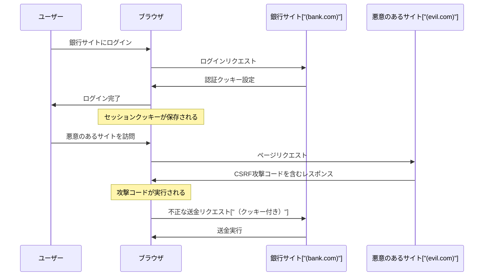
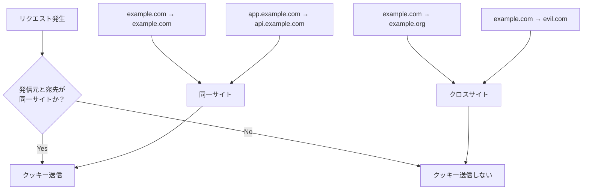
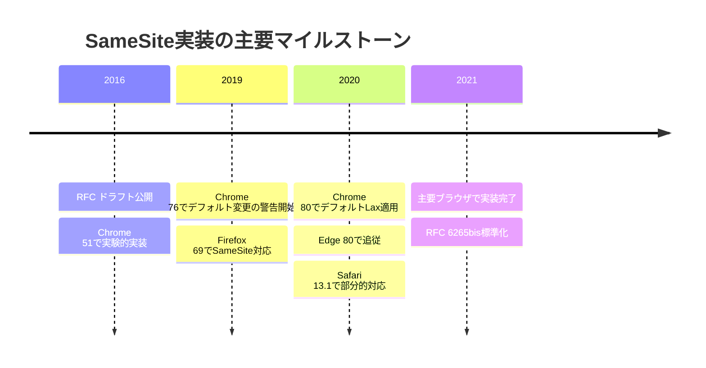
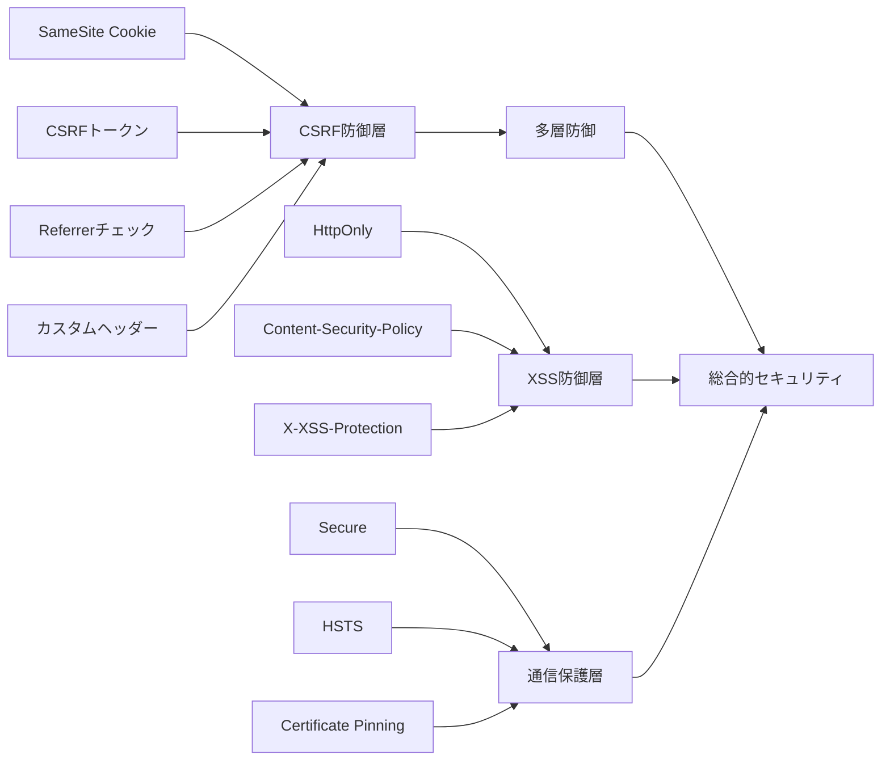
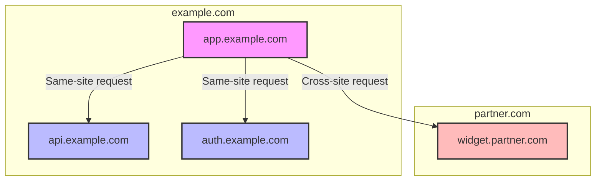
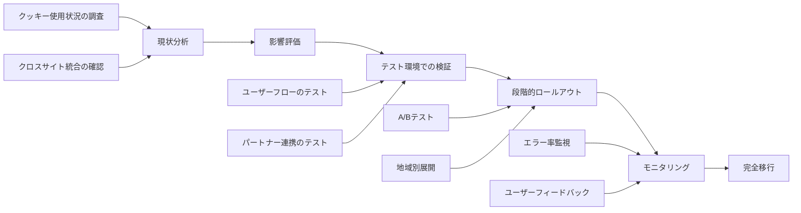
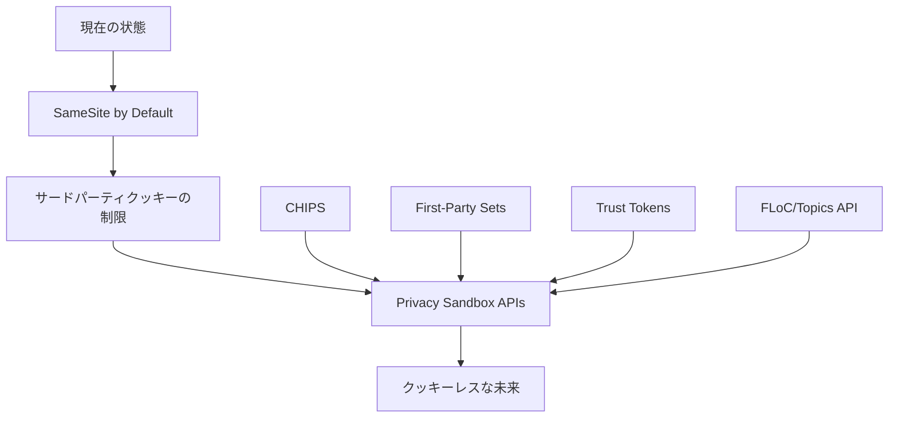

# SameSite Cookie

Webアプリケーションのセキュリティにおいて、クロスサイトリクエストフォージェリ（CSRF）攻撃は長年にわたり重要な脅威として認識されてきた。この攻撃手法は、ユーザーが意図しないリクエストを悪意のあるWebサイトから送信させることで、認証済みのセッションを悪用するものである。従来、この問題に対してはCSRFトークンなどの対策が講じられてきたが、2016年にGoogleのエンジニアによって提案されたSameSite Cookie属性は、より根本的なレベルでこの問題に対処する新しいアプローチを提供している[^1]。

SameSite属性は、HTTPクッキーに付与できる属性の一つであり、ブラウザがクロスサイトコンテキストでクッキーを送信する条件を制御する。この属性の導入により、開発者はクッキーの送信範囲を明示的に制限できるようになり、CSRF攻撃のリスクを大幅に軽減することが可能となった。しかし、その実装と運用には多くの考慮事項があり、単純な設定変更では済まない複雑性を含んでいる。

## クロスサイトリクエストとCSRF攻撃の本質

CSRF攻撃を理解するためには、まずWebブラウザにおけるクロスサイトリクエストの仕組みを正確に把握する必要がある。ブラウザは、あるオリジンから別のオリジンへのリクエストを送信する際、デフォルトでは対象サイトに設定されているクッキーを自動的に付与する。この動作は、Webの分散的な性質を支える重要な機能であるが、同時にセキュリティ上の脆弱性の源にもなっている。



上図に示すように、CSRF攻撃は正規のユーザーセッションを悪用する。ユーザーが銀行サイトにログインした状態で悪意のあるサイトを訪問すると、そのサイトに埋め込まれたコードによって、ユーザーの意図しない送金リクエストが銀行サイトに送信される。ブラウザは自動的に銀行サイトのクッキーを付与するため、銀行サイトはこのリクエストを正規のものとして処理してしまう。

この攻撃が成立する根本的な原因は、ブラウザがクロスサイトリクエストにおいてもクッキーを自動的に送信するというデフォルト動作にある。HTTPの仕様では、クッキーはドメインとパスに基づいて管理され、リクエストの発信元（オリジン）は考慮されない。この設計は、画像の埋め込みやCDNの利用など、正当なクロスサイトリクエストを可能にする一方で、セキュリティ上の問題を引き起こす原因となっている。

## SameSite属性の技術仕様と動作原理

SameSite属性は、RFC 6265bis[^2]で標準化されたクッキー属性であり、クロスサイトコンテキストにおけるクッキーの送信を制御する。この属性は三つの値を取ることができ、それぞれ異なるセキュリティレベルと使用性のトレードオフを提供する。

### Strict モード

Strictモードは最も厳格な設定であり、クロスサイトリクエストにおいてクッキーの送信を完全に禁止する。この設定では、リクエストの発信元と宛先が同一サイトである場合にのみクッキーが送信される。

```
Set-Cookie: sessionid=abc123; SameSite=Strict; Secure; HttpOnly
```

Strictモードの動作を詳細に理解するためには、「同一サイト」の定義を正確に把握する必要がある。RFC 6265bisにおいて、同一サイトは登録可能ドメイン（eTLD+1）に基づいて判定される。例えば、`app.example.com`と`api.example.com`は同一サイトと見なされるが、`example.com`と`example.org`は異なるサイトとして扱われる。



Strictモードの利点は、CSRF攻撃に対する完全な防御を提供することである。クロスサイトコンテキストではクッキーが送信されないため、攻撃者が悪意のあるサイトから正規サイトへのリクエストを発生させても、認証情報は含まれない。しかし、この厳格さは使用性の問題を引き起こす可能性がある。

例えば、ユーザーがメールやSNSのリンクから直接サイトにアクセスした場合、そのリクエストはクロスサイトリクエストとして扱われるため、認証クッキーが送信されない。結果として、ユーザーは既にログインしているにもかかわらず、再度ログインを求められることになる。この問題は、特にソーシャルメディアやメールマーケティングを活用するサービスにとって重大な使用性の低下を意味する。

### Lax モード

Laxモードは、セキュリティと使用性のバランスを考慮した設定である。このモードでは、特定の「安全な」クロスサイトナビゲーションにおいてクッキーの送信を許可する。具体的には、トップレベルナビゲーション（ユーザーがリンクをクリックしてページ遷移する場合など）で、かつHTTPメソッドが安全とされるもの（GET）の場合にのみ、クッキーが送信される。

```
Set-Cookie: sessionid=abc123; SameSite=Lax; Secure; HttpOnly
```

Laxモードにおける「安全な」リクエストの判定基準は、以下の条件をすべて満たす必要がある：

1. トップレベルナビゲーションであること（iframe内のナビゲーションやXHRリクエストは除外）
2. HTTPメソッドがGETであること（RFC 7231で定義される「安全な」メソッド）
3. ユーザーの明示的なアクション（リンククリックやフォーム送信）によるものであること

```mermaid
flowchart TD
    A[クロスサイトリクエスト] --> B{"トップレベル<br/>ナビゲーション？"}
    B -->|No| C[クッキー送信しない]
    B -->|Yes| D{"HTTPメソッドは<br/>GET？"}
    D -->|No| C
    D -->|Yes| E{"ユーザーの<br/>明示的アクション？"}
    E -->|No| C
    E -->|Yes| F[クッキー送信]
    
    G["<a href>リンククリック"] --> H[送信される]
    I["window.location変更"] --> J[送信される]
    K["<form method='POST'>"] --> L[送信されない]
    M["<img src>画像読み込み"] --> L
    N["XMLHttpRequest"] --> L
    O["fetch()"] --> L
```



Laxモードの設計思想は、一般的なWebサイトの使用パターンを維持しながら、CSRF攻撃の大部分を防ぐことにある。外部サイトからのリンクによる通常のナビゲーションは許可されるため、ユーザーエクスペリエンスへの影響は最小限に抑えられる。一方で、フォームのPOST送信やAJAXリクエストなど、CSRF攻撃で一般的に使用される手法ではクッキーが送信されないため、セキュリティも確保される。

しかし、Laxモードにも限界がある。例えば、GETリクエストで状態を変更する操作を実装している場合（RESTfulでない設計）、依然としてCSRF攻撃のリスクが残る。また、一部の正当なクロスサイト統合（例：決済サービスからのリダイレクト後のPOSTリクエスト）が機能しなくなる可能性がある。

### None モード

Noneモードは、SameSite属性を明示的に無効化し、従来のクッキー動作を維持する設定である。この設定では、クロスサイトリクエストにおいてもクッキーが送信される。ただし、Chrome 80以降では、`SameSite=None`を指定する場合は`Secure`属性も必須となっている。

```
Set-Cookie: sessionid=abc123; SameSite=None; Secure; HttpOnly
```

Noneモードが必要となる主なケースは以下の通りである：

1. **クロスサイト認証フロー**: OAuth 2.0やSAMLなどの認証プロトコルでは、異なるドメイン間でのリダイレクトとクッキーの送信が必要
2. **埋め込みコンテンツ**: 他サイトに埋め込まれるウィジェットやiframeで認証が必要な場合
3. **支払いゲートウェイ統合**: 外部決済サービスとの連携で、リダイレクト後も状態を保持する必要がある場合
4. **CDNや外部APIの利用**: 認証が必要なリソースをクロスオリジンで取得する場合

## ブラウザ実装の変遷とデフォルト動作の変更

SameSite属性の実装は、ブラウザベンダーによって段階的に進められてきた。特に重要な転換点は、2020年のChrome 80のリリースである。このバージョンから、SameSite属性が指定されていないクッキーのデフォルト動作が変更された。



Chrome 80以前は、SameSite属性が指定されていないクッキーは`SameSite=None`として扱われていた。つまり、クロスサイトリクエストでも無条件にクッキーが送信されていた。しかし、Chrome 80以降では、明示的な指定がない場合は`SameSite=Lax`として扱われるようになった。この変更は「SameSite cookies by default」と呼ばれ、Web全体のセキュリティを向上させる重要な施策である。

この変更による影響は広範囲に及んだ。多くのWebアプリケーションが、暗黙的にクロスサイトでのクッキー送信に依存していたため、互換性の問題が発生した。Googleは移行期間を設け、開発者に対して以下のような対応を推奨した：

1. **明示的な属性指定**: クロスサイトでクッキーが必要な場合は`SameSite=None; Secure`を明示的に指定
2. **User-Agentベースの条件分岐**: 古いブラウザとの互換性のため、User-Agentを確認して適切な属性を設定
3. **二重クッキー戦略**: 新旧両方のブラウザに対応するため、異なる名前で複数のクッキーを設定

```javascript
// User-Agentベースの条件分岐の例
function shouldSendSameSiteNone(userAgent) {
  // iOS 12のバグ対応
  if (userAgent.includes('CPU iPhone OS 12') || 
      userAgent.includes('iPad; CPU OS 12')) {
    return false;
  }
  
  // macOS 10.14のSafariバグ対応
  const macosxVersion = userAgent.match(/Macintosh;.*Mac OS X (\d+)_(\d+)/);
  if (macosxVersion && 
      parseInt(macosxVersion[1]) === 10 && 
      parseInt(macosxVersion[2]) === 14) {
    return false;
  }
  
  // Chrome 51-66のバグ対応
  const chromeVersion = userAgent.match(/Chrome\/(\d+)/);
  if (chromeVersion && 
      parseInt(chromeVersion[1]) >= 51 && 
      parseInt(chromeVersion[1]) <= 66) {
    return false;
  }
  
  return true;
}
```

## セキュリティ上の考慮事項とトレードオフ

SameSite属性は強力なセキュリティメカニズムであるが、完全な解決策ではない。その効果と限界を正確に理解することが、適切な実装のために不可欠である。

### CSRF攻撃に対する防御効果

SameSite属性の主要な目的はCSRF攻撃の防止であり、適切に設定された場合、この目的を効果的に達成する。StrictまたはLaxモードを使用することで、攻撃者が制御する外部サイトからの不正なリクエストにクッキーが含まれないため、認証されたセッションを悪用することができなくなる。

しかし、いくつかの重要な制限事項がある：

1. **同一サイト内でのCSRF**: SameSite属性は、同一サイト内の異なるサブドメイン間でのCSRF攻撃を防ぐことはできない。例えば、`user-content.example.com`から`app.example.com`への攻撃は防げない。

2. **クライアントサイドの攻撃**: XSS（クロスサイトスクリプティング）攻撃によってJavaScriptが実行された場合、SameSite属性は無力である。攻撃者のスクリプトは同一オリジンから実行されるため、クッキーへのアクセスが可能となる。

3. **ネットワーク層の攻撃**: 中間者攻撃やDNSハイジャックなど、ネットワーク層での攻撃に対してはSameSite属性単体では防御できない。これらの攻撃に対してはHTTPSの使用が必須である。

### 他のセキュリティメカニズムとの相互作用

SameSite属性は、他のセキュリティメカニズムと組み合わせて使用することで、より堅牢な防御を実現できる。主要な組み合わせパターンを以下に示す。



**CSRFトークンとの併用**: SameSite属性とCSRFトークンを併用することで、防御の深度を増すことができる。特に、SameSite=Laxでは防げないGETリクエストによる状態変更操作がある場合、CSRFトークンが追加の保護層として機能する。

**Content Security Policy (CSP)との連携**: CSPのconnect-srcディレクティブと組み合わせることで、XHRやfetch APIによる不正なリクエストをより効果的に制限できる。

**Referrerポリシーとの調整**: Strict-origin-when-cross-originなどのReferrerポリシーと組み合わせることで、クロスサイトリクエストの検証をより厳密に行える。

### パフォーマンスへの影響

SameSite属性の使用は、直接的なパフォーマンスへの影響は最小限である。クッキーヘッダーに数バイトが追加されるのみで、処理オーバーヘッドはほぼ無視できる。しかし、間接的な影響として以下の点を考慮する必要がある：

1. **キャッシュ効率の低下**: Strictモードでは、外部サイトからのナビゲーション時に認証状態が失われるため、キャッシュされたコンテンツを活用できない場合がある。

2. **追加のラウンドトリップ**: クロスサイトの認証フローで追加のリダイレクトが必要になる場合があり、レイテンシが増加する可能性がある。

3. **クライアントサイドの処理増加**: SameSite非対応のレガシーシステムとの互換性のため、JavaScriptでの条件分岐処理が必要になる場合がある。

## 実装パターンとベストプラクティス

SameSite属性を効果的に活用するためには、アプリケーションの特性に応じた適切な実装パターンを選択する必要がある。以下に、一般的なシナリオにおける推奨アプローチを示す。

### 認証クッキーの設定戦略

認証クッキーは、アプリケーションのセキュリティにおいて最も重要な要素の一つである。その設定には特に慎重な検討が必要である。

```javascript
// Node.js/Expressでの実装例
function setAuthCookie(res, sessionId, options = {}) {
  const isProduction = process.env.NODE_ENV === 'production';
  const sameSiteValue = determineSameSiteValue(options);
  
  const cookieOptions = {
    httpOnly: true,  // XSS対策
    secure: isProduction,  // HTTPS必須（本番環境）
    sameSite: sameSiteValue,
    maxAge: 24 * 60 * 60 * 1000,  // 24時間
    path: '/',
    ...options
  };
  
  res.cookie('sessionId', sessionId, cookieOptions);
  
  // レガシーブラウザ対応のための二重クッキー戦略
  if (sameSiteValue === 'none' && shouldSetLegacyCookie(req)) {
    res.cookie('sessionId-legacy', sessionId, {
      ...cookieOptions,
      sameSite: undefined  // SameSite属性を付けない
    });
  }
}

function determineSameSiteValue(options) {
  // アプリケーションの要件に基づいて決定
  if (options.requireCrossSite) {
    return 'none';
  }
  if (options.strictSecurity) {
    return 'strict';
  }
  return 'lax';  // デフォルト
}
```

### マイクロサービスアーキテクチャでの考慮事項

マイクロサービスアーキテクチャでは、異なるサービスが異なるサブドメインでホストされることが一般的である。この場合、SameSite属性の設定には特別な注意が必要である。



同一の登録可能ドメイン（eTLD+1）内のサービス間通信では、SameSite=StrictまたはLaxでも問題ない。しかし、外部パートナーのサービスとの統合が必要な場合は、より複雑な戦略が必要となる：

1. **API専用トークン**: 認証クッキーとは別に、API通信専用のトークンを使用し、Authorizationヘッダーで送信する。

2. **ドメイン分離**: セキュリティが重要な操作は同一サイト内で完結させ、外部連携が必要な機能は別ドメインで提供する。

3. **段階的な認証**: 初期認証は同一サイト内で行い、外部サービスへの連携時に追加の確認ステップを設ける。

### SPAにおける実装パターン

シングルページアプリケーション（SPA）では、クライアントサイドのJavaScriptがAPIと通信するため、SameSite属性の設定に特有の考慮事項がある。

```javascript
// SPAでのAPI通信設定例
class ApiClient {
  constructor(baseURL) {
    this.baseURL = baseURL;
    this.issameSite = this.checkSameSite(baseURL);
  }
  
  checkSameSite(url) {
    const apiURL = new URL(url);
    const currentURL = new URL(window.location.href);
    
    // eTLD+1レベルでの比較
    return this.getETLDPlusOne(apiURL.hostname) === 
           this.getETLDPlusOne(currentURL.hostname);
  }
  
  async request(endpoint, options = {}) {
    const url = `${this.baseURL}${endpoint}`;
    
    const fetchOptions = {
      ...options,
      credentials: this.issameSite ? 'same-origin' : 'include',
      headers: {
        'Content-Type': 'application/json',
        ...options.headers
      }
    };
    
    // CSRFトークンの追加（必要に応じて）
    if (this.shouldIncludeCSRFToken(options.method)) {
      fetchOptions.headers['X-CSRF-Token'] = this.getCSRFToken();
    }
    
    const response = await fetch(url, fetchOptions);
    
    if (!response.ok) {
      throw new ApiError(response.status, await response.text());
    }
    
    return response.json();
  }
  
  shouldIncludeCSRFToken(method) {
    return ['POST', 'PUT', 'DELETE', 'PATCH'].includes(method?.toUpperCase());
  }
  
  getCSRFToken() {
    // メタタグやクッキーからCSRFトークンを取得
    const meta = document.querySelector('meta[name="csrf-token"]');
    return meta?.content || this.getCookie('csrf-token');
  }
}
```

### 段階的移行戦略

既存のアプリケーションにSameSite属性を導入する際は、段階的な移行戦略が重要である。急激な変更は、ユーザーエクスペリエンスの低下やシステムの障害を引き起こす可能性がある。



**フェーズ1: 現状分析と影響評価**
- すべてのクッキーの用途と設定を文書化
- クロスサイトでのクッキー使用箇所を特定
- 影響を受ける可能性のある統合ポイントをリストアップ

**フェーズ2: テストと検証**
- 開発環境でSameSite属性を適用し、すべての機能をテスト
- 自動テストスイートの更新と実行
- パートナーやサードパーティサービスとの連携テスト

**フェーズ3: 段階的展開**
- 非クリティカルなクッキーから開始
- A/Bテストで一部のユーザーに適用
- 問題が発生した場合の迅速なロールバック体制の確立

**フェーズ4: モニタリングと最適化**
- ログとメトリクスの収集
- エラー率とユーザーフィードバックの監視
- 必要に応じた調整と最適化

## 実世界での課題と解決策

SameSite属性の導入は、理論的には単純であるが、実際の運用環境では様々な課題に直面する。これらの課題と実践的な解決策について詳しく検討する。

### レガシーシステムとの互換性

多くの企業環境では、更新が困難なレガシーシステムが存在する。これらのシステムがSameSite属性に対応していない場合、以下のような問題が発生する可能性がある：

1. **古いブラウザのサポート**: IE11などの古いブラウザは、SameSite属性を正しく処理できない、または予期しない動作をする場合がある。

2. **エンタープライズアプリケーション**: 社内システムやB2Bアプリケーションでは、クライアント環境の制御が困難な場合が多い。

3. **組み込みブラウザ**: モバイルアプリ内のWebViewやIoTデバイスのブラウザは、更新サイクルが遅い傾向がある。

これらの課題に対する実践的なアプローチ：

```nginx
# Nginxでの条件付きヘッダー設定例
map $http_user_agent $samesite_flag {
    default                              "SameSite=Lax";
    "~*CPU iPhone OS 1[0-2]"            "";  # iOS 12以下
    "~*Chrome/5[1-9]"                   "";  # Chrome 51-59
    "~*Chrome/6[0-6]"                   "";  # Chrome 60-66
    "~*UCBrowser"                       "";  # 一部のUCブラウザ
}

server {
    location / {
        add_header Set-Cookie "sessionid=$cookie_sessionid; Path=/; HttpOnly; Secure; $samesite_flag" always;
    }
}
```

### サードパーティサービスとの統合

現代のWebアプリケーションは、決済、分析、広告など、多数のサードパーティサービスと統合されている。これらのサービスとの連携において、SameSite属性は新たな複雑性をもたらす。

**決済サービスの統合例**：

```javascript
// 決済完了後のコールバック処理
class PaymentCallbackHandler {
  constructor() {
    this.pendingTransactions = new Map();
  }
  
  // 決済開始時にトランザクション情報を保存
  initiatePayment(transactionId, orderData) {
    // サーバーサイドセッションに保存
    sessionStorage.setItem(`payment_${transactionId}`, JSON.stringify({
      orderId: orderData.orderId,
      amount: orderData.amount,
      timestamp: Date.now()
    }));
    
    // 決済プロバイダーへのリダイレクト
    const paymentUrl = new URL('https://payment-provider.com/checkout');
    paymentUrl.searchParams.set('transaction_id', transactionId);
    paymentUrl.searchParams.set('callback_url', this.getCallbackUrl(transactionId));
    
    window.location.href = paymentUrl.toString();
  }
  
  // コールバック処理（クロスサイトPOST）
  async handleCallback(req, res) {
    const { transaction_id, status, signature } = req.body;
    
    // 署名検証
    if (!this.verifySignature(req.body, signature)) {
      return res.status(400).json({ error: 'Invalid signature' });
    }
    
    // トランザクション情報の復元（クッキーに依存しない）
    const transactionData = await this.getTransactionFromDatabase(transaction_id);
    
    if (!transactionData) {
      return res.status(404).json({ error: 'Transaction not found' });
    }
    
    // 決済処理の完了
    await this.completePayment(transactionData, status);
    
    // ユーザーを結果ページへリダイレクト
    res.redirect(`/payment/complete/${transaction_id}`);
  }
}
```

### モバイルアプリとの連携

ネイティブモバイルアプリとWebサービスの連携は、特に複雑な課題を提示する。アプリ内のWebViewは、通常のブラウザとは異なる挙動を示すことがある。

```swift
// iOS WKWebViewでのクッキー管理例
import WebKit

class AuthenticatedWebViewController: UIViewController {
    var webView: WKWebView!
    
    override func viewDidLoad() {
        super.viewDidLoad()
        
        let configuration = WKWebViewConfiguration()
        
        // クッキーの手動設定（SameSite問題の回避）
        if let authCookie = getAuthCookieFromKeychain() {
            let cookieProperties: [HTTPCookiePropertyKey: Any] = [
                .name: "sessionId",
                .value: authCookie.value,
                .domain: "example.com",
                .path: "/",
                .secure: true,
                .httpOnly: true,
                // WKWebViewではSameSite属性は自動的に処理される
            ]
            
            if let cookie = HTTPCookie(properties: cookieProperties) {
                configuration.websiteDataStore.httpCookieStore.setCookie(cookie)
            }
        }
        
        webView = WKWebView(frame: .zero, configuration: configuration)
        
        // カスタムスキームハンドラーの設定
        configuration.setURLSchemeHandler(
            CustomSchemeHandler(), 
            forURLScheme: "app-auth"
        )
    }
    
    // ディープリンクからの認証処理
    func handleAuthDeepLink(_ url: URL) {
        guard let components = URLComponents(url: url, resolvingAgainstBaseURL: false),
              let token = components.queryItems?.first(where: { $0.name == "token" })?.value else {
            return
        }
        
        // トークンベースの認証（クッキーに依存しない）
        let script = """
            window.postMessage({
                type: 'auth',
                token: '\(token)'
            }, '*');
        """
        
        webView.evaluateJavaScript(script) { _, error in
            if let error = error {
                print("Authentication injection failed: \(error)")
            }
        }
    }
}
```

### パフォーマンスモニタリングと診断

SameSite属性の導入後は、その影響を継続的にモニタリングすることが重要である。特に、ユーザー体験への影響や、予期しない動作の検出に注力する必要がある。

```javascript
// ブラウザ側のモニタリング実装
class SameSiteMonitor {
  constructor() {
    this.metrics = {
      cookieFailures: 0,
      authRedirects: 0,
      crossSiteRequests: 0
    };
    
    this.setupInterceptors();
  }
  
  setupInterceptors() {
    // Fetch APIのインターセプト
    const originalFetch = window.fetch;
    window.fetch = async (...args) => {
      const [resource, config] = args;
      const url = typeof resource === 'string' ? resource : resource.url;
      
      if (this.isCrossSite(url)) {
        this.metrics.crossSiteRequests++;
        
        // クロスサイトリクエストの詳細をログ
        this.logCrossSiteRequest({
          url,
          method: config?.method || 'GET',
          credentials: config?.credentials || 'same-origin',
          timestamp: Date.now()
        });
      }
      
      try {
        const response = await originalFetch(...args);
        
        // 認証エラーの検出
        if (response.status === 401 && this.isCrossSite(url)) {
          this.metrics.cookieFailures++;
          this.reportAuthFailure(url);
        }
        
        return response;
      } catch (error) {
        this.handleNetworkError(error, url);
        throw error;
      }
    };
  }
  
  isCrossSite(url) {
    try {
      const targetURL = new URL(url);
      const currentURL = new URL(window.location.href);
      
      return this.getETLDPlusOne(targetURL.hostname) !== 
             this.getETLDPlusOne(currentURL.hostname);
    } catch {
      return false;
    }
  }
  
  reportMetrics() {
    // メトリクスをサーバーに送信
    navigator.sendBeacon('/api/metrics/samesite', JSON.stringify({
      metrics: this.metrics,
      userAgent: navigator.userAgent,
      timestamp: Date.now()
    }));
  }
}
```

## 将来の展望と発展的な考察

SameSite属性は、Web セキュリティの進化における重要な一歩であるが、より包括的なプライバシー保護の取り組みの一部として理解する必要がある。

### Privacy Sandboxとの関連

GoogleのPrivacy Sandboxイニシアチブは、サードパーティクッキーの段階的廃止を目指している。この文脈において、SameSite属性は過渡的な技術として位置づけられる可能性がある。



**CHIPS (Cookies Having Independent Partitioned State)**: サードパーティクッキーを、トップレベルサイトごとに分離して保存する提案。これにより、クロスサイトトラッキングを防ぎつつ、埋め込みコンテンツの機能を維持できる。

**First-Party Sets**: 同一組織が管理する複数のドメインを「セット」として宣言し、その範囲内でのクッキー共有を許可する仕組み。

### 新しいWeb標準との統合

SameSite属性は、他の新しいWeb標準と組み合わせることで、より強力なセキュリティモデルを構築できる。

**Fetch Metadataヘッダー**: リクエストのコンテキスト情報を提供する新しいヘッダー群。SameSite属性と組み合わせることで、より細かな制御が可能。

```
Sec-Fetch-Site: cross-site
Sec-Fetch-Mode: navigate
Sec-Fetch-User: ?1
Sec-Fetch-Dest: document
```

**Origin-Bound Cookies**: クッキーを特定のオリジンに紐付ける提案。SameSite属性よりも厳密なスコープ制御を提供する。

SameSite Cookie属性は、現代のWebセキュリティにおいて重要な役割を果たしている。CSRF攻撃に対する効果的な防御を提供しながら、実装の複雑性と使用性のバランスを取る必要がある。適切な実装戦略と継続的なモニタリングにより、セキュアでユーザーフレンドリーなWebアプリケーションを構築することが可能である。技術の進化に伴い、SameSite属性も進化を続けるが、その基本的な原則と設計思想は、将来のWebセキュリティ標準にも引き継がれていくであろう。

[^1]: West, M., Goodwin, M. (2016). "Same-site Cookies". Internet Engineering Task Force (IETF). draft-west-first-party-cookies.

[^2]: West, M., Goodwin, M. (2020). "Cookies: HTTP State Management Mechanism". RFC 6265bis. Internet Engineering Task Force (IETF).