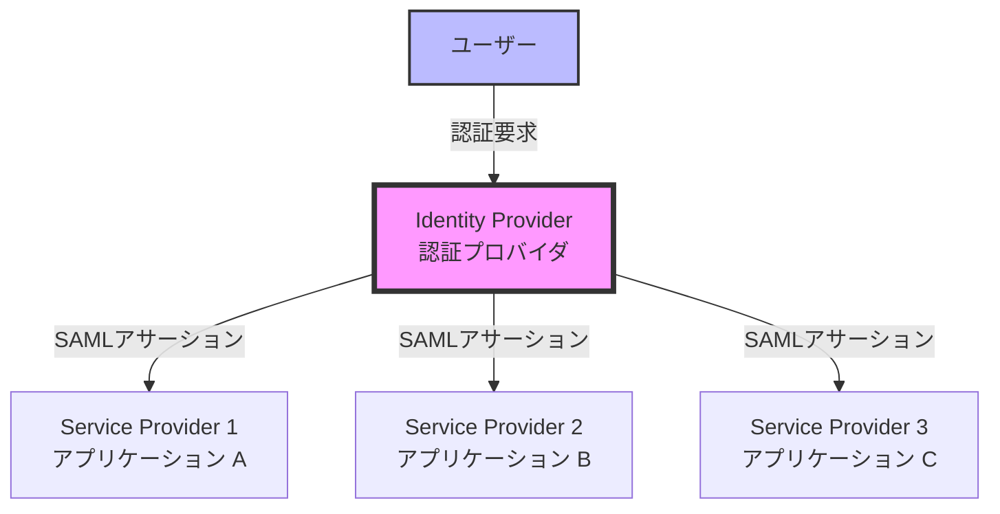
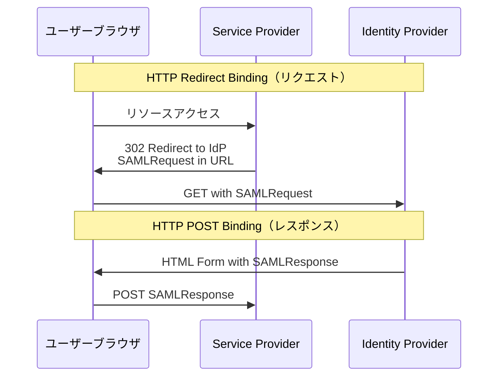
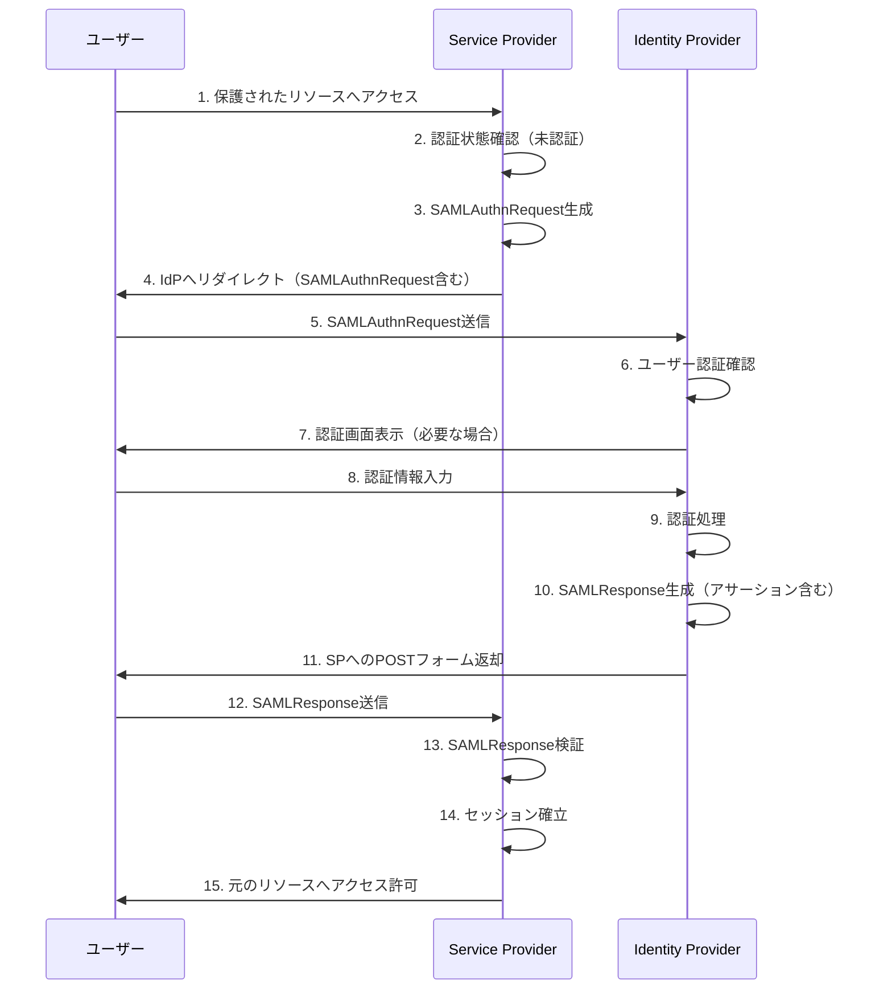
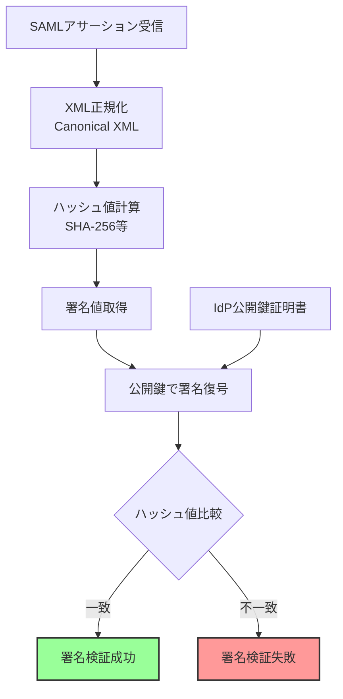
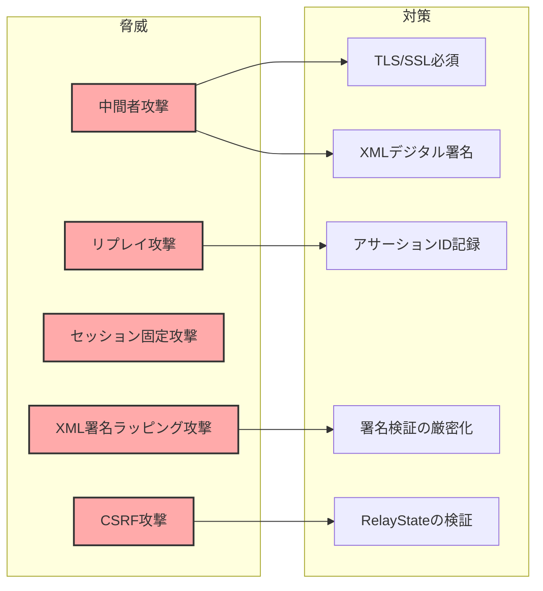

# SAML

SAML（Security Assertion Markup Language）は、異なるセキュリティドメイン間で認証および認可情報を交換するためのXMLベースのオープンスタンダードである。2002年にOASIS（Organization for the Advancement of Structured Information Standards）によって初版が策定され、現在広く利用されているSAML 2.0は2005年に標準化された[^1]。企業のエンタープライズ環境において、複数のサービスやアプリケーション間でシングルサインオン（SSO）を実現する際の事実上の標準となっている。

SAMLが解決しようとする本質的な問題は、ユーザー認証の中央集権化と、その結果として得られる認証状態の信頼できる伝達である。従来、個々のアプリケーションが独自にユーザー認証を行っていた環境では、ユーザーは利用するサービスごとに個別のアカウントとパスワードを管理する必要があった。これは利便性の低下だけでなく、パスワードの使い回しや弱いパスワードの利用といったセキュリティリスクも招いていた。SAMLは、信頼できる認証プロバイダ（Identity Provider: IdP）が行った認証結果を、サービスプロバイダ（Service Provider: SP）が安全に受け入れることを可能にする仕組みを提供する。



SAMLプロトコルの設計において重要な要素は、その信頼モデルである。IdPとSP間には事前に確立された信頼関係が必要であり、これは通常、公開鍵証明書の交換とメタデータの共有によって実現される。この信頼関係により、SPは受信したSAMLアサーション（認証・認可情報を含むXMLドキュメント）が確かに信頼するIdPから発行されたものであることを検証できる。

## SAMLの構成要素

SAML仕様は、相互に関連する4つの主要コンポーネントから構成される。これらのコンポーネントは階層的な関係を持ち、上位層は下位層の機能を利用して、より複雑な機能を実現する。

**Assertions（アサーション）**は、SAMLの最も基本的な構成要素である。アサーションは、サブジェクト（通常はユーザー）に関するステートメントを含むXMLドキュメントであり、IdPによって発行され、デジタル署名によって保護される。SAML 2.0では、3種類のアサーションが定義されている。Authentication Assertionは、サブジェクトがいつ、どのような方法で認証されたかを示す。Attribute Assertionは、サブジェクトに関する属性情報（名前、メールアドレス、所属組織など）を提供する。Authorization Decision Assertionは、サブジェクトが特定のリソースに対して特定のアクションを実行する権限を持つかどうかを示す。

```xml
<saml:Assertion xmlns:saml="urn:oasis:names:tc:SAML:2.0:assertion"
                ID="_8e8dc5f69a98cc4c1ff3427e5ce34606fd672f91e6"
                Version="2.0"
                IssueInstant="2024-01-20T12:30:00Z">
    <saml:Issuer>https://idp.example.com</saml:Issuer>
    <ds:Signature xmlns:ds="http://www.w3.org/2000/09/xmldsig#">
        <!-- Digital signature content -->
    </ds:Signature>
    <saml:Subject>
        <saml:NameID Format="urn:oasis:names:tc:SAML:2.0:nameid-format:persistent">
            user123
        </saml:NameID>
        <saml:SubjectConfirmation Method="urn:oasis:names:tc:SAML:2.0:cm:bearer">
            <saml:SubjectConfirmationData NotOnOrAfter="2024-01-20T12:35:00Z"
                                         Recipient="https://sp.example.com/acs"
                                         InResponseTo="_abcdef123456"/>
        </saml:SubjectConfirmation>
    </saml:Subject>
    <saml:Conditions NotBefore="2024-01-20T12:29:30Z"
                     NotOnOrAfter="2024-01-20T12:35:00Z">
        <saml:AudienceRestriction>
            <saml:Audience>https://sp.example.com</saml:Audience>
        </saml:AudienceRestriction>
    </saml:Conditions>
    <saml:AuthnStatement AuthnInstant="2024-01-20T12:30:00Z">
        <saml:AuthnContext>
            <saml:AuthnContextClassRef>
                urn:oasis:names:tc:SAML:2.0:ac:classes:PasswordProtectedTransport
            </saml:AuthnContextClassRef>
        </saml:AuthnContext>
    </saml:AuthnStatement>
</saml:Assertion>
```

**Protocols（プロトコル）**は、SAMLアサーションをリクエストし、レスポンスを受け取るための通信パターンを定義する。主要なプロトコルには、Authentication Request Protocol（認証要求プロトコル）、Single Logout Protocol（シングルログアウトプロトコル）、Assertion Query/Request Protocol（アサーション照会プロトコル）などがある。これらのプロトコルは、IdPとSP間でどのようなメッセージがどのような順序で交換されるかを規定する。

**Bindings（バインディング）**は、SAMLプロトコルメッセージを標準的な通信プロトコル（HTTPなど）上でどのように転送するかを定義する。SAML 2.0では、複数のバインディングが定義されているが、実際によく使用されるのは、HTTP Redirect Binding、HTTP POST Binding、HTTP Artifact Bindingの3つである。HTTP Redirect Bindingは、SAMLメッセージをURLエンコードしてHTTPリダイレクトのクエリパラメータとして送信する。メッセージサイズの制限があるため、主にリクエストメッセージに使用される。HTTP POST Bindingは、SAMLメッセージをHTMLフォームの隠しフィールドに埋め込み、JavaScriptによる自動サブミットで送信する。メッセージサイズの制限が緩いため、大きなアサーションを含むレスポンスによく使用される。



**Profiles（プロファイル）**は、特定のユースケースにおいて、アサーション、プロトコル、バインディングをどのように組み合わせて使用するかを規定する。最も重要なプロファイルは、Web Browser SSO Profileである。このプロファイルは、Webブラウザを介したシングルサインオンの実現方法を詳細に定義しており、現在のSAML実装の大部分はこのプロファイルに基づいている。

## SAMLフローの詳細

SAML Web Browser SSO Profileには、2つの主要なフローパターンが存在する。SP-initiated SSOとIdP-initiated SSOである。これらのフローは、認証プロセスの開始点が異なるが、最終的には同じ結果（ユーザーがSPにアクセスできる状態）を達成する。

**SP-initiated SSO**は、ユーザーが最初にSPのリソースにアクセスしようとすることから始まる。SPは、ユーザーが認証されていないことを検出すると、SAMLAuthnRequestを生成し、設定されたIdPにユーザーをリダイレクトする。このプロセスは以下のように進行する。



SP-initiated SSOフローにおいて、SPが生成するSAMLAuthnRequestには、いくつかの重要な要素が含まれる。IDは、リクエストを一意に識別するための識別子である。IssueInstantは、リクエストが発行された時刻を示す。Destinationは、このリクエストが送信されるべきIdPのエンドポイントURLを指定する。AssertionConsumerServiceURLは、IdPがSAMLResponseを送信すべきSPのエンドポイントを示す。

IdPは、SAMLAuthnRequestを受信すると、まずリクエストの妥当性を検証する。これには、リクエストの署名検証（署名されている場合）、Destination属性の確認、リクエストの有効期限チェックなどが含まれる。次に、IdPは現在のユーザーセッションを確認し、ユーザーが既に認証されているかどうかを判断する。認証されていない場合は、適切な認証メカニズム（パスワード認証、多要素認証など）を使用してユーザーを認証する。

認証が成功すると、IdPはSAMLResponseを生成する。このレスポンスには、先ほど説明したSAMLアサーションが含まれる。アサーションには、認証ステートメント、属性ステートメント、そして重要なことに、SubjectConfirmation要素が含まれる。SubjectConfirmation要素は、このアサーションの受信者（SP）が、アサーションが意図された受信者であることを確認するための情報を提供する。

**IdP-initiated SSO**は、ユーザーが最初にIdPのポータルやダッシュボードにアクセスし、そこから利用したいSPを選択することから始まる。このフローは、企業の従業員ポータルのような環境でよく見られる。IdPは、ユーザーの選択に基づいて、unsolicited SAMLResponseを生成し、選択されたSPに送信する。

IdP-initiated SSOには、セキュリティ上の考慮事項がある。SPは、予期しないSAMLResponseを受信することになるため、より慎重な検証が必要となる。特に、アサーションの有効期限、Audience制限、署名の検証は極めて重要である。また、CSRF（Cross-Site Request Forgery）攻撃を防ぐため、多くの実装では、IdP-initiated SSOを無効にするか、追加のセキュリティ対策を実装している。

## SAMLアサーションの構造と署名検証

SAMLアサーションの信頼性は、XMLデジタル署名によって保証される。SAML 2.0では、XML Signature Syntax and Processing仕様[^2]に基づいた署名メカニズムを使用する。署名は、アサーション全体に対して適用されることも、個別のアサーションステートメントに対して適用されることもある。

XMLデジタル署名の検証プロセスは、以下の手順で行われる。まず、署名対象の要素を正規化（Canonicalization）する。XMLは、同じ意味を持つ文書でも異なる表現が可能なため、署名検証の前に標準的な形式に変換する必要がある。次に、正規化されたXMLに対してハッシュ値を計算する。そして、署名値をIdPの公開鍵で復号化し、計算したハッシュ値と比較する。これらが一致すれば、アサーションが改ざんされていないことが確認できる。



アサーションの有効性検証は、署名検証だけでは不十分である。SPは、以下の追加検証を実行する必要がある。

**時間的制約の検証**では、NotBefore属性とNotOnOrAfter属性で指定された有効期間内にアサーションが使用されているかを確認する。これらの時刻比較では、IdPとSP間の時刻同期のずれを考慮し、通常は数分程度の許容誤差（clock skew）を設ける。

**Audience制限の検証**では、アサーションのAudience要素が自身のEntity IDと一致することを確認する。これにより、他のSP向けのアサーションを誤って受け入れることを防ぐ。

**Subject確認の検証**では、SubjectConfirmation要素内のRecipient属性が、アサーションを受信したエンドポイントと一致することを確認する。また、InResponseTo属性がある場合は、自身が発行したSAMLAuthnRequestのIDと一致することを確認する。

**リプレイ攻撃の防止**のため、SPは受信したアサーションのIDを一定期間記録し、同じIDのアサーションを再度受信した場合は拒否する。この期間は通常、アサーションの有効期限までとする。

## セキュリティ考慮事項

SAMLの実装において、セキュリティは最も重要な考慮事項である。SAML Security and Privacy Considerations[^3]では、様々な脅威モデルと対策が詳述されている。

**メッセージの完全性と機密性**を保証するため、SAMLメッセージは常にTLS/SSL上で転送されるべきである。しかし、TLSは通信路の保護のみを提供し、メッセージレベルの保護は提供しない。そのため、XMLデジタル署名による完全性保護が必須となる。機密性が必要な場合は、XML暗号化を使用してアサーションの一部または全体を暗号化することができる。

**セッション管理**に関して、SAMLはIdPとSP間でセッション情報を同期する仕組みを持たない。これは、シングルログアウトの実装を複雑にする要因となっている。SPは独自のセッション管理を行い、アサーションの有効期限とは独立してセッションタイムアウトを設定する必要がある。一方で、セッションの有効期限をアサーションの有効期限より長く設定すると、IdPでログアウトしてもSPではログイン状態が継続するという問題が発生する。

**メタデータの信頼性**も重要な課題である。IdPとSPは、相互の設定情報（エンドポイントURL、公開鍵証明書など）を含むメタデータを交換する。このメタデータが改ざんされると、中間者攻撃の可能性が生じる。メタデータ自体にXML署名を適用し、安全な経路で交換することが推奨される。



**XML署名ラッピング攻撃**は、SAMLに特有の脆弱性である。攻撃者は、正当な署名を持つアサーションを別のXML構造でラップし、SPの検証ロジックを混乱させることで、偽のアサーションを受け入れさせようとする。この攻撃を防ぐには、署名検証時に署名対象要素を正確に特定し、検証後はその要素のみを信頼することが重要である。

## 実装における課題とベストプラクティス

SAMLの実装は、仕様の複雑さと、相互運用性の要求から、多くの課題を伴う。実際の運用環境では、異なるベンダーの製品間での相互接続、レガシーシステムとの統合、パフォーマンスの最適化など、様々な問題に直面する。

**相互運用性の課題**は、SAML実装において最も一般的な問題である。SAML仕様は包括的であるが、実装の詳細については多くの選択肢を残している。例えば、NameID形式の選択、属性名のマッピング、認証コンテキストクラスの解釈などは、実装によって異なる場合がある。これらの差異を吸収するため、多くのSAML実装では、詳細な設定オプションやマッピング機能を提供している。

実装時には、以下のベストプラクティスに従うことが推奨される：

**エラーハンドリングの適切な実装**が重要である。セキュリティの観点から、エラーメッセージは攻撃者に有用な情報を提供しないよう、一般的なメッセージに留める。一方で、正当なユーザーや管理者のトラブルシューティングのため、詳細なログを内部的に記録する。

**設定の柔軟性と安全性のバランス**を取る必要がある。多くのSAML実装では、様々な設定オプションを提供するが、デフォルト設定は最も安全な選択肢とすべきである。例えば、署名検証の無効化オプションは、開発環境でのみ使用可能とし、本番環境では強制的に有効とする。

**パフォーマンスの最適化**も重要な考慮事項である。XML処理とデジタル署名検証は計算コストが高い。大規模な環境では、以下の最適化を検討する。検証済みアサーションのキャッシング（ただし、リプレイ攻撃に注意）、IdPメタデータのキャッシング、XML処理ライブラリの最適化、署名検証の並列化などが有効である。

**監査とロギング**は、セキュリティインシデントの検出と事後分析のために不可欠である。記録すべき情報には、認証の成功/失敗、アサーションID、ユーザー識別情報、アクセス元IPアドレス、使用された認証方式などが含まれる。ただし、個人情報保護の観点から、必要以上の情報を記録しないよう注意が必要である。

SAMLプロトコルの将来を考えると、OAuth 2.0やOpenID Connectといった新しいプロトコルが台頭している中でも、SAMLは企業環境において重要な役割を果たし続けている。特に、複雑な認可要件、属性ベースのアクセス制御、レガシーシステムとの統合が必要な環境では、SAMLの豊富な機能セットが依然として価値を持つ。一方で、モバイルアプリケーションやシングルページアプリケーションのような新しいアーキテクチャでは、よりシンプルで軽量なプロトコルが好まれる傾向にある。

実装者は、これらの技術的トレンドを理解しつつ、組織の要件に最も適したソリューションを選択する必要がある。多くの場合、SAMLと新しいプロトコルを組み合わせたハイブリッドアプローチが、移行期間における現実的な選択肢となる。

[^1]: OASIS Security Services (SAML) TC, "Security Assertion Markup Language (SAML) V2.0 Technical Overview", OASIS Committee Draft, March 2008. https://docs.oasis-open.org/security/saml/Post2.0/sstc-saml-tech-overview-2.0.html

[^2]: W3C, "XML Signature Syntax and Processing Version 1.1", W3C Recommendation, April 2013. https://www.w3.org/TR/xmldsig-core1/

[^3]: OASIS Security Services (SAML) TC, "Security and Privacy Considerations for the OASIS Security Assertion Markup Language (SAML) V2.0", OASIS Standard, March 2005. https://docs.oasis-open.org/security/saml/v2.0/saml-sec-consider-2.0-os.pdf