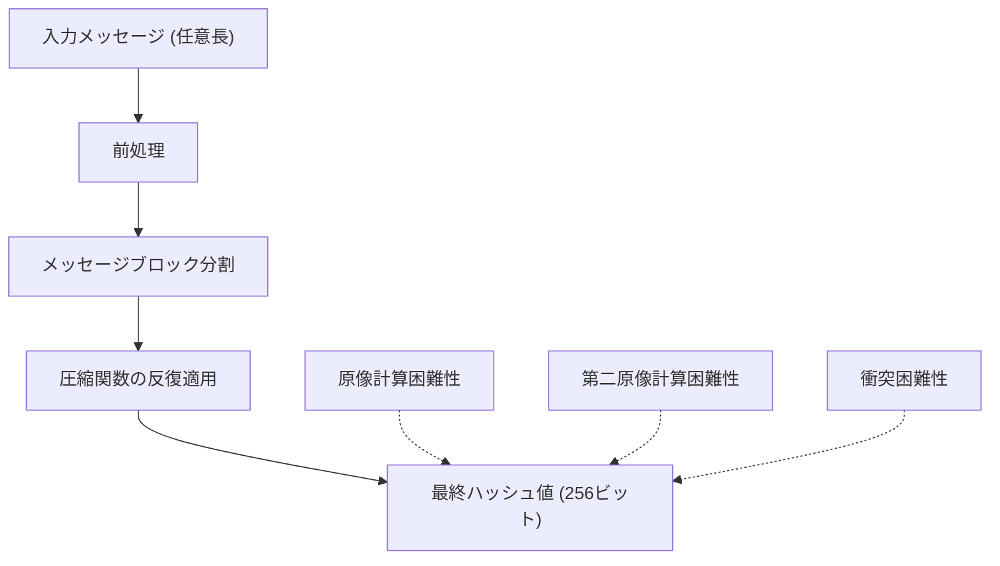
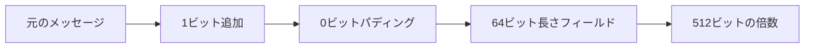
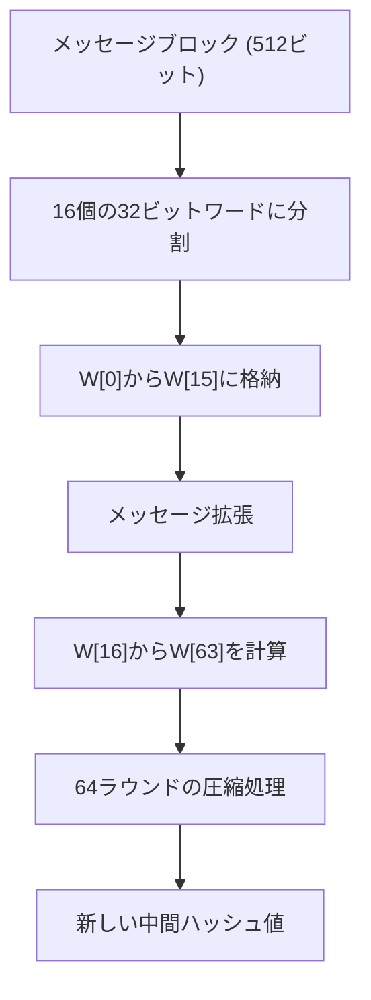
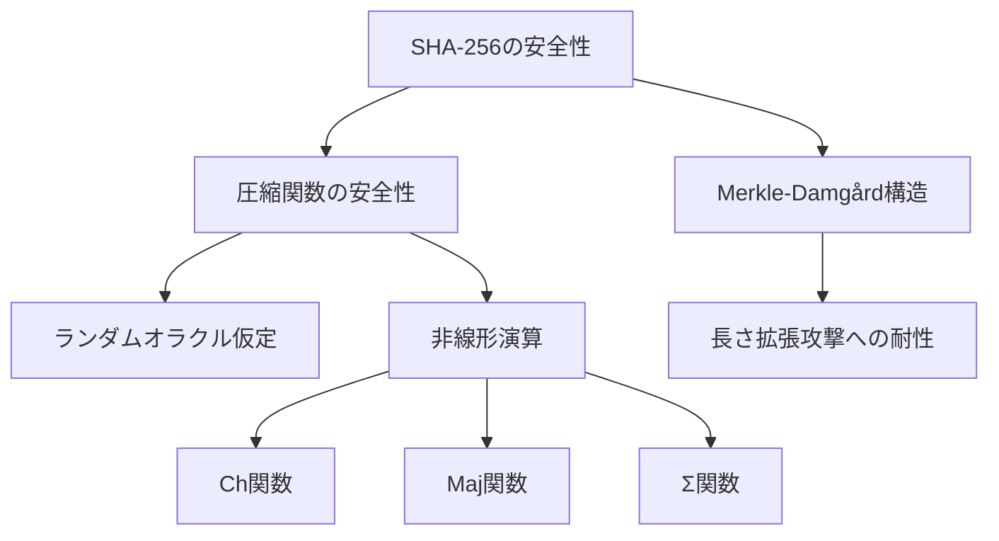
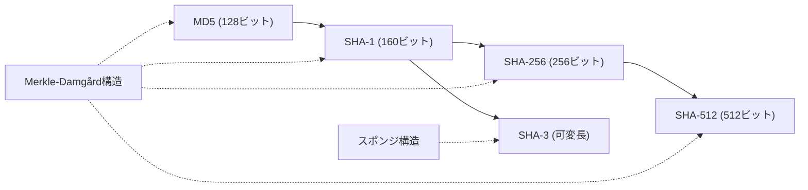

# SHA-256: 暗号学的ハッシュ関数の設計と実装

SHA-256は、Secure Hash Algorithm 2ファミリーの中核を成す暗号学的ハッシュ関数である。2001年にNSA（米国家安全保障局）によって設計され、NIST（米国立標準技術研究所）によってFIPS 180-2として標準化された。任意長の入力データから256ビット（32バイト）の固定長出力を生成し、デジタル署名、メッセージ認証、パスワード保護など、現代の情報セキュリティインフラストラクチャの基盤として広く利用されている。

## 暗号学的ハッシュ関数の本質

暗号学的ハッシュ関数は、任意長のメッセージを固定長のダイジェストに変換する一方向関数である。SHA-256が満たすべき暗号学的性質として、以下の三つが基本要件となる。

第一に、原像計算困難性（preimage resistance）がある。これは、与えられたハッシュ値$h$に対して、$H(m) = h$となるメッセージ$m$を見つけることが計算量的に困難であることを意味する。SHA-256では、256ビットのハッシュ値から元のメッセージを復元するには、平均して$2^{256}$回の試行が必要となる。

第二に、第二原像計算困難性（second preimage resistance）がある。既知のメッセージ$m_1$に対して、$H(m_1) = H(m_2)$かつ$m_1 \neq m_2$となる別のメッセージ$m_2$を見つけることが困難でなければならない。この性質により、既存のメッセージを別のメッセージで置き換える攻撃を防ぐことができる。

第三に、衝突困難性（collision resistance）がある。$H(m_1) = H(m_2)$かつ$m_1 \neq m_2$となる任意の二つのメッセージ$m_1$、$m_2$を見つけることが困難でなければならない。誕生日パラドックスにより、$n$ビットのハッシュ関数に対する衝突攻撃の計算量は約$2^{n/2}$となるため、SHA-256では約$2^{128}$回の計算が必要となる。

## Merkle-Damgård構造とメッセージ処理

SHA-256は、Merkle-Damgård構造^[1]に基づいて設計されている。この構造は、任意長の入力を固定長のブロックに分割し、各ブロックを順次処理することで最終的なハッシュ値を生成する。この設計により、固定サイズの圧縮関数から任意長入力に対応するハッシュ関数を構築できる。

メッセージの前処理では、まず入力メッセージの末尾にパディングを追加する。パディングは、メッセージの終端を示す1ビットの'1'と、必要な数の'0'ビット、そして元のメッセージ長を表す64ビットの値で構成される。これにより、パディング後のメッセージ長は512ビットの倍数となる。

パディング処理の具体的な手順は次のとおりである。メッセージ長を$l$ビットとすると、$l + 1 + k \equiv 448 \pmod{512}$となる最小の非負整数$k$を求め、$k$個の0ビットをパディングとして追加する。最後に、元のメッセージ長$l$を64ビットのビッグエンディアン表現で追加する。

## 圧縮関数の内部構造

SHA-256の中核となる圧縮関数は、512ビットのメッセージブロックと256ビットの中間ハッシュ値を入力として受け取り、新たな256ビットの中間ハッシュ値を出力する。この圧縮関数は64ラウンドの反復処理で構成され、各ラウンドでは複雑な論理演算とビット操作が行われる。

圧縮関数の処理は、8個の32ビットワード（A, B, C, D, E, F, G, H）からなる作業変数を使用する。初期値として、以下の定数が設定される（これらは最初の8個の素数の平方根の小数部分の最初の32ビットである）：

- $H_0 = \text{0x6a09e667}$
- $H_1 = \text{0xbb67ae85}$
- $H_2 = \text{0x3c6ef372}$
- $H_3 = \text{0xa54ff53a}$
- $H_4 = \text{0x510e527f}$
- $H_5 = \text{0x9b05688c}$
- $H_6 = \text{0x1f83d9ab}$
- $H_7 = \text{0x5be0cd19}$

各ラウンドでは、メッセージスケジュールアレイ$W_t$（$t = 0, 1, ..., 63$）を使用する。最初の16個の値（$W_0$から$W_{15}$）は、現在処理中の512ビットメッセージブロックを32ビットワードに分割したものである。残りの48個の値は、以下の拡張アルゴリズムで生成される：

$$W_t = \sigma_1(W_{t-2}) + W_{t-7} + \sigma_0(W_{t-15}) + W_{t-16}$$

ここで、$\sigma_0$と$\sigma_1$は以下のように定義される：

$$\sigma_0(x) = \text{ROTR}^7(x) \oplus \text{ROTR}^{18}(x) \oplus \text{SHR}^3(x)$$
$$\sigma_1(x) = \text{ROTR}^{17}(x) \oplus \text{ROTR}^{19}(x) \oplus \text{SHR}^{10}(x)$$

ROTR（rotate right）は右循環シフト、SHR（shift right）は右論理シフト、$\oplus$はXOR演算を表す。

## ラウンド関数の詳細

各ラウンド$t$（$t = 0, 1, ..., 63$）では、以下の演算が実行される：

$$T_1 = H + \Sigma_1(E) + \text{Ch}(E, F, G) + K_t + W_t$$
$$T_2 = \Sigma_0(A) + \text{Maj}(A, B, C)$$

その後、作業変数が以下のように更新される：

- $H = G$
- $G = F$
- $F = E$
- $E = D + T_1$
- $D = C$
- $C = B$
- $B = A$
- $A = T_1 + T_2$

ここで使用される関数は以下のように定義される：

$$\text{Ch}(x, y, z) = (x \land y) \oplus (\neg x \land z)$$
$$\text{Maj}(x, y, z) = (x \land y) \oplus (x \land z) \oplus (y \land z)$$
$$\Sigma_0(x) = \text{ROTR}^2(x) \oplus \text{ROTR}^{13}(x) \oplus \text{ROTR}^{22}(x)$$
$$\Sigma_1(x) = \text{ROTR}^6(x) \oplus \text{ROTR}^{11}(x) \oplus \text{ROTR}^{25}(x)$$

Ch関数（Choose）は、$x$のビットに基づいて$y$または$z$のビットを選択する。Maj関数（Majority）は、3つの入力ビットの多数決を取る。これらの関数は、非線形性を導入し、雪崩効果を強化する役割を果たす。

定数$K_t$は、最初の64個の素数の立方根の小数部分の最初の32ビットから導出された値である^[2]。これらの定数は、バックドアが仕込まれていないことを示すために、数学的に定義された値から生成されている。

## 最終出力の生成

64ラウンドの処理が完了した後、作業変数の値が前のブロックのハッシュ値に加算される（モジュロ$2^{32}$加算）：

- $H_0 = H_0 + A$
- $H_1 = H_1 + B$
- $H_2 = H_2 + C$
- $H_3 = H_3 + D$
- $H_4 = H_4 + E$
- $H_5 = H_5 + F$
- $H_6 = H_6 + G$
- $H_7 = H_7 + H$

すべてのメッセージブロックが処理された後、最終的なハッシュ値は$H_0 || H_1 || H_2 || H_3 || H_4 || H_5 || H_6 || H_7$の連結として得られる（||は連結を表す）。

## 安全性の理論的基盤

SHA-256の安全性は、いくつかの暗号学的仮定に基づいている。まず、圧縮関数がランダムオラクルのように振る舞うという仮定がある。ランダムオラクルモデル^[3]では、ハッシュ関数は理想的なランダム関数として扱われ、同じ入力に対しては常に同じ出力を返すが、新しい入力に対してはランダムな出力を生成する。

Merkle-Damgård構造の安全性証明により、圧縮関数が衝突困難であれば、全体のハッシュ関数も衝突困難となることが示されている。具体的には、ハッシュ関数$H$に対する衝突が見つかった場合、その衝突から圧縮関数$f$に対する衝突を構成できることが証明されている。

SHA-256に対する最良の攻撃手法は、現在のところ一般的な誕生日攻撃である。これは約$2^{128}$回の計算を必要とし、現在の計算能力では実行不可能である。差分攻撃や線形攻撃などの高度な暗号解析手法も研究されているが、フルラウンドのSHA-256に対する有効な攻撃は発見されていない。

## 実装上の考慮事項

SHA-256の実装では、性能とセキュリティの両面から様々な最適化と対策が必要となる。まず、メッセージ拡張の計算は、必要になる直前に行うことでメモリ使用量を削減できる。64個すべての$W_t$値を事前に計算して保存する代わりに、16個の値だけを循環バッファとして管理し、各ラウンドで必要な値を計算する手法が一般的である。

ビット演算の最適化も重要である。多くのプロセッサでは、循環シフト命令が直接サポートされているため、これを活用することで性能向上が期待できる。また、Ch関数とMaj関数は、ビット演算の代替表現を使用することで、命令数を削減できる：

$$\text{Ch}(x, y, z) = z \oplus (x \land (y \oplus z))$$
$$\text{Maj}(x, y, z) = (x \land y) | (z \land (x | y))$$

サイドチャネル攻撃への対策も重要である。特に、タイミング攻撃を防ぐためには、すべての演算が入力データに依存しない一定時間で実行されるように実装する必要がある。これは、条件分岐を避け、すべての処理パスで同じ数の演算を実行することで達成される。

並列処理による高速化も可能である。複数のメッセージブロックを同時に処理したり、SIMD命令を使用して複数のSHA-256計算を並列実行したりすることで、スループットを向上させることができる。特に、GPUを使用した大規模並列処理は、パスワードクラッキングやマイニングなどの用途で広く利用されている。

## ハードウェア実装

SHA-256は、ハードウェアでの実装にも適している。専用のASIC（Application-Specific Integrated Circuit）やFPGA（Field-Programmable Gate Array）での実装により、ソフトウェア実装と比較して大幅な性能向上が可能である。

ハードウェア実装では、パイプライン処理が効果的である。64ラウンドの処理を複数のステージに分割し、各ステージで異なるメッセージブロックを処理することで、スループットを向上させることができる。典型的な実装では、4段または8段のパイプラインが使用される。

また、ラウンド関数の演算を展開（unrolling）することで、制御ロジックを簡素化し、クリティカルパスを短縮できる。完全展開では64個のラウンド関数を個別の回路として実装するが、面積とのトレードオフを考慮して部分展開を選択することも多い。

## 他のハッシュ関数との比較

SHA-256は、SHA-2ファミリーの一員として、他のハッシュ関数と比較して独自の位置を占めている。MD5やSHA-1などの前世代のハッシュ関数と比較すると、より強固な安全性を提供する一方で、計算コストも増加している。

SHA-1との主な違いは、出力長（160ビット対256ビット）、ラウンド数（80対64）、および使用される論理関数の複雑さにある。SHA-1に対する実際の衝突攻撃が2017年に実証された^[4]ことから、SHA-256への移行が加速した。

SHA-3（Keccak）との比較では、設計思想の根本的な違いがある。SHA-3はスポンジ構造を採用しており、Merkle-Damgård構造とは異なるアプローチを取っている。SHA-3は長さ拡張攻撃に対して構造的に耐性があり、より柔軟な出力長をサポートするが、多くの実装ではSHA-256の方が高速である。

## 実践的な利用シナリオ

SHA-256は、様々なセキュリティプロトコルとアプリケーションで使用されている。デジタル署名では、メッセージのハッシュ値に対して署名を行うことで、署名のサイズを固定化し、計算効率を向上させている。RSA-PSS、DSA、ECDSAなどの署名アルゴリズムでは、SHA-256が標準的なハッシュ関数として使用される。

証明書の検証においても、SHA-256は重要な役割を果たす。X.509証明書では、証明書の内容のハッシュ値に対して認証局が署名を行う。TLS/SSLプロトコルでは、証明書チェーンの検証やハンドシェイクメッセージの完全性確認にSHA-256が使用される。

ブロックチェーン技術では、SHA-256が基盤技術として使用されている。Bitcoinのプルーフ・オブ・ワークでは、ブロックヘッダーのSHA-256ハッシュ値が特定の条件を満たすまで、ノンス値を変更しながら繰り返し計算を行う。この計算の困難さが、ブロックチェーンの改ざん耐性を保証している。

パスワード保護では、SHA-256を直接使用することは推奨されない。代わりに、PBKDF2、bcrypt、scryptなどの専用のパスワードハッシュ関数で、内部的にSHA-256を使用することが一般的である。これらの関数は、意図的に計算を遅くすることで、総当たり攻撃を困難にしている。

## 実装例と性能特性

SHA-256の性能は、実装方法とハードウェアプラットフォームに大きく依存する。現代のx86-64プロセッサでは、Intel SHA拡張命令^[5]を使用することで、ソフトウェア実装の性能を大幅に向上させることができる。これらの命令は、メッセージスケジュールの計算とラウンド関数の実行を高速化する。

典型的な性能指標として、Intel Core i7プロセッサでの最適化されたソフトウェア実装では、約200-300 MB/秒のスループットが達成される。SHA拡張命令を使用した場合、この値は1 GB/秒を超えることもある。一方、専用のASICでは、数十GB/秒のスループットが可能である。

メモリ使用量の観点では、SHA-256は非常に効率的である。基本的な実装では、8個の32ビット作業変数と16個のメッセージワード用のバッファのみが必要であり、合計で約100バイト程度のメモリで動作可能である。これにより、リソースが制限された組み込みシステムでも使用できる。

## 将来の展望と量子耐性

量子コンピュータの発展により、暗号学的ハッシュ関数の安全性についても再評価が必要となっている。Groverのアルゴリズム^[6]により、$n$ビットのハッシュ関数に対する原像攻撃の計算量は$O(2^{n/2})$に削減される。したがって、量子コンピュータに対してSHA-256は実質的に128ビットのセキュリティしか提供しない。

しかし、現在の量子コンピュータの技術では、SHA-256に対する実用的な攻撃はまだ不可能である。量子ビットの数とコヒーレンス時間の制約により、Groverのアルゴリズムを完全に実行することは困難である。さらに、衝突攻撃に対しては、量子アルゴリズムによる高速化は限定的である（$O(2^{n/3})$程度）。

長期的なセキュリティを考慮する場合、SHA-384やSHA-512などのより長い出力長を持つハッシュ関数への移行が推奨される。また、量子耐性を持つ新しい暗号プリミティブの研究も進められているが、ハッシュ関数については古典的な設計でも十分な安全性が維持される見込みである。

SHA-256は、その堅牢な設計と広範な採用により、今後も情報セキュリティの基盤技術として重要な役割を果たし続けるだろう。実装の最適化、新しいハードウェアアーキテクチャへの対応、そして量子コンピュータ時代への準備など、継続的な研究開発により、その有用性は維持されていくと考えられる。

---

^[1] Merkle, R. C. (1989). "One way hash functions and DES". Advances in Cryptology — CRYPTO '89. Lecture Notes in Computer Science. 435. pp. 428–446.

^[2] NIST (2015). "FIPS 180-4: Secure Hash Standard". National Institute of Standards and Technology.

^[3] Bellare, M., & Rogaway, P. (1993). "Random oracles are practical: A paradigm for designing efficient protocols". Proceedings of the 1st ACM Conference on Computer and Communications Security. pp. 62–73.

^[4] Stevens, M., Bursztein, E., Karpman, P., Albertini, A., & Markov, Y. (2017). "The first collision for full SHA-1". Advances in Cryptology – CRYPTO 2017. pp. 570–596.

^[5] Intel Corporation (2013). "Intel SHA Extensions: New Instructions Supporting the Secure Hash Algorithm on Intel Architecture Processors". White Paper.

^[6] Grover, L. K. (1996). "A fast quantum mechanical algorithm for database search". Proceedings of the 28th Annual ACM Symposium on Theory of Computing. pp. 212–219.