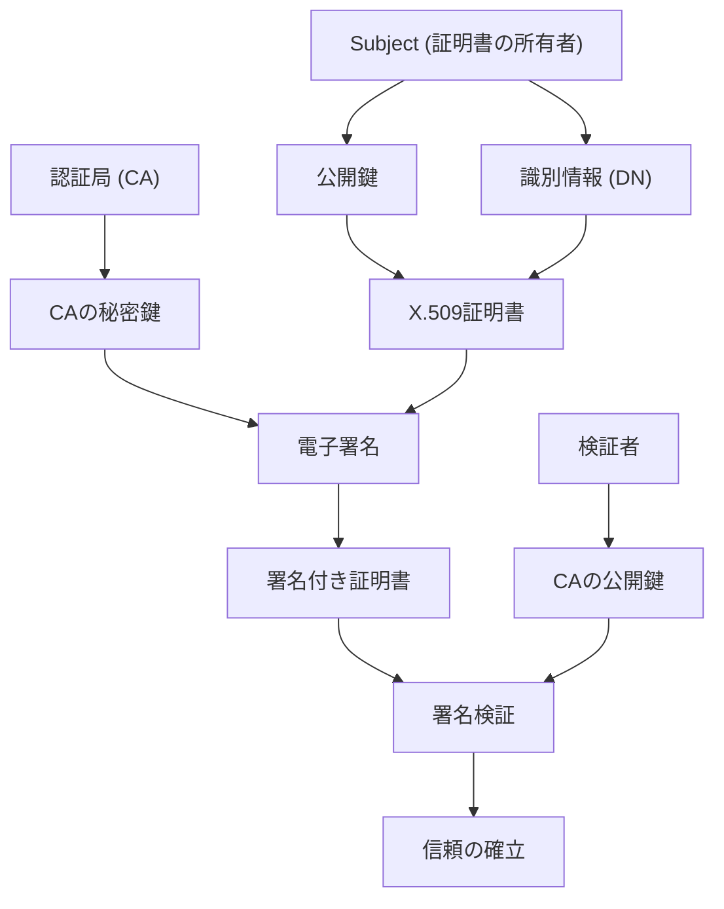
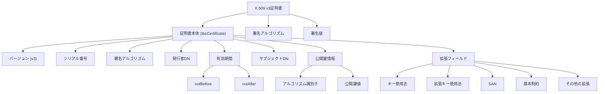
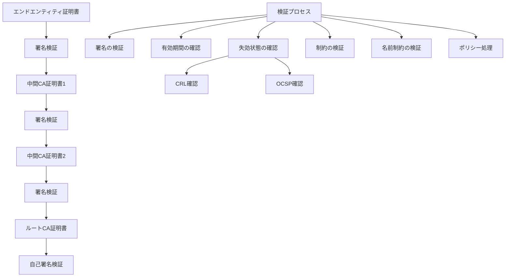
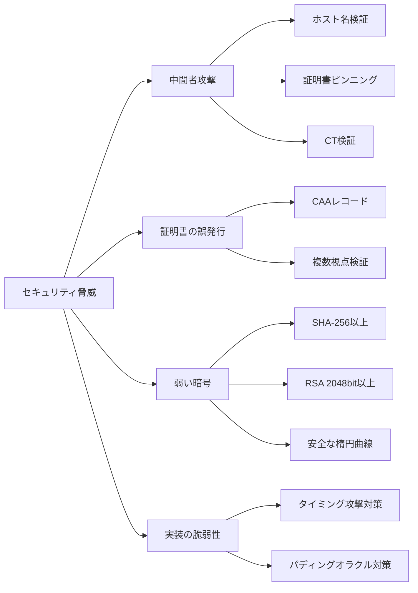

# X.509証明書

X.509は、公開鍵証明書とその検証のための標準フォーマットを定義する国際標準規格である。ITU-T（国際電気通信連合の電気通信標準化部門）によって1988年に初版が策定され、その後数回の改訂を経て現在のバージョン3（X.509 v3）に至っている[^1]。インターネット上でのセキュアな通信を実現するPKI（Public Key Infrastructure）の中核技術として、TLS/SSLやコード署名、電子メールの暗号化など幅広い用途で利用されている。

X.509証明書の本質は、公開鍵とその所有者の身元情報を暗号学的に結びつけることにある。証明書は信頼できる第三者機関である認証局（Certificate Authority: CA）によって電子署名され、この署名により証明書の内容が改ざんされていないことと、確かにその認証局が発行したものであることが保証される。この仕組みにより、事前に公開鍵を安全に交換する手段を持たない通信相手との間でも、信頼できる暗号通信を確立することが可能となる。



## 証明書の構造と各フィールドの詳細

X.509証明書は、ASN.1（Abstract Syntax Notation One）[^2]で定義された構造を持ち、DER（Distinguished Encoding Rules）またはその派生形式でエンコードされる。証明書の基本構造は、証明書本体（tbsCertificate）、署名アルゴリズム識別子（signatureAlgorithm）、署名値（signatureValue）の3つの主要部分から構成される。

### 証明書本体（tbsCertificate）

証明書本体には以下のフィールドが含まれる：

**バージョン（version）**: 証明書のバージョンを示す。現在広く使用されているのはバージョン3（値は2）である。バージョン1（値は0）とバージョン2（値は1）も存在するが、拡張フィールドをサポートしないため現在ではほとんど使用されない。

**シリアル番号（serialNumber）**: 認証局が発行する証明書を一意に識別するための番号。同一の認証局が発行する証明書間で重複してはならない。RFC 5280[^3]では、シリアル番号は20オクテット（160ビット）を超えてはならないと規定されている。

**署名アルゴリズム（signature）**: 証明書の署名に使用されるアルゴリズムを指定する。RSA with SHA-256（OID: 1.2.840.113549.1.1.11）やECDSA with SHA-256（OID: 1.2.840.10045.4.3.2）などが一般的である。

**発行者（issuer）**: 証明書を発行した認証局の識別名（Distinguished Name: DN）。X.500ディレクトリサービスの命名規則に従い、国名（C）、組織名（O）、組織単位名（OU）、共通名（CN）などの属性で構成される。

**有効期間（validity）**: 証明書の有効期間を示すnotBeforeとnotAfterの2つのタイムスタンプで構成される。時刻はUTCTimeまたはGeneralizedTime形式で表現される。2050年以降の日付にはGeneralizedTimeを使用しなければならない。

**サブジェクト（subject）**: 証明書の所有者（公開鍵の所有者）の識別名。発行者と同様のDN形式で表現される。Webサーバー証明書の場合、CNフィールドにはサーバーのFQDN（Fully Qualified Domain Name）が設定される。

**公開鍵情報（subjectPublicKeyInfo）**: 公開鍵アルゴリズムの識別子と公開鍵の値を含む。RSA公開鍵の場合はモジュラスと公開指数、楕円曲線暗号の場合は曲線パラメータと公開鍵点が含まれる。

### 拡張フィールド（Extensions）

X.509 v3では、証明書に追加情報を含めるための拡張フィールドが導入された。各拡張は、オブジェクト識別子（OID）、クリティカルフラグ、値の3つの要素で構成される。クリティカルフラグがtrueに設定された拡張を理解できないシステムは、その証明書を拒否しなければならない。

主要な拡張フィールドには以下のものがある：

**キー使用法（Key Usage）**: 公開鍵の使用目的を制限する。デジタル署名、否認防止、鍵暗号化、データ暗号化、鍵合意、証明書署名、CRL署名などのビットフラグで構成される。

**拡張キー使用法（Extended Key Usage）**: より具体的な用途を指定する。TLSサーバー認証（OID: 1.3.6.1.5.5.7.3.1）、TLSクライアント認証（OID: 1.3.6.1.5.5.7.3.2）、コード署名（OID: 1.3.6.1.5.5.7.3.3）などがある。

**サブジェクト代替名（Subject Alternative Name: SAN）**: 証明書の所有者を識別する追加の名前を指定する。DNS名、IPアドレス、電子メールアドレス、URIなどを含めることができる。Webサーバー証明書では、複数のドメイン名やワイルドカードドメインを指定するために使用される。

**基本制約（Basic Constraints）**: 証明書がCA証明書であるかエンドエンティティ証明書であるかを示す。CA証明書の場合、パス長制約（認証パスに含めることができる中間CA証明書の最大数）を指定できる。

**証明書ポリシー（Certificate Policies）**: 証明書の発行と使用に関するポリシーを示すOIDのリスト。各ポリシーには、CPS（Certification Practice Statement）へのURIなどの修飾子を含めることができる。

**権限キー識別子（Authority Key Identifier）**: 証明書の署名に使用された認証局の公開鍵を識別する。通常、認証局証明書の公開鍵のSHA-1ハッシュ値が使用される。

**サブジェクトキー識別子（Subject Key Identifier）**: 証明書に含まれる公開鍵を識別する。通常、公開鍵のSHA-1ハッシュ値が使用される。



## 証明書チェーンと検証プロセス

X.509証明書の信頼性は、証明書チェーン（認証パス）と呼ばれる階層構造によって確立される。証明書チェーンは、エンドエンティティ証明書から始まり、1つ以上の中間CA証明書を経て、最終的にルートCA証明書に至る一連の証明書で構成される。

### 証明書チェーンの構築

証明書チェーンの構築プロセスは、検証対象の証明書（通常はサーバー証明書）から開始される。各証明書の発行者フィールドと、次の証明書のサブジェクトフィールドが一致することを確認しながら、チェーンを上位に向かって構築していく。このプロセスは、自己署名されたルートCA証明書に到達するか、信頼できる証明書ストアに含まれる証明書に到達するまで続けられる。

チェーン構築時には、権限キー識別子（AKI）とサブジェクトキー識別子（SKI）の拡張フィールドも活用される。AKIは証明書を署名した鍵を特定し、SKIは証明書に含まれる公開鍵を識別するため、これらを照合することでより確実なチェーン構築が可能となる。

### 証明書の検証プロセス

証明書の検証は、以下の手順で実行される：

1. **署名検証**: 各証明書の署名を、その発行者（上位の証明書）の公開鍵を使用して検証する。署名アルゴリズムに従って証明書本体のハッシュ値を計算し、署名値を復号化した結果と比較する。

2. **有効期間の確認**: 現在時刻が各証明書のnotBeforeとnotAfterの間にあることを確認する。チェーン内のすべての証明書が有効期間内である必要がある。

3. **失効状態の確認**: 証明書が失効していないことを確認する。CRL（Certificate Revocation List）やOCSP（Online Certificate Status Protocol）を使用して、証明書の失効状態をチェックする。

4. **制約の検証**: 基本制約、キー使用法、証明書ポリシーなどの拡張フィールドに指定された制約が満たされていることを確認する。特に、中間CA証明書にはCA:TRUEの基本制約が設定されている必要がある。

5. **名前制約の検証**: 名前制約拡張が存在する場合、証明書チェーン内の後続の証明書のサブジェクトおよびSANが、許可された名前空間内にあることを確認する。

6. **ポリシー制約の処理**: 証明書ポリシー拡張とポリシー制約拡張に基づいて、受け入れ可能なポリシーのセットを計算する。requireExplicitPolicyやinhibitPolicyMappingなどの制約も考慮される。



### パス検証アルゴリズム

RFC 5280で定義されているパス検証アルゴリズムは、証明書チェーンの各証明書に対して状態変数を維持しながら処理を進める。主要な状態変数には以下のものがある：

- **valid_policy_tree**: 有効なポリシーのツリー構造
- **explicit_policy**: 明示的なポリシーが必要となるまでの証明書数
- **inhibit_any_policy**: anyPolicyが無効となるまでの証明書数
- **policy_mapping**: ポリシーマッピングが禁止されるまでの証明書数
- **working_public_key**: 次の証明書の署名検証に使用する公開鍵
- **working_issuer_name**: 次の証明書の発行者として期待される名前
- **max_path_length**: 残りの許容パス長

これらの状態変数は、証明書チェーンを処理する過程で更新され、最終的に検証の成否を決定する。

## エンコーディング形式とファイルフォーマット

X.509証明書は、ASN.1で定義された抽象構造を具体的なバイト列に変換するため、DER（Distinguished Encoding Rules）でエンコードされる。DERは、ASN.1構造を一意のバイト列表現に変換する決定的なエンコーディング規則である。

### DERエンコーディング

DERエンコーディングは、TLV（Type-Length-Value）形式を使用する。各データ要素は、型を示すタグ、データ長、実際の値の3つの部分で構成される：

- **タグ**: データ型を識別する。クラス（2ビット）、構造化フラグ（1ビット）、タグ番号（5ビット以上）で構成される
- **長さ**: 値フィールドのバイト数を示す。127バイト以下の場合は1バイトで表現され、それ以上の場合は長形式が使用される
- **値**: 実際のデータ内容

例えば、整数値256は以下のようにエンコードされる：
- タグ: 0x02（INTEGER型）
- 長さ: 0x02（2バイト）
- 値: 0x01 0x00

### PEMフォーマット

DERでエンコードされた証明書は、そのままではバイナリデータであるため、テキストベースのプロトコルや設定ファイルでの使用に適さない。このため、PEM（Privacy Enhanced Mail）フォーマットが広く使用される。PEMは、DERエンコードされたデータをBase64でエンコードし、ヘッダーとフッターで囲んだテキスト形式である：

```
-----BEGIN CERTIFICATE-----
MIIDXTCCAkWgAwIBAgIJAKLdQVPy90WJMA0GCSqGSIb3DQEBCwUAMEUxCzAJBgNV
BAYTAkFVMRMwEQYDVQQIDApTb21lLVN0YXRlMSEwHwYDVQQKDBhJbnRlcm5ldCBX
...（Base64エンコードされたDERデータ）...
-----END CERTIFICATE-----
```

PEMフォーマットの利点は、テキストエディタで扱いやすく、電子メールやWebフォームなどでも安全に転送できることである。複数の証明書や秘密鍵を1つのファイルに含めることも可能で、各要素は個別のヘッダー/フッターのペアで区切られる。

### PKCS#7とPKCS#12

証明書の配布や保存には、他のフォーマットも使用される：

**PKCS#7（.p7b）**: 証明書チェーンを含むことができるが、秘密鍵は含まない。署名されたデータ構造として、証明書の集合を安全に転送するために使用される。Windows環境でよく使用される。

**PKCS#12（.p12/.pfx）**: 証明書、秘密鍵、および証明書チェーンを1つのファイルに含めることができる。パスワードで保護され、クライアント証明書の配布などに使用される。内部的には、証明書と鍵は個別に暗号化され、MAC（Message Authentication Code）で完全性が保護される。

## 実装上の考慮事項

X.509証明書を扱うシステムを実装する際には、以下の点に注意が必要である：

### エンコーディングの厳密性

DERエンコーディングは決定的であるべきだが、実装によっては非標準的なエンコーディングを生成したり受け入れたりする場合がある。例えば：

- 整数値の先頭の余分なゼロバイト
- BOOLEANのTRUE値として0xFF以外の値の使用
- 不必要に長い長さ表現の使用

これらの非標準的なエンコーディングは、相互運用性の問題や、場合によってはセキュリティ脆弱性につながる可能性がある。

### 時刻の扱い

証明書の有効期間を表すUTCTimeとGeneralizedTimeの扱いには注意が必要である：

- UTCTimeは2桁の年表現を使用するため、1950-2049年の範囲でのみ使用可能
- GeneralizedTimeは4桁の年表現を使用し、より広い範囲をサポート
- タイムゾーンの扱い（通常はUTCを使用）
- うるう秒の考慮

### 暗号アルゴリズムの移行

時代とともに暗号アルゴリズムの安全性は変化する。SHA-1からSHA-256への移行、RSAから楕円曲線暗号への移行など、アルゴリズムの変更に対応できる柔軟な実装が必要である。また、量子コンピュータ耐性を持つアルゴリズムへの将来的な移行も考慮すべきである。

### 証明書の大きさ

証明書のサイズは、特に制約のある環境（IoTデバイスなど）では重要な考慮事項となる：

- RSA鍵のサイズ（2048ビット、4096ビットなど）
- 証明書チェーンの長さ
- 拡張フィールドの数と内容
- 楕円曲線暗号の使用によるサイズ削減

### 失効確認の実装

証明書の失効確認は、PKIの信頼性を維持する上で重要だが、実装には課題がある：

- CRLのサイズとダウンロード時間
- OCSPレスポンダーの可用性
- ネットワーク障害時のフォールバック動作
- OCSPステープリングの実装
- ソフトフェイルとハードフェイルの選択

## PKIとの統合

X.509証明書は、より大きなPKIエコシステムの一部として機能する。PKIの主要コンポーネントには以下が含まれる：

### 認証局（CA）の階層

商用PKIでは、通常以下のような階層構造が採用される：

1. **ルートCA**: オフラインで管理され、自己署名証明書を持つ。ルート証明書は、OSやブラウザの信頼できる証明書ストアに事前にインストールされる。

2. **ポリシーCA**: 特定のポリシードメインを管理する中間CA。地理的地域や事業部門ごとに設置されることがある。

3. **発行CA**: 実際にエンドエンティティ証明書を発行するオンラインCA。HSM（Hardware Security Module）で秘密鍵を保護する。

### 証明書の透明性（Certificate Transparency）

証明書の透明性は、不正な証明書の発行を検出するための仕組みである：

- 証明書はCTログサーバーに記録される
- SCT（Signed Certificate Timestamp）が証明書に含まれる
- 監視者とオーディターがログを監視する

### 自動化とACME

Let's Encryptに代表されるACME（Automatic Certificate Management Environment）プロトコル[^4]により、証明書の発行と更新が自動化された：

- ドメイン検証の自動化（HTTP-01、DNS-01チャレンジ）
- 証明書の自動更新
- 短期間証明書（90日）の利用促進

## セキュリティ上の脅威と対策

X.509証明書を利用するシステムには、様々なセキュリティ脅威が存在する。これらの脅威を理解し、適切な対策を実装することが重要である。

### 中間者攻撃（MITM）への対策

証明書検証の不備は、中間者攻撃を可能にする。以下の対策が必要である：

**ホスト名検証の厳密化**: 証明書のCNやSANフィールドと、接続先のホスト名が一致することを確認する。ワイルドカード証明書の場合は、RFC 6125[^5]に従った検証を行う。例えば、`*.example.com`は`foo.example.com`にマッチするが、`bar.foo.example.com`にはマッチしない。

**証明書ピンニング**: 特定のサービスに対して、期待される証明書または認証局を事前に固定する。公開鍵ピンニング（HPKP）やTLS証明書ピンニングにより、不正な証明書の使用を防ぐ。ただし、証明書の更新時には注意が必要である。

**CT（Certificate Transparency）の活用**: 証明書にSCTが含まれていることを確認し、CTログに記録された証明書のみを信頼する。これにより、不正に発行された証明書の検出が可能となる。

### 証明書の誤発行と対策

認証局による証明書の誤発行は、PKI全体の信頼性を損なう重大な問題である：

**CAA（Certification Authority Authorization）レコード**: DNSにCAAレコードを設定することで、ドメインの証明書を発行できる認証局を制限する。例えば：
```
example.com. IN CAA 0 issue "letsencrypt.org"
```

**複数視点からのドメイン検証**: ACME-MEGAなどの手法により、複数の地理的位置からドメイン検証を行い、BGPハイジャックなどの攻撃を防ぐ。

### 弱い暗号アルゴリズムの問題

時代遅れの暗号アルゴリズムは、証明書の偽造や署名の偽造を可能にする：

**SHA-1の廃止**: SHA-1ハッシュ関数は衝突攻撃に対して脆弱であることが証明されている。2017年のSHAtteredデモンストレーション[^6]以降、SHA-256以上の使用が必須となった。

**RSA鍵長の考慮**: 2048ビット未満のRSA鍵は、現在の計算能力では現実的な時間内に破られる可能性がある。NIST SP 800-57[^7]では、2030年まで2048ビット、それ以降は3072ビット以上を推奨している。

**楕円曲線の選択**: NIST P-256、P-384、P-521などの標準的な曲線を使用する。Curve25519やCurve448などの新しい曲線も、サイドチャネル攻撃への耐性が高いため推奨される。



### 実装の脆弱性

証明書処理の実装における脆弱性は、しばしば深刻なセキュリティ問題を引き起こす：

**ASN.1パーサーの脆弱性**: 複雑なASN.1構造の解析において、バッファオーバーフローや整数オーバーフローが発生する可能性がある。厳密な境界チェックと、ファジングテストによる検証が必要である。

**タイミング攻撃**: RSA署名検証などの処理時間の違いから、秘密情報が漏洩する可能性がある。一定時間アルゴリズムの使用や、ブラインディング技術の適用が推奨される。

## 実運用における注意点

X.509証明書を実際の運用環境で使用する際には、技術的な側面だけでなく、運用上の課題にも対処する必要がある。

### 証明書のライフサイクル管理

証明書の有効期間は、セキュリティと運用のバランスを考慮して決定される：

**短期証明書の利点**: Let's Encryptが採用する90日証明書は、鍵の漏洩時の影響を限定し、自動化を促進する。一方で、更新頻度が高くなるため、自動化が必須となる。

**更新タイミングの考慮**: 証明書の更新は、有効期限の30日前から開始することが一般的である。更新プロセスには、新証明書の発行、検証、段階的なロールアウト、古い証明書の無効化が含まれる。

**監視とアラート**: 証明書の有効期限、失効状態、CTログへの登録状況を継続的に監視する。Prometheusなどの監視システムと統合し、異常を早期に検出する。

### 大規模環境での証明書管理

エンタープライズ環境では、数千から数万の証明書を管理する必要がある：

**証明書インベントリ**: すべての証明書の所在、用途、有効期限、責任者を一元管理する。自動検出ツールを使用して、未管理の証明書を発見する。

**自動化の推進**: 証明書の要求、承認、発行、配布、更新のワークフローを自動化する。HashiCorp VaultやVenafiなどの証明書管理プラットフォームの活用が有効である。

**階層的な管理**: 組織内でサブCAを運用し、部門ごとに証明書発行権限を委譲する。ただし、適切なポリシー制約と監査が必要である。

### パフォーマンスの最適化

証明書処理は計算量が多いため、パフォーマンスの最適化が重要である：

**証明書チェーンの最適化**: 不要な中間CA証明書を除外し、チェーンを最小限に保つ。クライアントが既に持っている可能性の高いルートCA証明書は送信しない。

**OCSPステープリング**: サーバーが事前にOCSPレスポンスを取得し、TLSハンドシェイク時にクライアントに提供する。これにより、クライアントのOCSP確認によるレイテンシを削減できる。

**セッション再開**: TLSセッションチケットやセッションIDを使用して、証明書検証を含む完全なハンドシェイクを回避する。

### コンプライアンスと監査

多くの業界では、証明書管理に関する規制要件が存在する：

**監査ログの保持**: 証明書の発行、失効、更新などすべての操作を記録し、改ざん防止措置を講じる。ログは最低でも7年間保持することが推奨される。

**職務の分離**: 証明書の要求者、承認者、発行者の役割を分離し、不正な証明書発行を防ぐ。

**定期的な監査**: 証明書ポリシー（CP）と証明書実施規程（CPS）への準拠を定期的に監査する。WebTrust for CAやETSI監査などの第三者監査も考慮する。

X.509証明書は、インターネットセキュリティの基盤技術として、今後も進化を続けていく。量子コンピュータ耐性アルゴリズムへの移行、IoTデバイスへの適用、ブロックチェーン技術との統合など、新たな課題と機会が存在する。これらの技術動向を理解し、適切に実装することが、セキュアなシステムを構築する上で重要となる。

[^1]: ITU-T Recommendation X.509 (10/2019) | ISO/IEC 9594-8:2020, Information technology - Open Systems Interconnection - The Directory: Public-key and attribute certificate frameworks

[^2]: ITU-T Recommendation X.680 (02/2021), Information technology - Abstract Syntax Notation One (ASN.1): Specification of basic notation

[^3]: RFC 5280: Internet X.509 Public Key Infrastructure Certificate and Certificate Revocation List (CRL) Profile, D. Cooper et al., May 2008

[^4]: RFC 8555: Automatic Certificate Management Environment (ACME), R. Barnes et al., March 2019

[^5]: RFC 6125: Representation and Verification of Domain-Based Application Service Identity within Internet Public Key Infrastructure Using X.509 (PKIX) Certificates in the Context of Transport Layer Security (TLS), P. Saint-Andre et al., March 2011

[^6]: Stevens, M., Bursztein, E., Karpman, P., Albertini, A., & Markov, Y. (2017). The first collision for full SHA-1. In Annual International Cryptology Conference (pp. 570-596). Springer.

[^7]: NIST Special Publication 800-57 Part 1 Revision 5: Recommendation for Key Management: Part 1 – General, E. Barker, May 2020