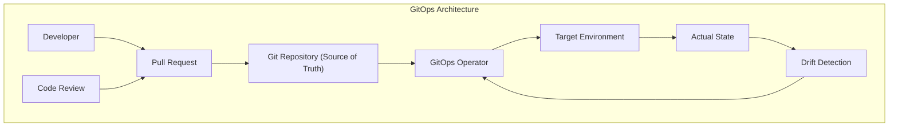
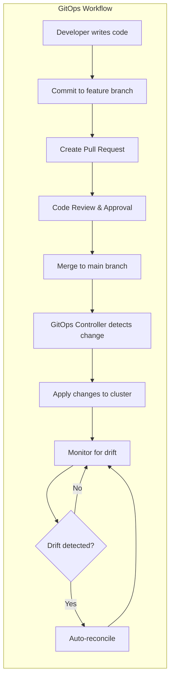
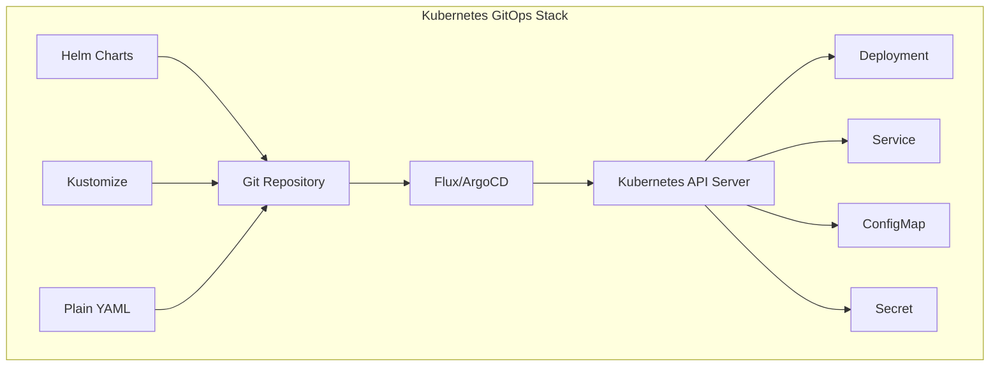
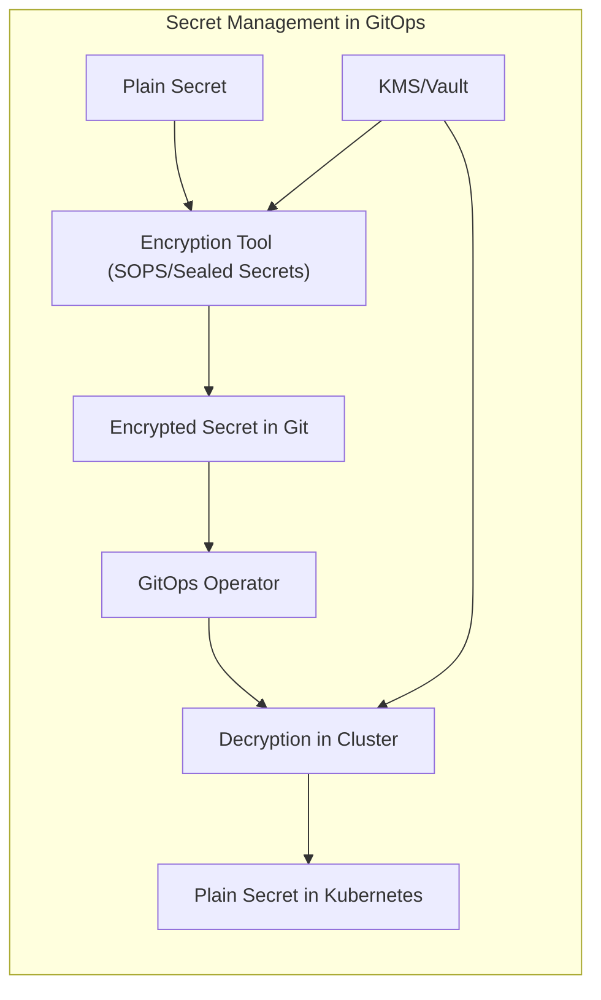
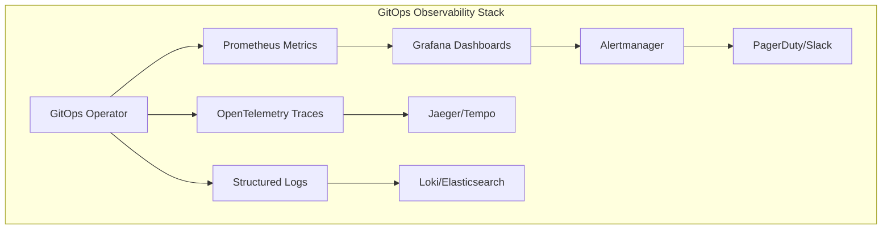
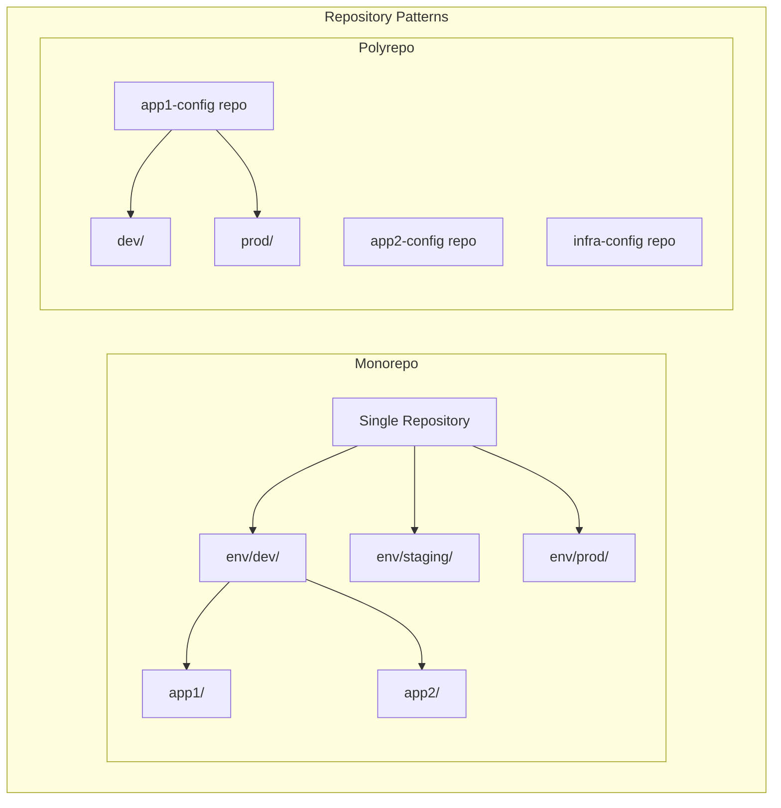
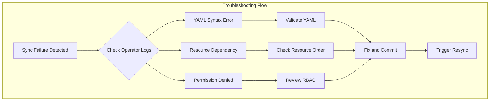
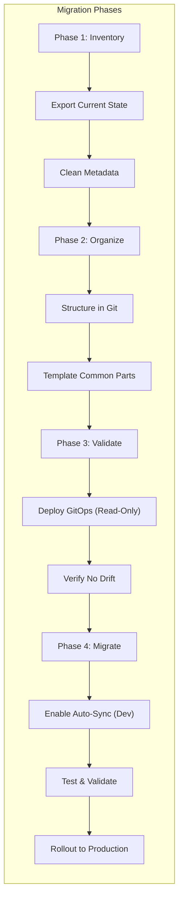

# GitOps

GitOpsは、インフラストラクチャとアプリケーションの宣言的な構成をGitリポジトリで管理し、実際の環境状態をGitに記述された望ましい状態と自動的に同期させる運用手法である。この概念は2017年にWeaveworksのAlexis Richardsonによって提唱され[^1]、以降クラウドネイティブコミュニティにおける標準的なプラクティスとして定着してきた。GitOpsの本質は、Gitを単一の真実の源（Single Source of Truth）として扱い、すべての変更をGitのワークフローを通じて実施することで、インフラストラクチャとアプリケーションの管理に対して監査可能性、再現性、そして一貫性をもたらすことにある。

従来のインフラストラクチャ管理手法では、管理者が直接サーバーにログインして設定を変更したり、スクリプトを実行したりすることが一般的であった。この手法は、変更の追跡が困難であり、環境間の一貫性を保つことが難しく、また人的エラーのリスクも高かった。一方、GitOpsでは、すべての変更はコードレビューを経てGitリポジトリにコミットされ、自動化されたプロセスによって環境に適用される。これにより、変更の履歴が完全に保持され、必要に応じて任意の時点の状態に戻すことが可能となる。

GitOpsの中核となる原則は4つ存在する。第一に、システムの望ましい状態は宣言的に記述される。これは、「どのように」ではなく「何を」達成したいかを記述することを意味し、YAMLやJSONなどの構造化フォーマットで表現される。第二に、この宣言的な記述はGitでバージョン管理される。Gitの持つ分散性、イミュータビリティ、監査可能性といった特性が、インフラストラクチャ管理においても活用される。第三に、承認された変更は自動的に適用される。人間の介入なしに、Gitリポジトリの状態が実環境に反映される。第四に、ソフトウェアエージェントが継続的に実環境の状態を監視し、宣言された状態との差異（ドリフト）を検出して自動的に修正する。

GitOpsのアーキテクチャには、大きく分けてPull型とPush型の2つのモデルが存在する。Push型モデルは、従来のCI/CDパイプラインに近い形態で、CIシステムがビルドとテストを実行した後、デプロイメントツールが対象環境に変更をプッシュする。このモデルの利点は、既存のCI/CDツールとの統合が容易であることだが、CIシステムが本番環境へのアクセス権限を持つ必要があるため、セキュリティ上の懸念がある。

一方、Pull型モデルでは、クラスター内で動作するオペレーター（FluxやArgo CDなど）がGitリポジトリを定期的にポーリングし、変更を検出すると自動的にクラスターに適用する。このモデルの最大の利点は、外部システムがクラスターへの書き込み権限を持つ必要がないことで、セキュリティが大幅に向上する。また、オペレーターは継続的に実際の状態と望ましい状態を比較し、差異があれば自動的に修正するため、設定のドリフトを防ぐことができる。

Kubernetesエコシステムにおいて、GitOpsは特に強力な効果を発揮する。Kubernetesの宣言的な性質とGitOpsの原則は非常に相性が良く、マニフェストファイルをGitで管理し、それらを自動的にクラスターに適用することで、複雑なマイクロサービスアーキテクチャの管理が大幅に簡素化される。Kubernetesのリソース（Deployment、Service、ConfigMapなど）はすべてYAMLで宣言的に記述でき、これらをGitリポジトリで管理することで、アプリケーションの完全な構成を追跡可能な形で保持できる。

GitOpsツールの代表的なものとして、FluxとArgo CDが挙げられる。Fluxは、WeaveworksによってGitOpsの概念と共に開発されたツールで、Kubernetes専用に設計されている。Flux v2では、GitリポジトリだけでなくHelm RepositoryやOCI Registryもソースとして扱えるようになり、より柔軟な構成管理が可能となった[^2]。Fluxの特徴は、軽量でKubernetesネイティブな設計であり、Custom Resource Definitions (CRDs)を使用してGitOpsワークフローを定義する。

Argo CDは、Intuitによって開発されたGitOpsツールで、豊富なUIと高度な同期機能を提供する。Argo CDの特徴は、アプリケーションの健全性チェック、ロールバック機能、複数クラスターのサポート、RBACによる細かなアクセス制御などが挙げられる[^3]。また、Argo CDはApplicationSetコントローラーを使用して、複数の類似したアプリケーションを一括で管理する機能も提供している。

セキュリティの観点から見ると、GitOpsは従来の運用手法と比較して大幅な改善をもたらす。まず、本番環境へのアクセスを最小限に抑えることができる。開発者やオペレーターは直接本番環境にアクセスする必要がなく、すべての変更はGitを通じて行われる。これにより、誰が、いつ、何を変更したかが完全に記録され、監査要件を満たすことが容易になる。また、Pull型モデルでは、クラスター外部からの書き込みアクセスが不要となるため、攻撃対象領域が大幅に削減される。

しかし、GitOpsにもセキュリティ上の考慮事項は存在する。特にシークレット管理は重要な課題である。Gitリポジトリに平文でパスワードやAPIキーを保存することは絶対に避けなければならない。この問題に対処するため、Sealed Secrets、SOPS（Secrets OPerationS）、HashiCorp Vaultなどのツールが使用される。これらのツールは、シークレットを暗号化してGitリポジトリに保存し、クラスター内で復号化する仕組みを提供する。

マルチクラスター環境でのGitOps実装は、より複雑な考慮事項を伴う。組織が複数のKubernetesクラスターを運用する場合、それぞれのクラスターに対して異なる構成を適用しながら、共通部分を効率的に管理する必要がある。この課題に対して、一般的には環境ごとにブランチを分ける方法、ディレクトリ構造で環境を分離する方法、Kustomizeのオーバーレイを使用する方法などが採用される。

ディレクトリ構造による環境分離の例として、以下のような構成が考えられる。baseディレクトリに共通の設定を配置し、各環境固有の設定をオーバーレイとして管理する。この構造により、DRY（Don't Repeat Yourself）原則を守りながら、環境ごとの差異を明確に管理できる。

マルチテナント環境においては、GitOpsのアクセス制御がさらに重要となる。各テナントが自身のアプリケーションのみを管理できるよう、Gitリポジトリの構造とKubernetesのRBACを適切に設計する必要がある。一般的なパターンとして、テナントごとに名前空間を分離し、各テナントのGitOpsオペレーターがその名前空間のみにアクセスできるよう制限する方法がある。

パフォーマンスとスケーラビリティの観点では、GitOpsツールが管理するリソースの数が増加するにつれて、同期にかかる時間やリソース消費が問題となることがある。特に大規模な環境では、数千のKubernetesリソースを管理することも珍しくない。この課題に対処するため、GitOpsツールは様々な最適化手法を実装している。例えば、Argo CDは並列同期、選択的同期、リソースのヘルスチェックの最適化などを提供している。

監視とオブザーバビリティは、GitOps環境において重要な要素である。GitOpsオペレーターの健全性、同期の成功/失敗、ドリフトの検出などを監視する必要がある。PrometheusメトリクスやOpenTelemetryトレースを使用して、GitOpsワークフローの各段階を可視化することが推奨される。また、アラートの設定により、同期の失敗やドリフトの発生を迅速に検知し、対応することができる。

災害復旧（DR）とビジネス継続性の観点から、GitOpsは強力な利点を提供する。Gitリポジトリに完全な構成が保存されているため、クラスターが完全に失われた場合でも、新しいクラスターを立ち上げてGitOpsツールを設定するだけで、アプリケーションとインフラストラクチャを迅速に復元できる。この特性は、「Infrastructure as Code」の究極的な実現と言える。

GitOpsの実装における一般的な課題として、既存環境からの移行がある。すでに手動で管理されている環境や、従来のCI/CDパイプラインで管理されている環境をGitOpsに移行する際は、慎重な計画が必要である。一般的なアプローチとして、まず現在の状態をGitリポジトリにインポートし、GitOpsツールを読み取り専用モードで動作させて差異を確認し、段階的に管理を移行していく方法が推奨される。

開発者体験（Developer Experience）の向上も、GitOpsがもたらす重要な利点である。開発者は本番環境へのアクセス権限を持つ必要がなく、使い慣れたGitワークフローを使用してインフラストラクチャとアプリケーションを管理できる。プルリクエストによるレビュープロセスは、変更の品質を向上させ、知識の共有を促進する。また、変更の履歴が完全に保持されるため、問題が発生した際のトラブルシューティングが容易になる。

GitOpsのベストプラクティスとして、以下の点が重要である。まず、リポジトリ構造は明確で一貫性のあるものにする。環境、アプリケーション、チームの境界を反映した構造を採用し、ドキュメントで明確に説明する。次に、変更のレビュープロセスを確立する。すべての変更はプルリクエストを通じて行い、適切なレビューと承認を経てマージする。また、自動テストを充実させ、構成の妥当性を検証する。

ブランチ戦略も重要な考慮事項である。環境ごとにブランチを分ける方法と、単一のメインブランチで全環境を管理する方法があり、それぞれに利点と欠点がある。環境ブランチ方式は直感的で理解しやすいが、環境間の差異が大きくなりやすい。一方、単一ブランチ方式は一貫性を保ちやすいが、環境固有の設定の管理が複雑になる可能性がある。

継続的な改善のプロセスも重要である。GitOpsの導入後も、定期的にワークフローを見直し、ボトルネックや改善点を特定する。メトリクスを収集して、デプロイメントの頻度、リードタイム、障害率などを測定し、改善の効果を定量的に評価する。また、チームメンバーからのフィードバックを積極的に収集し、開発者体験の向上に努める。

GitOpsと他の技術トレンドとの統合も進んでいる。サービスメッシュ（Istioなど）の設定管理、プログレッシブデリバリー（Flaggerなど）との統合、ポリシーエンジン（Open Policy Agent）との連携など、GitOpsは現代のクラウドネイティブスタックの中核として機能している。これらの統合により、より高度な運用パターンが実現可能となっている。

エンタープライズ環境におけるGitOpsの採用には、組織的な変革も必要となる。従来の役割分担や承認プロセスの見直し、コンプライアンス要件への対応、既存のITサービス管理（ITSM）プロセスとの統合などが課題となる。しかし、これらの課題を克服することで、より迅速で信頼性の高いソフトウェアデリバリーが実現できる。

GitOpsは単なるツールや技術ではなく、ソフトウェアデリバリーに対する根本的な考え方の変革である。宣言的な構成管理、バージョン管理、自動化、継続的な監視という原則を組み合わせることで、複雑な分散システムの管理を簡素化し、信頼性を向上させる。クラウドネイティブ技術の発展と共に、GitOpsの重要性はさらに高まっていくことが予想される。

実装パターンの観点から、GitOpsには様々なアプローチが存在する。モノリポジトリ型では、すべての環境とアプリケーションの構成を単一のリポジトリで管理する。この方法は、全体の一貫性を保ちやすく、依存関係の管理が簡単である一方、大規模化に伴ってリポジトリが肥大化し、アクセス制御が複雑になる傾向がある。対照的に、ポリリポジトリ型では、アプリケーションや環境ごとに個別のリポジトリを作成する。これにより、きめ細かなアクセス制御と独立したリリースサイクルが可能となるが、構成の重複や一貫性の維持が課題となる。

ハイブリッド型のアプローチでは、インフラストラクチャの基盤部分（ネットワーク、セキュリティ、共通サービス）は中央集権的に管理し、アプリケーション固有の構成は各チームが独自のリポジトリで管理する。この方法は、ガバナンスと柔軟性のバランスを取ることができ、多くのエンタープライズ環境で採用されている。

GitOps実装時の具体的な設定例として、Flux v2を使用したマルチテナント環境の構築パターンを考察する。各テナントに専用の名前空間とGitリポジトリを割り当て、Fluxのマルチテナンシー機能を活用することで、セキュアな環境分離を実現できる。テナントは自身のリポジトリ内で自由にアプリケーションを管理できる一方、プラットフォームチームは基盤インフラストラクチャとポリシーを中央管理する。

トラブルシューティングの観点では、GitOps環境で発生する一般的な問題とその対処法を理解することが重要である。同期の失敗は最も頻繁に遭遇する問題の一つで、原因としてはYAMLの構文エラー、リソースの依存関係の問題、権限不足などが挙げられる。これらの問題を迅速に診断するためには、GitOpsオペレーターのログを詳細に確認し、Kubernetes eventsを監視することが必要である。

パフォーマンスチューニングにおいては、大規模環境でのGitOps運用に特有の課題が存在する。リポジトリサイズの最適化は重要な要素で、不要な履歴の削除、大きなバイナリファイルの外部化、shallow cloneの活用などが有効である。また、同期間隔の調整も重要で、変更頻度の高い開発環境では短い間隔（30秒〜1分）、安定した本番環境では長い間隔（5〜10分）を設定することで、リソース消費を最適化できる。

Argo CDにおけるパフォーマンス最適化の具体例として、アプリケーションのヘルスチェックをカスタマイズすることで、不要な再同期を防ぐことができる。また、Resource Hooksを活用して、特定のリソースの同期順序を制御し、依存関係に起因する失敗を回避できる。大規模なマニフェストを扱う場合は、Server-Side Applyを有効にすることで、クライアント側の負荷を軽減できる。

実装時のアンチパターンを認識し、回避することも重要である。よくある間違いとして、本番環境の構成を開発環境から直接コピーすることが挙げられる。これは、環境固有の設定（レプリカ数、リソース制限、外部サービスのエンドポイントなど）が混在し、予期しない動作を引き起こす原因となる。正しいアプローチは、基本構成を共有しながら、環境固有の値は明確に分離して管理することである。

別のアンチパターンとして、GitOpsリポジトリに機密情報を平文で保存することがある。たとえ秘密のリポジトリであっても、データベースのパスワードやAPIキーなどの機密情報は必ず暗号化して保存すべきである。また、すべての変更を自動的に本番環境に適用する設定も危険である。重要な環境では、手動承認のステップを組み込むか、特定の時間帯のみ自動適用を許可するなどの制御が必要である。

移行戦略の詳細について、既存のKubernetes環境をGitOpsに移行する際の段階的アプローチを考察する。第一段階では、現在の環境の棚卸しを行い、すべてのリソースをYAMLファイルとしてエクスポートする。この際、`kubectl get`コマンドで取得したマニフェストから、不要なメタデータ（resourceVersion、uid、creationTimestampなど）を削除することが重要である。

第二段階では、エクスポートしたマニフェストをGitリポジトリに整理して配置する。この時点で、環境固有の値を抽出し、Kustomizeやhelmを使用してテンプレート化することを検討する。第三段階では、GitOpsツールを読み取り専用モードで設定し、現在の環境との差異を確認する。差異がないことを確認した後、第四段階として段階的に管理を移行していく。まず開発環境から始め、問題がないことを確認してから、段階的に本番環境に展開していく。

GitOpsの成熟度モデルを考えると、組織は通常、いくつかの段階を経て成熟していく。初期段階では、単一のアプリケーションやチームでGitOpsを試験的に導入し、基本的な自動化を実現する。中級段階では、複数のチームがGitOpsを採用し、共通のパターンとツールチェーンが確立される。上級段階では、組織全体でGitOpsが標準化され、高度な機能（プログレッシブデリバリー、ポリシーベースの管理、マルチクラウド対応など）が活用される。

実運用における考慮事項として、バックアップとリカバリー戦略も重要である。Gitリポジトリ自体のバックアップはもちろん、Kubernetes etcdのバックアップ、永続ボリュームのスナップショット、アプリケーションデータのバックアップなど、多層的なアプローチが必要である。GitOpsの文脈では、設定のバックアップはGitの履歴として自然に保存されるが、ステートフルなデータについては別途考慮が必要である。

コスト最適化の観点では、GitOpsは開発環境の効率的な管理に貢献する。例えば、開発環境を夜間や週末に自動的にスケールダウンする設定をGitOpsで管理することで、クラウドコストを大幅に削減できる。また、機能ブランチに対応した一時的な環境の自動作成と削除も、GitOpsワークフローに組み込むことで、リソースの無駄を防ぐことができる。

最後に、GitOpsの将来の方向性として、AIとMLの統合が注目されている。異常検知、自動修復、設定の最適化提案など、機械学習を活用したインテリジェントなGitOps運用が期待されている。また、WebAssemblyやサーバーレスアーキテクチャとの統合、エッジコンピューティング環境でのGitOps適用など、新しい技術領域への拡張も進んでいる。

[^1]: Alexis Richardson, "GitOps - Operations by Pull Request", Weaveworks Blog, 2017
[^2]: Flux Documentation, "Flux v2 GA: Secure GitOps for Cloud Native Apps", 2021
[^3]: Argo CD Documentation, "Declarative GitOps CD for Kubernetes", CNCF Project