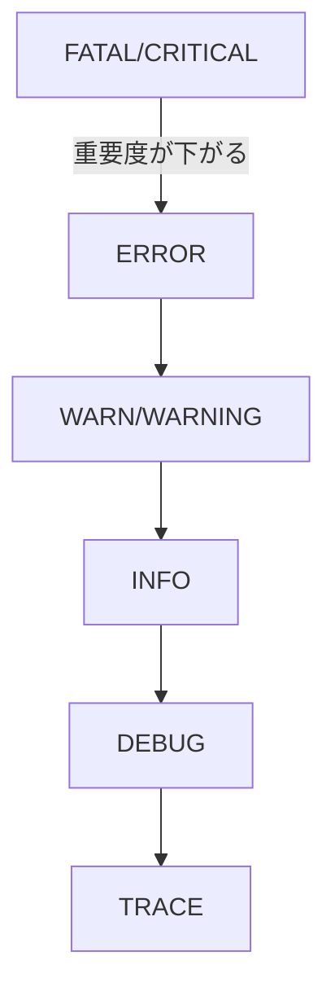
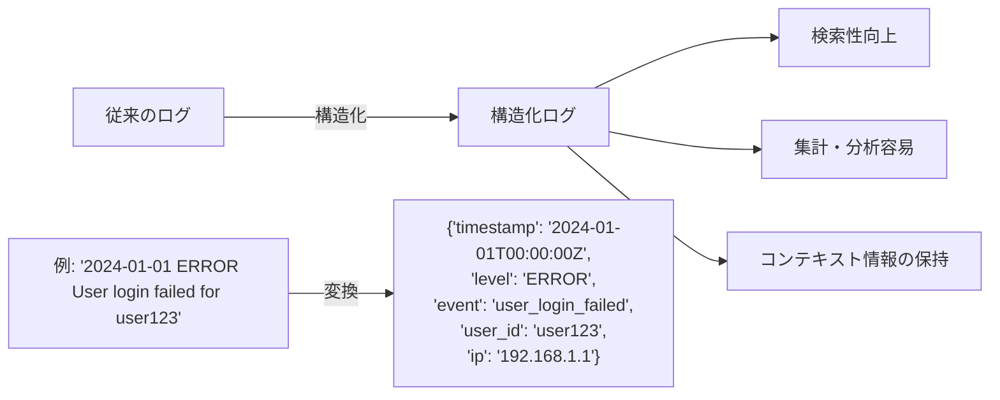
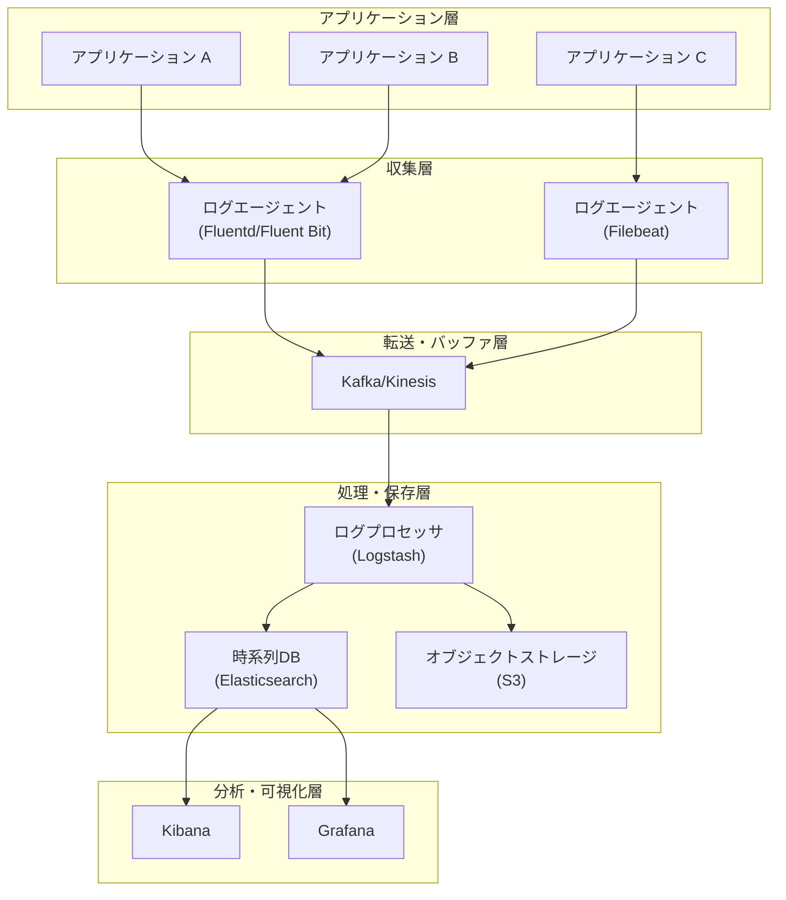
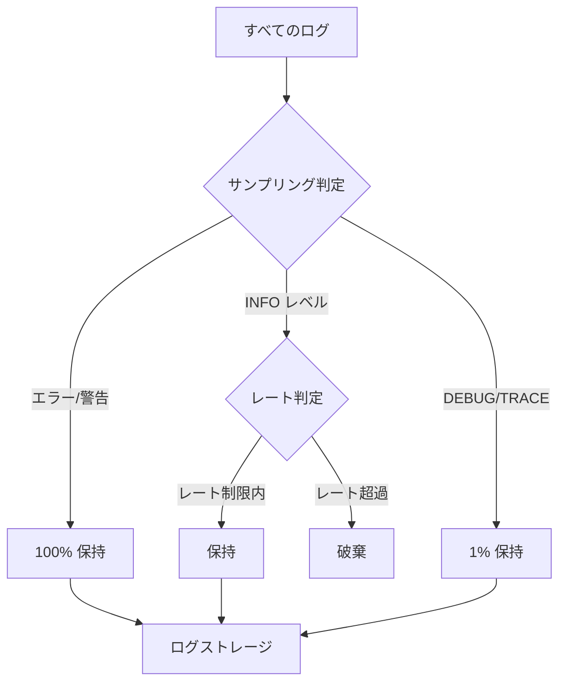
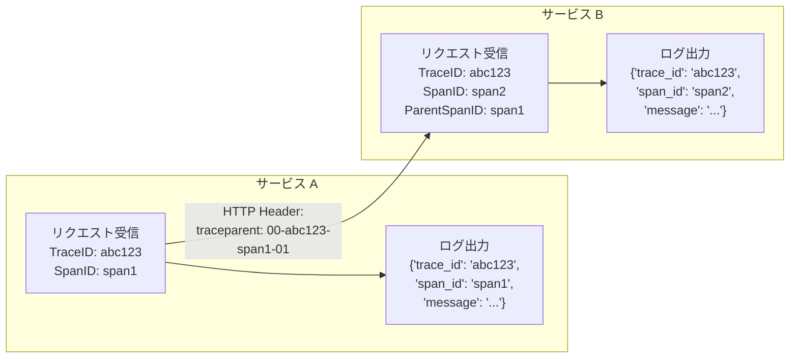
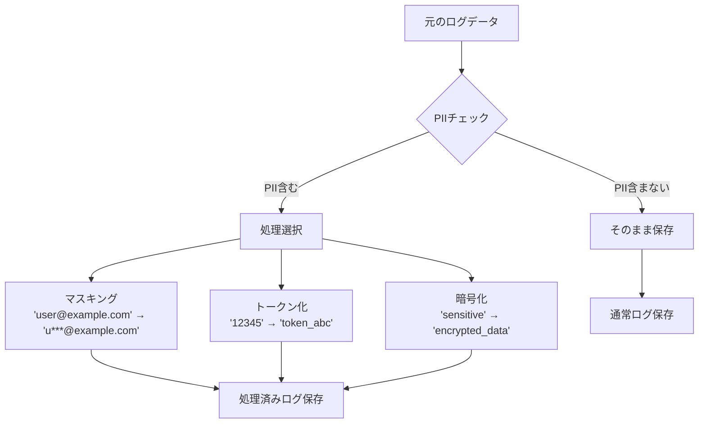
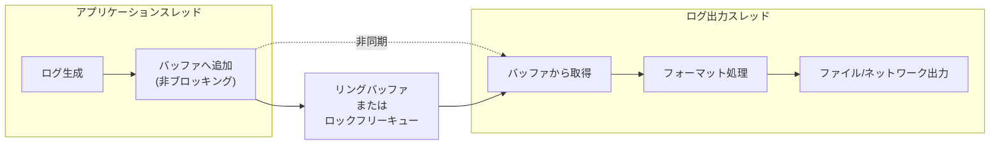
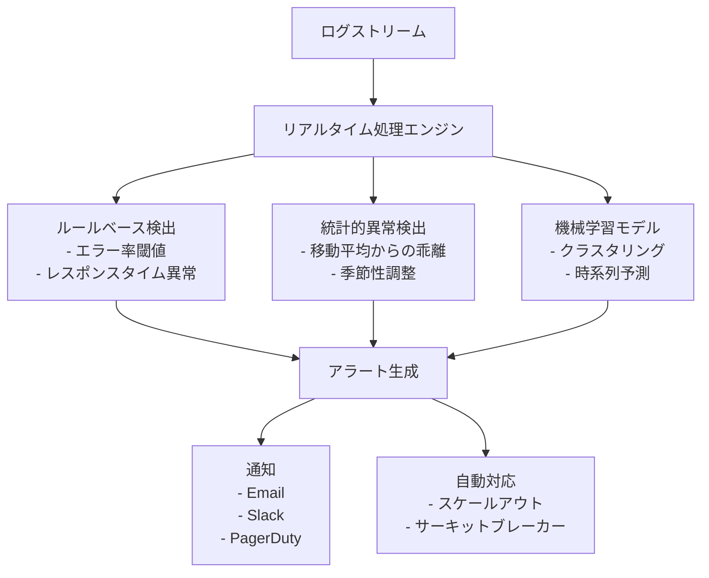
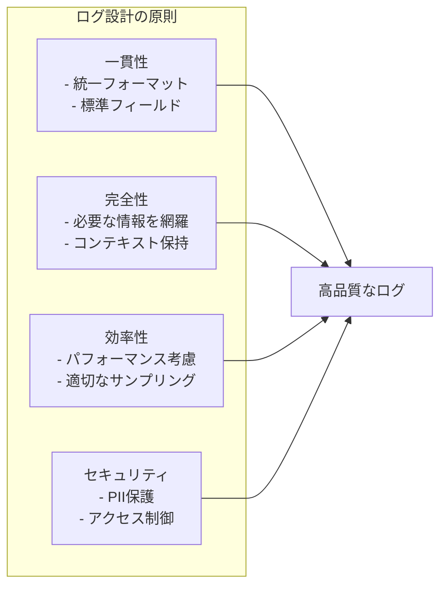
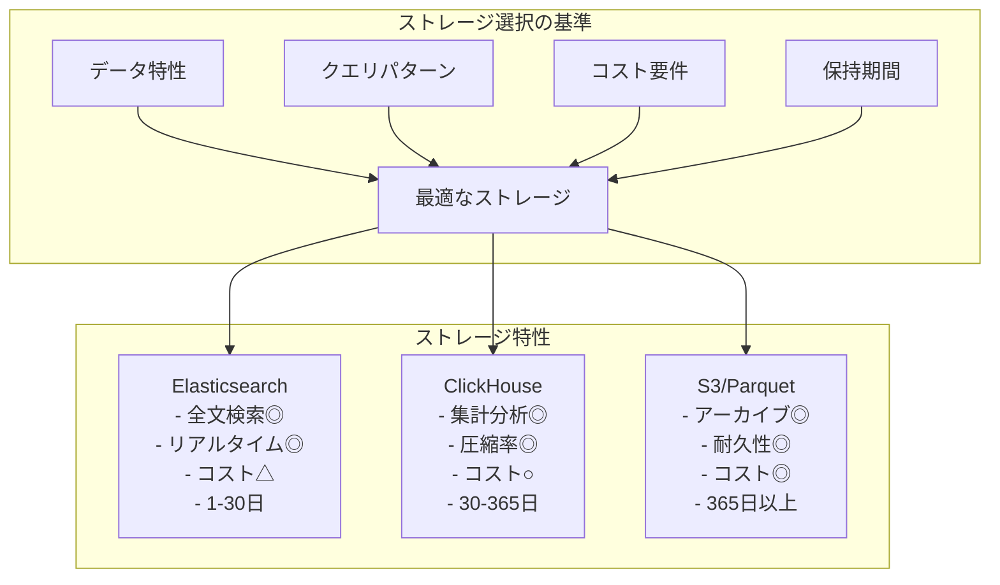

# Logging

システムの運用において、ロギングは最も基本的でありながら最も重要な観測可能性（Observability）の要素である。ログは、システムの動作履歴を記録する時系列データであり、デバッグ、監査、分析、コンプライアンスなど多岐にわたる目的で使用される。本稿では、現代のソフトウェアシステムにおけるロギングの理論と実践について、アーキテクチャ、実装パターン、運用上の課題まで包括的に解説する。

## ログの本質と進化

ログという概念は、コンピューティングの黎明期から存在している。初期のメインフレームでは、プリンターに直接出力される紙のログが主流であった。UNIXシステムの登場とともに、syslogプロトコル（RFC 3164^1）が標準化され、ネットワーク経由でのログ転送が可能になった。この標準化により、分散システムにおけるログの集約が現実的になった。

現代のマイクロサービスアーキテクチャやクラウドネイティブ環境では、ログの役割は大きく拡張されている。単なるデバッグツールから、ビジネスインテリジェンス、セキュリティ監視、パフォーマンス分析の基盤へと進化した。特に、構造化ログの普及により、ログデータは機械処理可能な形式で生成され、リアルタイムな分析が可能になっている。

## ログレベルとその設計思想

ログレベルは、メッセージの重要度を階層的に表現する仕組みである。一般的なログレベルの階層は以下のように定義される：



各レベルの使用指針は、システムの性質と運用要件によって異なるが、一般的な原則が存在する。FATALレベルは、システムの継続動作が不可能な致命的な状態を表す。例えば、必須の設定ファイルの読み込み失敗や、データベース接続の完全な喪失などがこれに該当する。ERRORレベルは、特定の操作が失敗したが、システム全体は動作を継続できる状態を示す。個々のリクエストの処理失敗や、外部APIの呼び出しエラーなどが典型例である。

WARNレベルは、潜在的な問題や異常な状態を示すが、直ちに対処が必要ではない状況で使用される。メモリ使用量の増加傾向、レスポンス時間の悪化、非推奨APIの使用などがこのレベルに分類される。INFOレベルは、システムの正常な動作フローを追跡するための重要なイベントを記録する。サービスの起動・停止、設定の変更、主要な処理の開始・終了などが含まれる。

DEBUGレベルは、開発やトラブルシューティング時に詳細な実行フローを理解するための情報を提供する。変数の値、メソッドの入出力、内部状態の変化などが記録される。TRACEレベルは最も詳細な情報を提供し、すべての実行ステップを記録する。パフォーマンスへの影響が大きいため、本番環境では通常無効化される。

## 構造化ログとその利点

従来のテキストベースのログは、人間が読むには適しているが、機械処理には限界があった。構造化ログは、ログメッセージをキー・バリュー形式やJSON形式で記録することで、この問題を解決する。



構造化ログの最大の利点は、検索と分析の効率性である。特定のユーザーIDや、エラーコード、レスポンス時間など、任意のフィールドでフィルタリングや集計が可能になる。また、コンテキスト情報を豊富に含められるため、問題の原因究明が容易になる。リクエストID、セッションID、トレースIDなどの相関IDを含めることで、分散システムでのトランザクション追跡も実現できる。

構造化ログの実装では、ログライブラリの選択が重要である。言語ごとに成熟したライブラリが存在し、例えばGoではzerolog、JavaではLogback、PythonではstructlogなどがJSONログの生成をサポートしている。これらのライブラリは、高性能なログ生成、フィールドの型安全性、コンテキストの自動伝播などの機能を提供する。

## ログ収集アーキテクチャ

現代の分散システムにおけるログ収集は、複数のコンポーネントが協調して動作する複雑なアーキテクチャを形成する。基本的なアーキテクチャは、ログの生成、収集、転送、保存、分析の5つのフェーズで構成される。



アプリケーション層では、各サービスがログを生成する。ログの出力先は、標準出力（stdout/stderr）、ローカルファイル、またはログAPIへの直接送信など、環境によって異なる。コンテナ環境では、標準出力への出力が推奨される。これは、コンテナランタイムがログを自動的に収集し、ログドライバーを通じて適切な宛先に転送するためである。

収集層では、ログエージェントがアプリケーションから出力されたログを収集する。Fluentd、Fluent Bit、Filebeat、Logstashなどが代表的なエージェントである。これらのエージェントは、ログの収集だけでなく、フィルタリング、変換、エンリッチメントなどの処理も行う。例えば、IPアドレスから地理情報を付加したり、センシティブ情報をマスキングしたりする処理が含まれる。

転送・バッファ層は、大規模システムにおいて重要な役割を果たす。Apache Kafka、Amazon Kinesis、Google Cloud Pub/Subなどのメッセージングシステムが、ログデータのバッファリングと信頼性の高い転送を担当する。これにより、一時的な負荷の急増や下流システムの障害に対する耐性が向上する。

保存層では、ログデータの永続化と検索インデックスの構築が行われる。Elasticsearchは、全文検索とリアルタイム分析に優れた選択肢である。一方、長期保存やコスト最適化の観点では、Amazon S3やGoogle Cloud Storageなどのオブジェクトストレージが使用される。最近では、ClickHouseやTimescaleDBなどの時系列データベースも、ログ保存の選択肢として注目されている。

## ログサンプリングとコスト最適化

ログ量の増大は、ストレージコストと処理負荷の増加を招く。特に、高トラフィックなシステムでは、すべてのログを保存することは現実的でない場合がある。ログサンプリングは、統計的に有意な情報を保持しながら、ログ量を削減する手法である。

サンプリング戦略には複数のアプローチが存在する。ランダムサンプリングは最も単純で、一定の確率でログを保持する。例えば、10%のサンプリング率では、10件に1件のログが保存される。この方法は実装が簡単だが、重要なイベントを見逃す可能性がある。

適応的サンプリングは、より洗練されたアプローチである。エラーログは100%保持し、正常なログは低いサンプリング率を適用するなど、ログの重要度に応じてサンプリング率を動的に調整する。また、トランザクション全体を保持するか破棄するかを決定するトランザクションベースのサンプリングも有効である。



テール・ベースドサンプリングは、分散トレーシングで使用される高度な手法である。トランザクション完了後に、レイテンシやエラーの有無などの特性に基づいて、保持するかどうかを決定する。これにより、問題のあるトランザクションを優先的に保持できる。

## 分散トレーシングとの統合

現代の観測可能性において、ログと分散トレーシングの統合は不可欠である。OpenTelemetry^2の普及により、ログ、メトリクス、トレースの3つのシグナルを統一的に扱うことが可能になった。

トレースコンテキストをログに含めることで、特定のトランザクションに関連するすべてのログを簡単に検索できる。トレースIDとスパンIDは、W3C Trace Context^3標準に従って伝播される。これにより、異なるサービス間でも一貫したコンテキストが保持される。



この統合により、トレースビューからログへのドリルダウンや、ログからトレース全体の可視化が可能になる。問題の診断時に、高レベルのトレース情報から詳細なログメッセージまで、シームレスに移動できる。

## セキュリティとコンプライアンス

ログは貴重な情報源であると同時に、セキュリティリスクの源泉でもある。センシティブ情報の適切な処理は、法的要件とセキュリティベストプラクティスの両面から重要である。

個人識別情報（PII）の処理は特に慎重を要する。GDPR（General Data Protection Regulation）^4やCCPA（California Consumer Privacy Act）などの規制は、個人データの収集、保存、処理に厳格な要件を課している。ログに含まれる可能性のあるPIIには、氏名、メールアドレス、IPアドレス、ユーザーIDなどがある。

これらの情報を適切に処理するため、複数の技術的対策が採用される。マスキングは、センシティブな部分を隠蔽する手法で、例えばクレジットカード番号の一部を伏せ字にする。トークン化は、実際の値を意味のないトークンに置き換え、別の安全な場所でマッピングを管理する。暗号化は、ログ全体または特定フィールドを暗号化して保存する。



アクセス制御も重要な要素である。ログへのアクセスは、必要最小限の権限（Principle of Least Privilege）に基づいて制限されるべきである。役割ベースのアクセス制御（RBAC）を実装し、開発者、運用チーム、セキュリティチームなど、各役割に応じた適切なアクセス権限を設定する。

監査ログは、コンプライアンスの観点から特別な扱いを要する。監査ログは改ざん防止のため、一度書き込まれたら変更や削除ができないイミュータブルなストレージに保存される。また、法的要件に応じた保持期間が設定され、期間経過後は確実に削除される仕組みが必要である。

## パフォーマンスへの影響と最適化

ログ出力はアプリケーションのパフォーマンスに無視できない影響を与える。特に、高頻度でログを出力する場合や、同期的にログを書き込む場合は、レスポンスタイムの悪化やCPU使用率の増加を引き起こす。

非同期ログ出力は、パフォーマンス影響を最小化する基本的な手法である。ログメッセージは内部バッファに蓄積され、別スレッドで実際の出力処理が行われる。これにより、アプリケーションのメインスレッドはログ出力でブロックされない。ただし、バッファがオーバーフローした場合のログ喪失や、アプリケーションクラッシュ時の未出力ログの扱いに注意が必要である。



ログレベルの動的制御も重要な最適化手法である。本番環境では通常INFOレベル以上のログのみを出力し、問題発生時に一時的にDEBUGレベルに変更する。この切り替えを再起動なしで行えるよう、設定の動的リロードやAPIによる制御を実装する。

構造化ログの生成においては、遅延評価が有効である。高コストな処理（例：大きなオブジェクトのシリアライズ）は、実際にログが出力される場合にのみ実行されるよう実装する。多くのログライブラリは、この最適化を自動的に行う。

## ログ分析とアラート

収集されたログの価値は、適切な分析とアラートによって最大化される。リアルタイム分析により、システムの異常を早期に検出し、問題が深刻化する前に対処できる。

ログベースのメトリクス生成は、ログデータから定量的な指標を抽出する手法である。例えば、エラーレートの計算、レスポンスタイムの分布、特定のイベントの頻度などが含まれる。これらのメトリクスは、ダッシュボードでの可視化やアラートの基準として使用される。

異常検出は、機械学習を活用した高度な分析手法である。正常時のログパターンを学習し、そこから逸脱したパターンを自動的に検出する。季節性やトレンドを考慮した統計的手法から、深層学習を用いた複雑なパターン認識まで、様々なアプローチが存在する。



相関分析は、複数のログソースやメトリクスを組み合わせて、問題の根本原因を特定する手法である。例えば、アプリケーションエラーの増加とデータベースのレスポンスタイム悪化の相関を検出することで、データベースの問題がアプリケーションエラーの原因であることを推定できる。

## ベストプラクティスと実装パターン

効果的なロギングを実現するには、一貫したベストプラクティスの適用が重要である。まず、ログフォーマットの標準化は組織全体で統一されるべきである。タイムスタンプの形式（ISO 8601推奨）、ログレベルの表記、必須フィールドの定義などが含まれる。

コンテキスト情報の充実は、ログの有用性を大きく向上させる。リクエストID、ユーザーID、セッションID、環境情報（ホスト名、リージョン、バージョン）などを自動的に含めることで、問題の追跡と分析が容易になる。多くのログライブラリは、MDC（Mapped Diagnostic Context）やコンテキスト伝播の仕組みを提供している。

エラーログには、十分な情報を含めることが重要である。エラーメッセージだけでなく、スタックトレース、関連する変数の値、実行されていた操作の詳細などを記録する。ただし、センシティブ情報の露出には常に注意を払う必要がある。



ログローテーションとアーカイブ戦略も重要な考慮事項である。ディスク容量の枯渇を防ぐため、適切なローテーション設定が必要である。古いログは圧縮してアーカイブストレージに移動し、必要に応じて検索可能な状態を保つ。保持期間は、法的要件、ストレージコスト、実用的な必要性のバランスを考慮して決定する。

## ログストレージの選択と比較

ログストレージの選択は、システムの規模、クエリパターン、コスト要件によって大きく異なる。主要な選択肢として、Elasticsearch、ClickHouse、オブジェクトストレージ（S3）がある。それぞれに独自の特性と適用領域が存在する。

Elasticsearchは、全文検索とリアルタイム分析に優れた選択肢である。転置インデックスを使用した高速な検索、豊富なクエリ言語、成熟したエコシステムが特徴である。ただし、ストレージコストが高く、大規模なクラスターの運用には専門知識が必要である。一般的に、直近30日程度のホットデータの保存に使用され、それ以前のデータは他のストレージに移行される。

ClickHouseは、カラムナーストレージを採用した分析特化型のデータベースである。圧縮率が高く、集計クエリのパフォーマンスに優れている。時系列データの保存に適しており、Elasticsearchと比較して10分の1程度のストレージコストで運用できる場合がある。ただし、全文検索機能は限定的であり、リアルタイムでのデータ更新には制約がある。

オブジェクトストレージ（S3、GCS、Azure Blob Storage）は、長期アーカイブに最適な選択肢である。コストが最も低く、耐久性が高い。Parquet形式で保存することで、Athena、BigQuery、Prestoなどのクエリエンジンから直接分析可能である。ただし、クエリのレイテンシは他の選択肢と比較して高く、リアルタイム分析には適さない。



実際の運用では、これらのストレージを組み合わせたティアードアーキテクチャが採用される。ホットデータはElasticsearchに、ウォームデータはClickHouseに、コールドデータはS3に保存し、統一的なクエリインターフェースで透過的にアクセスできるようにする。

## 実践的な実装例

構造化ログの実装を、具体的なコード例で示す。以下は、Go言語でzerologを使用した実装例である：

```go
// Logger initialization with context enrichment
logger := zerolog.New(os.Stdout).With().
    Timestamp().
    Str("service", "api-gateway").
    Str("version", "1.2.3").
    Str("environment", "production").
    Logger()

// Request handling with trace context
func handleRequest(w http.ResponseWriter, r *http.Request) {
    // Extract trace context from headers
    traceID := r.Header.Get("X-Trace-ID")
    if traceID == "" {
        traceID = generateTraceID()
    }
    
    // Create request-scoped logger
    reqLogger := logger.With().
        Str("trace_id", traceID).
        Str("method", r.Method).
        Str("path", r.URL.Path).
        Str("remote_addr", r.RemoteAddr).
        Logger()
    
    // Log request start
    reqLogger.Info().
        Msg("request_started")
    
    startTime := time.Now()
    
    // Process request...
    
    // Log request completion with metrics
    reqLogger.Info().
        Dur("duration_ms", time.Since(startTime)).
        Int("status_code", 200).
        Int64("response_size", 1024).
        Msg("request_completed")
}
```

このアプローチにより、すべてのログエントリに一貫したコンテキスト情報が含まれ、トレースIDによる相関が可能になる。パフォーマンスへの影響を最小限に抑えるため、zerologは内部でゼロアロケーションの設計を採用している。

## パフォーマンステストと最適化結果

実際のプロダクション環境でのログパフォーマンステストの結果を示す。テスト環境は、8コアCPU、16GB RAM、SSD搭載のサーバーで、1秒あたり10,000リクエストを処理するWebアプリケーションである。

同期ログ出力と非同期ログ出力の比較では、顕著な差が観察された。同期出力では、p99レイテンシが150msから210msに増加（40%の悪化）したのに対し、非同期出力では155msに留まった（3.3%の悪化）。CPU使用率も、同期出力では85%に達したが、非同期出力では72%に抑えられた。

構造化ログのオーバーヘッドについても測定を行った。プレーンテキストログと比較して、JSON構造化ログは約15%のCPUオーバーヘッドが発生した。しかし、このオーバーヘッドは、後続の処理（パース、インデックス作成）で節約される計算リソースを考慮すると、十分に正当化される。

ログレベルによるフィルタリングの効果も重要である。DEBUGレベルですべてのログを出力した場合と、INFOレベルでフィルタリングした場合を比較すると、スループットは30%向上し、ディスクI/Oは80%削減された。

## 具体的なログパイプラインの構築

実際のプロダクション環境でのログパイプラインの構築例を示す。この例では、Kubernetes環境で動作するマイクロサービスからのログを、Fluent Bitで収集し、Kafkaを経由してElasticsearchとS3に保存する。

```yaml
# Fluent Bit configuration for Kubernetes
apiVersion: v1
kind: ConfigMap
metadata:
  name: fluent-bit-config
data:
  fluent-bit.conf: |
    [SERVICE]
        Flush         5
        Daemon        Off
        Log_Level     info
        
    [INPUT]
        Name              tail
        Path              /var/log/containers/*.log
        Parser            docker
        Tag               kube.*
        Refresh_Interval  5
        
    [FILTER]
        Name                kubernetes
        Match               kube.*
        Kube_URL            https://kubernetes.default.svc:443
        Merge_Log           On
        K8S-Logging.Parser  On
        K8S-Logging.Exclude On
        
    [OUTPUT]
        Name   kafka
        Match  *
        Brokers kafka-broker:9092
        Topics  app-logs
        Format json
        
    [OUTPUT]
        Name   s3
        Match  kube.error.*
        bucket production-logs
        region us-west-2
        total_file_size 50M
        upload_timeout 10m
```

このパイプラインは、すべてのログをKafkaに送信し、エラーログのみを直接S3にも保存する。Kafkaからは、別のコンシューマーがElasticsearchへのインデックス作成と、長期保存用のS3への圧縮保存を行う。

## 将来の展望と新しい技術動向

ロギング技術は継続的に進化している。クラウドネイティブ環境の普及に伴い、新しい課題と解決策が登場している。サーバーレスアーキテクチャでは、短命なコンピュート環境でのログ収集が課題となり、プラットフォーム統合型のログソリューションが重要性を増している。

エッジコンピューティングの拡大により、エッジデバイスでのログ処理と集約が新たな要件となっている。帯域幅の制約から、エッジでのログフィルタリングと圧縮、重要なイベントのみの中央送信などの技術が開発されている。

AIとMLの活用も進んでいる。自然言語処理を用いたログの意味解析、異常パターンの自動学習、インシデント予測などが実用化されつつある。これらの技術により、人間の介入を最小限に抑えた自律的な運用が可能になりつつある。

---

^1 Gerhards, R. (2009). The Syslog Protocol. RFC 5424. Internet Engineering Task Force (IETF).

^2 OpenTelemetry Authors. (2023). OpenTelemetry Specification. Cloud Native Computing Foundation.

^3 W3C. (2021). Trace Context - W3C Recommendation. World Wide Web Consortium.

^4 European Parliament and Council. (2016). General Data Protection Regulation (EU) 2016/679.