# Metrics

Site Reliability Engineering（SRE）において、メトリクスはシステムの健全性を定量的に把握し、信頼性の高いサービス運用を実現するための基盤となる。メトリクスとは、システムやアプリケーションの動作状態を数値化したデータであり、時系列データとして継続的に収集・分析される。これらの数値は単なる測定値ではなく、システムの振る舞いを理解し、問題を早期に発見し、適切な意思決定を行うための重要な情報源となる。

現代の分散システムにおいて、メトリクスの重要性はますます高まっている。マイクロサービスアーキテクチャの普及により、単一のモノリシックなアプリケーションから数十、数百のサービスが協調動作する複雑なシステムへと移行が進んでいる。このような環境では、個々のコンポーネントの状態だけでなく、システム全体の振る舞いを包括的に理解することが不可欠となる。メトリクスは、この複雑性を管理し、システムの可観測性（Observability）を確保するための三本柱（メトリクス、ログ、トレース）の一つとして位置づけられている。

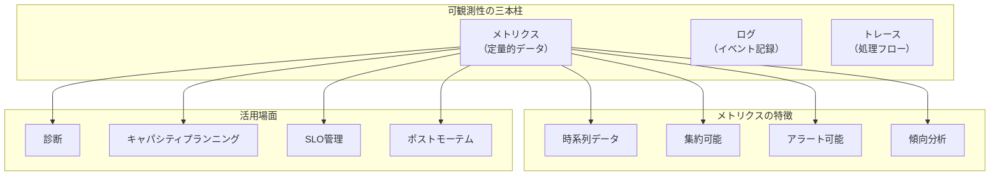

メトリクスが提供する価値は多岐にわたる。第一に、システムの現在の状態をリアルタイムで把握できることである。CPU使用率、メモリ使用量、リクエスト数、エラー率などの基本的な指標から、ビジネス固有のKPIまで、様々な観点からシステムを観察できる。第二に、過去のデータを基に傾向を分析し、将来の問題を予測できることである。たとえば、ディスク使用量の増加傾向から、いつ頃ストレージが枯渇するかを予測し、事前に対策を講じることができる。第三に、異常を自動的に検知し、アラートを発生させることで、人間が24時間365日監視し続ける必要をなくすことである。

メトリクスの収集と分析は、SREの実践において中核的な活動である。Google社のSREブック¹では、サービスの信頼性を測定し、改善するためにメトリクスを活用することの重要性が繰り返し強調されている。特に、Service Level Indicator（SLI）の定義と測定において、メトリクスは不可欠な要素となる。適切に選択され、正確に測定されたメトリクスは、エンジニアリングチームがサービスの品質を客観的に評価し、ユーザーエクスペリエンスを向上させるための具体的なアクションを導き出すことを可能にする。

## メトリクスの分類と特性

メトリクスは様々な観点から分類することができる。最も基本的な分類は、測定対象による分類である。システムメトリクス（インフラストラクチャメトリクス）は、CPU使用率、メモリ使用量、ディスクI/O、ネットワークトラフィックなど、ハードウェアやオペレーティングシステムレベルの指標を含む。アプリケーションメトリクスは、リクエスト数、レスポンスタイム、エラー率、スループットなど、アプリケーション固有の動作を反映する指標である。ビジネスメトリクスは、売上、コンバージョン率、ユーザー登録数など、ビジネス価値に直結する指標を指す。

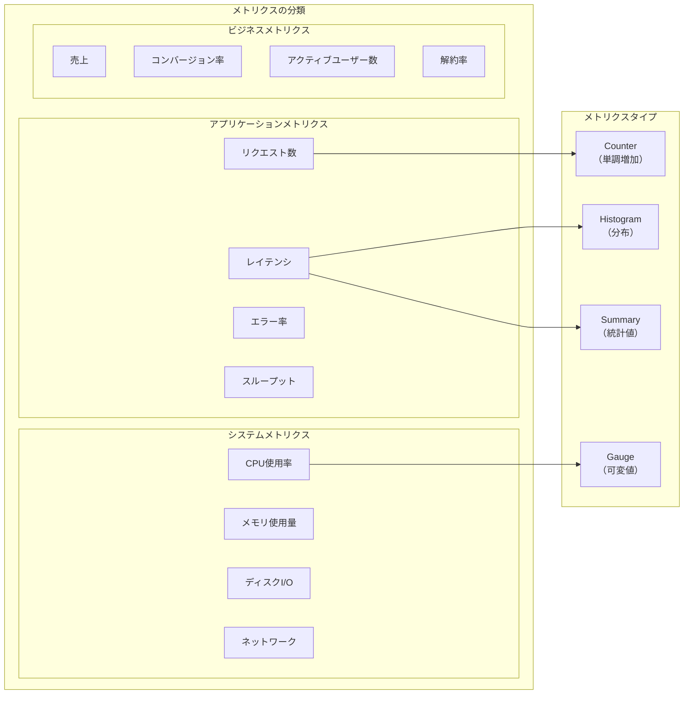

メトリクスのデータ型による分類も重要である。Counter型は単調増加する値を表し、リクエスト数やエラー数などの累積値を記録する。この型の特徴は、値がリセットされるまで減少しないことであり、差分を計算することで特定期間の発生数を求めることができる。Gauge型は上下する可能性のある瞬間値を表し、CPU使用率やメモリ使用量、同時接続数などを記録する。Histogram型は値の分布を記録し、レスポンスタイムの分布やリクエストサイズの分布などを表現する。Summary型はHistogramと似ているが、クライアント側で分位数（パーセンタイル）を計算する点が異なる。

Google社が提唱する「4つのゴールデンシグナル」²は、サービスの健全性を測定するための最も重要なメトリクスのカテゴリを示している。レイテンシ（Latency）は、リクエストを処理するのに要する時間を測定する。ここで重要なのは、成功したリクエストと失敗したリクエストのレイテンシを区別することである。エラーによって即座に返されるレスポンスは非常に短いレイテンシを示すが、これは正常な処理の指標とはならない。トラフィック（Traffic）は、システムに対する要求の量を測定する。Webサービスであれば1秒あたりのHTTPリクエスト数、ストレージシステムであれば1秒あたりのI/O操作数などが該当する。

エラー（Errors）は、失敗したリクエストの割合を測定する。ここでのエラーは明示的なもの（HTTP 500エラー）、暗黙的なもの（HTTP 200だが内容が正しくない）、ポリシーによるもの（レスポンスタイムが1秒を超えた）を含む。飽和度（Saturation）は、サービスがどの程度「満杯」であるかを測定する。メモリ、CPU、I/Oなどのリソースの使用率が該当し、多くのシステムでは100%に達する前にパフォーマンスが劣化し始める。これら4つのシグナルを適切に監視することで、システムの問題を早期に発見し、ユーザーへの影響を最小限に抑えることができる。

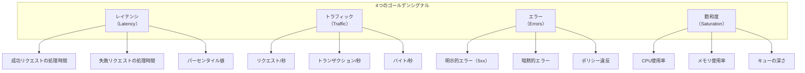

Brendan Gregg氏が提唱するUSEメソッド³は、システムリソースの分析に焦点を当てたアプローチである。すべてのリソースについて、使用率（Utilization）、飽和度（Saturation）、エラー（Errors）を確認する。使用率は、リソースがビジー状態である時間の割合やリソースの使用量を示す。飽和度は、リソースが処理できない追加作業の量（通常はキューの長さ）を示す。エラーは、エラーイベントの数を示す。このメソッドは、パフォーマンス問題の原因を体系的に特定するための強力なフレームワークを提供する。

一方、Tom Wilkie氏が提唱するREDメソッド⁴は、マイクロサービスの監視に特化したアプローチである。Rate（レート）は単位時間あたりのリクエスト数、Errors（エラー）は失敗したリクエストの数または割合、Duration（期間）はリクエストの処理時間を測定する。REDメソッドは、サービス指向のアーキテクチャにおいて、各サービスの健全性を一貫した方法で評価することを可能にする。

## SLI、SLO、SLAとメトリクス設計

Service Level Indicator（SLI）、Service Level Objective（SLO）、Service Level Agreement（SLA）は、サービスの信頼性を定義し、測定し、保証するための重要な概念である。これらの概念の中心にあるのがメトリクスであり、適切なメトリクス設計なしには、意味のあるSLI/SLO/SLAを定義することはできない。

SLIは、サービスレベルの特定の側面を定量的に測定する指標である。良いSLIは、ユーザーエクスペリエンスと直接的に相関し、測定可能で、理解しやすいものである必要がある。例えば、「過去5分間のHTTPリクエストのうち、200ミリ秒以内に正常に応答したものの割合」は典型的なSLIである。この定義には、測定対象（HTTPリクエスト）、成功条件（200ミリ秒以内かつ正常応答）、集計期間（過去5分間）が明確に含まれている。

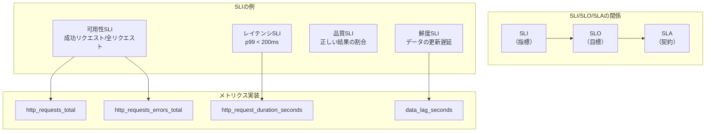

SLOは、SLIの目標値である。例えば、「可用性SLIが30日間のローリングウィンドウで99.9%以上」というSLOは、サービスが達成すべき信頼性の水準を定義する。SLOの設定には、ユーザーの期待、ビジネス要件、技術的制約、コストのバランスを考慮する必要がある。過度に高いSLOは、開発速度を犠牲にし、コストを増大させる。一方、低すぎるSLOは、ユーザーの信頼を失うリスクがある。

エラーバジェット（Error Budget）は、SLOから導出される重要な概念である。100%からSLO目標値を引いた値がエラーバジェットとなる。99.9%のSLOの場合、0.1%のエラーバジェットが存在する。これは、30日間で約43分間のダウンタイムまたは1000リクエストに1回の失敗が許容されることを意味する。エラーバジェットは、信頼性と機能開発のバランスを取るための強力なツールである。バジェットに余裕がある場合は新機能のリリースを加速し、バジェットが枯渇しそうな場合は信頼性改善に注力する。

SLIの実装において、メトリクスの精度と信頼性は極めて重要である。測定ポイントの選択は、SLIの品質に大きく影響する。クライアント側での測定は、実際のユーザーエクスペリエンスに最も近いが、実装が複雑で、悪意のあるクライアントからのデータを除外する必要がある。ロードバランサーでの測定は、比較的実装が容易で、全トラフィックをカバーできるが、クライアントまでのネットワーク遅延は含まれない。アプリケーションサーバーでの測定は、詳細な情報を取得できるが、ロードバランサーでの失敗は捕捉できない。

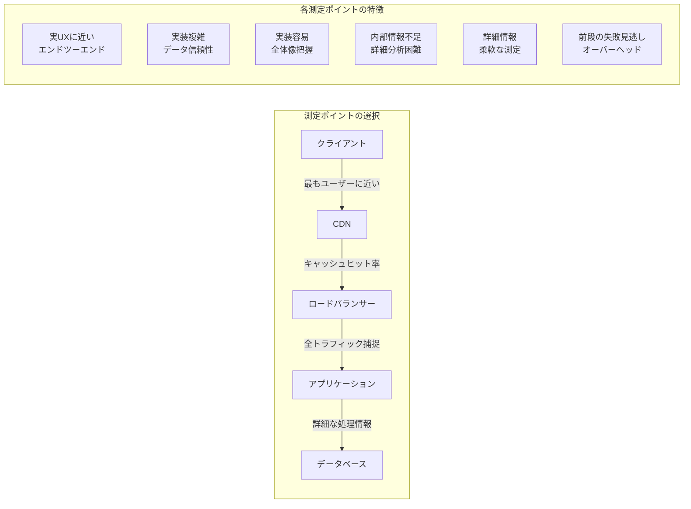

メトリクスの集計方法も慎重に設計する必要がある。算術平均は実装が簡単だが、外れ値の影響を受けやすく、実際のユーザーエクスペリエンスを正確に反映しない場合がある。パーセンタイル（特にp50、p95、p99）は、分布の形状をより良く表現し、大多数のユーザーの体験を反映する。ただし、パーセンタイルは単純に平均化できないため、複数のインスタンスやリージョンをまたがる集計には注意が必要である。

時間窓の選択も重要な設計判断である。短い時間窓（例：1分）は、問題の早期発見に有利だが、ノイズが多く、一時的なスパイクで誤検知する可能性がある。長い時間窓（例：1時間）は、安定した測定値を提供するが、問題の検出が遅れる可能性がある。多くの場合、複数の時間窓を組み合わせて使用することが推奨される。例えば、アラート用には5分窓、SLO評価用には30日のローリングウィンドウを使用する。

## メトリクス収集アーキテクチャ

メトリクスの収集アーキテクチャは、大きくプル型（Pull-based）とプッシュ型（Push-based）に分類される。それぞれのアプローチには長所と短所があり、システムの要件に応じて適切に選択する必要がある。

プル型アーキテクチャでは、メトリクス収集システムが定期的に各ターゲット（監視対象）からメトリクスを取得する。Prometheusが代表的な実装であり、各ターゲットはHTTPエンドポイント（通常は`/metrics`）でメトリクスを公開し、Prometheusサーバーが設定されたインターバルでこれらのエンドポイントをスクレイピングする。プル型の利点は、ターゲットの死活監視が容易であること、ターゲット側に収集先の設定が不要であること、ネットワーク分断時の挙動が予測可能であることなどがある。一方、ファイアウォールやNATの背後にあるターゲットの監視が困難であること、短命なジョブのメトリクス収集に工夫が必要であることなどの課題がある。

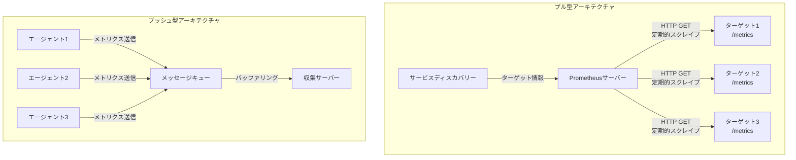

プッシュ型アーキテクチャでは、各ターゲットが能動的にメトリクスを収集システムに送信する。StatsD、OpenTelemetry Collector、各種商用サービス（Datadog、New Relic等）がこのモデルを採用している。プッシュ型の利点は、ファイアウォールやNATの制約を受けにくいこと、短命なジョブやバッチ処理のメトリクス収集が容易であること、ターゲット側で送信タイミングを制御できることなどがある。課題としては、ターゲットの死活監視に別途仕組みが必要であること、収集システムへの負荷が集中しやすいこと、ターゲット側に収集先の設定が必要であることなどがある。

ハイブリッドアプローチも一般的である。例えば、Prometheus Pushgatewayを使用することで、短命なジョブがメトリクスをプッシュし、Prometheusサーバーがそれをプルすることができる。また、OpenTelemetry Collectorを中間層として配置し、アプリケーションからのプッシュを受け取り、バックエンドシステムへの送信を管理することもできる。

メトリクスの収集頻度（サンプリングレート）は、精度とコストのトレードオフである。高頻度（例：1秒間隔）での収集は、細かい変化を捉えられるが、データ量が増大し、ストレージとネットワークのコストが上昇する。低頻度（例：1分間隔）での収集は、コストを抑えられるが、短時間のスパイクや異常を見逃す可能性がある。一般的には、システムメトリクスは15-30秒間隔、アプリケーションメトリクスは30-60秒間隔で収集されることが多い。

## 時系列データベースとストレージ最適化

メトリクスは本質的に時系列データであり、その特性に最適化されたストレージシステムが必要となる。時系列データベース（TSDB）は、タイムスタンプ付きのデータポイントを効率的に保存、検索、集計するために設計されている。

時系列データの特徴として、書き込みが多く読み込みが相対的に少ないこと、最新のデータへのアクセスが多いこと、データが追記のみで更新されないこと、時間範囲での集計クエリが多いことなどがある。これらの特性を考慮して、TSDBは様々な最適化技術を実装している。

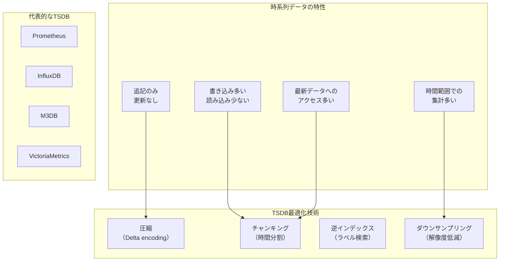

Prometheus⁵は、Cloud Native Computing Foundation（CNCF）のGraduatedプロジェクトであり、最も広く採用されているオープンソースの監視システムの一つである。Prometheusの時系列データベースは、メモリマップドファイルを活用し、最新のデータをメモリに保持することで高速な書き込みと読み込みを実現している。データはブロック単位で管理され、各ブロックは特定の時間範囲のデータを含む。古いブロックは圧縮され、ディスクに永続化される。

データの圧縮は、ストレージコストを削減する重要な技術である。時系列データは高い時間的局所性を持つため、効果的な圧縮が可能である。Delta encodingは、連続するデータポイント間の差分のみを保存する技術である。例えば、CPUテンプレチャが[70.1, 70.2, 70.1, 70.3]という値を持つ場合、[70.1, +0.1, -0.1, +0.2]として保存できる。Delta-of-delta encodingはさらに差分の差分を保存し、より高い圧縮率を実現する。Gorilla圧縮⁶（Facebook社が開発）は、XORベースの圧縮技術を使用し、浮動小数点値を効率的に圧縮する。

カーディナリティは、TSDBにおける最も重要な課題の一つである。カーディナリティとは、時系列の一意な組み合わせの数を指す。例えば、`http_requests_total{method="GET", status="200", endpoint="/api/users"}`というメトリクスにおいて、methodが5種類、statusが10種類、endpointが1000種類ある場合、理論上の最大カーディナリティは5×10×1000=50,000となる。高カーディナリティは、メモリ使用量の増大、クエリパフォーマンスの低下、ストレージコストの上昇を引き起こす。

カーディナリティ爆発を防ぐためには、ラベルの設計に注意が必要である。ユーザーIDやセッションIDなど、無限に増える可能性のある値をラベルに含めることは避けるべきである。代わりに、これらの情報はログやトレースに記録し、メトリクスでは集約された形で扱う。また、不要な詳細度を避け、適切な抽象化レベルでメトリクスを設計することも重要である。

ダウンサンプリングとデータ保持ポリシーは、長期的なストレージコストを管理するための重要な戦略である。新しいデータは高解像度で保存し、古いデータは低解像度に集約する。例えば、直近1週間は5秒間隔、1週間から1ヶ月は1分間隔、1ヶ月から1年は5分間隔といった段階的な保持ポリシーを設定する。ダウンサンプリング時には、平均値だけでなく、最小値、最大値、標準偏差などの統計値も保存することで、情報の損失を最小限に抑える。

## 実装上の課題と解決策

メトリクスシステムの実装と運用において、様々な技術的課題に直面する。これらの課題を理解し、適切な解決策を実装することが、信頼性の高い監視システムの構築には不可欠である。

スケーラビリティは最も基本的な課題の一つである。監視対象のシステムが成長するにつれて、メトリクスの量も指数関数的に増加する。単一のPrometheusインスタンスでは、メモリとCPUの制限により、扱えるメトリクス数に上限がある。この問題に対する解決策として、フェデレーション（Federation）がある。複数のPrometheusインスタンスを階層的に配置し、各インスタンスが特定の範囲のターゲットを担当する。上位のPrometheusインスタンスは、下位のインスタンスから集約されたメトリクスを収集する。

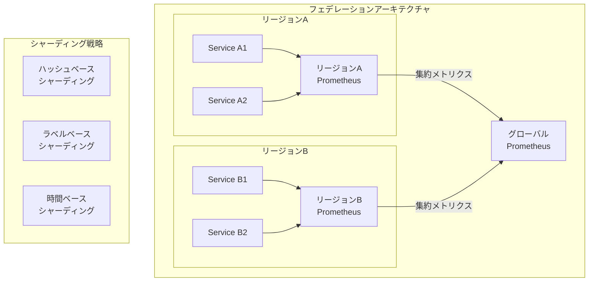

シャーディングは、もう一つの重要なスケーリング戦略である。メトリクスを複数のインスタンスに分散させることで、各インスタンスの負荷を軽減する。ハッシュベースのシャーディングでは、メトリクス名やラベルのハッシュ値に基づいて振り分ける。ラベルベースのシャーディングでは、特定のラベル（例：region、service）に基づいて振り分ける。時間ベースのシャーディングでは、データの時間範囲に基づいて振り分ける。

メトリクスの信頼性も重要な課題である。監視システム自体がダウンしていては、本来の目的を果たすことができない。高可用性を実現するために、複数のPrometheusインスタンスを並列に動作させ、同じターゲットを監視する構成が一般的である。この場合、重複したデータの扱いが課題となるが、クエリ時に適切に重複を排除することで対処する。

サンプリングは、大量のメトリクスを扱う際の有効な手法である。すべてのイベントを記録するのではなく、統計的に有意な サンプルを収集することで、リソース消費を削減しながら、全体の傾向を把握できる。テール・ベースド・サンプリングでは、通常のリクエストは低い確率でサンプリングし、エラーや高レイテンシのリクエストは高い確率でサンプリングする。アダプティブ・サンプリングでは、トラフィックの量に応じてサンプリングレートを動的に調整する。

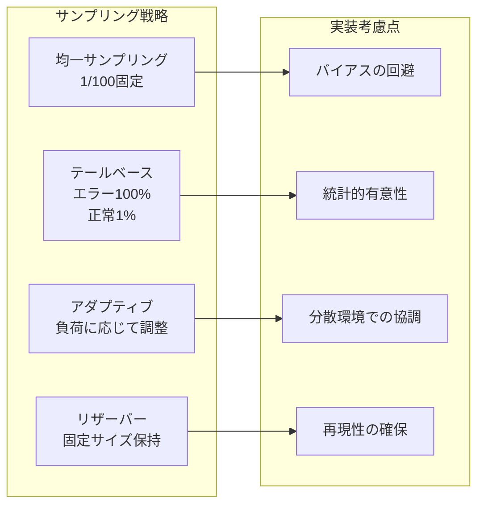

クロック同期の問題は、分散システムにおいて しばしば見過ごされる課題である。異なるホスト間でクロックがずれていると、メトリクスの時系列が正しく整列せず、誤った分析結果を導く可能性がある。NTP（Network Time Protocol）を使用してクロックを同期することは基本であるが、それでも数ミリ秒から数秒のずれが生じることがある。この問題に対処するため、メトリクスの収集時にクロックのずれを検出し、必要に応じて補正する仕組みを実装することが推奨される。

メトリクスの命名規則とラベリングの標準化も、大規模なシステムでは重要な課題となる。一貫性のない命名は、クエリの作成を困難にし、ダッシュボードの保守を複雑にする。Prometheusコミュニティでは、メトリクス名にユニット（`_seconds`、`_bytes`、`_total`など）を含めることを推奨している。また、ラベル名は小文字のスネークケースを使用し、値は人間が読みやすい形式にすることが推奨される。

## アラート設計のベストプラクティス

効果的なアラートシステムは、問題を早期に発見し、適切な対応を促すために不可欠である。しかし、過度に敏感なアラートは「アラート疲れ」を引き起こし、本当に重要な問題を見逃す原因となる。適切なバランスを見つけることが、アラート設計の鍵となる。

アラートの品質を評価する指標として、精度（Precision）と再現率（Recall）がある。精度は、発生したアラートのうち実際に対応が必要だったものの割合である。再現率は、実際に問題が発生した際にアラートが発生した割合である。理想的には両方を高く保ちたいが、実際にはトレードオフの関係にある。一般的には、クリティカルなアラートでは再現率を重視し、情報提供的なアラートでは精度を重視する。

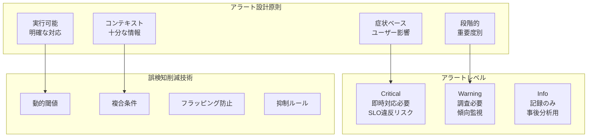

症状ベースのアラート（Symptom-based Alerting）は、Google SREの重要な原則の一つである。原因ではなく、ユーザーに影響を与える症状に基づいてアラートを設定する。例えば、「データベースのレプリケーション遅延が5秒」というアラートよりも、「ユーザーのリクエストの5%が500msec以上のレイテンシ」というアラートの方が適切である。前者は必ずしもユーザー影響を示さないが、後者は直接的なユーザー体験の劣化を示している。

アラートに必要な情報を含めることも重要である。アラートメッセージには、何が問題なのか、どの程度深刻なのか、どのような影響があるのか、どう対応すべきかを明確に記載する必要がある。Runbookへのリンク、関連するダッシュボードのURL、最近の変更履歴などのコンテキスト情報も含めることで、対応時間を短縮できる。

フラッピング（頻繁なアラートの発生と解除の繰り返し）は、アラート疲れの主要な原因の一つである。これを防ぐために、ヒステリシス（履歴効果）を実装する。例えば、CPU使用率80%でアラートを発生させ、70%で解除するという異なる閾値を設定する。また、一定期間（例：5分間）条件が継続した場合のみアラートを発生させる遅延評価も有効である。

アラートの抑制（Inhibition）と相関（Correlation）も重要な技術である。上位のシステムで問題が発生した場合、依存する下位のシステムからも大量のアラートが発生する可能性がある。抑制ルールを設定することで、根本原因のアラートのみを通知し、派生的なアラートを抑制できる。また、複数の関連するアラートをグループ化して、一つの インシデントとして扱うことで、問題の全体像を把握しやすくする。

## ダッシュボード設計と可視化

ダッシュボードは、メトリクスを人間が理解しやすい形で表示するための重要なインターフェースである。効果的なダッシュボードは、システムの状態を一目で把握でき、問題の調査を効率的に行えるように設計される必要がある。

ダッシュボードの階層構造は、情報のオーバーロードを防ぎ、段階的な調査を可能にする。最上位のエグゼクティブダッシュボードは、ビジネスKPIとサービス全体の健全性を表示する。サービスレベルダッシュボードは、個々のサービスの4つのゴールデンシグナルとSLO遵守状況を表示する。詳細調査用ダッシュボードは、特定の問題を深く調査するための詳細なメトリクスを提供する。

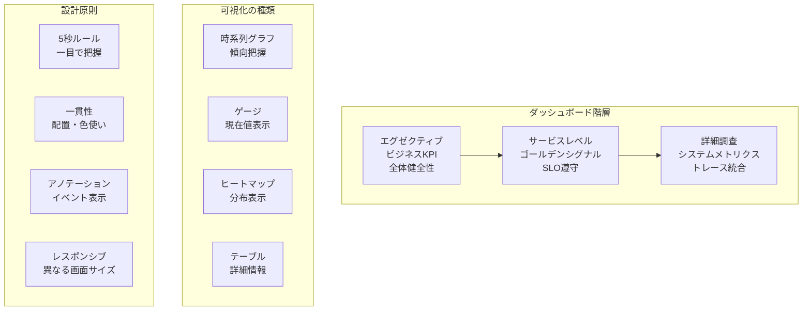

可視化の選択は、表示したい情報の性質によって決定される。時系列グラフは、メトリクスの変化を時間軸で追跡するのに適している。ゲージやシングルスタット（単一統計値）は、現在の状態を強調表示するのに適している。ヒートマップは、レイテンシの分布やエラーパターンを視覚化するのに効果的である。テーブルは、詳細な情報や複数のディメンションを同時に表示するのに適している。

色使いは、情報の迅速な理解に大きく影響する。一般的に、緑は正常、黄色は警告、赤は異常を示す。ただし、色覚異常のユーザーも考慮し、色だけでなく形状やパターンでも情報を区別できるようにする。また、文化的な違いも考慮する必要がある。

「5秒ルール」は、ダッシュボード設計の重要な原則である。ユーザーがダッシュボードを見てから5秒以内に、システムの全体的な健全性を理解できるべきである。これを実現するために、最も重要な情報を最も目立つ位置に配置し、詳細情報は段階的に開示する設計とする。

アノテーションは、メトリクスのコンテキストを提供する重要な機能である。デプロイメント、設定変更、インシデント、メンテナンス作業などのイベントをグラフ上に表示することで、メトリクスの変化と外部イベントの相関を容易に把握できる。これは、問題の根本原因分析において特に有用である。

## 高度なメトリクス分析技術

基本的なメトリクス収集と可視化を超えて、より高度な分析技術を活用することで、システムの理解を深め、問題を予測的に検出することができる。

異常検知（Anomaly Detection）は、正常な動作パターンからの逸脱を自動的に検出する技術である。統計的手法では、移動平均と標準偏差を使用して、通常の変動範囲を定義し、それを超える値を異常として検出する。機械学習ベースの手法では、過去のデータからパターンを学習し、より複雑な異常を検出できる。ただし、季節性（時間帯、曜日、月次の周期的パターン）を考慮することが重要である。

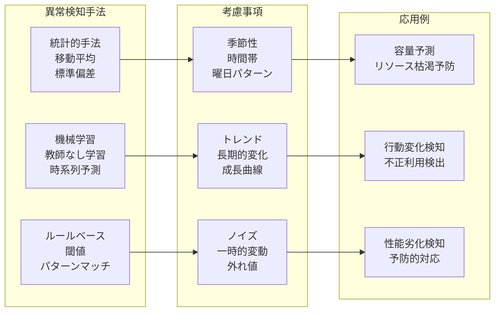

予測分析（Predictive Analytics）は、過去のメトリクスデータから将来の値を予測する技術である。線形回帰は最も単純な手法であるが、多くの実世界のメトリクスは非線形な振る舞いを示す。ARIMA（AutoRegressive Integrated Moving Average）モデルは、時系列データの予測に広く使用される。Prophet（Facebook社が開発）は、季節性と休日効果を考慮した予測が可能である。これらの予測技術は、キャパシティプランニングやリソース最適化に活用できる。

相関分析は、複数のメトリクス間の関係を発見する技術である。例えば、レスポンスタイムの増加とCPU使用率の上昇が相関している場合、CPUがボトルネックである可能性が示唆される。ただし、相関は因果関係を示すものではないことに注意が必要である。擬似相関（見かけ上の相関）を避けるため、ドメイン知識と組み合わせて解釈することが重要である。

根本原因分析（Root Cause Analysis）の自動化は、複雑な分散システムにおいて特に価値がある。メトリクスの変化を時系列で追跡し、異常が最初に発生したコンポーネントを特定する。依存関係グラフと組み合わせることで、問題の伝播経路を可視化できる。ただし、完全な自動化は困難であり、人間の専門知識と組み合わせたハイブリッドアプローチが現実的である。

## メトリクスシステムの運用と改善

メトリクスシステム自体の信頼性と性能を維持することは、全体的な監視戦略の重要な部分である。「誰が監視者を監視するのか」という古典的な問題に対処する必要がある。

メトリクスシステムの自己監視は、基本的な要件である。Prometheusは自身のメトリクスを公開し、別のPrometheusインスタンスで監視することができる。重要な指標には、取り込みレート（ingestion rate）、クエリレイテンシ、ストレージ使用量、アクティブな時系列数などがある。これらのメトリクスに対してアラートを設定し、問題を早期に検出する。

パフォーマンスチューニングは、継続的な活動である。クエリの最適化では、時間範囲を必要最小限に制限し、適切なレート関数（rate、irate）を使用し、高カーディナリティのクエリを避ける。記録ルール（Recording Rules）を使用して、頻繁に使用される複雑なクエリの結果を事前計算し、クエリ時の計算負荷を削減する。

メトリクスの品質管理も重要である。欠損値の監視、異常な値（負の値、非現実的に大きな値）の検出、メトリクスの一貫性チェックなどを実施する。メトリクスのメタデータ（単位、説明、所有者）を管理し、ドキュメントとして維持することで、長期的な保守性を確保する。

コスト最適化は、特にクラウド環境で重要である。不要なメトリクスの削除、サンプリングレートの最適化、保持期間の見直し、ダウンサンプリングポリシーの調整などにより、ストレージとネットワークのコストを削減できる。ただし、コスト削減と監視品質のバランスを慎重に検討する必要がある。

## まとめ

メトリクスは、現代のSRE実践において不可欠な要素である。適切に設計され、実装され、運用されるメトリクスシステムは、サービスの信頼性向上、問題の早期発見、データ駆動の意思決定を可能にする。本稿で述べた原則と技術を適用することで、スケーラブルで信頼性の高いメトリクスシステムを構築できる。

技術は常に進化しており、新しいツールや手法が継続的に登場している。OpenTelemetryの普及、eBPFを使用したカーネルレベルの観測可能性、AIを活用した異常検知と根本原因分析など、今後も注目すべき発展が予想される。しかし、基本的な原則—ユーザー中心の指標選択、適切な抽象化レベル、信頼性とコストのバランス—は変わらない。

メトリクスシステムの構築と運用は、技術的な挑戦であると同時に、組織的な取り組みでもある。エンジニアリングチーム全体がメトリクスの重要性を理解し、適切な指標を定義し、継続的に改善していく文化を醸成することが、長期的な成功の鍵となる。

---

### 脚注

1. Beyer, B., Jones, C., Petoff, J., & Murphy, N. R. (2016). Site Reliability Engineering: How Google Runs Production Systems. O'Reilly Media.
2. Google Cloud. "The Four Golden Signals." https://sre.google/sre-book/monitoring-distributed-systems/
3. Gregg, B. (2013). "The USE Method." http://www.brendangregg.com/usemethod.html
4. Wilkie, T. (2018). "The RED Method: key metrics for microservices architecture." https://www.weave.works/blog/the-red-method-key-metrics-for-microservices-architecture/
5. Prometheus Authors. "Prometheus Documentation." https://prometheus.io/docs/
6. Pelkonen, T., et al. (2015). "Gorilla: A Fast, Scalable, In-Memory Time Series Database." Proceedings of the VLDB Endowment, 8(12), 1816-1827.