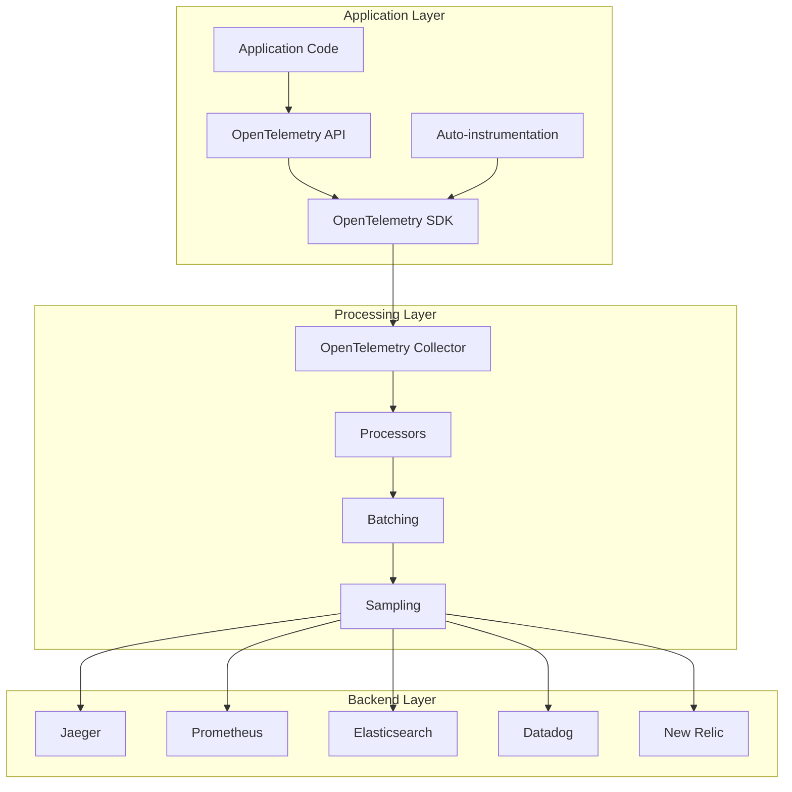
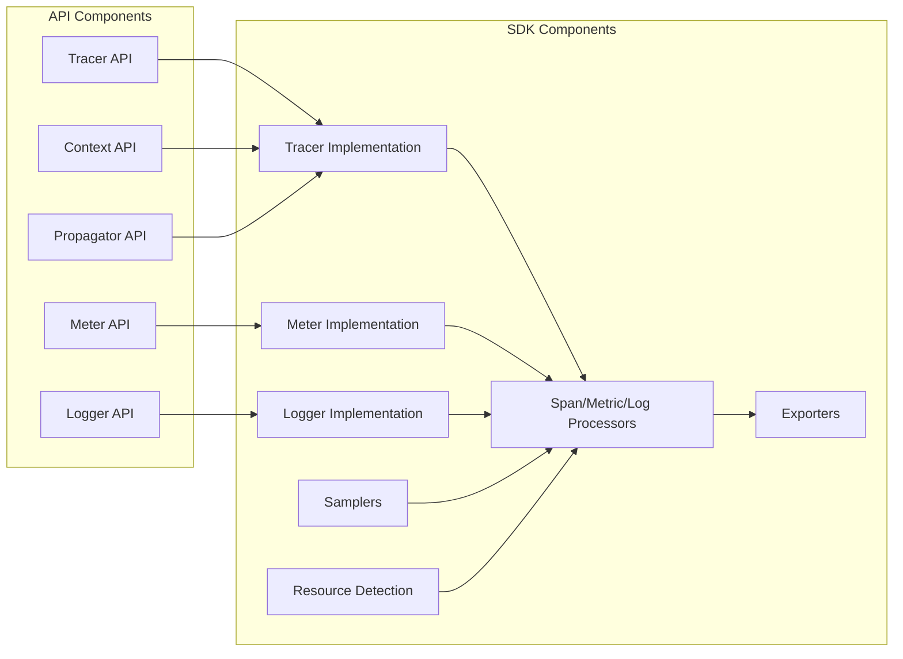
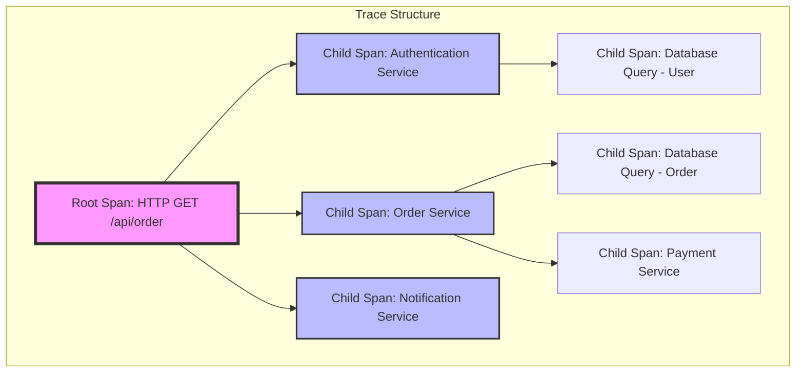
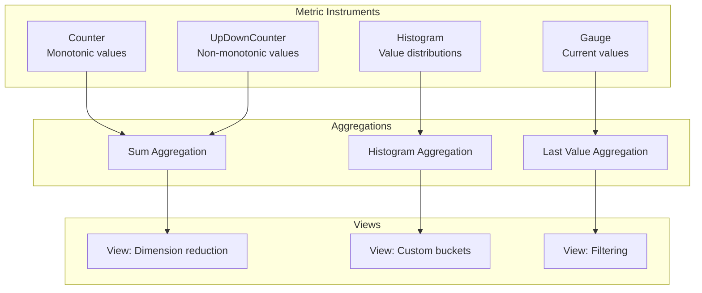
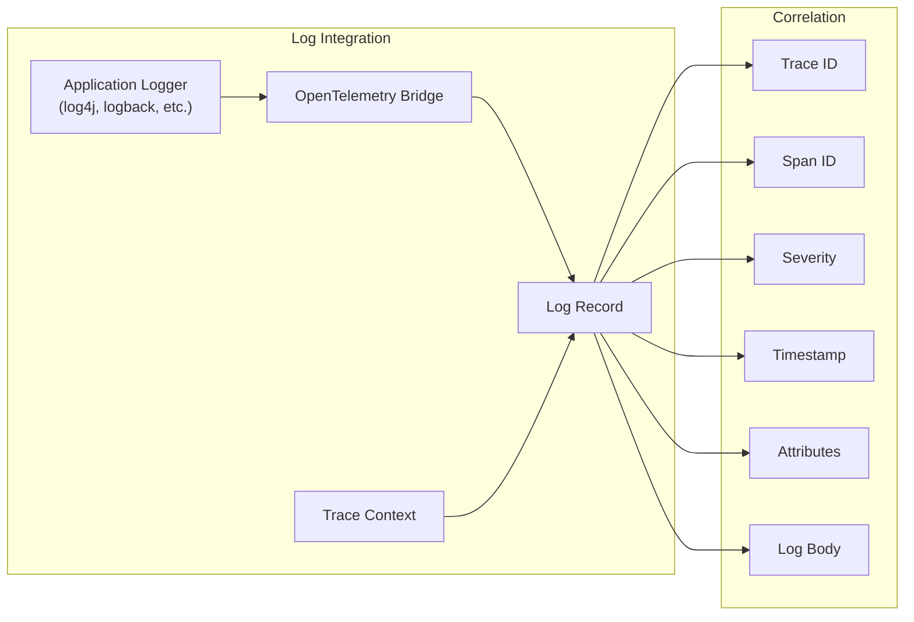
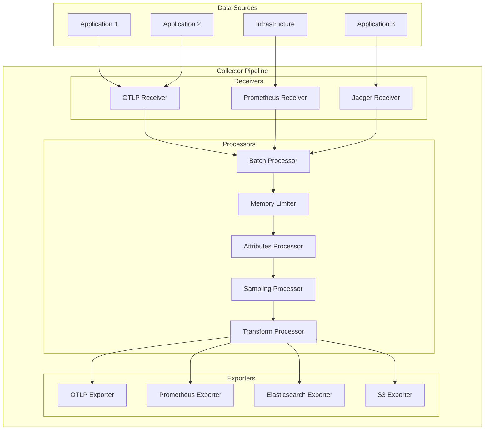
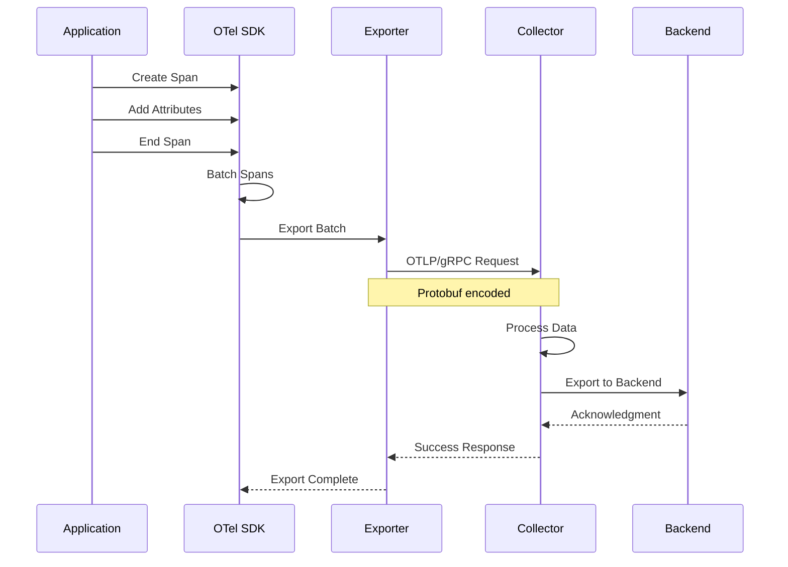
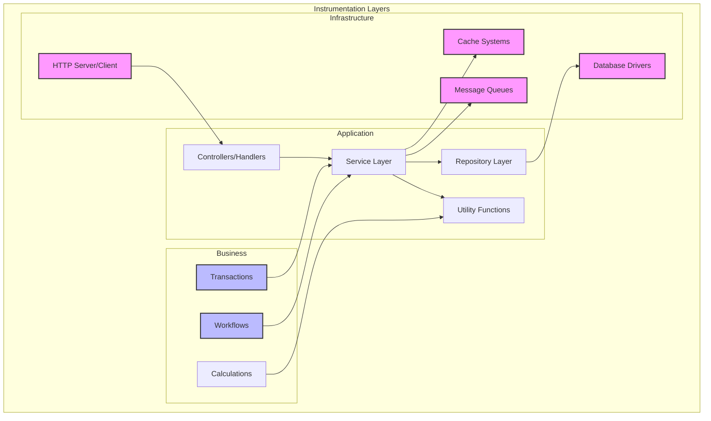
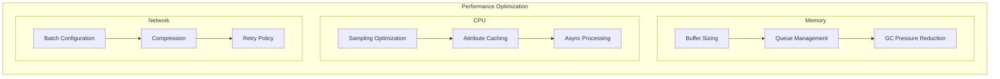
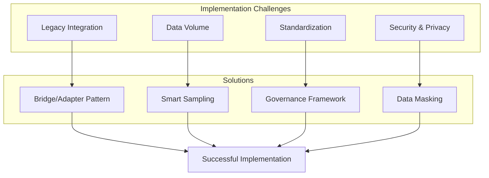

# OpenTelemetry

分散システムの複雑性が増す中で、システムの内部動作を可視化し理解することは、信頼性の高いサービス運用において不可欠な要素となっている。従来、アプリケーションパフォーマンス監視（APM）やログ収集、メトリクス監視といった観測可能性（Observability）の各領域は、それぞれ独立したツールやフレームワークによって実現されてきた。この断片化された状況は、運用チームに複数のツールセットの習得を強い、データの相関分析を困難にし、計装コードの重複を招いていた。

OpenTelemetryは、この課題に対する業界標準の解決策として登場した。Cloud Native Computing Foundation（CNCF）のプロジェクトとして、OpenTelemetryは観測可能性データの収集、処理、エクスポートのための統一されたフレームワークとツールセットを提供する。その最大の特徴は、トレーシング、メトリクス、ログという観測可能性の三本柱を単一の一貫したAPIとSDKで扱える点にある。

本質的にOpenTelemetryは、ベンダーニュートラルな観測可能性のためのデータ収集レイヤーとして機能する。アプリケーション開発者は、特定の監視バックエンドに依存することなく、標準化された方法で計装を実装できる。この抽象化により、監視バックエンドの変更や複数バックエンドへの同時送信が、アプリケーションコードの変更なしに可能となる。

## アーキテクチャと設計原則

OpenTelemetryのアーキテクチャは、明確な責任分離と拡張性を重視して設計されている。その中核となる設計原則は、API と実装の分離、言語固有の慣用句への適応、パフォーマンスへの配慮、そしてベンダー中立性である。

API層は、アプリケーション開発者が直接使用するインターフェースを定義する。この層は最小限の依存関係で構成され、アプリケーションコードに組み込まれても負担にならないよう設計されている。重要な点として、APIは実装を含まず、純粋なインターフェース定義のみを提供する。これにより、本番環境でOpenTelemetryを無効化する場合でも、APIコールは軽量なno-op実装に置き換えられ、パフォーマンスへの影響を最小限に抑えることができる。

SDK層は、APIの具体的な実装を提供する。ここには、スパンの生成と管理、メトリクスの集計、コンテキスト伝播の処理、バッチング、サンプリングといった核心的な機能が実装されている。SDKは言語ごとに最適化されており、それぞれの言語の特性や慣用句を活かした実装となっている。例えば、Go言語のSDKではcontextパッケージを活用したコンテキスト伝播が実装され、Java SDKではThreadLocalを使用した実装が採用されている。

計装（Instrumentation）の層は、実際にテレメトリデータを生成する部分である。OpenTelemetryは手動計装と自動計装の両方をサポートしている。手動計装では、開発者が明示的にコード内でスパンの開始と終了、メトリクスの記録、ログの出力を行う。一方、自動計装は言語固有のメカニズム（Javaのバイトコード操作、Pythonのモンキーパッチング、.NETのプロファイラAPI等）を使用して、アプリケーションコードの変更なしにテレメトリデータを収集する。

## トレーシングの実装と概念

分散トレーシングは、OpenTelemetryの中でも特に重要な機能である。マイクロサービスアーキテクチャにおいて、単一のユーザーリクエストが複数のサービスを経由する際、その全体像を把握することは従来の監視手法では困難であった。OpenTelemetryのトレーシングは、この課題に対して標準化されたソリューションを提供する。

トレースの基本単位はスパン（Span）である。スパンは、特定の操作や処理の実行を表現し、開始時刻、終了時刻、属性（Attributes）、イベント（Events）、リンク（Links）といった情報を含む。複数のスパンが親子関係を持って連なることで、一つのトレースを形成する。この構造により、分散システム全体でのリクエストの流れを可視化できる。

スパンの識別には、トレースIDとスパンIDという二つの識別子が使用される。トレースIDは128ビットの値で、一つのトレース全体で共通の識別子となる。スパンIDは64ビットの値で、個々のスパンを一意に識別する。この識別体系は、W3C Trace Context仕様に準拠しており、異なるシステム間でのトレース情報の伝播を可能にしている[^1]。

コンテキスト伝播は、分散トレーシングの成功において極めて重要な要素である。サービス間の通信において、トレースコンテキスト（トレースID、スパンID、サンプリング決定等）を正確に伝播させることで、複数のサービスにまたがるトレースの一貫性が保たれる。OpenTelemetryは、HTTPヘッダー、gRPCメタデータ、メッセージキューのヘッダーなど、様々なプロトコルでのコンテキスト伝播をサポートしている。

サンプリングは、大規模システムにおけるトレーシングの実用性を左右する重要な機能である。すべてのリクエストをトレースすることは、パフォーマンスとストレージの観点から現実的ではない。OpenTelemetryは、ヘッドベースサンプリング（リクエストの開始時点でサンプリング決定）とテールベースサンプリング（トレース完了後にサンプリング決定）の両方をサポートしている。サンプリング戦略は、AlwaysOn、AlwaysOff、TraceIdRatioBased、ParentBasedなど、複数の方式から選択できる。

## メトリクスの収集と集計

メトリクスは、システムの健全性とパフォーマンスを定量的に把握するための基盤である。OpenTelemetryのメトリクスAPIは、異なる種類の測定値を効率的に収集し、集計するための包括的なフレームワークを提供する。従来のメトリクスシステムと比較して、OpenTelemetryの特徴は、プッシュ型とプル型の両方のモデルをサポートし、高い柔軟性を持つ点にある。

メトリクスの種類は、測定対象の性質に応じて選択される。Counterは単調増加する値を記録し、リクエスト数やエラー数などの累積値に適している。UpDownCounterは増減する値を扱い、接続数やキューサイズなどの状態値に使用される。Histogramは値の分布を記録し、レスポンスタイムやリクエストサイズなどの測定に適している。Gaugeは特定時点の値を記録し、CPUやメモリ使用率などの瞬間値を表現する。

メトリクスの集計は、SDKレベルで実行される重要な処理である。生の測定値は、時間窓やディメンション（ラベル）に基づいて集計され、エクスポートに適した形式に変換される。この集計処理は、デルタ一時性（前回のエクスポート以降の変化量）と累積一時性（開始時点からの累積値）の両方をサポートしている。集計の粒度と頻度は、パフォーマンスとデータの精度のトレードオフを考慮して設定される。

ビュー（View）は、メトリクスデータの変換と最適化のための強力な機能である。ビューを使用することで、高カーディナリティのディメンションを削減したり、ヒストグラムのバケット境界をカスタマイズしたり、特定の条件に基づいてメトリクスをフィルタリングすることができる。これにより、バックエンドシステムへの負荷を軽減しながら、必要な洞察を得ることが可能となる。

## ログの統合と相関

ログは、アプリケーションの詳細な動作記録として、デバッグとトラブルシューティングにおいて不可欠な役割を果たす。OpenTelemetryにおけるログの扱いは、既存のログライブラリとの統合を重視しており、アプリケーションの既存のログ出力を変更することなく、トレースやメトリクスとの相関を実現する。

ログレコードは、タイムスタンプ、重要度レベル、本文、属性、トレースコンテキストなどの情報を含む構造化データとして扱われる。特に重要なのは、ログとトレースの相関である。ログレコードにトレースIDとスパンIDが自動的に付与されることで、特定のリクエストに関連するすべてのログを容易に検索できる。この相関により、分散システムにおける問題の根本原因分析が大幅に簡素化される。

ログの処理パイプラインは、収集、変換、バッチング、エクスポートの各段階から構成される。ログプロセッサーは、ログレコードの内容を変更したり、フィルタリングしたり、エンリッチメントを行ったりする役割を担う。例えば、機密情報のマスキング、構造化されていないログの解析、追加のメタデータの付与などが、プロセッサーレベルで実行される。

## OpenTelemetry Collectorの役割と設計

OpenTelemetry Collectorは、テレメトリデータの収集、処理、エクスポートを担う独立したサービスコンポーネントである。アプリケーションから直接バックエンドにデータを送信する代わりに、Collectorを経由することで、より柔軟で信頼性の高いデータパイプラインを構築できる。

Collectorのアーキテクチャは、レシーバー、プロセッサー、エクスポーターという三つの主要コンポーネントから構成される。レシーバーは、様々なソースからデータを受信する入力ポイントであり、OTLP、Jaeger、Prometheus、Zipkinなど、多様なプロトコルとフォーマットをサポートしている。プロセッサーは、受信したデータに対して変換、フィルタリング、エンリッチメント、バッチングなどの処理を実行する。エクスポーターは、処理されたデータを最終的な宛先に送信する役割を担う。

Collectorの重要な設計原則の一つは、高可用性とスケーラビリティである。水平スケーリングをサポートし、複数のCollectorインスタンスを負荷分散構成で実行できる。また、メモリとCPU使用量の制限機能により、リソース枯渇によるシステム全体への影響を防ぐことができる。バックプレッシャー機構により、下流システムの過負荷を検知し、適切にデータフローを制御する。

デプロイメントモデルとして、Collectorはエージェントモードとゲートウェイモードの二つの主要なパターンをサポートしている。エージェントモードでは、各ホストやPodにCollectorを配置し、ローカルのアプリケーションからデータを収集する。ゲートウェイモードでは、中央集約型のCollectorクラスターを構成し、複数のソースからのデータを集約して処理する。多くの本番環境では、これら二つのモードを組み合わせた階層的なアーキテクチャが採用される。

## OpenTelemetry Protocol (OTLP)

OpenTelemetry Protocol（OTLP）は、テレメトリデータの転送のために設計された高性能なプロトコルである。トレース、メトリクス、ログの三種類のシグナルすべてを統一的に扱うことができ、効率的なシリアライゼーションとネットワーク転送を実現している。

OTLPは、gRPCとHTTP/JSONの二つのトランスポートをサポートしている。gRPCトランスポートは、Protocol Buffersを使用した効率的なバイナリエンコーディングにより、高スループットと低レイテンシを実現する。双方向ストリーミングのサポートにより、バックプレッシャーの実装も容易である。一方、HTTP/JSONトランスポートは、ファイアウォールやプロキシとの互換性が高く、デバッグが容易という利点がある。

プロトコルの設計において重要な考慮事項は、バッチング効率とリソース表現の最適化である。複数のスパン、メトリクスデータポイント、ログレコードを単一のリクエストで送信できるバッチング機能により、ネットワークオーバーヘッドが大幅に削減される。また、リソース情報（サービス名、バージョン、環境情報など）をバッチレベルで共有することで、データの重複を最小化している。

エラーハンドリングとリトライメカニズムは、信頼性の高いデータ配信を保証するために不可欠である。OTLPは、一時的なネットワーク障害や受信側の過負荷に対して、指数バックオフを使用したリトライを実装している。また、部分的な成功（バッチ内の一部のデータのみが受理された場合）のハンドリングもサポートしており、データロスを最小限に抑える設計となっている。

## 計装戦略とベストプラクティス

効果的な計装は、観測可能性の価値を最大化する上で極めて重要である。計装の品質は、得られる洞察の深さと問題解決の効率性を直接的に左右する。OpenTelemetryを使用した計装において、考慮すべき主要な側面は、カバレッジ、パフォーマンス影響、セマンティック規約への準拠、そしてコンテキストの豊富さである。

計装の粒度は、慎重に決定される必要がある。過度に詳細な計装は、パフォーマンスへの影響とデータ量の増大を招く。一方、粗すぎる計装は、問題の特定と分析を困難にする。一般的なガイドラインとして、ユーザーに影響を与える操作、外部サービスとの通信、重要なビジネスロジック、時間のかかる処理などを優先的に計装することが推奨される。

セマンティック規約は、異なるシステム間でのデータの一貫性と相互運用性を保証する重要な要素である。OpenTelemetryは、HTTP、データベース、メッセージング、RPCなど、一般的な技術領域に対する標準的な属性名と値を定義している[^2]。これらの規約に従うことで、異なるサービスやチームが生成したデータを統一的に分析できる。

エラーハンドリングと例外の記録は、トラブルシューティングにおいて特に重要である。スパンのステータスを適切に設定し、エラーの詳細を属性として記録することで、問題の根本原因を迅速に特定できる。スタックトレースは、イベントとして記録することが推奨され、これにより詳細なデバッグ情報を保持しながら、通常の属性データのサイズを抑えることができる。

パフォーマンスへの影響を最小化するためには、いくつかの技術的な考慮事項がある。スパンの作成と属性の追加は、可能な限り非同期的に処理されるべきである。高頻度の操作に対しては、サンプリングを適用して、データ量とCPU使用率を制御する。また、属性値の事前計算やキャッシングにより、計装のオーバーヘッドを削減できる。

## パフォーマンスとスケーラビリティの考慮事項

大規模な本番環境でOpenTelemetryを運用する際、パフォーマンスとスケーラビリティは最重要の考慮事項となる。テレメトリデータの収集と処理が、アプリケーションの主要な機能に悪影響を与えないよう、慎重な設計と最適化が必要である。

メモリ管理は、特に注意を要する領域である。SDKは、処理待ちのスパンやメトリクスデータをメモリ内に保持するため、不適切な設定は、メモリリークや過度のガベージコレクションを引き起こす可能性がある。バッファサイズ、キューの長さ、タイムアウト値などのパラメータは、アプリケーションの特性とリソース制約に基づいて調整される必要がある。

CPU使用率の最適化においては、計算量の多い操作を特定し、最小化することが重要である。属性の文字列フォーマット、正規表現マッチング、複雑なサンプリングロジックなどは、高頻度で実行される場合、顕著なCPUオーバーヘッドとなる。これらの操作は、可能な限り事前計算やキャッシングによって最適化されるべきである。

ネットワーク使用量の制御も重要な要素である。テレメトリデータの送信は、アプリケーションの通常のトラフィックに加えて、追加のネットワーク負荷を生成する。バッチングの適切な設定により、小さなペイロードの頻繁な送信を避け、ネットワーク効率を向上させることができる。また、圧縮の使用により、帯域幅使用量を大幅に削減できる。

スケーラビリティの観点から、OpenTelemetryは水平スケーリングを前提とした設計となっている。Collectorのクラスタリング、ロードバランシング、シャーディングなどの技術により、増大するデータ量に対応できる。ただし、高カーディナリティのメトリクス（多数のユニークなラベル組み合わせ）は、依然としてスケーラビリティの課題となる場合があり、適切なディメンション削減戦略が必要となる。

## エコシステムと統合

OpenTelemetryの成功は、その豊富なエコシステムと既存ツールとの統合能力に大きく依存している。主要なAPMベンダー、オープンソースプロジェクト、クラウドプロバイダーが OpenTelemetryをサポートしており、ユーザーは自由にバックエンドを選択できる。

言語別のSDKは、それぞれの言語エコシステムと密接に統合されている。例えば、JavaのSDKは、Spring Boot、Micronaut、Quarkusなどの主要フレームワークに対する自動計装を提供している。Python SDKは、Django、Flask、FastAPIなどのWebフレームワークをサポートし、Node.js SDKは、Express、Koa、Hapiなどをカバーしている。これらの統合により、最小限のコード変更で包括的な観測可能性を実現できる。

データベースとの統合も、実践的な観測可能性において重要である。OpenTelemetryは、PostgreSQL、MySQL、MongoDB、Redis、Elasticsearchなど、主要なデータストアに対する計装ライブラリを提供している。これらの計装により、クエリのレイテンシ、接続プールの状態、エラー率などの重要なメトリクスが自動的に収集される。

クラウドネイティブ環境との統合は、特に洗練されている。Kubernetesとの統合により、Pod、Node、Clusterレベルのメトリクスとアプリケーションレベルのテレメトリデータを相関させることができる。サービスメッシュ（Istio、Linkerd）との統合により、ネットワークレベルの観測可能性とアプリケーションレベルの観測可能性を統一的に扱える。

## 実装上の課題と解決策

OpenTelemetryの導入と運用には、いくつかの共通的な課題が存在する。これらの課題を理解し、適切な解決策を適用することで、成功確率を大幅に向上させることができる。

レガシーシステムとの統合は、多くの組織が直面する課題である。既存のモニタリングツールやログシステムとの共存、段階的な移行戦略の策定が必要となる。解決策として、OpenTelemetryのブリッジ機能を活用し、既存のデータを OpenTelemetry形式に変換することで、徐々に統一されたプラットフォームへ移行できる。

データ量の管理は、コストとパフォーマンスの両面で重要な課題である。包括的な計装は、大量のデータを生成し、ストレージとネットワークのコストを増大させる。インテリジェントなサンプリング戦略、データの階層化（ホットデータとコールドデータの分離）、保持期間の最適化などにより、この課題に対処できる。

組織的な採用と標準化も重要な側面である。異なるチームが異なる方法で計装を実装すると、データの一貫性が失われ、クロスサービスの分析が困難になる。中央集約的なガイドラインの策定、共有ライブラリの提供、定期的なレビューとフィードバックのプロセスにより、組織全体での一貫性を保つことができる。

セキュリティとプライバシーの考慮事項も無視できない。テレメトリデータには、機密情報やPII（個人識別情報）が含まれる可能性がある。データのマスキング、暗号化、アクセス制御などの適切なセキュリティ対策を実装することが不可欠である。また、規制要件（GDPR、HIPAA等）への準拠も考慮する必要がある。

## 高度な機能とユースケース

OpenTelemetryの高度な機能は、複雑な観測可能性要件に対応するために設計されている。これらの機能を適切に活用することで、より深い洞察と効率的な運用が可能となる。

コンテキスト伝播のカスタマイズは、特殊な要件を持つシステムにおいて重要である。標準的なHTTPヘッダーやgRPCメタデータ以外の方法でコンテキストを伝播させる必要がある場合、カスタムプロパゲーターを実装できる。例えば、非同期メッセージングシステムやバッチ処理システムにおいて、独自のコンテキスト伝播メカニズムを実装することで、エンドツーエンドのトレーシングを実現できる。

複合サンプリングストラテジーは、異なる条件に基づいて異なるサンプリング率を適用する高度な技術である。エラーリクエストは100%サンプリング、特定のユーザーからのリクエストは50%サンプリング、通常のトラフィックは1%サンプリングといった複雑なルールを実装できる。これにより、重要なデータを確実に捕捉しながら、全体的なデータ量を制御できる。

テールベースサンプリングは、Collectorレベルで実装される高度なサンプリング技術である。トレース全体が完了した後に、そのトレースの特性（レイテンシ、エラーの有無、関与するサービスの数など）に基づいてサンプリング決定を行う。これにより、異常なトレースや興味深いパターンを示すトレースを優先的に保持できる。

リソース検出と拡張は、動的な環境において特に有用である。クラウド環境のメタデータ（インスタンスタイプ、リージョン、可用性ゾーン）、コンテナ環境の情報（Pod名、Namespace、Node名）、プロセスレベルの情報（PID、実行ユーザー、コマンドライン引数）などを自動的に検出し、テレメトリデータに付加できる。

## 将来の発展と技術動向

OpenTelemetryは急速に進化しており、新しい機能と改善が継続的に追加されている。現在進行中の開発と将来の方向性を理解することは、長期的な観測可能性戦略の策定において重要である。

プロファイリングの統合は、現在活発に開発が進められている領域である。継続的プロファイリングをOpenTelemetryのシグナルとして統合することで、パフォーマンス問題の根本原因をコードレベルで特定できるようになる。CPUプロファイル、メモリプロファイル、ミューテックスコンテンションなどの情報を、トレースやメトリクスと相関させることで、より深い洞察が可能となる[^3]。

イベントAPIの標準化も重要な開発領域である。構造化イベントをファーストクラスのシグナルとして扱うことで、ログとトレースの境界をより柔軟に扱えるようになる。ビジネスイベント、セキュリティイベント、監査イベントなどを統一的なフレームワークで処理できるようになることが期待される。

AI/MLワークロードへの対応も、重要な発展領域である。機械学習モデルのトレーニングと推論のパフォーマンスを追跡し、データパイプラインの各段階を可視化することで、MLOpsの実践を支援する。GPUメトリクス、モデルバージョニング、データセットのトラッキングなど、ML固有の要件に対応する機能が追加される予定である。

エッジコンピューティングとIoTへの拡張も検討されている。リソース制約のある環境での効率的なテレメトリ収集、断続的な接続への対応、ローカルでのデータ集約と圧縮など、エッジ環境特有の課題に対処する機能が開発されている。

OpenTelemetryは、現代の分散システムにおける観測可能性の標準として確立されつつある。その包括的なアプローチ、ベンダー中立性、活発なコミュニティにより、今後も観測可能性の分野をリードしていくことが期待される。技術的な深さと実践的な柔軟性を兼ね備えたOpenTelemetryは、複雑化する分散システムの運用において、不可欠なツールとなっている。

[^1]: W3C Trace Context specification: https://www.w3.org/TR/trace-context/
[^2]: OpenTelemetry Semantic Conventions: https://opentelemetry.io/docs/reference/specification/trace/semantic_conventions/
[^3]: OpenTelemetry Profiling Vision: https://github.com/open-telemetry/oteps/blob/main/text/profiles/0212-profiling-vision.md