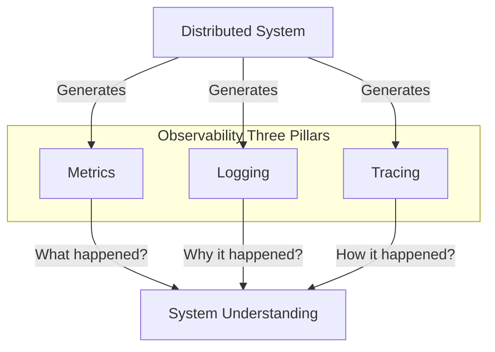
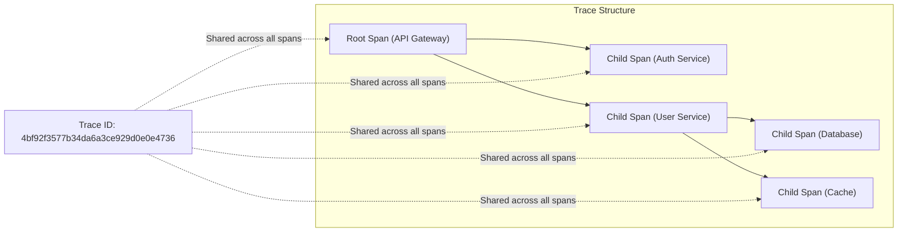
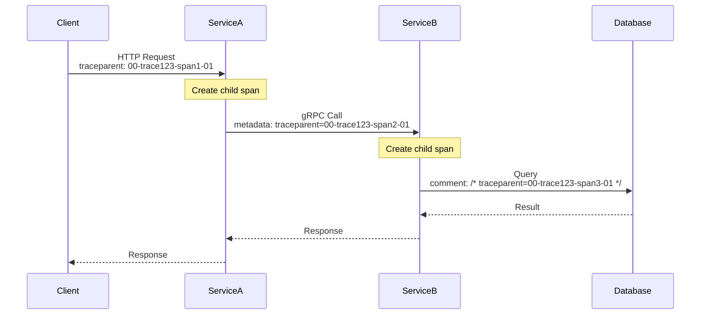
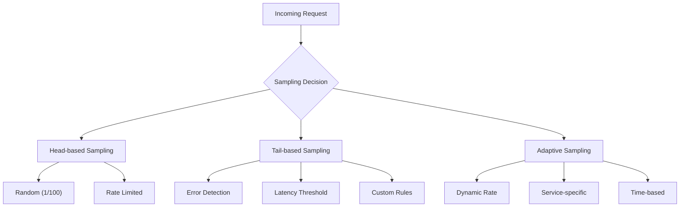
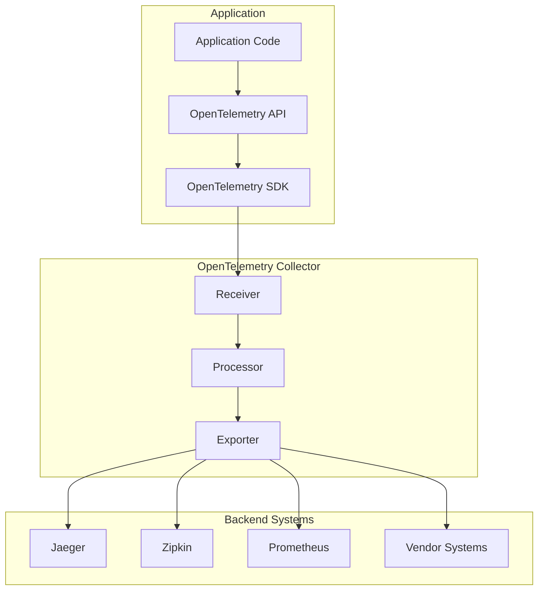
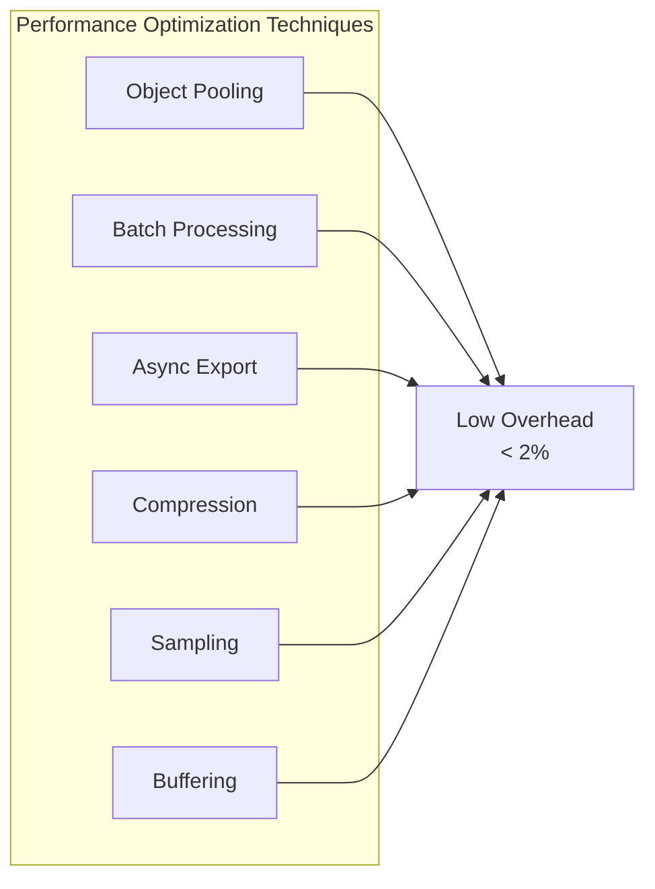
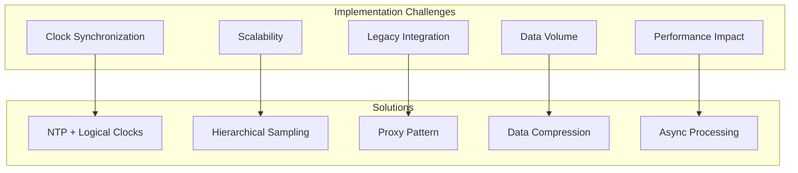

# Tracing

分散システムにおいて、単一のリクエストが複数のサービスを横断して処理される現代のアーキテクチャでは、システムの動作を理解し、問題を診断することが極めて困難になっている。従来のロギングやメトリクスだけでは、リクエストの全体的な流れや、各コンポーネントでの処理時間、依存関係を把握することは不可能に近い。分散トレーシングは、この課題を解決するために開発された観測可能性（Observability）の重要な柱の一つである。

トレーシングという概念自体は、1960年代のメインフレームコンピュータの時代から存在していた。当時は、プログラムの実行パスを追跡するためのデバッグツールとして使用されていた。しかし、現代の分散トレーシングは、Googleが2010年に発表した論文「Dapper, a Large-Scale Distributed Systems Tracing Infrastructure」¹によって体系化され、広く認知されるようになった。この論文は、大規模な分散システムにおいてトレーシングを実装するための基本的なアーキテクチャと概念を定義し、後のオープンソース実装の基礎となった。



## 分散トレーシングの基本概念

分散トレーシングの中核となる概念は「トレース」と「スパン」である。トレースは、システム全体を通過する単一のリクエストの完全な記録を表す。一方、スパンは、トレース内の個々の操作単位を表し、開始時刻、終了時刻、属性情報を持つ。これらの概念は、W3C Trace Context仕様²によって標準化されている。

トレースは、一意のトレースIDによって識別される。このIDは、リクエストがシステムに入った時点で生成され、そのリクエストに関連するすべての処理を通じて伝播される。各スパンは、親スパンのIDを持つことで、トレース内での階層構造を形成する。この親子関係により、リクエストの処理フローを木構造として表現することが可能になる。



スパンには、以下の基本的な属性が含まれる：

- **Trace ID**: トレース全体を識別する128ビットの値
- **Span ID**: 個々のスパンを識別する64ビットの値
- **Parent Span ID**: 親スパンのID（ルートスパンの場合はnull）
- **Operation Name**: スパンが表す操作の名前
- **Start Timestamp**: 操作の開始時刻（マイクロ秒精度）
- **Duration**: 操作の実行時間
- **Attributes**: 操作に関する追加のメタデータ（key-value形式）
- **Events**: スパンの実行中に発生した重要なイベント
- **Status**: 操作の成功/失敗を示すステータス

## トレースコンテキストの伝播

分散システムにおいて最も重要な技術的課題の一つは、トレースコンテキストをサービス間で確実に伝播することである。W3C Trace Context仕様では、HTTPヘッダーを使用したコンテキスト伝播の標準的な方法を定義している。主要なヘッダーは以下の通りである：

```
traceparent: 00-4bf92f3577b34da6a3ce929d0e0e4736-00f067aa0ba902b7-01
```

このヘッダーの構造は次のように定義されている：
- `00`: バージョン番号（現在は00）
- `4bf92f3577b34da6a3ce929d0e0e4736`: 128ビットのトレースID
- `00f067aa0ba902b7`: 64ビットのスパンID
- `01`: トレースフラグ（サンプリング情報を含む）

また、ベンダー固有の情報を伝播するための`tracestate`ヘッダーも定義されている：

```
tracestate: rojo=00f067aa0ba902b7,congo=t61rcWkgMzE
```

HTTPプロトコル以外の通信方式（gRPC、メッセージキュー、データベース接続など）でも、同様の原理でコンテキストを伝播する必要がある。gRPCの場合、メタデータとしてトレースコンテキストを含めることが一般的である。メッセージキューシステムでは、メッセージヘッダーやプロパティとしてコンテキストを付加する。



## サンプリング戦略

すべてのリクエストをトレースすることは、特に高トラフィックのシステムでは、パフォーマンスとストレージの観点から現実的ではない。そのため、効果的なサンプリング戦略が不可欠である。サンプリング戦略は大きく分けて以下の種類がある：

**ヘッドベースサンプリング**は、トレースの開始時点でサンプリングの可否を決定する方式である。最も単純な実装は確率的サンプリングで、設定された確率（例：1%）に基づいてランダムにトレースを選択する。この方式は実装が簡単で予測可能なオーバーヘッドを持つが、重要なトレース（エラーや遅延を含む）を見逃す可能性がある。

**テールベースサンプリング**は、トレースが完了した後にサンプリングの可否を決定する方式である。この方式では、エラーを含むトレース、閾値を超える遅延を持つトレース、特定の属性を持つトレースなど、より洗練された基準でサンプリングを行うことができる。ただし、一時的にすべてのトレースデータを保持する必要があるため、より多くのリソースを消費する。

**アダプティブサンプリング**は、システムの状態に応じて動的にサンプリング率を調整する方式である。例えば、エラー率が上昇した場合にサンプリング率を増加させたり、特定のエンドポイントやユーザーに対して異なるサンプリング率を適用したりすることができる。Jaegerの実装では、過去のトレースデータに基づいて各操作のサンプリング率を自動的に調整する機能が提供されている³。



## OpenTelemetryアーキテクチャ

OpenTelemetryは、クラウドネイティブコンピューティング財団（CNCF）のプロジェクトとして、観測可能性データの収集と処理のための統一された標準を提供している⁴。OpenTelemetryは、以前のOpenCensusとOpenTracingプロジェクトを統合したものであり、トレーシング、メトリクス、ログの収集と処理のための包括的なフレームワークを提供する。

OpenTelemetryのアーキテクチャは、以下の主要コンポーネントから構成される：

**API**は、アプリケーションコードがトレースデータを生成するための言語固有のインターフェースを提供する。このAPIは、実装から独立しており、ベンダーニュートラルな設計となっている。開発者は、このAPIを使用してスパンの作成、属性の設定、イベントの記録を行う。

**SDK**は、APIの具体的な実装を提供し、データの処理、バッチング、エクスポートの機能を含む。SDKは、サンプリング、リソース検出、コンテキスト伝播などの高度な機能も提供する。各プログラミング言語に対して、その言語の慣習に従った実装が提供されている。

**Collector**は、テレメトリーデータの受信、処理、エクスポートを行うスタンドアロンのサービスである。Collectorは、複数のソースからデータを受信し、フィルタリング、変換、集約などの処理を行った後、複数の宛先にデータをエクスポートすることができる。この設計により、アプリケーションとバックエンドシステムの間の疎結合が実現される。



OpenTelemetryのデータモデルは、OTLP（OpenTelemetry Protocol）として定義されており、Protocol Buffersを使用してシリアライズされる。このプロトコルは、効率的なデータ転送と、言語間の相互運用性を提供する。

## トレースデータの保存と検索

収集されたトレースデータは、効率的に保存され、迅速に検索可能である必要がある。トレースデータの特性として、書き込みが多く、読み取りは比較的少ない、時系列的な性質を持つ、高いカーディナリティを持つといった点が挙げられる。これらの特性を考慮した専用のストレージシステムが必要となる。

JaegerやZipkinなどの主要なトレーシングシステムは、複数のストレージバックエンドをサポートしている。Cassandraは、その分散性と書き込み性能の高さから、大規模なトレースデータの保存に適している。Elasticsearchは、強力な検索機能を提供し、複雑なクエリやアグリゲーションを可能にする。最近では、ClickHouseのようなカラムナストレージも、その圧縮効率とクエリ性能から注目されている。

トレースデータの保存において重要な考慮事項は、データの保持期間とサンプリング戦略である。一般的に、詳細なトレースデータは短期間（数日から数週間）保持され、集約されたメトリクスや重要なトレースのみが長期間保持される。この階層的なアプローチにより、ストレージコストを抑えながら、必要な情報へのアクセスを維持することができる。

検索機能においては、以下のような要件が求められる：

- トレースIDによる高速な検索
- タイムレンジベースの検索
- サービス名、操作名による検索
- レイテンシやエラーステータスによるフィルタリング
- タグや属性による複雑なクエリ
- サービス間の依存関係の可視化

## パフォーマンスへの影響と最適化

トレーシングの実装は、本番システムのパフォーマンスに対して最小限の影響に留める必要がある。一般的に、トレーシングのオーバーヘッドは1-2%以内に抑えることが目標とされる。このオーバーヘッドは、主に以下の要因から生じる：

**計装のオーバーヘッド**は、スパンの作成、属性の設定、コンテキストの伝播に必要なCPU時間とメモリ使用量である。効率的な実装では、オブジェクトプーリングやゼロアロケーション技術を使用してこのオーバーヘッドを最小化する。

**ネットワークオーバーヘッド**は、トレースデータの送信に伴う帯域幅の使用とレイテンシである。バッチング、圧縮、非同期送信などの技術により、このオーバーヘッドを削減することができる。OpenTelemetryのCollectorを使用することで、アプリケーションからのデータ送信を効率化し、バックプレッシャーの管理を改善することができる。

**ストレージオーバーヘッド**は、大量のトレースデータを保存するためのディスク容量とI/O負荷である。効果的なサンプリング戦略と、データの圧縮、階層的な保存により、このコストを管理することができる。



## 実装パターンとベストプラクティス

分散トレーシングを効果的に実装するためには、一貫性のある計装パターンとベストプラクティスに従うことが重要である。以下に、実践的な実装指針を示す。

**スパンの命名規則**は、システム全体で一貫性を保つ必要がある。一般的な規則として、`<service>.<operation>`の形式が推奨される。例えば、`user-service.get-user`や`payment-service.process-payment`のような命名により、トレースの可読性と検索性が向上する。

**属性の標準化**も重要である。OpenTelemetryは、セマンティック規約⁵として、一般的な属性名とその使用方法を定義している。例えば、HTTPリクエストの場合、`http.method`、`http.status_code`、`http.url`などの標準的な属性名を使用することで、異なるサービス間でのデータの一貫性が保たれる。

**エラーハンドリング**においては、例外やエラーが発生した場合に適切にスパンのステータスを設定し、エラー情報を記録することが重要である。スタックトレースや詳細なエラーメッセージは、トラブルシューティングに不可欠な情報となる。

```python
# Example of proper span instrumentation
def process_order(order_id):
    with tracer.start_as_current_span("order-service.process-order") as span:
        span.set_attribute("order.id", order_id)
        span.set_attribute("order.value", calculate_order_value(order_id))
        
        try:
            # Process the order
            result = execute_order_processing(order_id)
            span.set_attribute("order.status", "completed")
            return result
        except Exception as e:
            span.set_status(Status(StatusCode.ERROR, str(e)))
            span.record_exception(e)
            raise
```

**コンテキストの適切な管理**は、特に非同期処理やマルチスレッド環境において重要である。各言語のOpenTelemetry実装は、コンテキストの自動的な伝播をサポートしているが、カスタムの非同期処理やバックグラウンドタスクでは、明示的なコンテキスト管理が必要になる場合がある。

## セキュリティとプライバシーの考慮事項

トレースデータには、センシティブな情報が含まれる可能性があるため、適切なセキュリティとプライバシー対策が必要である。個人識別情報（PII）、認証トークン、パスワード、クレジットカード番号などの機密情報は、トレースデータに含めてはならない。

データのサニタイゼーションは、複数のレベルで実装することができる。アプリケーションレベルでは、センシティブな属性を記録する前にフィルタリングや難読化を行う。Collectorレベルでは、プロセッサーを使用して特定の属性を削除または変換することができる。ストレージレベルでは、暗号化とアクセス制御により、データの保護を強化する。

コンプライアンス要件（GDPR、PCI-DSSなど）に対応するため、データの保持期間、アクセス権限、監査ログの管理も重要である。特に、ユーザーの「忘れられる権利」に対応するため、特定のユーザーに関連するトレースデータを効率的に削除できる仕組みが必要となる場合がある。

## 高度なユースケース

分散トレーシングは、単なるデバッグツールを超えて、様々な高度なユースケースに活用されている。

**SLO（Service Level Objective）の監視**において、トレースデータから導出されるレイテンシ分布は、パーセンタイルベースのSLOの計算に使用される。例えば、「99パーセンタイルのレスポンスタイムが100ms以下」というSLOを、実際のトレースデータから継続的に検証することができる。

**カナリアデプロイメントの評価**では、新旧バージョン間のパフォーマンス比較にトレースデータが活用される。デプロイメントタグを使用してトレースを分類し、レイテンシ、エラー率、リソース使用量の変化を定量的に評価することができる。

**容量計画とボトルネック分析**では、トレースデータから各サービスの処理時間と呼び出し頻度を分析し、システムのボトルネックを特定する。この情報は、スケーリング決定やアーキテクチャの最適化に活用される。

**異常検知と根本原因分析**では、機械学習技術とトレースデータを組み合わせて、通常とは異なるパターンを自動的に検出する。例えば、特定のサービス間のレイテンシが突然増加した場合、関連するトレースを自動的に特定し、問題の根本原因を迅速に特定することができる。

## 実装の課題と解決策

分散トレーシングの実装には、いくつかの技術的課題が存在する。

**クロック同期の問題**は、分散システムにおいて避けられない課題である。異なるホスト間でのクロックのずれは、スパンの順序や期間の計算に影響を与える。NTPによる時刻同期の徹底と、論理クロックの使用により、この問題を緩和することができる。一部の実装では、Lamportタイムスタンプのような論理的な順序付けメカニズムを使用している。

**大規模システムでのスケーラビリティ**は、特に重要な課題である。数千のマイクロサービスと毎秒数百万のリクエストを処理するシステムでは、トレースデータの量が膨大になる。階層的なサンプリング、エッジでの集約、効率的なデータ圧縮などの技術により、この課題に対処する。

**レガシーシステムとの統合**も一般的な課題である。すべてのコンポーネントを一度に計装することは現実的ではないため、段階的な導入戦略が必要となる。プロキシやサイドカーパターンを使用して、レガシーシステムに対して透過的にトレーシングを追加することができる。



## エコシステムと統合

分散トレーシングは、より広範な観測可能性エコシステムの一部として機能する。主要なトレーシングシステムとその特徴を以下に示す。

**Jaeger**は、Uberによって開発され、現在はCNCFの卒業プロジェクトとなっている。Jaegerは、高いスケーラビリティと柔軟なアーキテクチャを特徴とし、OpenTelemetryとの深い統合を提供している。Spark統合による大規模なデータ分析機能も提供している。

**Zipkin**は、Twitterによって開発された、最も歴史のあるオープンソーストレーシングシステムの一つである。シンプルなアーキテクチャと豊富な言語サポートを特徴とし、多くの組織で採用されている。

**AWS X-Ray**、**Google Cloud Trace**、**Azure Application Insights**などのクラウドプロバイダーのマネージドサービスは、それぞれのクラウド環境との深い統合を提供している。これらのサービスは、インフラストラクチャの管理負担を軽減し、他のクラウドサービスとのシームレスな統合を可能にする。

商用ソリューション（Datadog APM、New Relic、Dynatraceなど）は、高度な分析機能、AIベースの異常検知、統合されたダッシュボードなどの付加価値機能を提供している。これらのソリューションは、エンタープライズ環境での包括的な観測可能性プラットフォームとして機能する。

## パフォーマンス特性と最適化技術

トレーシングシステムのパフォーマンス特性を理解し、適切に最適化することは、本番環境での成功に不可欠である。

**メモリ使用量の最適化**では、スパンオブジェクトのプーリングと再利用が重要である。Go言語の実装では、sync.Poolを使用してスパンオブジェクトを再利用し、ガベージコレクションの負荷を軽減している。また、属性の数を制限し、大きな値（長い文字列など）の保存を避けることも重要である。

**CPU使用率の最適化**では、トレースデータのシリアライゼーションとコンテキスト伝播のコストを最小化する必要がある。効率的なシリアライゼーション形式（Protocol Buffers、MessagePackなど）の使用と、ホットパスでの計算を避けることが重要である。

**ネットワーク帯域幅の最適化**では、バッチングと圧縮が主要な技術となる。OpenTelemetryのSDKは、設定可能なバッチサイズとタイムアウトにより、ネットワーク呼び出しを最適化する。gRPCの圧縮機能を使用することで、転送データ量を大幅に削減することができる。

## 実践的な導入戦略

組織全体に分散トレーシングを導入する際は、段階的かつ戦略的なアプローチが必要である。

初期段階では、クリティカルパスにあるサービスから始めることが推奨される。ユーザーに直接影響を与えるAPIゲートウェイや、ビジネスクリティカルなサービスから計装を開始し、徐々に依存関係のあるサービスに拡大していく。この段階では、基本的なHTTPやRPCの計装に焦点を当て、詳細な内部処理の計装は後回しにする。

次の段階では、データベースクエリ、キャッシュ操作、外部API呼び出しなど、より詳細な操作の計装を追加する。同時に、組織全体でのベストプラクティスとガイドラインを確立し、開発チーム間での知識共有を促進する。

成熟段階では、自動化された異常検知、SLOベースのアラート、容量計画への活用など、より高度なユースケースに取り組む。また、トレースデータを他の観測可能性ツール（メトリクス、ログ）と統合し、包括的な観測可能性プラットフォームを構築する。

---

¹ Sigelman, B. H., et al. (2010). "Dapper, a Large-Scale Distributed Systems Tracing Infrastructure." Google Technical Report.

² W3C. (2021). "Trace Context - Level 1." W3C Recommendation. https://www.w3.org/TR/trace-context/

³ Jaeger Documentation. (2023). "Adaptive Sampling." https://www.jaegertracing.io/docs/sampling/

⁴ OpenTelemetry. (2023). "OpenTelemetry Specification." https://opentelemetry.io/docs/reference/specification/

⁵ OpenTelemetry. (2023). "Semantic Conventions." https://opentelemetry.io/docs/reference/specification/trace/semantic_conventions/