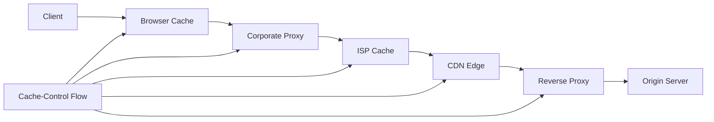
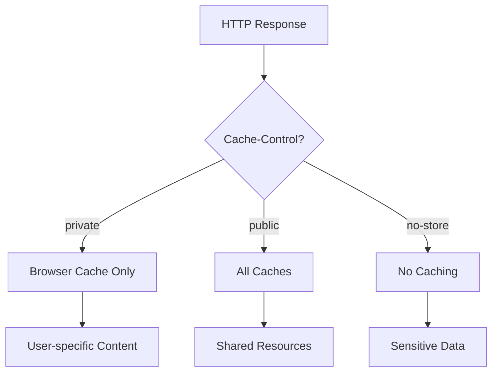
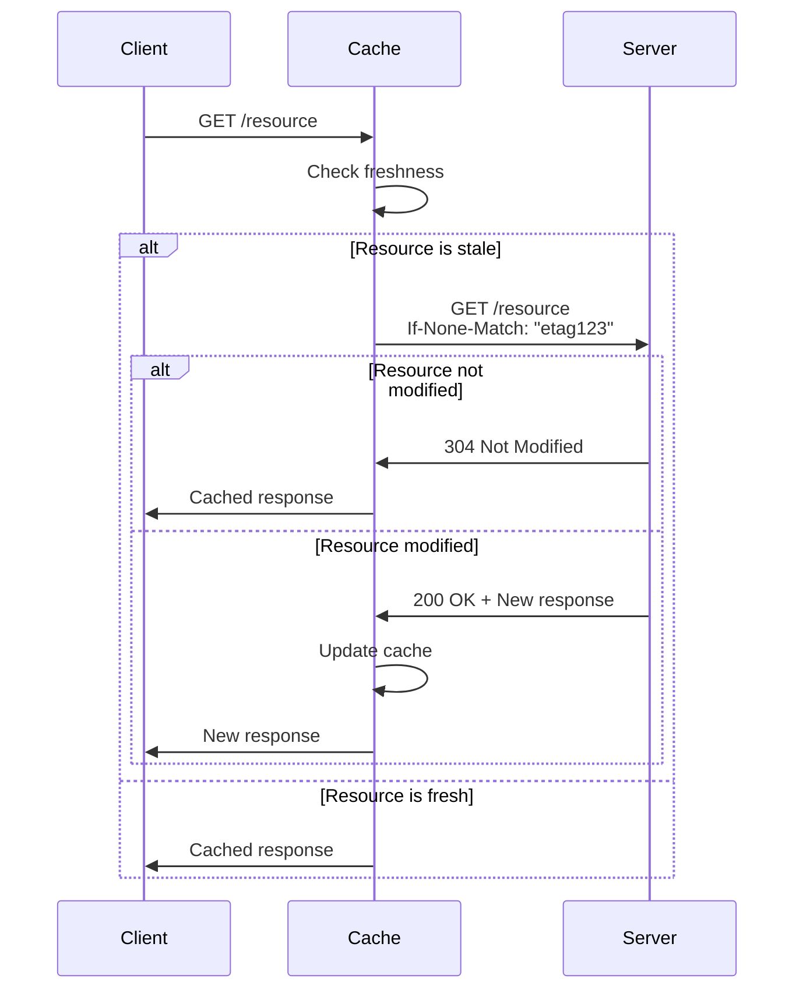

# Cache-Control

HTTPにおけるキャッシュ制御は、Webパフォーマンスの最適化において中核的な役割を果たす。Cache-Controlヘッダーは、HTTPレスポンスがどのようにキャッシュされ、再利用されるべきかを指示する主要な機構である。RFC 7234[^1]で定義されるこのヘッダーは、オリジンサーバーから中間プロキシ、そしてクライアントまでの経路上で、リソースの鮮度と再利用可能性を細かく制御する。

[^1]: Fielding, R., et al., "Hypertext Transfer Protocol (HTTP/1.1): Caching", RFC 7234, June 2014

HTTPキャッシュの基本的な動作原理は、一度取得したリソースを保存し、同一のリクエストに対して保存されたコピーを返すことで、ネットワーク通信を削減することにある。しかし、この単純な概念の実装には、リソースの鮮度管理、プライバシーの保護、一貫性の維持といった複雑な課題が伴う。Cache-Controlヘッダーは、これらの課題に対処するための包括的な制御機構を提供する。

## キャッシュの基本アーキテクチャ

HTTPキャッシュシステムは、複数の層で構成される分散アーキテクチャを形成する。クライアント側のブラウザキャッシュ、企業内のプロキシキャッシュ、ISPレベルの透過型プロキシ、CDNのエッジサーバー、そしてリバースプロキシといった各層が、それぞれ異なる最適化目標を持ちながら協調動作する。



各キャッシュ層は、Cache-Controlディレクティブに従って独立した判断を行う。この分散的な性質は、スケーラビリティの観点では優れているが、一貫性の保証や無効化の伝播において課題を生じさせる。特に、中間キャッシュの存在を前提とした制御戦略の設計は、システム全体のパフォーマンスに大きな影響を与える。

## Cache-Controlディレクティブの詳細

Cache-Controlヘッダーは、複数のディレクティブをカンマ区切りで指定できる構造を持つ。各ディレクティブは、キャッシュの振る舞いの特定の側面を制御する。主要なディレクティブの動作原理と実装上の考慮事項を詳しく見ていく。

### max-ageディレクティブ

max-ageは、レスポンスが新鮮であると見なされる最大秒数を指定する。このディレクティブは、Expiresヘッダーよりも優先され、より精密な制御を可能にする。

```
Cache-Control: max-age=3600
```

max-ageの計算は、レスポンスのDateヘッダーを基準とする。キャッシュは、現在時刻とDateヘッダーの差がmax-age値を超えていない場合、そのレスポンスを新鮮と判断する。この計算において、クライアントとサーバーの時刻同期のずれが問題となることがある。RFC 7234では、Ageヘッダーを用いてこの問題に対処する仕組みを定義している。

### no-cacheとno-store

no-cacheとno-storeは、しばしば混同されるが、全く異なる意味を持つ。no-cacheは、キャッシュされたレスポンスを再検証なしに使用することを禁止する。一方、no-storeは、レスポンスの永続的な保存を完全に禁止する。

```
Cache-Control: no-cache
```

no-cacheディレクティブは、条件付きリクエストと組み合わせて使用されることが多い。キャッシュはレスポンスを保存できるが、使用前に必ずオリジンサーバーに対してIf-None-MatchやIf-Modified-Sinceヘッダーを用いた再検証を行わなければならない。

```
Cache-Control: no-store
```

no-storeは、より厳格な制約を課す。このディレクティブは、機密情報を含むレスポンスに対して使用され、ディスクへの書き込みを含むあらゆる形式の永続化を禁止する。ただし、実装によってはメモリ上の一時的な保存は許可される場合がある。

### privateとpublic

privateディレクティブは、レスポンスが特定のユーザーに対してのみ有効であることを示す。共有キャッシュ（プロキシやCDN）はこのレスポンスを保存してはならないが、ユーザーのブラウザキャッシュは保存できる。

```
Cache-Control: private, max-age=3600
```

publicディレクティブは、通常はキャッシュ不可とされるレスポンス（認証が必要なレスポンスなど）でも、共有キャッシュに保存可能であることを明示的に示す。



### must-revalidateとproxy-revalidate

must-revalidateディレクティブは、キャッシュされたレスポンスが古くなった場合、再検証なしに使用することを禁止する。通常、ネットワーク障害時などには古いキャッシュを返すことが許されるが、must-revalidateはこの動作を禁止する。

```
Cache-Control: max-age=3600, must-revalidate
```

proxy-revalidateは、must-revalidateと同様の制約を共有キャッシュにのみ適用する。プライベートキャッシュは、この制約から除外される。

## 条件付きリクエストとの相互作用

Cache-Controlは、条件付きリクエストメカニズムと密接に連携して動作する。ETagやLast-Modifiedヘッダーと組み合わせることで、効率的な再検証プロセスを実現する。



この再検証プロセスにおいて、Cache-Controlディレクティブは重要な役割を果たす。max-ageは再検証が必要となるタイミングを決定し、must-revalidateは再検証の必須性を制御する。

## ヒューリスティックキャッシング

明示的なCache-Controlヘッダーが存在しない場合、多くのキャッシュ実装はヒューリスティックな手法を用いてキャッシュ可能性を判断する。RFC 7234は、Last-Modifiedヘッダーを基にした簡単なヒューリスティックを提案している。

```
freshness_lifetime = (current_time - last_modified_time) * 0.1
```

このヒューリスティックは、リソースが最後に変更されてから経過した時間の10%をキャッシュ期間として使用する。しかし、この暗黙的な動作は予期しない結果を招く可能性があるため、明示的なCache-Control指定が推奨される。

## Vary ヘッダーとの相互作用

Varyヘッダーは、キャッシュキーの生成に影響を与える重要な要素である。Cache-Controlと組み合わせて使用されることで、コンテンツネゴシエーションを考慮した適切なキャッシング戦略を実現する。

```
Cache-Control: public, max-age=3600
Vary: Accept-Encoding, Accept-Language
```

この例では、レスポンスは1時間キャッシュ可能だが、Accept-EncodingとAccept-Languageヘッダーの値が異なるリクエストに対しては、別々のキャッシュエントリとして保存される。

## immutableディレクティブ

比較的新しい拡張として、immutableディレクティブがある。このディレクティブは、リソースが指定されたmax-age期間中は絶対に変更されないことを保証する。

```
Cache-Control: public, max-age=31536000, immutable
```

immutableは、ブラウザのリロード動作を最適化する。通常、ユーザーがページをリロードすると、ブラウザは条件付きリクエストを送信するが、immutableが指定されている場合はこの再検証をスキップする。

## stale-while-revalidateとstale-if-error

これらの拡張ディレクティブは、RFC 5861[^2]で定義され、キャッシュの柔軟性を向上させる。

[^2]: Nottingham, M., "HTTP Cache-Control Extensions for Stale Content", RFC 5861, May 2010

```
Cache-Control: max-age=600, stale-while-revalidate=30
```

stale-while-revalidateは、キャッシュが古くなってから指定された秒数の間、古いコンテンツを返しながらバックグラウンドで再検証を行うことを許可する。これにより、ユーザーの体感的なレイテンシを削減できる。

stale-if-errorは、オリジンサーバーがエラーを返した場合に、古いキャッシュを使用することを許可する。

```
Cache-Control: max-age=600, stale-if-error=86400
```

## 実装上の考慮事項

Cache-Controlの実装において、いくつかの重要な考慮事項がある。第一に、キャッシュストレージの制限である。ブラウザやプロキシのキャッシュ容量は有限であり、LRU（Least Recently Used）などのアルゴリズムによって管理される。Cache-Controlで長期間のキャッシュを指定しても、実際にはより早く削除される可能性がある。

第二に、時刻同期の問題がある。max-ageベースの鮮度計算は、クライアントとサーバーの時刻が大きくずれている場合に問題となる。Ageヘッダーの適切な処理と、Date ヘッダーの検証が重要となる。

第三に、キャッシュの無効化戦略である。一度キャッシュされたコンテンツを明示的に無効化する標準的な方法は存在しない。多くの実装では、URLのバージョニングやクエリパラメータの付加によって、実質的な無効化を実現している。

```
/static/app.js?v=1.2.3
/static/app-1.2.3.js
```

## セキュリティ上の考慮事項

Cache-Controlの不適切な使用は、深刻なセキュリティ問題を引き起こす可能性がある。特に、個人情報を含むレスポンスに対して適切なディレクティブを設定しないと、共有キャッシュを通じて情報漏洩が発生する危険性がある。

認証が必要なエンドポイントでは、以下のような設定が推奨される：

```
Cache-Control: private, no-cache, no-store, must-revalidate
```

この組み合わせは、やや冗長に見えるが、様々なキャッシュ実装の挙動の違いを考慮した防御的な設定である。

## パフォーマンス最適化パターン

実践的なWebアプリケーションでは、リソースの特性に応じて異なるCache-Control戦略を採用する。静的アセット（CSS、JavaScript、画像）には長期間のキャッシュを設定し、URLバージョニングで更新を管理する。

```
# Static assets
Cache-Control: public, max-age=31536000, immutable

# API responses
Cache-Control: private, max-age=0, must-revalidate

# HTML documents
Cache-Control: no-cache
```

APIレスポンスに対しては、データの性質に応じて細かく制御する。読み取り専用のマスターデータは積極的にキャッシュし、ユーザー固有のデータは慎重に扱う必要がある。

## CDNとの統合

Content Delivery Network（CDN）との統合において、Cache-Controlは重要な制御点となる。多くのCDNは、オリジンサーバーのCache-Control ヘッダーを尊重するが、独自の拡張や上書き機能を提供する場合もある。

s-maxageディレクティブは、共有キャッシュ専用のmax-age値を指定できる：

```
Cache-Control: public, max-age=600, s-maxage=3600
```

この設定では、ブラウザキャッシュは10分間、CDNは1時間キャッシュを保持する。

## 測定と監視

Cache-Controlの効果を測定するためには、適切なメトリクスの収集が必要である。キャッシュヒット率、オリジンサーバーへのリクエスト数、帯域幅の削減量などが主要な指標となる。

多くのCDNプロバイダーは、詳細なキャッシュ統計を提供する。また、ブラウザの開発者ツールやWebPageTestなどのツールを使用して、エンドユーザー視点でのキャッシュ動作を検証できる。

Cache-Controlの設定は、アプリケーションの特性、ユーザーの利用パターン、インフラストラクチャの制約を総合的に考慮して決定される。適切に設計されたキャッシュ戦略は、パフォーマンスの大幅な向上とインフラコストの削減を実現する。しかし、不適切な設定は、古いコンテンツの表示やセキュリティリスクといった問題を引き起こす。継続的な監視と調整を通じて、最適なバランスを見出すことが重要である。