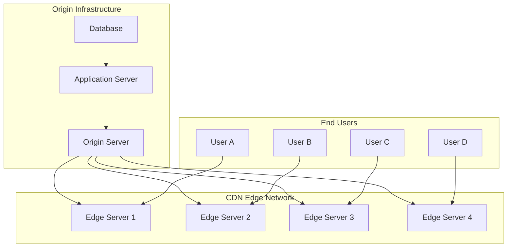
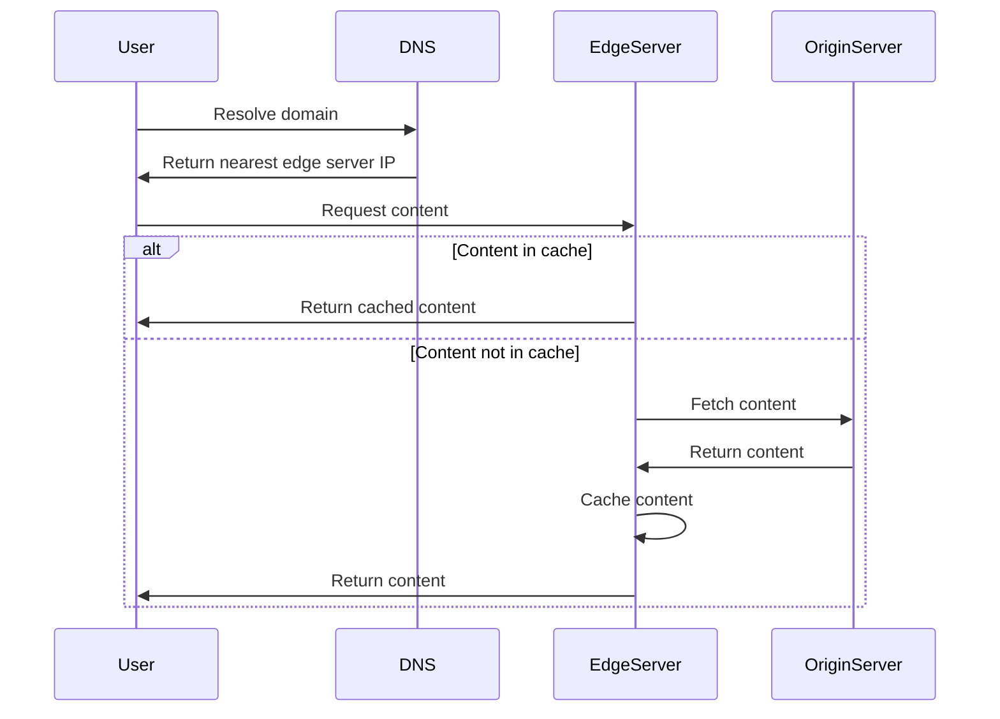
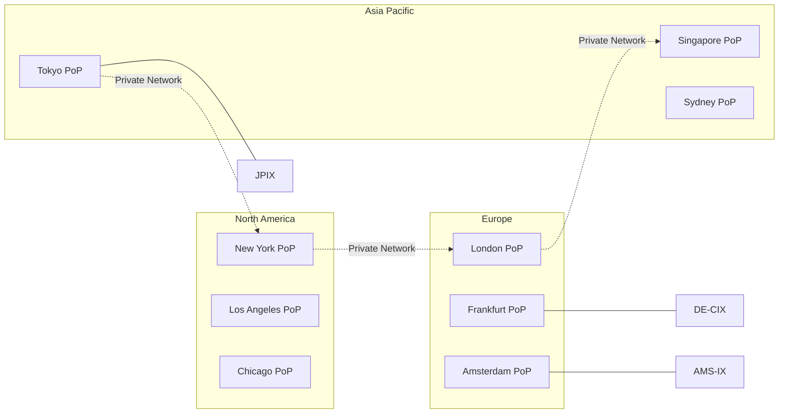
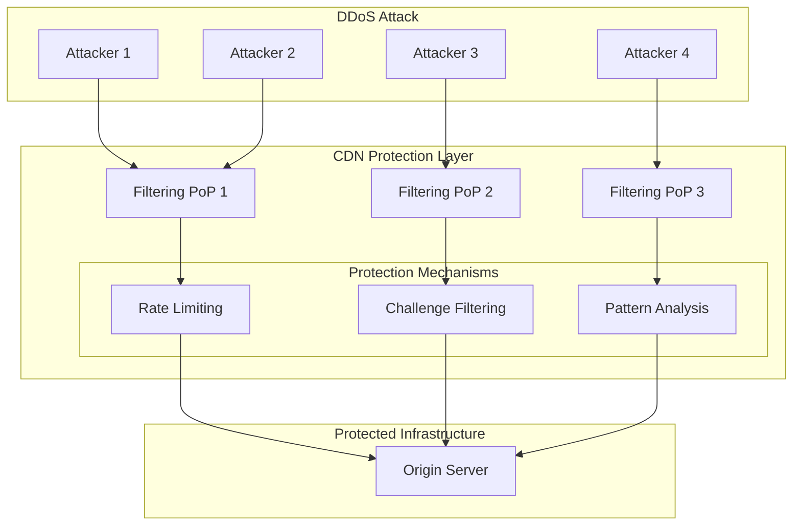
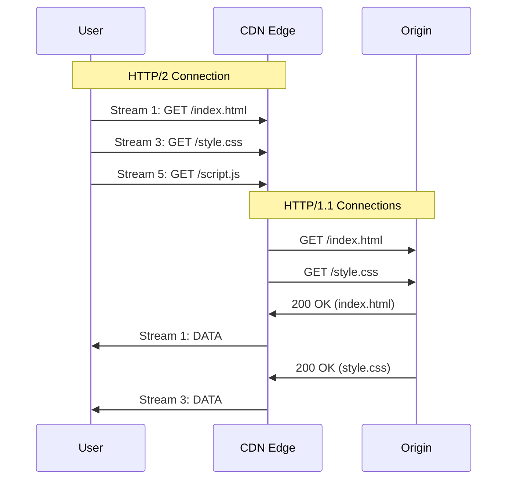
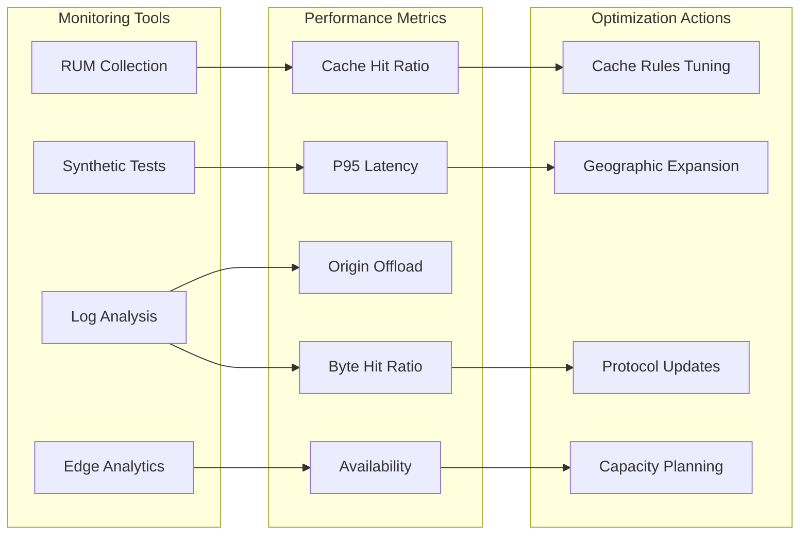

# CDN（Content Delivery Network）

Content Delivery Network（CDN）は、地理的に分散配置されたサーバー群を連携させ、エンドユーザーに対して高速かつ安定的にコンテンツを配信するための分散システムアーキテクチャである。インターネットトラフィックの爆発的な増加とグローバルなコンテンツ配信の需要に応える形で発展してきたCDNは、現代のWebインフラストラクチャにおいて不可欠な要素となっている。

CDNの本質は、コンテンツをエンドユーザーに物理的に近い場所に配置することで、ネットワークレイテンシを削減し、帯域幅の効率的な利用を実現することにある。この単純な原理の背後には、キャッシュ管理、負荷分散、ルーティング最適化、セキュリティ対策など、複雑な技術的課題とその解決策が存在する。



## CDNの動作原理とアーキテクチャ

CDNの動作原理を理解するには、まずインターネットにおける従来のクライアント・サーバーモデルの限界を認識する必要がある。単一のオリジンサーバーから全世界のユーザーにコンテンツを配信する場合、地理的な距離に起因するレイテンシ、ネットワークの輻輳、サーバーの処理能力の限界など、様々な問題が発生する。CDNはこれらの問題を、コンテンツの複製と分散配置によって解決する。

CDNの基本的なアーキテクチャは、オリジンサーバー、エッジサーバー、そしてこれらを結ぶネットワークインフラストラクチャから構成される。オリジンサーバーは、コンテンツの正式なソースとして機能し、すべてのコンテンツの最新版を保持する。一方、エッジサーバーは世界中の様々な地点（Point of Presence: PoP）に配置され、オリジンサーバーのコンテンツのキャッシュを保持する。

ユーザーがコンテンツをリクエストすると、CDNはDNS解決やAnycasting¹などの技術を用いて、そのユーザーに最も適したエッジサーバーを選択する。この選択プロセスには、地理的な近接性だけでなく、ネットワークの状態、サーバーの負荷、コンテンツの可用性など、複数の要因が考慮される。



エッジサーバーへのルーティングが完了すると、次はコンテンツの配信プロセスが始まる。エッジサーバーは、リクエストされたコンテンツがキャッシュに存在するかを確認し、存在する場合は即座にユーザーに返す。これがキャッシュヒットと呼ばれる状態である。一方、キャッシュに存在しない場合（キャッシュミス）、エッジサーバーはオリジンサーバーからコンテンツを取得し、ユーザーに配信すると同時に、将来のリクエストに備えてキャッシュに保存する。

## キャッシュ戦略とアルゴリズム

CDNの性能を決定づける最も重要な要素の一つがキャッシュ戦略である。効果的なキャッシュ戦略は、キャッシュヒット率を最大化し、オリジンサーバーへの負荷を最小化すると同時に、コンテンツの鮮度を保証する必要がある。この複雑な要求を満たすため、CDNは様々なキャッシュアルゴリズムと戦略を組み合わせて使用する。

キャッシュ置換アルゴリズムは、限られたストレージ容量の中で、どのコンテンツをキャッシュに保持し、どのコンテンツを削除するかを決定する。最も基本的なアルゴリズムであるLeast Recently Used（LRU）は、最も長い間アクセスされていないコンテンツを削除する。しかし、CDNの文脈では、コンテンツのサイズ、取得コスト、人気度の変動など、より複雑な要因を考慮する必要がある。

そのため、多くのCDNはLeast Frequently Used（LFU）、Adaptive Replacement Cache（ARC）²、あるいはこれらの変種を採用している。例えば、Greedy Dual-Size Frequency（GDSF）アルゴリズムは、コンテンツのサイズ、アクセス頻度、取得コストを総合的に考慮してキャッシュの価値を計算する。

```python
# GDSF algorithm conceptual implementation
class GDSFCache:
    def __init__(self, capacity):
        self.capacity = capacity
        self.cache = {}
        self.clock = 0
        
    def calculate_value(self, item):
        # Value calculation considering size, frequency, and cost
        return (item.frequency * item.fetch_cost) / item.size + self.clock
        
    def evict(self):
        # Find item with minimum value
        min_item = min(self.cache.values(), key=lambda x: x.value)
        del self.cache[min_item.key]
```

キャッシュの一貫性（Cache Consistency）も重要な課題である。オリジンサーバーのコンテンツが更新された際、すべてのエッジサーバーのキャッシュを即座に更新することは現実的ではない。そのため、CDNはTime-To-Live（TTL）ベースの有効期限管理、条件付きリクエスト（Conditional Requests）、パージ（Purge）機能などを組み合わせて使用する。

TTLベースの管理では、各コンテンツに有効期限が設定され、期限が切れたコンテンツは自動的に無効化される。しかし、この方法では有効期限内でもコンテンツが古くなる可能性がある。そこで、HTTP/1.1で導入されたETagやLast-Modifiedヘッダーを使用した条件付きリクエストが重要となる。エッジサーバーは、キャッシュされたコンテンツのETagをオリジンサーバーに送信し、コンテンツが変更されていない場合は304 Not Modifiedレスポンスを受け取ることで、帯域幅を節約しながら鮮度を確認できる。

## 地理的分散とネットワーク最適化

CDNの価値提案の中核は、地理的に分散したインフラストラクチャによるレイテンシの削減である。しかし、単にサーバーを世界中に配置するだけでは不十分であり、効果的な地理的分散には戦略的な計画と継続的な最適化が必要である。

Point of Presence（PoP）の配置戦略は、人口密度、インターネット利用パターン、ネットワークトポロジー、コスト制約など、多数の要因を考慮して決定される。大規模なCDNプロバイダーは、数百から数千のPoPを運営し、それぞれが複数のエッジサーバーをホストしている。これらのPoPは、主要なInternet Exchange Point（IXP）³に近接して配置されることが多く、複数のISPとの直接接続（ピアリング）を確立することで、ネットワークホップ数を削減する。



ユーザーを最適なエッジサーバーにルーティングする方法も、CDNの性能に大きな影響を与える。DNS-based routingは最も一般的な方法であり、権威DNSサーバーが地理的位置やネットワーク条件に基づいて、異なるIPアドレスを返すことで実現される。しかし、DNSキャッシュやリゾルバーの位置の問題により、必ずしも最適なルーティングが行われるとは限らない。

そのため、多くのCDNはAnycast⁴ルーティングも併用する。Anycastでは、複数のエッジサーバーが同一のIPアドレスを共有し、BGP（Border Gateway Protocol）⁵を使用してネットワークレベルで最適なパスが選択される。この方法は、特にDDoS攻撃の緩和において有効であり、攻撃トラフィックを複数のPoPに分散させることができる。

さらに高度な最適化として、Real User Monitoring（RUM）データを活用した動的ルーティングがある。実際のユーザーのパフォーマンスデータを収集・分析し、リアルタイムでルーティング決定を調整することで、理論的な地理的近接性だけでなく、実際のネットワーク性能に基づいた最適化が可能となる。

## HTTPキャッシュヘッダーとCDNの相互作用

CDNとHTTPプロトコルは密接に連携して動作し、特にHTTPキャッシュヘッダーは、CDNの挙動を制御する重要なメカニズムとなっている。RFC 7234⁶で定義されているHTTPキャッシュの仕様は、CDNがコンテンツをどのようにキャッシュし、配信すべきかを決定する基礎となる。

Cache-Controlヘッダーは、最も重要なキャッシュ制御メカニズムである。`max-age`ディレクティブは、コンテンツがキャッシュ可能な秒数を指定し、`s-maxage`は共有キャッシュ（CDNなど）に対する個別の有効期限を設定できる。`private`ディレクティブは、コンテンツがエンドユーザーのブラウザでのみキャッシュ可能であることを示し、CDNでのキャッシュを防ぐ。一方、`public`ディレクティブは、認証が必要なコンテンツでもCDNでキャッシュ可能であることを明示的に示す。

```
Cache-Control: public, max-age=3600, s-maxage=86400
```

この例では、ブラウザキャッシュは1時間（3600秒）、CDNキャッシュは24時間（86400秒）有効となる。このような差別化により、頻繁に更新されるコンテンツでも、CDNの効果を最大化しながら、エンドユーザーには比較的新鮮なコンテンツを提供できる。

Varyヘッダーは、CDNにおける別の重要な考慮事項である。このヘッダーは、レスポンスがどのリクエストヘッダーに依存して変化するかを示す。例えば、`Vary: Accept-Encoding`は、圧縮形式によって異なるレスポンスが返されることを示し、CDNは圧縮・非圧縮の両バージョンを個別にキャッシュする必要がある。

```
Vary: Accept-Encoding, Accept-Language
```

しかし、Varyヘッダーの過度な使用は、キャッシュの断片化を引き起こし、ヒット率を低下させる可能性がある。特に`Vary: Cookie`や`Vary: User-Agent`のような高カーディナリティのヘッダーは、実質的にキャッシュを無効化してしまう。

Surrogate-Controlヘッダーは、エッジサーバー専用の制御を可能にする拡張である。このヘッダーはエンドユーザーには転送されず、CDN内部でのみ使用される。これにより、オリジンサーバーはCDNとブラウザに対して異なるキャッシュポリシーを設定できる。

## 動的コンテンツの最適化とエッジコンピューティング

従来、CDNは静的コンテンツの配信に特化していたが、Webアプリケーションの進化に伴い、動的コンテンツの最適化も重要な機能となっている。動的コンテンツは、その性質上、従来のキャッシュ手法では対応が困難であり、新たなアプローチが必要となる。

Edge Side Includes（ESI）⁷は、動的ページの一部をキャッシュ可能にする技術である。ESIを使用すると、ページを複数のフラグメントに分割し、それぞれに異なるキャッシュポリシーを適用できる。例えば、ニュースサイトのページで、ヘッダーやフッターは長期間キャッシュし、記事本文は中期間、パーソナライズされた推奨記事は短期間またはキャッシュしないという制御が可能となる。

```html
<esi:include src="/header.html" ttl="1d"/>
<div class="content">
    <esi:include src="/article/12345.html" ttl="1h"/>
</div>
<esi:include src="/personalized/recommendations" ttl="0"/>
```

より高度なアプローチとして、エッジコンピューティングの活用がある。CDNプロバイダーは、エッジサーバー上でコードを実行できるプラットフォームを提供し始めている。Cloudflare Workers⁸、Fastly Compute@Edge⁹、AWS Lambda@Edge¹⁰などのサービスにより、開発者はエッジで動的なロジックを実行できる。

```javascript
// Edge computing example: A/B testing at the edge
addEventListener('fetch', event => {
  event.respondWith(handleRequest(event.request))
})

async function handleRequest(request) {
  const cookie = request.headers.get('Cookie')
  const variant = cookie?.includes('variant=B') ? 'B' : 'A'
  
  const response = await fetch(request)
  const html = await response.text()
  
  // Modify HTML based on variant
  const modifiedHtml = variant === 'B' 
    ? html.replace('Original Title', 'New Title B')
    : html
    
  return new Response(modifiedHtml, response)
}
```

エッジコンピューティングは、レイテンシの削減だけでなく、オリジンサーバーの負荷軽減、パーソナライゼーション、リアルタイム処理など、様々な利点をもたらす。しかし、分散環境でのステート管理、デバッグの困難さ、コールドスタートの問題など、新たな課題も存在する。

## セキュリティとDDoS対策

CDNは、パフォーマンスの向上だけでなく、セキュリティの強化においても重要な役割を果たす。特に、Distributed Denial of Service（DDoS）攻撃に対する防御は、CDNの主要な機能の一つとなっている。

CDNのDDoS対策の基本原理は、攻撃トラフィックを複数のエッジサーバーに分散させることで、単一のターゲットへの集中を防ぐことである。Anycastルーティングにより、攻撃トラフィックは自動的に最も近いPoPに誘導され、各PoPで個別に処理される。これにより、数百Gbpsから数Tbpsに及ぶ大規模な攻撃でも、CDNの分散インフラストラクチャ全体で吸収することが可能となる。



CDNは、様々な種類のDDoS攻撃に対して、階層的な防御メカニズムを実装している。ネットワーク層（L3/L4）の攻撃に対しては、パケットフィルタリング、レート制限、SYN cookieなどの技術を使用する。アプリケーション層（L7）の攻撃に対しては、より高度な分析が必要となり、機械学習を用いた異常検知、行動分析、チャレンジ・レスポンス（CAPTCHA）などが活用される。

Web Application Firewall（WAF）機能も、多くのCDNが提供する重要なセキュリティ機能である。WAFは、SQLインジェクション、クロスサイトスクリプティング（XSS）、その他のOWASP Top 10¹¹に分類される脆弱性からアプリケーションを保護する。CDNのエッジでWAFを実行することで、悪意のあるリクエストがオリジンサーバーに到達する前にブロックできる。

```
# ModSecurity compatible WAF rule example
SecRule REQUEST_URI "@contains /admin" \
    "id:1001,\
    phase:1,\
    block,\
    msg:'Admin access attempt',\
    logdata:'Matched Data: %{MATCHED_VAR} found within %{MATCHED_VAR_NAME}',\
    severity:'2'"
```

TLS/SSL termination（終端）も、CDNが提供する重要なセキュリティ機能である。CDNは、エッジサーバーでTLS接続を終端し、最新の暗号化プロトコルとcipher suitesをサポートする。これにより、オリジンサーバーは計算集約的なTLS処理から解放され、同時に、すべてのユーザーに対して一貫したセキュリティレベルを提供できる。

## プロトコルレベルの最適化

CDNは、HTTPプロトコルの進化と密接に連携し、新しいプロトコル機能を活用してパフォーマンスを向上させている。HTTP/2¹²の導入により、CDNは多重化、サーバープッシュ、ヘッダー圧縮などの機能を活用できるようになった。

HTTP/2の多重化により、単一のTCP接続上で複数のリクエスト・レスポンスを並行して処理できる。これは、特に多数の小さなリソースを含むWebページで、Head-of-Line（HOL）ブロッキングの問題を解決し、レイテンシを大幅に削減する。CDNは、エッジサーバーとユーザー間でHTTP/2を使用し、必要に応じてオリジンサーバーとの通信をHTTP/1.1にダウングレードすることで、レガシーシステムとの互換性を保ちながら最新プロトコルの利点を提供する。



HTTP/3とQUIC¹³プロトコルは、さらなる性能向上をもたらす。QUICは、UDPベースのトランスポートプロトコルであり、TCPの持つHOLブロッキングの問題を根本的に解決する。また、0-RTTハンドシェイクにより、以前に接続したことのあるサーバーへの再接続時のレイテンシを劇的に削減する。

```
# QUIC connection establishment
Client                          Server
  |                               |
  |---Initial[CRYPTO,STREAM]----->|
  |                               |
  |<--Initial[CRYPTO,ACK]---------|
  |<--Handshake[CRYPTO]-----------|
  |                               |
  |---Handshake[CRYPTO,ACK]------>|
  |                               |
  |<--1-RTT[STREAM]---------------|  # Application data can start here
  |---1-RTT[STREAM,ACK]---------->|
```

CDNは、これらの新しいプロトコルを段階的に導入し、クライアントの対応状況に応じて適切なプロトコルを選択する。プロトコルネゴシエーションは、Application-Layer Protocol Negotiation（ALPN）¹⁴拡張を使用してTLSハンドシェイク中に行われる。

## パフォーマンス測定と監視

CDNの効果を最大化するためには、継続的なパフォーマンス測定と監視が不可欠である。CDNプロバイダーとユーザーの両方が、様々なメトリクスを追跡し、最適化の機会を特定する必要がある。

Real User Monitoring（RUM）は、実際のユーザーのブラウザから収集されるパフォーマンスデータであり、CDNの実際の効果を測定する最も正確な方法である。Navigation Timing API¹⁵やResource Timing API¹⁶を使用して、DNS解決時間、TCP接続時間、TLSネゴシエーション時間、最初のバイトまでの時間（TTFB）、総ダウンロード時間などの詳細なメトリクスを収集できる。

```javascript
// RUM data collection example
window.addEventListener('load', function() {
    const perfData = performance.getEntriesByType('navigation')[0];
    const metrics = {
        dns: perfData.domainLookupEnd - perfData.domainLookupStart,
        tcp: perfData.connectEnd - perfData.connectStart,
        ttfb: perfData.responseStart - perfData.requestStart,
        download: perfData.responseEnd - perfData.responseStart,
        total: perfData.loadEventEnd - perfData.fetchStart
    };
    
    // Send metrics to analytics endpoint
    navigator.sendBeacon('/analytics', JSON.stringify(metrics));
});
```

Synthetic Monitoring（合成監視）は、制御された環境から定期的にテストを実行し、パフォーマンスの基準線を確立する。これにより、実際のユーザートラフィックに影響を与える前に、問題を検出できる。CDNの文脈では、異なる地理的位置からのテストが特に重要であり、グローバルなパフォーマンスの一貫性を確保する。

キャッシュ効率のメトリクスも重要である。Cache Hit Ratio（CHR）は、最も基本的な指標であり、全リクエストに対するキャッシュヒットの割合を示す。しかし、より詳細な分析のためには、Byte Hit Ratio（データ量ベースのヒット率）、Origin Offload（オリジンサーバーから削減されたトラフィック量）、Cache Coverage（キャッシュ可能なコンテンツの割合）なども追跡する必要がある。



ログ分析も、CDNの最適化において重要な役割を果たす。エッジサーバーのアクセスログは、トラフィックパターン、人気コンテンツ、エラー率、地理的分布などの貴重な洞察を提供する。多くのCDNプロバイダーは、リアルタイムログストリーミングやバッチログ配信を提供し、ユーザーが独自の分析パイプラインを構築できるようにしている。

## 実装における設計上の考慮事項

CDNを効果的に活用するためには、アプリケーションアーキテクチャの設計段階から、CDNの特性を考慮する必要がある。キャッシュキーの設計は、最も重要な考慮事項の一つである。URLパラメータ、クエリストリング、パスの構造は、キャッシュ効率に直接影響する。

例えば、ユーザーセッション情報やトラッキングパラメータをURLに含めると、本質的に同一のコンテンツが異なるキャッシュエントリとして扱われ、キャッシュ効率が低下する。そのため、キャッシュに影響しないパラメータは、別の方法（Cookieやカスタムヘッダー）で渡すか、CDNのキャッシュキー正規化機能を使用して除外する必要がある。

```
# Bad: Session ID in URL reduces cache efficiency
https://example.com/product/123?session=abc123&utm_source=email

# Good: Clean URLs for better caching
https://example.com/product/123
# Session and tracking data in cookies or headers
```

コンテンツの分割戦略も重要である。大きなモノリシックなリソースよりも、適切なサイズに分割されたリソースの方が、キャッシュ効率が高く、並列ダウンロードの利点を活用できる。JavaScript bundlesやCSS filesは、変更頻度に基づいて分割し、vendorライブラリとアプリケーションコードを分離することで、キャッシュの有効性を最大化できる。

マルチCDN戦略も、エンタープライズ環境では一般的になっている。複数のCDNプロバイダーを使用することで、単一障害点を排除し、各プロバイダーの強みを活用できる。しかし、これには複雑性も伴い、一貫したキャッシュポリシー、ログの統合、コスト管理などの課題に対処する必要がある。

CDNは現代のWebインフラストラクチャにおいて不可欠な要素となっており、その重要性は今後も増大し続けるだろう。5Gネットワークの普及、IoTデバイスの増加、8K動画などの高帯域幅コンテンツの登場により、CDNに対する要求はますます高度化している。同時に、エッジコンピューティング、機械学習、新しいプロトコルなどの技術革新により、CDNの能力も継続的に拡張されている。開発者とアーキテクトは、これらの進化を理解し、適切に活用することで、より高速で信頼性の高いWebアプリケーションを構築できるのである。

---

¹ Anycast: 複数のノードが同一のIPアドレスを共有し、ルーティングプロトコルによって最適なノードが選択される技術。RFC 4786で詳細が定義されている。

² Adaptive Replacement Cache (ARC): IBM Research によって開発されたキャッシュアルゴリズム。Megiddo, N., & Modha, D. S. (2003). "ARC: A Self-Tuning, Low Overhead Replacement Cache". FAST '03.

³ Internet Exchange Point (IXP): 複数のネットワーク事業者が相互接続を行う物理的な施設。

⁴ Anycast routing: RFC 4786 "Operation of Anycast Services" で標準化されている。

⁵ Border Gateway Protocol (BGP): インターネットの基幹となる経路制御プロトコル。RFC 4271で定義。

⁶ RFC 7234: "Hypertext Transfer Protocol (HTTP/1.1): Caching" - HTTPキャッシングの標準仕様。

⁷ Edge Side Includes (ESI): W3C Note として公開されている仕様。https://www.w3.org/TR/esi-lang

⁸ Cloudflare Workers: Cloudflareのエッジコンピューティングプラットフォーム。V8 JavaScriptエンジンを使用。

⁹ Fastly Compute@Edge: WebAssemblyベースのエッジコンピューティング環境。

¹⁰ AWS Lambda@Edge: Amazon CloudFrontと統合されたサーバーレスコンピューティングサービス。

¹¹ OWASP Top 10: Open Web Application Security Projectが発行する、最も重要なWebアプリケーションセキュリティリスクのリスト。

¹² HTTP/2: RFC 7540で標準化された、HTTP/1.1の後継プロトコル。

¹³ QUIC: RFC 9000で標準化された、UDPベースのトランスポートプロトコル。

¹⁴ Application-Layer Protocol Negotiation (ALPN): RFC 7301で定義されたTLS拡張。

¹⁵ Navigation Timing API: W3C勧告として公開されているWeb API仕様。

¹⁶ Resource Timing API: 個々のリソースの詳細なタイミング情報を提供するW3C仕様。