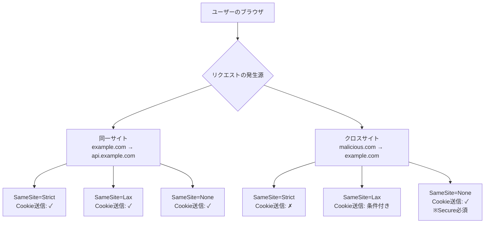
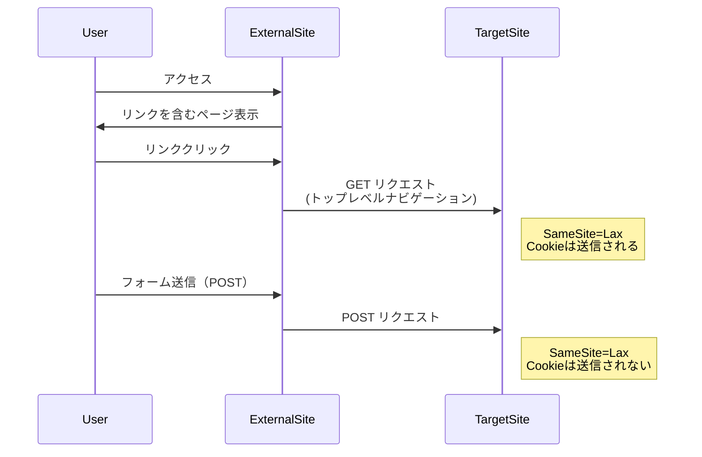
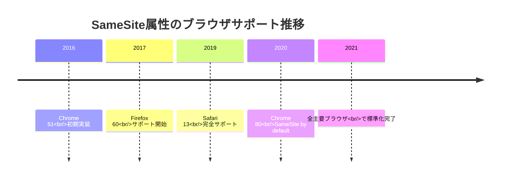
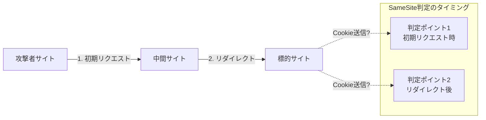

# Cookie SameSite属性：Webセキュリティにおけるサイト境界の制御

CookieのSameSite属性は、Cross-Site Request Forgery（CSRF）攻撃を防ぐために導入されたセキュリティ機構である。2016年にGoogleのエンジニアによって提案され[^1]、その後RFC 6265bis[^2]として標準化された。この属性は、ブラウザがクロスサイトリクエストにおいてCookieを送信するかどうかを制御し、Webアプリケーションのセキュリティ境界をより明確に定義する。

Webの進化に伴い、サイト間の相互作用は複雑化し、同時にセキュリティリスクも増大してきた。従来のCookie仕様では、リクエストの発生源に関わらず、ドメインとパスが一致すればCookieが自動的に送信される。この挙動は利便性を提供する一方で、攻撃者が悪意のあるサイトから正規サイトへのリクエストを誘発し、ユーザーの認証情報を悪用する道を開いていた。SameSite属性は、この根本的な問題に対処するため、Cookieの送信条件にサイト境界という新たな制約を導入した。

## サイト境界の定義と動作原理

SameSite属性を理解するには、まず「サイト」の概念を正確に把握する必要がある。Web標準において、サイトはRegistrable Domain（登録可能ドメイン）によって定義される。これはPublic Suffix List[^3]に基づいて決定され、例えば`example.com`と`sub.example.com`は同一サイトと見なされるが、`example.com`と`another.com`は異なるサイトとなる。



サイト境界の判定は、リクエストのイニシエーターとターゲットのeTLD+1（effective Top-Level Domain plus one）を比較することで行われる。この判定プロセスは、スキーム（HTTPまたはHTTPS）も考慮に入れる。RFC 6265bisでは、HTTPSからHTTPへのダウングレードもクロスサイトとして扱われる。これにより、セキュアな接続から非セキュアな接続への情報漏洩を防ぐ。

## SameSite属性の3つのモード

SameSite属性には、Strict、Lax、Noneの3つの値が定義されており、それぞれ異なるセキュリティと利便性のバランスを提供する。

### Strict モード

Strictモードは最も厳格な制限を課す。このモードでは、クロスサイトリクエストにおいて、いかなる場合もCookieは送信されない。これは最高レベルのCSRF保護を提供するが、ユーザビリティの面で制約が生じる。

```
Set-Cookie: sessionid=abc123; SameSite=Strict; Secure; HttpOnly
```

Strictモードの典型的な問題は、外部サイトからのリンクによるナビゲーションでも認証Cookieが送信されないことだ。例えば、ユーザーがメールのリンクから銀行のサイトにアクセスした場合、既にログイン済みであってもCookieが送信されないため、再度ログインを要求される。この挙動は、セキュリティを重視する金融機関や医療機関のアプリケーションでは受け入れられることもあるが、一般的なWebサービスでは過度に厳格と見なされることが多い。

### Lax モード

Laxモードは、セキュリティと利便性のバランスを取ったモードである。このモードでは、トップレベルナビゲーション（リンククリックやフォームのGET送信など）の場合に限り、クロスサイトリクエストでもCookieが送信される。

```
Set-Cookie: sessionid=def456; SameSite=Lax; Secure; HttpOnly
```

Laxモードの挙動は、HTTPメソッドとリクエストの種類によって決定される。具体的には以下の条件を満たす場合にCookieが送信される：

1. リクエストがトップレベルナビゲーションである（iframe内のナビゲーションは含まれない）
2. HTTPメソッドが「安全」である（GET、HEAD、OPTIONSなど）
3. ユーザーの意図的なアクション（リンククリックなど）によって発生している



### None モード

Noneモードは、従来のCookieと同じ挙動を維持し、クロスサイトリクエストでも常にCookieを送信する。ただし、このモードを使用する場合は、Secure属性の指定が必須となる。

```
Set-Cookie: tracking=ghi789; SameSite=None; Secure
```

Noneモードは、正当なクロスサイト使用が必要なシナリオで使用される。例えば、埋め込みコンテンツ（動画プレーヤー、ソーシャルメディアウィジェット）、シングルサインオン（SSO）システム、決済プロバイダーの統合などがこれに該当する。

## ブラウザ実装の詳細と互換性

SameSite属性のブラウザ実装は段階的に進化してきた。Chrome 80（2020年2月リリース）から、SameSite属性が指定されていないCookieはデフォルトで`SameSite=Lax`として扱われるようになった[^4]。この変更は「SameSite by default」と呼ばれ、Web全体のセキュリティベースラインを向上させる重要な転換点となった。

実装上の重要な考慮事項として、「2分間の猶予期間」がある。Chrome、Edge、Firefoxなどの主要ブラウザは、Cookie設定から2分以内のクロスサイトPOSTリクエストに対して、SameSite=Laxの制限を緩和する。これは、リダイレクトを伴う決済フローやSSOの実装において、互換性の問題を軽減するための措置である。



## 実装上の考慮事項とトレードオフ

SameSite属性を実装する際には、いくつかの重要なトレードオフを考慮する必要がある。

### セキュリティと機能性のバランス

最も基本的なトレードオフは、セキュリティレベルと機能性の間に存在する。Strictモードは最高のセキュリティを提供するが、正当なクロスサイトインタラクションも制限してしまう。一方、Noneモードは最大の柔軟性を提供するが、CSRF攻撃のリスクを残す。多くのアプリケーションでは、認証に関わるCookieにはLaxまたはStrictを使用し、分析やパーソナライゼーション用のCookieにはNoneを使用するという階層的アプローチを採用している。

### レガシーシステムとの互換性

古いブラウザやシステムとの互換性は重要な課題である。SameSite=Noneを認識しないブラウザは、この値を無効として扱い、Cookieを完全に拒否する場合がある。この問題に対処するため、User-Agentスニッフィングによる条件分岐や、二重Cookie戦略（同じ情報を異なるSameSite設定で複数のCookieに保存）などの回避策が用いられる。

```javascript
// User-Agent based compatibility handling example
function setCookieWithSameSite(name, value, sameSite) {
    const userAgent = navigator.userAgent;
    
    // Check for incompatible browsers
    const incompatibleBrowsers = [
        /Chrome\/5[0-9]/, // Chrome 50-59
        /UCBrowser\//, // UC Browser
        /CPU OS 12/ // iOS 12
    ];
    
    const isIncompatible = incompatibleBrowsers.some(
        regex => regex.test(userAgent)
    );
    
    if (isIncompatible && sameSite === 'None') {
        // Set cookie without SameSite for incompatible browsers
        document.cookie = `${name}=${value}; Secure`;
    } else {
        document.cookie = `${name}=${value}; SameSite=${sameSite}; Secure`;
    }
}
```

### パフォーマンスへの影響

SameSite属性自体はパフォーマンスに直接的な影響を与えないが、その制限により、アプリケーションアーキテクチャの変更が必要になる場合がある。例えば、クロスサイトでのCookie共有ができなくなったため、代替手段としてサーバー間通信やトークンベースの認証への移行が必要になることがある。これらの変更は、レイテンシーの増加やインフラストラクチャの複雑化をもたらす可能性がある。

## セキュリティインプリケーションと攻撃シナリオ

SameSite属性は、CSRF攻撃に対する強力な防御層を提供するが、万能ではない。攻撃者は依然として様々な手法を用いて、この保護を回避しようとする。

### サブドメインテイクオーバー

SameSite属性は同一サイト内のリクエストを許可するため、サブドメインが侵害された場合、攻撃者は正当なサイト内リクエストとして悪意のあるアクションを実行できる。例えば、`vulnerable.example.com`が攻撃者に制御された場合、`secure.example.com`へのリクエストはSameSiteチェックを通過する。

### ブラウザの実装差異を利用した攻撃

ブラウザ間の実装の微妙な差異は、攻撃の機会を生む可能性がある。例えば、リダイレクトチェーンにおけるSameSite判定のタイミングや、WebSocketsやWebRTCなどの新しいWeb APIとの相互作用において、予期しない挙動が発生することがある。



### 時間ベースの攻撃

前述の「2分間の猶予期間」は、特定の攻撃シナリオを可能にする。攻撃者は、ユーザーが正当なサイトでCookieを設定した直後を狙い、この猶予期間内にクロスサイトPOSTリクエストを実行することで、SameSite=Laxの保護を回避できる可能性がある。

## 実践的な実装ガイドライン

SameSite属性を効果的に実装するためには、以下のガイドラインに従うことが推奨される。

認証関連のCookieには、最低限Laxモードを設定し、可能であればStrictモードを使用する。セッションIDやCSRFトークンなど、セキュリティクリティカルなCookieは、常に`Secure`および`HttpOnly`属性と組み合わせて使用すべきである。

```http
Set-Cookie: session_id=abc123; SameSite=Strict; Secure; HttpOnly; Path=/; Max-Age=3600
Set-Cookie: csrf_token=xyz789; SameSite=Strict; Secure; HttpOnly; Path=/
```

クロスサイト機能が必要な場合は、機能を細分化し、必要最小限のCookieのみをSameSite=Noneに設定する。例えば、埋め込みウィジェットの場合、認証情報は別のメカニズム（OAuthトークンなど）で管理し、表示設定のみをクロスサイトCookieで保持する。

移行戦略としては、段階的アプローチが推奨される。まず、既存のCookieにSameSite=Laxを追加し、問題が発生しないことを確認する。その後、可能な範囲でStrictに移行し、どうしても必要な場合のみNoneを使用する。この過程で、包括的なログ記録とモニタリングを実施し、予期しない影響を早期に検出する。

## 今後の展開と標準化の動向

SameSite属性の仕様は継続的に進化している。IETF HTTP Working Groupでは、スキームフルサイト（Schemeful Same-Site）の概念が議論されており、HTTPとHTTPSの混在をより厳格に制御する方向に進んでいる[^5]。また、First-Party Setsの提案により、関連する複数のドメインを論理的にグループ化し、SameSite制限を緩和する仕組みも検討されている。

プライバシー保護の観点から、サードパーティCookieの段階的廃止（Privacy Sandbox initiative）との関連も重要である。SameSite=NoneのCookieは事実上のサードパーティCookieとして機能するため、将来的にはより制限的な扱いを受ける可能性がある。開発者は、CookieベースのトラッキングからPrivacy-Preserving APIへの移行を計画する必要がある。

SameSite属性は、Webセキュリティの基本的な構成要素として定着した。その実装と運用には技術的な課題が伴うが、適切に使用することで、CSRF攻撃のリスクを大幅に軽減できる。開発者は、セキュリティ、機能性、互換性のバランスを慎重に評価し、アプリケーションの要件に応じた最適な設定を選択する必要がある。標準の進化とブラウザの実装変更に注意を払いながら、継続的にセキュリティ態勢を改善していくことが重要である。

[^1]: West, M., Goodwin, M. (2016). "Same-site Cookies". Internet-Draft. https://tools.ietf.org/html/draft-west-first-party-cookies-07

[^2]: West, M., Wilander, J. (2021). "Cookies: HTTP State Management Mechanism". RFC 6265bis. https://datatracker.ietf.org/doc/draft-ietf-httpbis-rfc6265bis/

[^3]: Mozilla Foundation. "Public Suffix List". https://publicsuffix.org/

[^4]: Barth, A., et al. (2020). "Cookies default to SameSite=Lax". Chrome Platform Status. https://www.chromestatus.com/feature/5088147346030592

[^5]: West, M. (2020). "Schemeful Same-Site". W3C Web Application Security Working Group. https://github.com/w3c/webappsec-schemeful-samesite