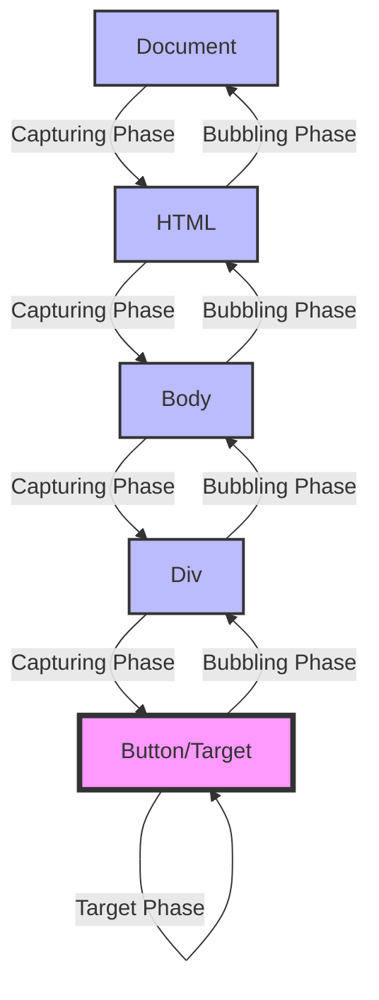
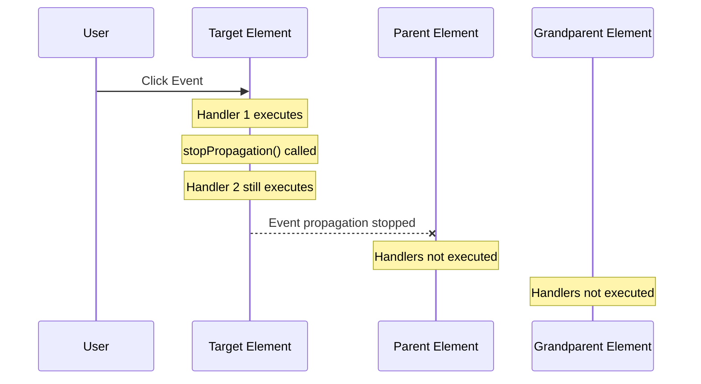
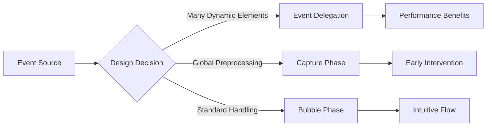

# Event Bubbling/Capturing

Webアプリケーションにおけるイベント処理は、ユーザーインタラクションの中核を成す技術要素である。DOMツリー上でイベントがどのように伝播し、各要素がどのようにイベントを受け取るかを理解することは、効率的で予測可能なイベントハンドリングシステムを構築する上で不可欠である。DOM Level 2 Events仕様[^1]で標準化されたイベント伝播モデルは、キャプチャリングとバブリングという2つのフェーズを通じて、イベントがDOMツリーを巡回する仕組みを定義している。

[^1]: W3C DOM Level 2 Events Specification: https://www.w3.org/TR/DOM-Level-2-Events/

## イベント伝播の基本概念

イベント伝播は、あるDOM要素で発生したイベントが、その要素だけでなく、DOMツリー内の他の要素にも通知される仕組みである。この伝播メカニズムは、イベントデリゲーションやイベントの集中管理といった高度なパターンを可能にし、メモリ効率の良いイベントハンドリングを実現する基盤となっている。

DOM Level 2 Events仕様では、イベントの伝播は3つのフェーズで構成される。まず、ドキュメントのルートから開始してターゲット要素に向かって下降するキャプチャリングフェーズ、次にターゲット要素自体でイベントが処理されるターゲットフェーズ、そして最後にターゲット要素からドキュメントのルートに向かって上昇するバブリングフェーズである。この3フェーズモデルにより、イベントハンドラーは任意のタイミングでイベントを捕捉し、処理することが可能となる。



歴史的には、NetscapeとMicrosoftが異なるイベントモデルを実装していた。Netscapeはイベントキャプチャリングを採用し、イベントは外側から内側へと伝播した。一方、MicrosoftのInternet Explorerはイベントバブリングを採用し、イベントは内側から外側へと伝播した。W3Cはこの両方のアプローチを統合し、現在の標準モデルを確立した。

## キャプチャリングフェーズの詳細

キャプチャリングフェーズは、イベントがドキュメントのルートからターゲット要素に向かって下降する過程である。このフェーズでは、イベントはDOMツリーの各祖先要素を順番に通過し、各要素に登録されたキャプチャリングリスナーが実行される機会を得る。

キャプチャリングフェーズの重要な特徴は、イベントがターゲット要素に到達する前に、親要素でイベントを捕捉できることである。これにより、特定の条件下でイベントの伝播を早期に停止したり、イベントの前処理を行ったりすることが可能となる。例えば、フォーム全体のバリデーションロジックをフォーム要素のキャプチャリングリスナーに実装することで、個々の入力フィールドに到達する前にイベントを処理できる。

```javascript
// Capturing phase listener example
element.addEventListener('click', function(event) {
    console.log('Capturing phase:', event.currentTarget);
}, true); // third parameter 'true' enables capturing
```

addEventListener メソッドの第3引数に true を指定することで、キャプチャリングフェーズでのイベントリスナー登録が可能となる。この引数は options オブジェクトとしても指定でき、より詳細な制御が可能である[^2]。

[^2]: EventTarget.addEventListener() - MDN Web Docs: https://developer.mozilla.org/en-US/docs/Web/API/EventTarget/addEventListener

## バブリングフェーズの詳細

バブリングフェーズは、イベントがターゲット要素から開始してドキュメントのルートに向かって上昇する過程である。多くのWebアプリケーションでは、バブリングフェーズでのイベント処理が主流となっている。これは、歴史的な理由と、直感的なイベント処理フローによるものである。

バブリングの概念は、物理的な泡が水中から表面に向かって上昇する様子に似ている。イベントは最も深い要素（ターゲット）から開始し、その親要素、さらにその親要素へと順番に伝播していく。各要素で登録されたバブリングリスナーは、イベントが通過する際に実行される。

```javascript
// Bubbling phase listener example (default behavior)
element.addEventListener('click', function(event) {
    console.log('Bubbling phase:', event.currentTarget);
}); // no third parameter or false enables bubbling
```

重要な点として、すべてのイベントがバブリングするわけではない。focus、blur、load、unload などの一部のイベントは、その性質上バブリングしない。これらのイベントは、ターゲット要素でのみ処理される。Event インターフェースの bubbles プロパティを確認することで、特定のイベントがバブリングするかどうかを判断できる。

## イベント伝播の制御メカニズム

イベント伝播を制御するための主要なメソッドとして、stopPropagation() と stopImmediatePropagation() がある。これらのメソッドは、イベントの伝播を異なるレベルで制御する。

stopPropagation() メソッドは、現在のイベントがキャプチャリングおよびバブリングフェーズで、これ以上伝播することを防ぐ。しかし、同じ要素に登録された他のイベントリスナーは引き続き実行される。一方、stopImmediatePropagation() メソッドは、イベントの伝播を停止するだけでなく、同じ要素の他のイベントリスナーの実行も防ぐ。



preventDefault() メソッドは、イベント伝播とは異なる概念である。このメソッドは、イベントのデフォルトアクション（リンクのナビゲーション、フォームの送信など）をキャンセルするが、イベントの伝播自体には影響を与えない。イベント伝播の制御とデフォルトアクションの制御は独立しており、それぞれ異なる目的で使用される。

## 実装の詳細と性能特性

イベント伝播システムの実装において、ブラウザエンジンは効率的なイベントディスパッチングのために様々な最適化を行っている。イベントパスの事前計算、イベントリスナーのキャッシング、そして条件付き伝播の最適化などが含まれる。

イベントデリゲーションは、イベント伝播を活用した重要なパターンである。多数の子要素に個別にイベントリスナーを登録する代わりに、親要素に単一のリスナーを登録し、event.target を使用して実際のターゲット要素を特定する。このアプローチは、特に動的に生成される要素を扱う場合に、メモリ使用量とパフォーマンスの両面で優れている。

```javascript
// Event delegation pattern
document.getElementById('parent-container').addEventListener('click', function(event) {
    // Check if the clicked element matches our selector
    if (event.target.matches('.child-button')) {
        // Handle the click on child button
        console.log('Child button clicked:', event.target);
    }
});
```

性能面では、イベントリスナーの数と配置が重要な要因となる。深いDOMツリーでは、イベントの伝播にかかる時間が増加する可能性がある。特に、各レベルで複雑な処理を行うリスナーが登録されている場合、累積的なパフォーマンスへの影響が懸念される。

PassiveEventListeners[^3]の導入により、スクロールやタッチイベントのパフォーマンスが大幅に改善された。passive オプションを true に設定することで、リスナーが preventDefault() を呼び出さないことをブラウザに通知し、スクロールの最適化を可能にする。

[^3]: Passive event listeners - Chrome Developers: https://developer.chrome.com/docs/lighthouse/best-practices/uses-passive-event-listeners/

## 実践的な設計指針とトレードオフ

イベント処理システムを設計する際、キャプチャリングとバブリングの選択は、アプリケーションの要件と構造に依存する。一般的に、バブリングはより直感的で、多くのユースケースに適している。しかし、特定のシナリオでは、キャプチャリングが必要となる。

グローバルなイベント処理や、子要素のイベントを親要素で前処理する必要がある場合、キャプチャリングフェーズの活用が有効である。例えば、アプリケーション全体のキーボードショートカット処理や、特定の領域内でのマウスイベントの統一的な処理などが該当する。

イベント伝播の制御に関しては、慎重な設計が必要である。stopPropagation() の過度な使用は、他のコンポーネントの期待する動作を妨げる可能性がある。特に、サードパーティライブラリやフレームワークとの統合において、イベント伝播の予期しない停止は問題を引き起こす可能性がある。



モダンなフレームワークやライブラリは、独自のイベントシステムを実装することが多い。React の SyntheticEvent[^4]、Vue のイベント修飾子[^5]などは、ネイティブのイベント伝播モデルを抽象化し、より予測可能で管理しやすいイベント処理を提供している。これらのシステムを使用する際も、基礎となるDOM イベント伝播の理解は重要である。

[^4]: SyntheticEvent - React: https://reactjs.org/docs/events.html
[^5]: Event Handling - Vue.js: https://vuejs.org/guide/essentials/event-handling.html

イベント伝播のデバッグには、Event インターフェースのプロパティが有用である。eventPhase プロパティは現在のフェーズを示し（1: キャプチャリング、2: ターゲット、3: バブリング）、currentTarget と target の違いを理解することで、イベントの流れを追跡できる。開発者ツールのイベントリスナーブレークポイントも、複雑なイベントフローの理解に役立つ。

最後に、アクセシビリティの観点から、イベント処理はキーボードナビゲーションとスクリーンリーダーの適切な動作を保証する必要がある。マウスイベントだけでなく、対応するキーボードイベントの実装、そして適切なARIA属性の使用により、すべてのユーザーにとって使いやすいインターフェースを構築することが重要である。