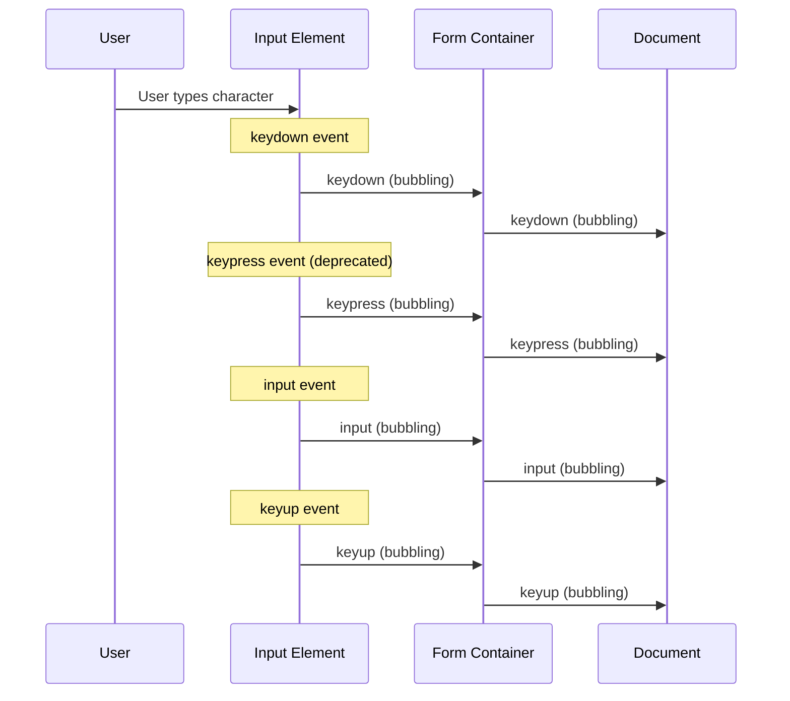

# Event Bubbling/Capturing

Webアプリケーションにおけるイベント処理は、ユーザーインタラクションの中核を成す技術要素である。DOMツリー上でイベントがどのように伝播し、各要素がどのようにイベントを受け取るかを理解することは、効率的で予測可能なイベントハンドリングシステムを構築する上で不可欠である。DOM Level 2 Events仕様[^1]で標準化されたイベント伝播モデルは、キャプチャリングとバブリングという2つのフェーズを通じて、イベントがDOMツリーを巡回する仕組みを定義している。このモデルは、単純なクリックハンドラーから複雑なイベントデリゲーションパターンまで、現代のWeb開発における様々な技術の基盤となっている。

[^1]: W3C DOM Level 2 Events Specification: https://www.w3.org/TR/DOM-Level-2-Events/

## イベント伝播モデルの歴史的背景と理論的基礎

イベント伝播の概念を完全に理解するためには、その歴史的な発展過程を振り返る必要がある。1990年代後半、NetscapeとMicrosoftは、それぞれ異なるイベントモデルを実装していた。Netscape Navigator 4はイベントキャプチャリングモデルを採用し、イベントは最も外側の要素（window）から開始して、ターゲット要素に向かって内側へと伝播した。一方、Internet Explorerはイベントバブリングモデルを実装し、イベントはターゲット要素から開始して、外側の要素へと伝播した。

この2つのモデルは、それぞれ異なる哲学に基づいていた。Netscapeのキャプチャリングモデルは、親要素が子要素のイベントを「捕獲」し、必要に応じて処理または阻止できるという考えに基づいていた。これは、親要素が子要素の動作を制御する階層的なアプローチである。対照的に、Microsoftのバブリングモデルは、イベントが発生した要素から自然に「泡のように」上昇するという、より直感的なメタファーに基づいていた。

W3Cは、これらの競合するモデルを統合する必要に直面し、DOM Level 2 Events仕様において、両方のアプローチを組み合わせた包括的なモデルを定義した。この統合モデルでは、イベントは3つの明確なフェーズを経て伝播する：キャプチャリングフェーズ、ターゲットフェーズ、そしてバブリングフェーズである。

```mermaid
graph TD
    subgraph "Event Flow Phases"
        A[Window] -->|1. Capture Phase| B[Document]
        B -->|2. Capture Phase| C[HTML]
        C -->|3. Capture Phase| D[Body]
        D -->|4. Capture Phase| E[Div Container]
        E -->|5. Capture Phase| F[Button Target]
        F -->|6. Target Phase| F
        F -->|7. Bubble Phase| E
        E -->|8. Bubble Phase| D
        D -->|9. Bubble Phase| C
        C -->|10. Bubble Phase| B
        B -->|11. Bubble Phase| A
    end
    
    style F fill:#ff6b6b,stroke:#c92a2a,stroke-width:3px
    style A fill:#74c0fc,stroke:#339af0,stroke-width:2px
    style B fill:#74c0fc,stroke:#339af0,stroke-width:2px
    style C fill:#74c0fc,stroke:#339af0,stroke-width:2px
    style D fill:#74c0fc,stroke:#339af0,stroke-width:2px
    style E fill:#74c0fc,stroke:#339af0,stroke-width:2px
```



## イベントオブジェクトの詳細構造と仕様

DOM Events仕様において、イベントはEventインターフェースのインスタンスとして表現される。このインターフェースは、イベントの性質と状態に関する豊富な情報を提供する。イベントオブジェクトの主要なプロパティとその意味を理解することは、効果的なイベント処理の基礎となる。

```javascript
interface Event {
    readonly attribute DOMString type;
    readonly attribute EventTarget? target;
    readonly attribute EventTarget? currentTarget;
    readonly attribute unsigned short eventPhase;
    readonly attribute boolean bubbles;
    readonly attribute boolean cancelable;
    readonly attribute DOMHighResTimeStamp timeStamp;
    readonly attribute boolean defaultPrevented;
    readonly attribute boolean composed;
    readonly attribute boolean isTrusted;
    
    void stopPropagation();
    void stopImmediatePropagation();
    void preventDefault();
}
```

typeプロパティは、イベントの種類を識別する文字列である。targetプロパティは、イベントが最初に発生した要素への参照を保持し、currentTargetは現在イベントハンドラーが実行されている要素を示す。この2つの違いは、イベント伝播を理解する上で極めて重要である。

eventPhaseプロパティは、現在のイベント伝播フェーズを示す数値である。仕様では、以下の定数が定義されている：

- Event.NONE (0): イベントが初期化されていない
- Event.CAPTURING_PHASE (1): キャプチャリングフェーズ
- Event.AT_TARGET (2): ターゲットフェーズ
- Event.BUBBLING_PHASE (3): バブリングフェーズ

bubblesプロパティは、そのイベントタイプがバブリングをサポートするかどうかを示すブール値である。すべてのイベントがバブリングするわけではなく、focus、blur、load、error、scroll（要素によって異なる）などのイベントは、その性質上バブリングしない。

## キャプチャリングフェーズの実装詳細

キャプチャリングフェーズは、イベントがDOMツリーの最上位から開始し、ターゲット要素に向かって下降する過程である。このフェーズの実装には、いくつかの重要な技術的側面がある。

まず、イベントパスの構築について考える必要がある。ブラウザエンジンは、ターゲット要素からルート要素（通常はwindow）までの全ての祖先要素を含むイベントパスを構築する。このパスは、Shadow DOMの存在やイベントのcomposedプロパティによって影響を受ける可能性がある。

```javascript
// Detailed capturing phase implementation example
class EventCapturingManager {
    constructor() {
        this.captureHandlers = new WeakMap();
    }
    
    registerCaptureHandler(element, eventType, handler, options = {}) {
        const actualOptions = typeof options === 'boolean' 
            ? { capture: options } 
            : options;
            
        if (!actualOptions.capture) {
            throw new Error('This manager only handles capture phase listeners');
        }
        
        const wrappedHandler = (event) => {
            // Log event phase for debugging
            console.log(`Capture phase - Element: ${element.tagName}, Phase: ${event.eventPhase}`);
            
            // Execute the actual handler
            const result = handler.call(element, event);
            
            // Track propagation state
            if (event.cancelBubble) {
                console.log('Event propagation stopped during capture');
            }
            
            return result;
        };
        
        element.addEventListener(eventType, wrappedHandler, actualOptions);
        
        // Store reference for potential removal
        if (!this.captureHandlers.has(element)) {
            this.captureHandlers.set(element, new Map());
        }
        this.captureHandlers.get(element).set(handler, wrappedHandler);
    }
}
```

キャプチャリングフェーズの重要な使用例として、グローバルなイベント管理がある。例えば、アプリケーション全体でのキーボードショートカットの実装や、特定の領域外でのクリックを検出するための「クリックアウェイ」パターンなどがある。

```javascript
// Global keyboard shortcut manager using capture phase
class ShortcutManager {
    constructor() {
        this.shortcuts = new Map();
        this.initializeCapture();
    }
    
    initializeCapture() {
        // Register at the document level to catch all keyboard events early
        document.addEventListener('keydown', (event) => {
            const key = this.normalizeKey(event);
            const handler = this.shortcuts.get(key);
            
            if (handler) {
                // Prevent the event from reaching focused elements
                event.preventDefault();
                event.stopPropagation();
                handler(event);
            }
        }, true); // Use capture phase
    }
    
    normalizeKey(event) {
        const modifiers = [];
        if (event.ctrlKey) modifiers.push('ctrl');
        if (event.altKey) modifiers.push('alt');
        if (event.shiftKey) modifiers.push('shift');
        if (event.metaKey) modifiers.push('meta');
        
        const key = event.key.toLowerCase();
        return [...modifiers, key].join('+');
    }
    
    register(shortcut, handler) {
        this.shortcuts.set(shortcut.toLowerCase(), handler);
    }
}
```

## バブリングフェーズの詳細実装とパフォーマンス最適化

バブリングフェーズは、イベントがターゲット要素から開始し、DOMツリーを上昇してルート要素に到達する過程である。このフェーズは、最も一般的に使用されるイベント処理メカニズムであり、多くの実用的なパターンの基礎となっている。

バブリングメカニズムの実装において、ブラウザエンジンは効率的なイベントディスパッチングのために様々な最適化を行っている。その一つが、イベントリスナーのリストの事前計算とキャッシングである。

```javascript
// Event delegation pattern with performance optimization
class OptimizedEventDelegator {
    constructor(rootElement) {
        this.root = rootElement;
        this.handlers = new Map();
        this.cache = new WeakMap();
        
        // Single listener for all delegated events
        this.root.addEventListener('click', this.handleEvent.bind(this));
    }
    
    delegate(selector, handler) {
        if (!this.handlers.has(selector)) {
            this.handlers.set(selector, []);
        }
        this.handlers.get(selector).push(handler);
        
        // Invalidate cache when handlers change
        this.cache = new WeakMap();
    }
    
    handleEvent(event) {
        const path = event.composedPath();
        
        // Check cache first
        let matchedHandlers = this.cache.get(event.target);
        
        if (!matchedHandlers) {
            matchedHandlers = this.findMatchingHandlers(path);
            this.cache.set(event.target, matchedHandlers);
        }
        
        // Execute handlers in order
        for (const { element, handlers } of matchedHandlers) {
            for (const handler of handlers) {
                handler.call(element, event);
                
                if (event.cancelBubble) {
                    return; // Stop if propagation was stopped
                }
            }
        }
    }
    
    findMatchingHandlers(path) {
        const matched = [];
        
        for (const element of path) {
            if (element === this.root) {
                break; // Don't go beyond the delegation root
            }
            
            for (const [selector, handlers] of this.handlers) {
                if (element.matches && element.matches(selector)) {
                    matched.push({ element, handlers });
                }
            }
        }
        
        return matched;
    }
}
```

バブリングフェーズの重要な特性として、イベントの合成（Event Composition）がある。一つのユーザーアクションが複数の関連イベントを生成する場合、これらのイベントは特定の順序でバブリングする。



## イベント伝播の制御とベストプラクティス

イベント伝播の制御は、複雑なアプリケーションにおいて重要な設計上の決定となる。stopPropagation()、stopImmediatePropagation()、preventDefault()の各メソッドは、それぞれ異なる目的を持ち、適切に使用する必要がある。

stopPropagation()メソッドは、現在のイベントがこれ以上伝播することを防ぐが、同じ要素に登録された他のハンドラーは実行される。これは、特定のコンポーネントがイベントを「消費」し、親要素での処理を防ぎたい場合に使用される。

```javascript
// Proper use of event propagation control
class ModalDialog {
    constructor(modalElement) {
        this.modal = modalElement;
        this.backdrop = modalElement.querySelector('.modal-backdrop');
        this.content = modalElement.querySelector('.modal-content');
        
        this.initializeEventHandlers();
    }
    
    initializeEventHandlers() {
        // Backdrop click should close modal
        this.backdrop.addEventListener('click', (event) => {
            this.close();
        });
        
        // Content click should not close modal
        this.content.addEventListener('click', (event) => {
            // Prevent the click from reaching the backdrop
            event.stopPropagation();
        });
        
        // ESC key handling with capture to ensure it's caught early
        document.addEventListener('keydown', (event) => {
            if (event.key === 'Escape' && this.isOpen()) {
                event.preventDefault(); // Prevent default ESC behavior
                event.stopPropagation(); // Stop other handlers
                this.close();
            }
        }, true);
    }
    
    isOpen() {
        return this.modal.classList.contains('open');
    }
    
    close() {
        this.modal.classList.remove('open');
        this.dispatchCustomEvent('modal:closed');
    }
    
    dispatchCustomEvent(eventName) {
        // Custom events bubble by default
        const event = new CustomEvent(eventName, {
            bubbles: true,
            cancelable: true,
            detail: { modal: this }
        });
        this.modal.dispatchEvent(event);
    }
}
```

stopImmediatePropagation()は、より強力な制御を提供し、同じ要素の後続のハンドラーの実行も防ぐ。これは、イベントハンドラーの優先順位を実装する際に有用である。

```javascript
// Priority-based event handling system
class PriorityEventManager {
    constructor() {
        this.handlers = new Map();
    }
    
    addHandler(element, event, handler, priority = 0) {
        const key = `${element.id || 'element'}-${event}`;
        
        if (!this.handlers.has(key)) {
            this.handlers.set(key, []);
            this.setupPriorityListener(element, event, key);
        }
        
        const handlers = this.handlers.get(key);
        handlers.push({ handler, priority });
        handlers.sort((a, b) => b.priority - a.priority);
    }
    
    setupPriorityListener(element, event, key) {
        element.addEventListener(event, (e) => {
            const handlers = this.handlers.get(key);
            
            for (const { handler, priority } of handlers) {
                const result = handler(e);
                
                // If handler returns false, stop processing lower priority handlers
                if (result === false) {
                    e.stopImmediatePropagation();
                    break;
                }
            }
        });
    }
}
```

## Shadow DOMとイベント伝播

Web Componentsの重要な機能であるShadow DOMは、イベント伝播に特別な考慮を必要とする。Shadow DOMは、カプセル化の境界を作成し、イベントがこの境界を越える際の振る舞いを制御する。

Shadow DOMにおけるイベント伝播は、イベントのcomposedプロパティによって制御される。composedがtrueのイベントは、Shadow DOM境界を越えて伝播するが、その際にtargetプロパティが調整される（Event Retargeting）。

```javascript
// Shadow DOM event handling example
class CustomElement extends HTMLElement {
    constructor() {
        super();
        this.attachShadow({ mode: 'open' });
        this.setupShadowDOM();
    }
    
    setupShadowDOM() {
        this.shadowRoot.innerHTML = `
            <style>
                :host {
                    display: block;
                    padding: 20px;
                    border: 1px solid #ccc;
                }
                button {
                    padding: 10px;
                    margin: 5px;
                }
            </style>
            <div class="container">
                <button class="internal-button">Shadow Button</button>
                <slot></slot>
            </div>
        `;
        
        // Internal event handling
        this.shadowRoot.querySelector('.internal-button').addEventListener('click', (event) => {
            console.log('Shadow DOM click:', event.target); // The button element
            
            // Dispatch a custom composed event
            this.dispatchEvent(new CustomEvent('shadow-click', {
                bubbles: true,
                composed: true, // Will cross shadow boundary
                detail: { originalTarget: event.target }
            }));
        });
    }
    
    connectedCallback() {
        // Monitor events at the host element level
        this.addEventListener('click', (event) => {
            console.log('Host element click:', event.target); // Retargeted to host element
            console.log('Event composed:', event.composed);
            console.log('Event path:', event.composedPath());
        });
    }
}

customElements.define('custom-element', CustomElement);
```

## パフォーマンス最適化とメモリ管理

大規模なWebアプリケーションにおいて、イベントハンドラーの管理は重要なパフォーマンス要因となる。不適切なイベントハンドラーの登録と削除は、メモリリークの原因となり、アプリケーションのパフォーマンスを著しく低下させる可能性がある。

```javascript
// Advanced event handler management with automatic cleanup
class EventHandlerManager {
    constructor() {
        this.handlers = new WeakMap();
        this.observer = new MutationObserver(this.handleMutations.bind(this));
        this.observer.observe(document.body, {
            childList: true,
            subtree: true
        });
    }
    
    register(element, event, handler, options = {}) {
        if (!this.handlers.has(element)) {
            this.handlers.set(element, new Map());
        }
        
        const elementHandlers = this.handlers.get(element);
        const key = `${event}-${options.capture || false}`;
        
        if (!elementHandlers.has(key)) {
            elementHandlers.set(key, new Set());
        }
        
        elementHandlers.get(key).add(handler);
        element.addEventListener(event, handler, options);
        
        // Return cleanup function
        return () => this.unregister(element, event, handler, options);
    }
    
    unregister(element, event, handler, options = {}) {
        const elementHandlers = this.handlers.get(element);
        if (!elementHandlers) return;
        
        const key = `${event}-${options.capture || false}`;
        const handlers = elementHandlers.get(key);
        
        if (handlers) {
            handlers.delete(handler);
            element.removeEventListener(event, handler, options);
            
            if (handlers.size === 0) {
                elementHandlers.delete(key);
            }
        }
        
        if (elementHandlers.size === 0) {
            this.handlers.delete(element);
        }
    }
    
    handleMutations(mutations) {
        for (const mutation of mutations) {
            for (const node of mutation.removedNodes) {
                if (node.nodeType === Node.ELEMENT_NODE) {
                    this.cleanupElement(node);
                }
            }
        }
    }
    
    cleanupElement(element) {
        // Recursively cleanup handlers for removed elements
        const elementHandlers = this.handlers.get(element);
        if (elementHandlers) {
            for (const [key, handlers] of elementHandlers) {
                const [event, capture] = key.split('-');
                for (const handler of handlers) {
                    element.removeEventListener(event, handler, { capture: capture === 'true' });
                }
            }
            this.handlers.delete(element);
        }
        
        // Cleanup child elements
        element.querySelectorAll('*').forEach(child => {
            this.cleanupElement(child);
        });
    }
}
```

Passive Event Listenersは、スクロールとタッチイベントのパフォーマンスを大幅に改善する重要な最適化技術である[^2]。passiveオプションを使用することで、ブラウザはイベントハンドラーがpreventDefault()を呼び出さないことを事前に知ることができ、スクロール処理を別スレッドで実行できる。

[^2]: Passive event listeners - Chrome Platform Status: https://www.chromestatus.com/feature/5745543795965952

```javascript
// Optimized scroll handling with passive listeners
class ScrollPerformanceOptimizer {
    constructor(container) {
        this.container = container;
        this.rafId = null;
        this.lastScrollY = 0;
        
        this.initializeScrollHandling();
    }
    
    initializeScrollHandling() {
        // Passive listener for scroll events
        this.container.addEventListener('scroll', this.handleScroll.bind(this), {
            passive: true, // Critical for performance
            capture: false
        });
        
        // Touch events should also be passive when possible
        this.container.addEventListener('touchstart', this.handleTouchStart.bind(this), {
            passive: true
        });
        
        // Wheel events can benefit from passive listeners
        this.container.addEventListener('wheel', this.handleWheel.bind(this), {
            passive: true
        });
    }
    
    handleScroll(event) {
        // Cancel previous animation frame
        if (this.rafId) {
            cancelAnimationFrame(this.rafId);
        }
        
        // Throttle scroll handling using requestAnimationFrame
        this.rafId = requestAnimationFrame(() => {
            const currentScrollY = this.container.scrollTop;
            const scrollDelta = currentScrollY - this.lastScrollY;
            
            // Perform scroll-dependent operations
            this.updateScrollDependentElements(currentScrollY, scrollDelta);
            
            this.lastScrollY = currentScrollY;
        });
    }
    
    updateScrollDependentElements(scrollY, delta) {
        // Update UI elements based on scroll position
        // This runs at most once per frame
    }
}
```

## 現代的なフレームワークとの統合

ReactやVueなどの現代的なフレームワークは、独自のイベントシステムを実装しているが、これらは依然としてネイティブのDOM イベント伝播モデルの上に構築されている。これらのフレームワークがどのようにイベント伝播を扱うかを理解することは、効率的なアプリケーション開発において重要である。

Reactの合成イベントシステム（SyntheticEvent）は、ブラウザ間の互換性を提供しながら、パフォーマンスの最適化も行っている[^3]。React 17以降、イベントハンドラーはドキュメントレベルではなく、ルート要素にアタッチされるようになった。

[^3]: SyntheticEvent - React Documentation: https://react.dev/reference/react-dom/components/common#react-event-object

```javascript
// React event system internals simulation
class SimplifiedReactEventSystem {
    constructor(rootElement) {
        this.root = rootElement;
        this.eventHandlers = new Map();
        
        // React attaches listeners at the root level
        this.attachRootListeners();
    }
    
    attachRootListeners() {
        // Common events that React handles
        const events = ['click', 'input', 'change', 'focus', 'blur'];
        
        events.forEach(eventType => {
            // React uses capture phase for some events
            const useCapture = ['focus', 'blur'].includes(eventType);
            
            this.root.addEventListener(eventType, (nativeEvent) => {
                this.dispatchEvent(nativeEvent, eventType);
            }, useCapture);
        });
    }
    
    dispatchEvent(nativeEvent, eventType) {
        // Find React component instances in the event path
        const path = nativeEvent.composedPath();
        const syntheticEvent = this.createSyntheticEvent(nativeEvent);
        
        // Simulate React's event dispatching
        for (const element of path) {
            const handler = this.eventHandlers.get(`${element.id}-${eventType}`);
            if (handler) {
                handler(syntheticEvent);
                
                if (syntheticEvent.isPropagationStopped()) {
                    break;
                }
            }
        }
    }
    
    createSyntheticEvent(nativeEvent) {
        // Simplified synthetic event creation
        return {
            nativeEvent,
            type: nativeEvent.type,
            target: nativeEvent.target,
            currentTarget: null, // Set during dispatch
            isPropagationStopped: () => nativeEvent.cancelBubble,
            stopPropagation: () => nativeEvent.stopPropagation(),
            preventDefault: () => nativeEvent.preventDefault()
        };
    }
}
```

イベント伝播の理解は、Webアプリケーション開発における基礎的かつ重要な知識である。キャプチャリングとバブリングの2つのフェーズ、イベントオブジェクトの詳細な構造、伝播制御のメカニズム、そして現代的な最適化技術を理解することで、より効率的で保守性の高いイベント処理システムを構築できる。Shadow DOMやフレームワーク固有の実装など、新しい技術においても、これらの基本原理は変わらず適用される。適切なイベント処理戦略の選択は、アプリケーションのパフォーマンス、保守性、そしてユーザー体験の質に直接的な影響を与える重要な設計判断である。