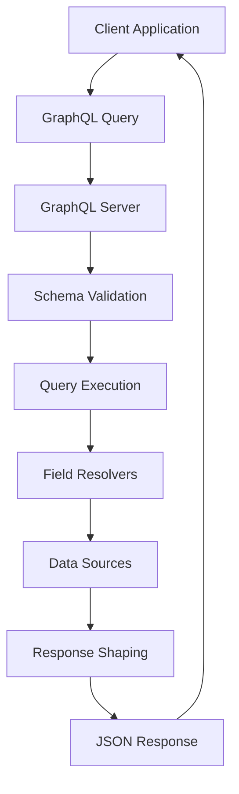
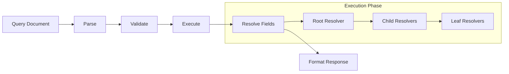
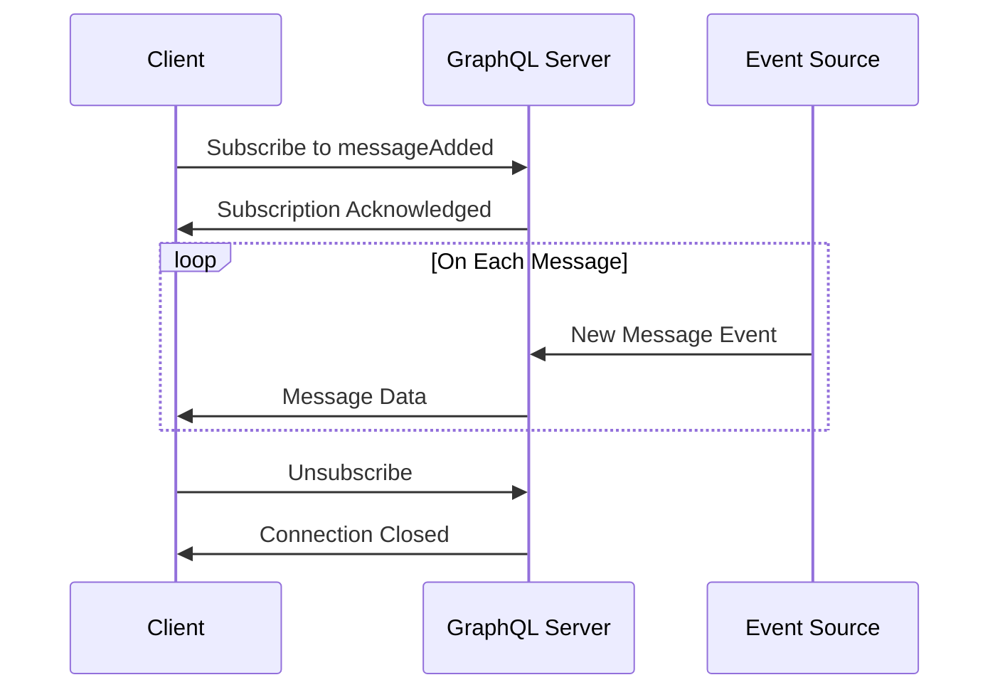
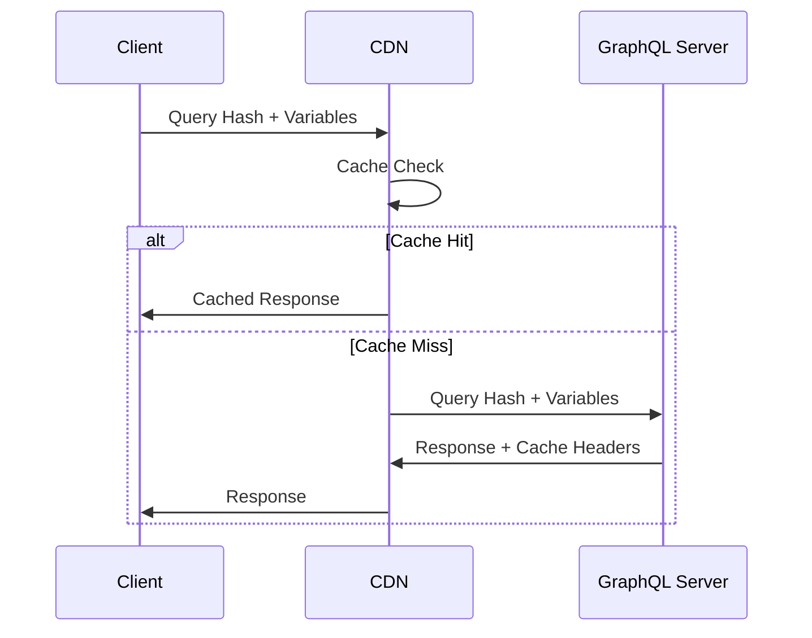
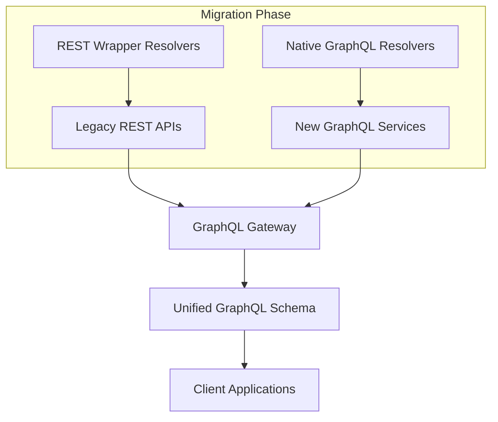

# GraphQL

GraphQLは2015年にFacebookによって公開されたクエリ言語および実行エンジンであり、クライアントが必要とするデータの構造を正確に指定できることを最大の特徴とする。従来のREST APIが抱えていたオーバーフェッチングやアンダーフェッチングの問題に対する解決策として設計され、モバイルアプリケーションの普及に伴う通信効率の最適化という実践的な要求から生まれた技術である[^1]。

GraphQLの本質は、データの取得と操作を宣言的に記述するための型付きクエリ言語であることにある。クライアントは必要なデータの形状を正確に指定し、サーバーはその要求に対して過不足なくデータを返却する。この設計思想は、従来のRPCスタイルやRESTfulアーキテクチャとは根本的に異なるアプローチを採用している。RESTがリソース指向でURLとHTTPメソッドの組み合わせによってAPIを構成するのに対し、GraphQLは単一のエンドポイントを通じて、クエリ言語によってデータの要求を表現する。



## 型システムとスキーマ定義

GraphQLの中核をなすのは、その強力な型システムである。スキーマ定義言語（SDL: Schema Definition Language）によって、APIで利用可能なすべての型、フィールド、操作が明示的に定義される。この型システムは、クライアントとサーバー間の契約として機能し、開発時の型安全性と実行時の検証を両立させる。

スキーマは、オブジェクト型、スカラー型、列挙型、インターフェース、ユニオン型などの型定義から構成される。特に重要なのは、QueryとMutationという特殊なルート型である。Queryは読み取り専用の操作を定義し、Mutationは副作用を伴う操作を定義する。この明確な分離により、操作の意図が明示的になり、キャッシュ戦略の最適化も可能になる。

```graphql
type User {
  id: ID!
  name: String!
  email: String!
  posts: [Post!]!
}

type Post {
  id: ID!
  title: String!
  content: String!
  author: User!
  comments: [Comment!]!
}

type Query {
  user(id: ID!): User
  users(limit: Int = 10): [User!]!
}

type Mutation {
  createUser(input: CreateUserInput!): User!
  updatePost(id: ID!, input: UpdatePostInput!): Post!
}
```

この型定義は、GraphQLの表現力の高さを示している。フィールドの必須性（!記号）、リスト型（[]記号）、デフォルト値の指定など、APIの仕様を厳密に定義できる。さらに、型システムはイントロスペクション機能を提供し、クライアントは実行時にスキーマの情報を取得できる。これにより、GraphiQLやApollo Studio Explorerといった開発ツールが、自動補完やドキュメント生成を実現している。

## クエリ言語の設計と実行メカニズム

GraphQLクエリは、要求するデータの形状を階層的に表現する。この階層構造は、レスポンスのJSONと同じ形状を持つことが保証される。クエリの各フィールドは、対応するリゾルバ関数によって解決される。リゾルバは、フィールドの値を計算または取得する責任を持つ純粋関数として実装される。



実行プロセスは、パース、検証、実行の3つのフェーズから構成される。パースフェーズでは、クエリ文字列が抽象構文木（AST）に変換される。検証フェーズでは、クエリがスキーマに対して妥当であることを確認する。実行フェーズでは、リゾルバが再帰的に呼び出され、要求されたデータが収集される。

リゾルバの実装において重要なのは、各リゾルバが独立して動作することである。親オブジェクト、引数、コンテキスト、フィールド情報の4つのパラメータを受け取り、フィールドの値またはPromiseを返す。この設計により、データの取得ロジックを柔軟に実装でき、複数のデータソースを統合することも容易になる。

```javascript
const resolvers = {
  Query: {
    user: async (parent, { id }, context, info) => {
      return await context.dataSources.userAPI.getUser(id);
    }
  },
  User: {
    posts: async (parent, args, context, info) => {
      return await context.dataSources.postAPI.getPostsByUserId(parent.id);
    }
  }
};
```

## N+1問題とDataLoaderパターン

GraphQLの階層的なデータ取得は、N+1クエリ問題を引き起こしやすい。例えば、10人のユーザーとそれぞれの投稿を取得する場合、素朴な実装では1回のユーザー取得クエリと10回の投稿取得クエリが発生する。この問題は、GraphQLの実用上最も重要な課題の一つである。

DataLoaderパターンは、この問題に対する標準的な解決策である[^2]。バッチング（複数のリクエストを一つにまとめる）とキャッシング（同一リクエストの重複排除）により、データベースへのアクセスを最適化する。DataLoaderは、Node.jsのイベントループを活用し、同一ティック内で発生したリクエストを自動的にバッチ化する。

```javascript
const userLoader = new DataLoader(async (userIds) => {
  const users = await db.query('SELECT * FROM users WHERE id = ANY($1)', [userIds]);
  const userMap = users.reduce((map, user) => {
    map[user.id] = user;
    return map;
  }, {});
  return userIds.map(id => userMap[id]);
});

const resolvers = {
  Post: {
    author: async (post) => {
      return await userLoader.load(post.authorId);
    }
  }
};
```

このパターンの重要性は、単なるパフォーマンス最適化にとどまらない。DataLoaderは、GraphQLのリゾルバの独立性を保ちながら、効率的なデータ取得を実現する。各リゾルバは他のリゾルバの存在を知る必要がなく、それでいて全体として最適化されたクエリが生成される。

## サブスクリプションとリアルタイム機能

GraphQLサブスクリプションは、サーバーからクライアントへのプッシュ型通信を実現する仕組みである。QueryやMutationが要求-応答型の通信パターンであるのに対し、Subscriptionは長時間接続を維持し、イベントドリブンな通信を可能にする。実装には通常WebSocketが使用されるが、Server-Sent EventsやHTTP/2のサーバープッシュも利用可能である。

```graphql
type Subscription {
  messageAdded(channelId: ID!): Message!
  userStatusChanged(userId: ID!): UserStatus!
}
```

サブスクリプションの実装は、パブリッシュ/サブスクライブパターンに基づく。クライアントがサブスクリプションを開始すると、サーバーは該当するイベントストリームを監視し、イベントが発生するたびにクライアントに通知する。この仕組みは、チャットアプリケーション、リアルタイムダッシュボード、協調編集システムなどの実装に適している。



サブスクリプションの実装において重要なのは、スケーラビリティとメモリ管理である。多数のクライアントが同時に接続する環境では、Redis PubSubやKafkaなどの外部メッセージングシステムと統合することで、水平スケーリングを実現する。また、接続の異常終了やメモリリークを防ぐため、適切なタイムアウトとクリーンアップ処理が必要である。

## フラグメントとクエリの再利用性

GraphQLのフラグメント機能は、クエリの再利用性とメンテナンス性を向上させる重要な機能である。フラグメントは、複数のクエリで共通して使用されるフィールドセットを定義し、DRY原則（Don't Repeat Yourself）を実現する。特に大規模なアプリケーションでは、コンポーネント単位でフラグメントを定義することで、データ要求の管理を効率化できる。

```graphql
fragment UserBasicInfo on User {
  id
  name
  email
  avatarUrl
}

fragment PostDetails on Post {
  id
  title
  content
  createdAt
  author {
    ...UserBasicInfo
  }
}

query GetUserWithPosts($userId: ID!) {
  user(id: $userId) {
    ...UserBasicInfo
    posts {
      ...PostDetails
    }
  }
}
```

フラグメントの利用は、クライアントサイドのコンポーネント設計と密接に関連する。Relay Modernのようなフレームワークでは、各コンポーネントが必要とするデータをフラグメントとして宣言し、それらを自動的に合成してクエリを生成する。この手法により、コンポーネントのデータ依存性が明確になり、過不足のないデータ取得が保証される。

## エラーハンドリングと部分的成功

GraphQLの特徴的な設計の一つに、部分的成功（Partial Success）の概念がある。REST APIでは通常、リクエスト全体が成功するか失敗するかの二択であるが、GraphQLでは一部のフィールドでエラーが発生しても、他のフィールドのデータは正常に返される。この設計は、複雑なクエリにおいて特に有用である。

```json
{
  "data": {
    "user": {
      "id": "123",
      "name": "John Doe",
      "posts": null
    }
  },
  "errors": [
    {
      "message": "Failed to fetch posts",
      "path": ["user", "posts"],
      "extensions": {
        "code": "INTERNAL_ERROR"
      }
    }
  ]
}
```

エラーハンドリングの実装では、エラーの分類と適切な情報の提供が重要である。GraphQL仕様では、エラーオブジェクトにmessage、path、locations、extensionsフィールドを含めることができる。extensionsフィールドを活用することで、エラーコード、スタックトレース（開発環境のみ）、リトライ可能性などの追加情報を提供できる。

## パフォーマンス最適化とクエリ複雑度分析

GraphQLの柔軟性は、同時に潜在的なパフォーマンスリスクをもたらす。深くネストされたクエリや、大量のデータを要求するクエリは、サーバーリソースを枯渇させる可能性がある。このため、クエリ複雑度分析（Query Complexity Analysis）が重要になる。

```javascript
const depthLimit = require('graphql-depth-limit');
const costAnalysis = require('graphql-cost-analysis');

const server = new GraphQLServer({
  typeDefs,
  resolvers,
  validationRules: [
    depthLimit(5),
    costAnalysis({
      maximumCost: 1000,
      defaultCost: 1,
      scalarCost: 1,
      objectCost: 2,
      listFactor: 10,
      introspectionCost: 1000,
    })
  ]
});
```

クエリ複雑度の計算には、深さ制限、コスト分析、タイムアウトなどの手法がある。深さ制限は単純だが効果的な方法で、クエリのネスト階層を制限する。コスト分析はより洗練されたアプローチで、各フィールドに重みを割り当て、クエリ全体のコストを計算する。これらの制限は、正当な使用を妨げない範囲で設定することが重要である。

## キャッシングとCDN統合

GraphQLのキャッシング戦略は、REST APIとは異なるアプローチを必要とする。RESTではURLベースのキャッシングが一般的だが、GraphQLでは単一エンドポイントを使用するため、クエリ内容に基づいたキャッシング戦略が必要になる。

Automatic Persisted Queries（APQ）は、この課題に対する一つの解決策である[^3]。クライアントはクエリのハッシュ値をサーバーに送信し、サーバーはハッシュ値に対応するクエリをキャッシュから取得する。これにより、ネットワーク転送量を削減し、CDNでのキャッシングも可能になる。



フィールドレベルのキャッシングも重要な最適化手法である。各フィールドにキャッシュヒントを付与し、リゾルバレベルでキャッシングを実装する。RedisやMemcachedなどのインメモリキャッシュと組み合わせることで、データベースへのアクセスを大幅に削減できる。

## セキュリティとアクセス制御

GraphQLのセキュリティは、その柔軟性ゆえに特別な注意を要する。任意の深さとの複雑さを持つクエリを許可することは、DoS攻撃のリスクを高める。また、フィールドレベルのアクセス制御が必要になることも多い。

認証と認可の実装では、コンテキストオブジェクトを活用する。リクエストごとにユーザー情報をコンテキストに含め、各リゾルバで権限チェックを行う。ディレクティブを使用することで、宣言的にアクセス制御を実装することも可能である。

```graphql
directive @auth(requires: Role = USER) on FIELD_DEFINITION

enum Role {
  USER
  ADMIN
}

type Query {
  publicData: String
  userData: String @auth(requires: USER)
  adminData: String @auth(requires: ADMIN)
}
```

SQLインジェクション対策も重要である。GraphQLの変数システムを適切に使用し、ユーザー入力を直接SQLクエリに組み込まないことが基本である。また、レート制限、クエリホワイトリスト、フィールドレベルの権限チェックなど、多層防御のアプローチが推奨される。

## フェデレーションとマイクロサービス

GraphQL Federationは、複数のGraphQLサービスを統合して単一のグラフを構成する仕組みである[^4]。マイクロサービスアーキテクチャにおいて、各サービスが独自のGraphQLスキーマを持ちながら、クライアントからは統一されたAPIとして見える。

```graphql
# User Service
type User @key(fields: "id") {
  id: ID!
  name: String!
  email: String!
}

# Post Service
extend type User @key(fields: "id") {
  id: ID! @external
  posts: [Post!]!
}

type Post {
  id: ID!
  title: String!
  content: String!
  authorId: ID!
}
```

フェデレーションの実装では、ゲートウェイが重要な役割を果たす。ゲートウェイは、クライアントからのクエリを解析し、適切なサービスに分割して転送する。各サービスからの応答を統合し、単一のレスポンスとしてクライアントに返す。この過程で、サービス間の依存関係を解決し、効率的なクエリプランを生成する。

## 実装における考慮事項

GraphQLの実装において、適切なツールとライブラリの選択は重要である。Apollo Server、GraphQL Yoga、Mercuriusなど、各言語・フレームワークに特化した実装が存在する。選択の際は、パフォーマンス特性、エコシステムの充実度、メンテナンスの活発さなどを考慮する必要がある。

スキーマファーストとコードファーストのアプローチも重要な設計決定である。スキーマファーストでは、SDLでスキーマを定義し、それに基づいてリゾルバを実装する。コードファーストでは、プログラミング言語の型システムを使用してスキーマを定義する。TypeScriptやRustのような型安全な言語では、コードファーストアプローチが開発効率を向上させることが多い。

監視とトレーシングも運用上重要である。GraphQLの単一エンドポイントという特性上、従来のAPM（Application Performance Monitoring）ツールでは十分な可視性が得られない。Apollo Studioやnew Relicなど、GraphQL専用の監視ツールを使用することで、フィールドレベルのパフォーマンス分析が可能になる。

## RESTとの共存と移行戦略

既存のREST APIからGraphQLへの移行は、段階的に進めることが推奨される。REST APIをラップするGraphQLレイヤーを構築し、クライアントを徐々に移行させる。この過程で、データモデルの再設計や、N+1問題への対処が必要になることが多い。



共存期間中は、両方のAPIを維持する必要があるため、運用負荷が増加する。自動化ツールやコード生成を活用し、保守性を高めることが重要である。また、段階的な機能追加により、リスクを最小化しながら移行を進める。

GraphQLは、現代のWebアプリケーション開発において強力なツールである。その柔軟性と表現力は、複雑なデータ要求を効率的に処理することを可能にする。一方で、適切な設計と実装なしには、パフォーマンスやセキュリティの問題を引き起こす可能性もある。型システムを基盤とした厳密な仕様定義、効率的なデータ取得戦略、適切なキャッシング、セキュリティ対策など、多面的な考慮が必要である。RESTfulアーキテクチャとは異なる思考モデルを要求するが、その投資に見合う価値を提供する技術である。

[^1]: GraphQL Specification, June 2018 Edition, https://spec.graphql.org/June2018/
[^2]: DataLoader - Source code walkthrough, Lee Byron, https://github.com/graphql/dataloader
[^3]: Automatic Persisted Queries, Apollo GraphQL, https://www.apollographql.com/docs/apollo-server/performance/apq/
[^4]: Apollo Federation Specification, https://www.apollographql.com/docs/federation/federation-spec/