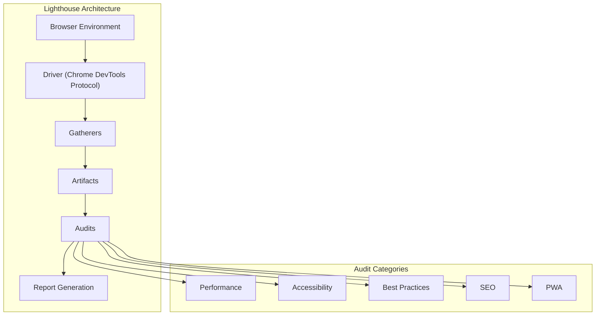
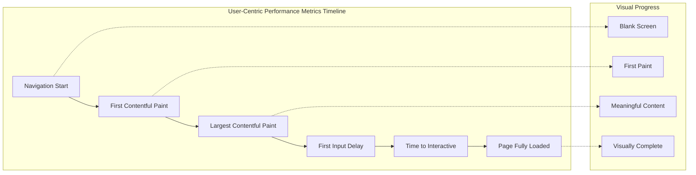
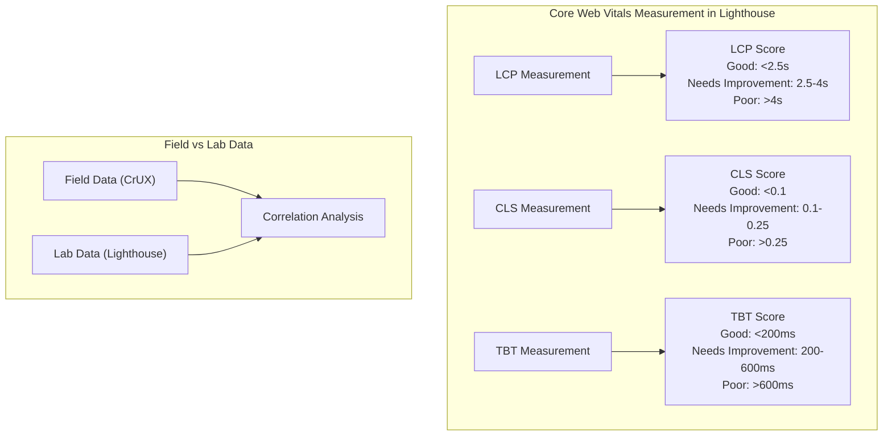
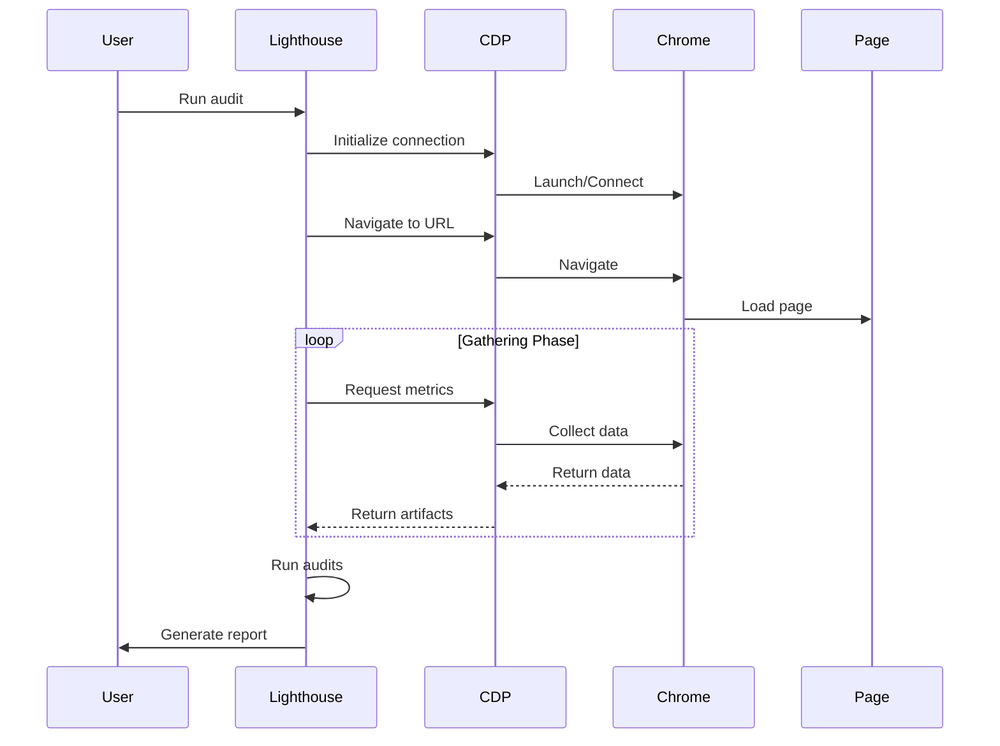
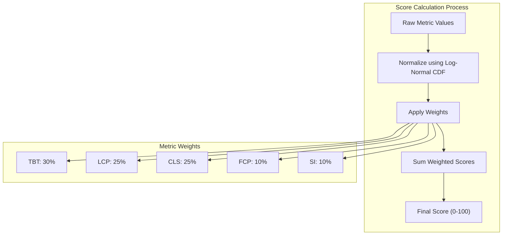
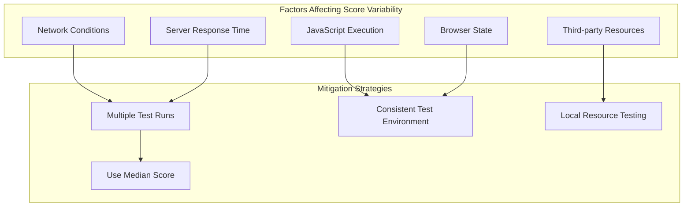

# Lighthouse

Lighthouseは、Googleが開発したオープンソースの自動化ツールで、ウェブアプリケーションの品質を多角的に分析し、改善のための具体的な指針を提供する。2016年にGoogle Chrome Labsのプロジェクトとして開始されたLighthouseは、当初はProgressive Web Apps（PWA）の品質評価ツールとして設計されたが、現在ではパフォーマンス、アクセシビリティ、ベストプラクティス、SEOなど、ウェブアプリケーションの品質を包括的に評価する標準的なツールへと進化している。



## パフォーマンス計測の理論的基盤

Lighthouseのパフォーマンス計測は、ユーザー体験の定量化という困難な課題に対する科学的アプローチを体現している。従来のウェブパフォーマンス計測は、ページの読み込み完了時間（onload event）などの技術的イベントに焦点を当てていたが、これらの指標は実際のユーザー体験と必ずしも相関しないという問題があった。例えば、ページの主要コンテンツが表示された後に、広告や解析スクリプトの読み込みが続く場合、技術的な読み込み完了は大幅に遅延するが、ユーザーは既にページを利用可能な状態として認識している。

この問題に対処するため、Lighthouseは「ユーザー中心のパフォーマンス指標」という概念を採用している。これは、ユーザーがページの読み込みプロセスをどのように知覚するかに基づいて設計された指標群である。具体的には、First Contentful Paint（FCP）、Largest Contentful Paint（LCP）、Time to Interactive（TTI）、Total Blocking Time（TBT）、Cumulative Layout Shift（CLS）などの指標が含まれる。



これらの指標の理論的基盤は、人間の知覚心理学と認知科学の研究に根ざしている。例えば、人間の視覚システムは約100ミリ秒以内の遅延を瞬時として知覚し、1秒以内の遅延は思考の流れを妨げないが、10秒を超える遅延はユーザーの注意を失わせるという研究結果¹がある。Lighthouseの指標設計は、これらの知見を実践的な計測可能な形式に変換したものである。

## Core Web Vitalsとの統合

2020年にGoogleが発表したCore Web Vitalsは、ウェブページのユーザー体験品質を評価するための標準化された指標セットであり、LighthouseはこれらのCore Web Vitalsの公式計測ツールとしての役割を担っている。Core Web VitalsはLCP（読み込みパフォーマンス）、FID（インタラクティビティ）、CLS（視覚的安定性）の3つの指標で構成されるが、LighthouseではFIDの代替としてTBT（Total Blocking Time）を使用している。

この代替の理由は技術的制約に基づいている。FIDは実際のユーザーインタラクションを必要とするため、ラボ環境での自動化測定が困難である。一方、TBTはメインスレッドがブロックされている時間の合計を測定し、潜在的な入力遅延を予測する。研究によると、TBTとFIDには強い相関関係があることが示されている²。



## 監査項目の技術的実装

Lighthouseの監査システムは、モジュラーアーキテクチャに基づいて設計されており、各監査項目は独立したモジュールとして実装されている。この設計により、新しい監査項目の追加や既存項目の更新が容易になっている。

各監査モジュールは、Gathererフェーズで収集されたArtifactsを入力として受け取り、特定の品質基準に基づいて評価を行う。例えば、画像最適化の監査では、ページ内のすべての画像要素を収集し、それぞれのファイルサイズ、フォーマット、レスポンシブ対応状況を分析する。

```javascript
// Example: Image optimization audit logic (simplified)
class UsesOptimizedImages extends Audit {
  static audit(artifacts) {
    const images = artifacts.ImageElements;
    const opportunities = [];
    
    for (const image of images) {
      const wastageBytesWebP = image.naturalSize - estimateWebPSize(image);
      const wastageBytesResize = calculateResizeWastage(image);
      
      if (wastageBytesWebP > THRESHOLD || wastageBytesResize > THRESHOLD) {
        opportunities.push({
          url: image.src,
          wastedBytes: wastageBytesWebP + wastageBytesResize,
          fromProtocol: image.naturalSize,
          toProtocol: image.naturalSize - (wastageBytesWebP + wastageBytesResize)
        });
      }
    }
    
    return {
      score: calculateScore(opportunities),
      opportunities
    };
  }
}
```

監査項目は大きく以下のカテゴリーに分類される：

**パフォーマンス監査**は、ページの読み込み速度とランタイムパフォーマンスに焦点を当てる。これには、リソースの最適化（画像、JavaScript、CSS）、キャッシュポリシー、サーバーレスポンス時間、メインスレッドの作業量などが含まれる。各監査項目は、潜在的な改善機会を定量的に示し、実装の優先順位付けを支援する。

**アクセシビリティ監査**は、WCAG 2.1（Web Content Accessibility Guidelines）³に基づいて実装されており、スクリーンリーダーの互換性、キーボードナビゲーション、色のコントラスト比、ARIAの適切な使用などを検証する。これらの監査は、障害を持つユーザーがウェブコンテンツにアクセスできることを保証するために重要である。

**ベストプラクティス監査**は、セキュリティ、現代的なWeb API の使用、エラーハンドリング、開発者体験に関する推奨事項をカバーする。HTTPSの使用、脆弱なライブラリの検出、コンソールエラーの有無、適切なエラーハンドリングなどが含まれる。

**SEO監査**は、検索エンジン最適化に関する技術的要件を検証する。これには、メタデータの存在と適切性、構造化データの実装、モバイルフレンドリー設計、クロール可能性などが含まれる。

## 実行環境とアーキテクチャ

Lighthouseは複数の実行環境をサポートしており、それぞれが異なるユースケースに対応している。Chrome DevToolsパネル、Chrome拡張機能、Node.jsモジュール、コマンドラインインターフェース、そしてPageSpeed Insights APIとしての利用が可能である。

アーキテクチャの中核にはChrome DevTools Protocol（CDP）がある。CDPは、Chromeブラウザとプログラムが通信するための低レベルAPIであり、Lighthouseはこれを使用してブラウザを制御し、パフォーマンスデータを収集する。



Lighthouseの実行プロセスは3つの主要なフェーズで構成される：

**Gathering（収集）フェーズ**では、ページを読み込み、必要なデータを収集する。このフェーズでは、ネットワークリクエスト、JavaScriptの実行、レンダリングイベント、リソースのタイミング情報などが記録される。Gathererと呼ばれるモジュールが、特定の種類のデータ収集を担当する。

**Auditing（監査）フェーズ**では、収集されたデータ（Artifacts）を分析し、各監査項目のスコアを計算する。各Auditモジュールは独立して動作し、特定の品質基準に基づいて評価を行う。

**Reporting（レポート生成）フェーズ**では、監査結果を人間が理解しやすい形式に変換する。HTMLレポート、JSON出力、または他のフォーマットで結果を提供する。

## スコアリングアルゴリズムの詳細

Lighthouseのスコアリングシステムは、複雑な技術的指標を0から100までの直感的なスコアに変換する。このスコアリングアルゴリズムは、統計的手法と実世界のデータに基づいて設計されている。

パフォーマンススコアの計算は、HTTPArchive⁴のデータセットに基づく対数正規分布モデルを使用している。各指標には重み付けが設定されており、2023年時点での重み付けは以下の通りである：

- Total Blocking Time (TBT): 30%
- Largest Contentful Paint (LCP): 25%
- Cumulative Layout Shift (CLS): 25%
- First Contentful Paint (FCP): 10%
- Speed Index (SI): 10%

スコアの計算式は以下のように表現される：

```
Score = Σ(weight_i × metric_score_i)
```

ここで、`metric_score_i`は各指標の正規化されたスコアであり、以下の対数正規累積分布関数を使用して計算される：

```
metric_score = Φ((log(metric_value) - μ) / σ) × 100
```

ここで、Φは標準正規累積分布関数、μとσは各指標の対数正規分布のパラメータである。これらのパラメータは、実世界のウェブサイトのパフォーマンスデータから導出されている。



## 各指標の技術的実装詳細

**First Contentful Paint (FCP)** は、ナビゲーション開始から最初のテキストまたは画像がレンダリングされるまでの時間を測定する。技術的には、ブラウザのPaint Timing API⁵を使用して実装されており、`first-contentful-paint`エントリのタイムスタンプを取得する。FCPの計測において重要なのは、「意味のあるコンテンツ」の定義である。空白のiframeや背景画像はFCPのトリガーとならないが、テキスト、画像（背景画像を含む）、非白色のcanvas要素、SVGはトリガーとなる。

**Largest Contentful Paint (LCP)** は、ビューポート内で最も大きな画像またはテキストブロックがレンダリングされる時間を測定する。LCPの実装は、Largest Contentful Paint API⁶に基づいており、ページの読み込み中に継続的に更新される。技術的な課題として、動的にロードされるコンテンツや、レイアウトシフトによるサイズ変更の扱いがある。LCPは、ユーザーの最初のインタラクションまで、または新しいページへのナビゲーションまで更新され続ける。

**Cumulative Layout Shift (CLS)** は、ページの視覚的安定性を測定する指標である。レイアウトシフトスコアは、影響を受けた領域の割合と移動距離の積として計算される：

```
layout shift score = impact fraction × distance fraction
```

CLSの実装では、Layout Instability API⁷を使用し、ページのライフサイクル全体でのレイアウトシフトを追跡する。重要な点として、ユーザーのインタラクションから500ms以内に発生したレイアウトシフトは除外される。これは、ユーザーが期待する変更（例：アコーディオンの展開）をペナルティとしないためである。

**Total Blocking Time (TBT)** は、FCPとTTIの間で、メインスレッドが50ms以上ブロックされた時間の合計を測定する。これは、Long Tasks API⁸を使用して実装されており、50msを超えるタスクの超過時間を累積する。例えば、70msのタスクは20msのブロッキング時間として計算される。

```javascript
// TBT calculation logic (simplified)
function calculateTBT(tasks, fcpTime, ttiTime) {
  let totalBlockingTime = 0;
  const BLOCKING_THRESHOLD = 50;
  
  for (const task of tasks) {
    if (task.startTime >= fcpTime && task.startTime < ttiTime) {
      const blockingTime = Math.max(0, task.duration - BLOCKING_THRESHOLD);
      totalBlockingTime += blockingTime;
    }
  }
  
  return totalBlockingTime;
}
```

**Speed Index** は、ページのコンテンツが視覚的にどれだけ速く表示されるかを測定する。この指標の実装は特に複雑で、ビデオキャプチャまたはPaint Timing APIを使用して、時間経過に伴う視覚的完成度を計算する。Speed Indexの計算式は：

```
Speed Index = ∫(1 - VC(t))dt
```

ここで、VC(t)は時刻tにおける視覚的完成度（0から1）である。実装では、定期的なスクリーンショットを取得し、各フレームの視覚的完成度を計算することで、この積分を近似する。

## 実装における制約と限界

Lighthouseは強力なツールであるが、いくつかの重要な制約と限界を理解することが、適切な使用と結果の解釈に不可欠である。

**シミュレーション環境の限界**：Lighthouseは制御された環境でページを読み込むため、実際のユーザー環境とは異なる結果を生む可能性がある。ネットワーク条件、CPUスロットリング、ビューポートサイズなどはシミュレートされるが、実際のデバイスの多様性、ブラウザ拡張機能の影響、キャッシュ状態などは完全には再現できない。

**単一ページ読み込みの制約**：Lighthouseは基本的に単一のページ読み込みを分析するため、ユーザーセッション全体でのパフォーマンスや、ページ間のナビゲーションパフォーマンスは評価できない。Single Page Application（SPA）の場合、初期読み込み後のクライアントサイドルーティングによるパフォーマンスは測定されない。

**動的コンテンツの扱い**：多くの現代的なウェブアプリケーションは、ユーザーのインタラクションに基づいて動的にコンテンツをロードする。Lighthouseは初期読み込みに焦点を当てているため、遅延読み込みされるコンテンツや、インタラクション後に表示される要素のパフォーマンスは評価されない可能性がある。

**スコアの変動性**：同じページでも実行ごとにスコアが変動することがある。これは、ネットワークの変動、サーバーの応答時間、JavaScriptの実行タイミングなど、多くの要因による。Googleは、信頼性の高い結果を得るために、複数回の実行結果の中央値を使用することを推奨している。



**サードパーティリソースの影響**：多くのウェブサイトは、広告、分析、ソーシャルメディアウィジェットなどのサードパーティリソースに依存している。これらのリソースのパフォーマンスは、ウェブサイト開発者の制御外にあるが、Lighthouseのスコアには大きく影響する。この問題に対処するため、LighthouseはサードパーティリソースのROPO（Render On Purpose Only）分析を提供している。

## パフォーマンス最適化の実践的アプローチ

Lighthouseの結果を実際のパフォーマンス改善に結びつけるには、体系的なアプローチが必要である。単にスコアを追求するのではなく、実際のユーザー体験の改善に焦点を当てることが重要である。

**Critical Rendering Path の最適化**は、パフォーマンス改善の基礎となる。これには、レンダリングブロッキングリソースの削減、CSSの最適化、JavaScriptの非同期読み込みなどが含まれる。具体的には、`<link rel="preconnect">`を使用した早期接続の確立、`<link rel="preload">`による重要リソースの優先読み込み、CSSのインライン化による追加のラウンドトリップの削減などが効果的である。

**リソース最適化**では、画像の最適化が特に重要である。WebPやAVIFなどの現代的な画像フォーマットの採用、レスポンシブ画像の実装、遅延読み込みの活用により、大幅なパフォーマンス改善が可能である。JavaScriptバンドルの最適化では、コード分割、Tree Shaking、動的インポートの活用が重要である。

**キャッシュ戦略**の実装は、リピートビジターのパフォーマンスに大きく影響する。適切なCache-Controlヘッダーの設定、Service Workerを使用したオフライン対応、CDNの活用により、ネットワークラウンドトリップを削減できる。

## 継続的な品質監視への統合

Lighthouseの真の価値は、開発プロセスへの統合によって実現される。CI/CDパイプラインへのLighthouseの組み込みにより、パフォーマンスの退行を早期に検出し、品質基準を維持できる。

```javascript
// Example: Lighthouse CI configuration
module.exports = {
  ci: {
    collect: {
      url: ['http://localhost:3000/', 'http://localhost:3000/about'],
      numberOfRuns: 3,
      settings: {
        preset: 'desktop'
      }
    },
    assert: {
      assertions: {
        'categories:performance': ['error', {minScore: 0.9}],
        'categories:accessibility': ['error', {minScore: 0.95}],
        'first-contentful-paint': ['error', {maxNumericValue: 2000}],
        'largest-contentful-paint': ['error', {maxNumericValue: 2500}],
        'cumulative-layout-shift': ['error', {maxNumericValue: 0.1}]
      }
    },
    upload: {
      target: 'lhci',
      serverBaseUrl: 'https://your-lhci-server.example.com'
    }
  }
};
```

Lighthouse CIを使用することで、プルリクエストごとにパフォーマンステストを自動実行し、基準を満たさない変更をブロックできる。また、時系列でのパフォーマンストレンドを追跡し、長期的な品質管理が可能になる。

## 実装の詳細とAPIの活用

LighthouseをプログラマティックにNode.js環境で使用する場合、豊富な設定オプションとAPIが利用可能である。以下は、カスタム設定でLighthouseを実行する例である：

```javascript
const lighthouse = require('lighthouse');
const chromeLauncher = require('chrome-launcher');

async function runLighthouse(url) {
  // Launch Chrome
  const chrome = await chromeLauncher.launch({
    chromeFlags: ['--headless', '--disable-gpu']
  });
  
  // Lighthouse configuration
  const options = {
    logLevel: 'info',
    output: 'json',
    onlyCategories: ['performance', 'accessibility'],
    port: chrome.port,
    throttling: {
      rttMs: 40,
      throughputKbps: 10240,
      cpuSlowdownMultiplier: 4
    },
    screenEmulation: {
      mobile: true,
      width: 360,
      height: 640,
      deviceScaleFactor: 2
    }
  };
  
  // Run Lighthouse
  const runnerResult = await lighthouse(url, options);
  
  // Process results
  const reportJson = runnerResult.report;
  const reportData = JSON.parse(reportJson);
  
  await chrome.kill();
  
  return reportData;
}
```

この例では、モバイルデバイスをエミュレートし、3G接続をシミュレートしてLighthouseを実行している。throttling設定により、実際のユーザー環境により近い条件でテストを行うことができる。

## 最新の展開と将来の方向性

Lighthouseは継続的に進化しており、ウェブプラットフォームの変化に対応している。最近の重要な更新には、INP（Interaction to Next Paint）のサポート追加がある。INPは、ページのライフサイクル全体でのインタラクションの応答性を測定する新しい指標であり、FIDの後継として位置づけられている。

また、Privacy Sandboxイニシアティブに関連する新しい監査項目の追加、WebGPUやWebAssemblyなどの新しいWeb APIのパフォーマンス影響の評価、機械学習を活用したより高度なパフォーマンス予測モデルの開発などが進行中である。

Lighthouseのエコシステムも拡大しており、様々なサードパーティツールとの統合が進んでいる。WebPageTest、SpeedCurve、Calibreなどのパフォーマンス監視サービスは、Lighthouseの指標を採用し、より包括的なパフォーマンス分析を提供している。

技術的な観点から、Lighthouseは単なる測定ツールを超えて、ウェブパフォーマンスの標準化と教育の重要な役割を果たしている。開発者がパフォーマンスの重要性を理解し、具体的な改善方法を学ぶためのプラットフォームとして機能している。これは、より高速で、アクセシブルで、ユーザーフレンドリーなウェブの実現に向けた重要な貢献である。

---

¹ Jakob Nielsen, "Response Times: The 3 Important Limits", Nielsen Norman Group, 1993
² "Lighthouse Scoring Calculator", Google Developers Documentation, 2023
³ "Web Content Accessibility Guidelines (WCAG) 2.1", W3C Recommendation, 2018
⁴ "HTTP Archive", https://httparchive.org/
⁵ "Paint Timing API", W3C Working Draft, 2023
⁶ "Largest Contentful Paint API", W3C Draft Community Group Report, 2023
⁷ "Layout Instability API", W3C Editor's Draft, 2023
⁸ "Long Tasks API", W3C Editor's Draft, 2023