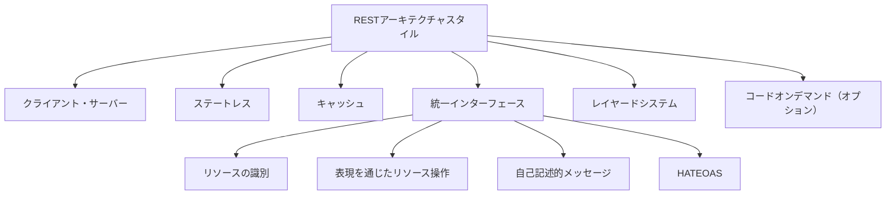
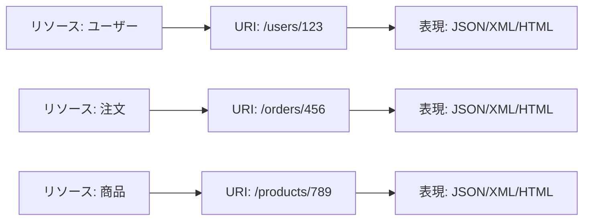
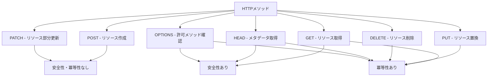
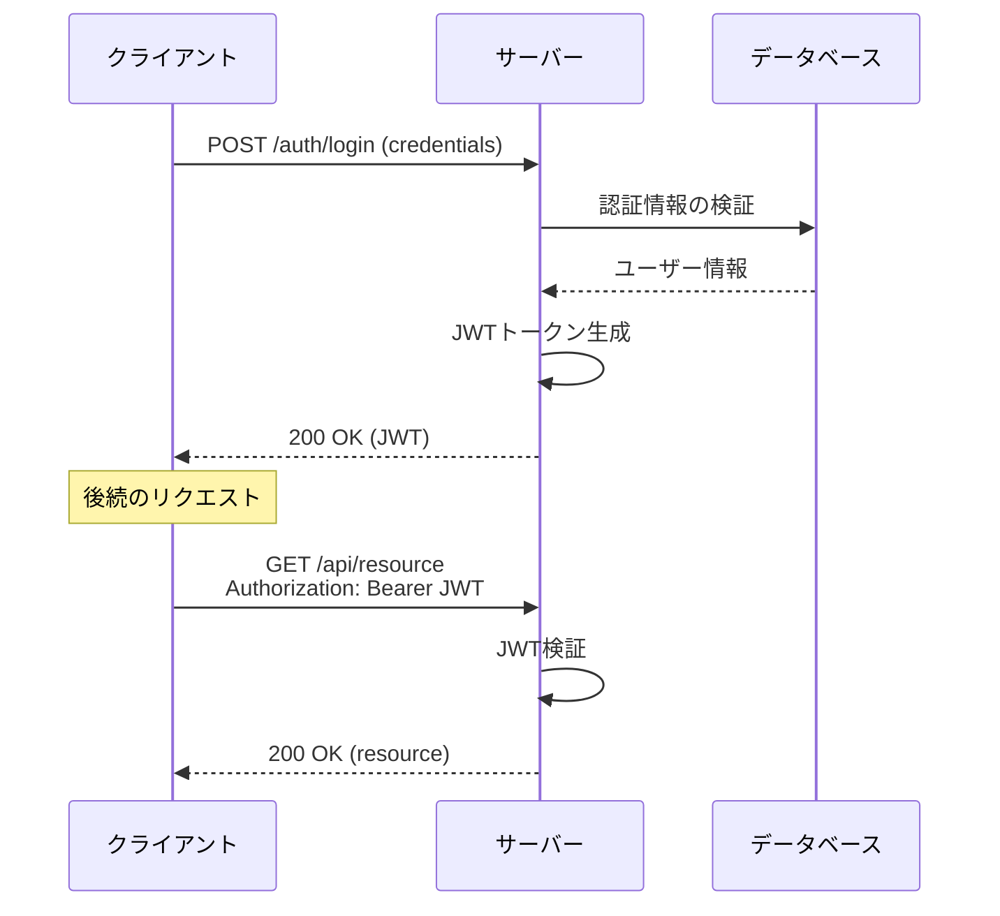
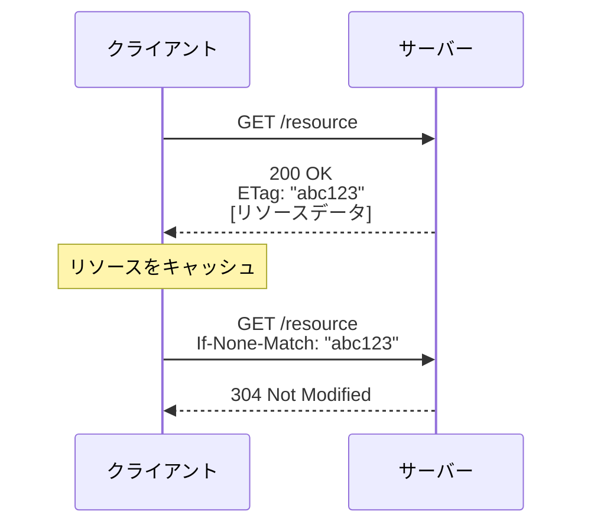
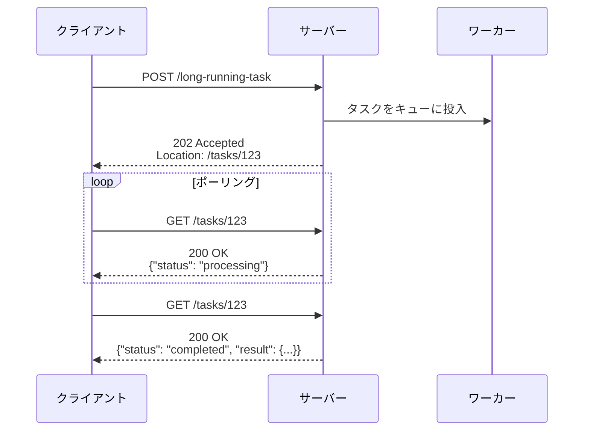

# RESTful API

RESTful APIは、Roy FieldingがUC Irvineの博士論文[^1]で提唱したREST（Representational State Transfer）アーキテクチャスタイルに基づいて設計されたWeb APIの実装方式である。インターネット規模の分散ハイパーメディアシステムのためのアーキテクチャスタイルとして考案され、現代のWeb APIの主流な設計手法となっている。

RESTは単なるAPIの設計パターンではなく、分散システムにおけるアーキテクチャ上の制約の集合として定義される。これらの制約を満たすシステムは、スケーラビリティ、独立した進化可能性、インターフェースの一般性などの望ましい特性を獲得する。本稿では、RESTの理論的基盤から実装上の詳細に至るまで、RESTful APIの設計と実装に必要な知識を体系的に解説する。

## RESTアーキテクチャスタイルの基礎

RESTは、Web自体のアーキテクチャから抽出された設計原則の集合である。Fieldingは、Webの成功要因を分析し、その本質的な特性を6つのアーキテクチャ制約として形式化した。これらの制約は、システムの特定の品質属性を向上させるために慎重に選択されている。



### クライアント・サーバー制約

クライアント・サーバー制約は、関心の分離（Separation of Concerns）の原則に基づく。ユーザーインターフェースの関心事とデータストレージの関心事を分離することで、クライアントのポータビリティとサーバーの拡張性を向上させる。この分離により、クライアントとサーバーは独立して進化することが可能となり、複数のプラットフォームへの対応や、サーバーコンポーネントの簡素化によるスケーラビリティの向上が実現される。

### ステートレス制約

ステートレス制約は、クライアントからサーバーへの各リクエストが、そのリクエストを理解するために必要なすべての情報を含むことを要求する。サーバーはクライアントのコンテキストを保存せず、セッション状態はすべてクライアント側で管理される。この制約により、サーバーの実装が簡素化され、信頼性とスケーラビリティが向上する。

ステートレス性は、以下の利点をもたらす：
- サーバーリソースの解放が迅速に行われる
- リクエストが任意のサーバーインスタンスで処理可能
- 障害からの回復が容易
- デバッグとモニタリングが単純化される

一方で、ステートレス性には以下のトレードオフが存在する：
- ネットワークオーバーヘッドの増加（各リクエストに認証情報等を含む必要がある）
- クライアント側の実装複雑性の増加

### キャッシュ制約

キャッシュ制約は、レスポンスデータに対してキャッシュ可能またはキャッシュ不可能のラベル付けを要求する。キャッシュ可能なレスポンスは、クライアントが後続の同等なリクエストに対して再利用することができる。効果的なキャッシュ戦略により、クライアント・サーバー間の相互作用が部分的または完全に排除され、スケーラビリティとパフォーマンスが向上する。

HTTPヘッダーを使用したキャッシュ制御の実装例：
```
Cache-Control: max-age=3600, must-revalidate
ETag: "33a64df551425fcc55e4d42a148795d9f25f89d4"
Last-Modified: Tue, 15 Nov 2024 12:45:26 GMT
```

### 統一インターフェース制約

統一インターフェース制約は、RESTアーキテクチャスタイルの中核となる制約であり、システムアーキテクチャを簡素化し、相互作用の可視性を向上させる。この制約は、さらに4つのサブ制約に分解される：

#### 1. リソースの識別

情報の抽象化の核となる概念がリソースである。リソースは、名前付けることができるあらゆる情報を指す概念的なマッピングである。ドキュメント、画像、時間的なサービス、他のリソースのコレクション、非仮想的なオブジェクトなど、すべてがリソースとなりうる。

リソースは、統一リソース識別子（URI）によって一意に識別される。URIは、リソースの実装や現在の状態から独立して、リソースを識別する役割を果たす。



#### 2. 表現を通じたリソース操作

クライアントは、リソースの表現を保持することで、リソースを操作する。表現は、特定の時点におけるリソースの状態を反映したデータと、そのデータを記述するメタデータから構成される。クライアントがリソースを変更または削除する十分な権限を持つ場合、保持している表現を修正してサーバーに送信することで、リソースの操作が可能となる。

#### 3. 自己記述的メッセージ

各メッセージは、そのメッセージをどのように処理すべきかを記述するのに十分な情報を含む。メッセージの構文解析と処理に必要なすべての情報が、メッセージ自体またはメッセージが参照する追加のメタデータに含まれる。

自己記述的メッセージの要素：
- メディアタイプ（Content-Type）
- HTTPメソッドのセマンティクス
- ステータスコードの意味
- ヘッダーフィールドの解釈

#### 4. HATEOAS（Hypermedia as the Engine of Application State）

HATEOASは、RESTful APIの成熟度モデル[^2]において最も高いレベルに位置する制約である。アプリケーションの状態遷移は、サーバーから提供されるハイパーメディアリンクによって駆動される。クライアントは、事前にURIの構造を知ることなく、動的に提供されるリンクを辿ることでアプリケーションと対話する。

```json
{
  "order_id": "12345",
  "status": "pending",
  "total": 150.00,
  "_links": {
    "self": { "href": "/orders/12345" },
    "payment": { "href": "/orders/12345/payment" },
    "cancel": { "href": "/orders/12345/cancel" },
    "customer": { "href": "/customers/67890" }
  }
}
```

### レイヤードシステム制約

レイヤードシステム制約は、アーキテクチャを階層的なレイヤーに編成することを要求する。各コンポーネントは、自身が相互作用する隣接レイヤーを超えて「見る」ことができない。この制約により、システム全体の複雑性が制限され、レイヤー間の独立性が促進される。

レイヤードアーキテクチャの利点：
- 既存のレイヤーを共有することで、レガシーサービスをカプセル化できる
- 中間層でのセキュリティポリシーの実装が可能
- ロードバランシングによるスケーラビリティの向上
- 共有キャッシュの実装による効率化

### コードオンデマンド制約（オプション）

コードオンデマンドは、RESTにおける唯一のオプション制約である。サーバーは、実行可能なコード（JavaScriptなど）をクライアントに転送することで、クライアントの機能を一時的に拡張または カスタマイズできる。この制約により、事前に実装されていない機能をクライアントに動的に提供することが可能となる。

## HTTPメソッドとRESTful操作

RESTful APIでは、HTTPメソッドを使用してリソースに対する操作を表現する。各HTTPメソッドは、特定のセマンティクスを持ち、RFC 7231[^3]で定義されている。



### GETメソッド

GETメソッドは、指定されたリソースの現在の表現を取得する。GETリクエストは安全（safe）かつ冪等（idempotent）でなければならない。つまり、GETリクエストはリソースの状態を変更せず、同じリクエストを複数回実行しても同じ結果が得られる。

GETメソッドの特性：
- キャッシュ可能
- ブックマーク可能
- 履歴に保存可能
- リクエストボディを持たない（RFC 7231では非推奨）

### POSTメソッド

POSTメソッドは、ターゲットリソースに対して、リソース固有の処理を要求する。最も一般的な用途は、新しいリソースの作成であるが、それに限定されない。POSTは安全でも冪等でもないため、同じリクエストを複数回実行すると、異なる結果をもたらす可能性がある。

POSTの用途：
- 新しいリソースの作成
- 既存リソースへのデータ追加
- プロセスの開始
- 他のメソッドでは表現できない操作

### PUTメソッド

PUTメソッドは、ターゲットリソースの状態を、リクエストペイロードで定義された状態に置き換える。PUTは冪等であり、同じリクエストを複数回実行しても、1回実行した場合と同じ結果となる。

PUTメソッドの特徴：
- 完全なリソース表現を送信する必要がある
- リソースが存在しない場合は作成される（201 Created）
- リソースが存在する場合は置換される（200 OK または 204 No Content）

### PATCHメソッド

PATCHメソッドは、RFC 5789[^4]で定義され、リソースの部分的な更新を行う。PUTとは異なり、変更したい部分のみを送信すればよい。PATCHは必ずしも冪等ではないが、実装によっては冪等にすることも可能である。

PATCHの実装方式：
- JSON Patch（RFC 6902）[^5]
- JSON Merge Patch（RFC 7396）[^6]
- カスタムパッチフォーマット

### DELETEメソッド

DELETEメソッドは、指定されたリソースを削除する。DELETEは冪等であり、リソースがすでに削除されている場合でも、成功として扱われる。

### HEADメソッド

HEADメソッドは、GETメソッドと同じだが、レスポンスボディを返さない。メタデータの取得や、リソースの存在確認、最終更新日時の確認などに使用される。

### OPTIONSメソッド

OPTIONSメソッドは、ターゲットリソースに対して許可されている通信オプションを記述する。CORSプリフライトリクエストで頻繁に使用される。

## リソース設計の原則

RESTful APIの品質は、リソース設計の良し悪しに大きく依存する。適切なリソース設計は、APIの使いやすさ、保守性、拡張性に直接影響を与える。

### リソースの粒度

リソースの粒度は、APIの使いやすさとパフォーマンスのバランスを考慮して決定する必要がある。過度に細かい粒度は、クライアントが複数のリクエストを発行する必要を生じさせ、過度に粗い粒度は、不要なデータの転送を引き起こす。

リソース粒度の設計指針：
- ビジネスエンティティに基づいたモデリング
- 集約ルートの概念の適用
- 用途に応じた複数の表現の提供
- 埋め込みリソースとリンクのバランス

### URIの設計

URIは、リソースの識別子であり、人間にとって理解しやすく、一貫性のある構造を持つべきである。RFC 3986[^7]に準拠したURI設計が求められる。

URI設計のベストプラクティス：
- 名詞を使用し、動詞を避ける
- 複数形を使用する（/users、/products）
- 階層関係を表現する（/users/123/orders）
- ハイフンを使用してワードを区切る
- 小文字を使用する
- ファイル拡張子を含めない

### コレクションとインスタンス

RESTful APIでは、リソースをコレクションとインスタンスの2つのタイプに分類する。コレクションは同じタイプのリソースの集合を表し、インスタンスは単一のリソースを表す。

```
/users          # ユーザーコレクション
/users/123      # ユーザーインスタンス
/users/123/orders    # 特定ユーザーの注文コレクション
/orders/456     # 注文インスタンス
```

### リソース間の関係

リソース間の関係は、URIの階層構造またはリンクによって表現される。関係の表現方法は、関係の性質と使用パターンに基づいて選択する。

関係表現のパターン：
- 埋め込み（Embedding）
- リンク（Linking）
- サイドローディング（Sideloading）

## ステートレス性の実装

ステートレス性は、RESTful APIの中核的な制約であり、その実装は認証、セッション管理、トランザクション処理など、多くの側面に影響を与える。

### 認証とステートレス性

ステートレスなAPIでは、各リクエストに認証情報を含める必要がある。一般的な認証方式には以下がある：

#### JWTトークン認証

JSON Web Token（JWT）[^8]は、ステートレス認証の実装に広く使用される。JWTは、クレームを安全に伝達するためのコンパクトでURLセーフな手段を提供する。



JWTの利点：
- サーバー側でのセッションストレージが不要
- スケールアウトが容易
- マイクロサービス間での認証情報共有が可能

JWTの課題：
- トークンの無効化が困難
- トークンサイズが大きい
- 秘密鍵の管理が必要

#### OAuth 2.0

OAuth 2.0[^9]は、第三者アプリケーションへの限定的なアクセス権限を提供するための認可フレームワークである。アクセストークンを使用することで、ステートレスな認可を実現する。

### トランザクション管理

ステートレス制約下でのトランザクション管理は、特別な考慮を必要とする。長時間実行されるトランザクションや、複数のリクエストにまたがるトランザクションの実装には、以下のパターンが使用される：

#### Sagaパターン

Sagaパターンは、分散トランザクションを一連の局所トランザクションとして実装する。各局所トランザクションは、失敗時の補償トランザクションを持つ。

#### イベントソーシング

イベントソーシングは、状態の変更をイベントのシーケンスとして記録する。この手法により、ステートレスなAPIでも複雑なビジネストランザクションを管理できる。

## 表現とコンテントネゴシエーション

RESTful APIにおける表現は、リソースの特定の時点での状態を反映したデータである。同一のリソースに対して、複数の表現を提供することが可能であり、コンテントネゴシエーションによって適切な表現が選択される。

### メディアタイプ

メディアタイプは、表現のフォーマットを識別する。一般的なメディアタイプには以下がある：

- application/json
- application/xml
- application/hal+json
- application/vnd.api+json（JSON:API）
- application/ld+json（JSON-LD）

### コンテントネゴシエーション

HTTPは、3つのコンテントネゴシエーション方式を提供する：

#### サーバー駆動ネゴシエーション

クライアントがAcceptヘッダーで希望する表現を指定し、サーバーが最適な表現を選択する。

```
GET /users/123 HTTP/1.1
Accept: application/json, application/xml;q=0.9
```

#### エージェント駆動ネゴシエーション

サーバーが利用可能な表現のリストを提供し、クライアントが選択する。

#### 透過的ネゴシエーション

サーバー駆動とエージェント駆動の組み合わせ。

### HAL（Hypertext Application Language）

HAL[^10]は、リソースとそのリンクを表現するためのシンプルなフォーマットである。

```json
{
  "_links": {
    "self": { "href": "/orders/123" },
    "ea:customer": { "href": "/customers/456" },
    "ea:basket": { "href": "/baskets/789" }
  },
  "total": 30.00,
  "currency": "USD",
  "status": "shipped"
}
```

## エラーハンドリング

適切なエラーハンドリングは、RESTful APIの使いやすさに大きく貢献する。エラーレスポンスは、問題の特定と解決に必要な情報を提供すべきである。

### HTTPステータスコード

HTTPステータスコードは、リクエストの結果を示す3桁の数値である。RESTful APIでは、適切なステータスコードの使用が重要である。

主要なステータスコードカテゴリ：
- 2xx：成功
- 3xx：リダイレクション
- 4xx：クライアントエラー
- 5xx：サーバーエラー

### Problem Details for HTTP APIs

RFC 7807[^11]は、HTTPエラーレスポンスの標準フォーマットを定義する。

```json
{
  "type": "https://example.com/probs/out-of-credit",
  "title": "You do not have enough credit.",
  "detail": "Your current balance is 30, but that costs 50.",
  "instance": "/account/12345/msgs/abc",
  "balance": 30,
  "accounts": ["/account/12345", "/account/67890"]
}
```

## バージョニング戦略

APIの進化は避けられないため、後方互換性を維持しながら変更を導入するバージョニング戦略が必要である。

### URIバージョニング

最も単純で広く使用される方式。バージョン番号をURIに含める。

```
/v1/users
/v2/users
```

### ヘッダーバージョニング

カスタムヘッダーまたはAcceptヘッダーでバージョンを指定する。

```
Accept: application/vnd.myapi.v2+json
```

### クエリパラメータバージョニング

バージョンをクエリパラメータとして指定する。

```
/users?version=2
```

## セキュリティの実装

RESTful APIのセキュリティは、多層防御のアプローチで実装すべきである。

### HTTPS

すべての通信をHTTPSで暗号化することは、RESTful APIセキュリティの基本である。TLS 1.2以上の使用が推奨される。

### 認証と認可

- OAuth 2.0とOpenID Connect
- API キー
- 相互TLS認証

### レート制限

APIの乱用を防ぐため、レート制限を実装する。一般的な実装方式：

- トークンバケットアルゴリズム
- 固定ウィンドウカウンター
- スライディングウィンドウログ

レート制限情報は、HTTPヘッダーで通知する：

```
X-RateLimit-Limit: 1000
X-RateLimit-Remaining: 998
X-RateLimit-Reset: 1672531200
```

### CORS（Cross-Origin Resource Sharing）

ブラウザベースのクライアントからのアクセスを制御するため、適切なCORSポリシーを設定する。

## パフォーマンス最適化

RESTful APIのパフォーマンスは、ユーザーエクスペリエンスとシステムのスケーラビリティに直接影響する。

### キャッシング戦略

効果的なキャッシング戦略により、サーバー負荷を軽減し、レスポンス時間を短縮できる。

#### ETagの使用

ETagは、リソースのバージョンを識別するための不透明な識別子である。



### ページネーション

大量のデータを返すAPIでは、ページネーションが必須である。一般的な実装パターン：

#### オフセットベースページネーション

```
GET /users?offset=20&limit=10
```

#### カーソルベースページネーション

```
GET /users?cursor=eyJpZCI6MTAwfQ&limit=10
```

### フィールドフィルタリング

クライアントが必要なフィールドのみを要求できるようにすることで、ペイロードサイズを削減する。

```
GET /users/123?fields=id,name,email
```

### 圧縮

レスポンスボディの圧縮により、ネットワーク転送量を削減する。

```
Accept-Encoding: gzip, deflate
Content-Encoding: gzip
```

## 非同期処理とロングポーリング

時間のかかる操作に対しては、非同期処理パターンを使用する。

### 202 Acceptedパターン



## GraphQLとの比較

RESTful APIとGraphQLは、それぞれ異なる問題を解決するために設計されている。

RESTの利点：
- HTTPセマンティクスの活用
- キャッシングの容易さ
- 標準化されたアプローチ
- ツールとライブラリの豊富さ

GraphQLの利点：
- 柔軟なクエリ
- オーバーフェッチ/アンダーフェッチの解決
- 型システム
- リアルタイムサブスクリプション

選択は、アプリケーションの要件、チームのスキル、既存のインフラストラクチャに基づいて行うべきである。

## マイクロサービスアーキテクチャにおけるREST

マイクロサービスアーキテクチャでは、サービス間の通信にRESTful APIが広く使用される。この文脈では、追加の考慮事項が生じる。

### サービスディスカバリー

動的な環境では、サービスの場所を発見するメカニズムが必要である。一般的なパターン：

- クライアントサイドディスカバリー
- サーバーサイドディスカバリー
- サービスメッシュ

### 回路ブレーカー

障害の連鎖を防ぐため、回路ブレーカーパターンを実装する。

### 分散トレーシング

複数のサービスにまたがるリクエストを追跡するため、分散トレーシングを実装する。OpenTelemetry[^12]などの標準を使用する。

## 実装上の考慮事項

RESTful APIの実装では、理論的な原則と実践的な要求のバランスを取る必要がある。

### フレームワークの選択

各プログラミング言語には、RESTful API開発のためのフレームワークが存在する：

- Node.js: Express, Fastify, NestJS
- Python: FastAPI, Django REST Framework, Flask-RESTful
- Java: Spring Boot, JAX-RS, Dropwizard
- Go: Gin, Echo, Chi
- Ruby: Ruby on Rails API, Grape

### API仕様の文書化

APIの仕様を文書化し、開発者に提供することは重要である。OpenAPI（Swagger）[^13]は、API仕様を記述するための標準フォーマットである。

### テスト戦略

RESTful APIの品質を保証するため、包括的なテスト戦略が必要である：

- 単体テスト
- 統合テスト
- 契約テスト
- 負荷テスト
- セキュリティテスト

[^1]: Fielding, Roy Thomas. "Architectural Styles and the Design of Network-based Software Architectures." Doctoral dissertation, University of California, Irvine, 2000.

[^2]: Richardson, Leonard. "Richardson Maturity Model." Martin Fowler's Blog, 2010.

[^3]: RFC 7231: Hypertext Transfer Protocol (HTTP/1.1): Semantics and Content

[^4]: RFC 5789: PATCH Method for HTTP

[^5]: RFC 6902: JavaScript Object Notation (JSON) Patch

[^6]: RFC 7396: JSON Merge Patch

[^7]: RFC 3986: Uniform Resource Identifier (URI): Generic Syntax

[^8]: RFC 7519: JSON Web Token (JWT)

[^9]: RFC 6749: The OAuth 2.0 Authorization Framework

[^10]: Kelly, Mike. "HAL - Hypertext Application Language." Internet Draft, 2013.

[^11]: RFC 7807: Problem Details for HTTP APIs

[^12]: OpenTelemetry Specification. Cloud Native Computing Foundation.

[^13]: OpenAPI Specification v3.1.0. OpenAPI Initiative.