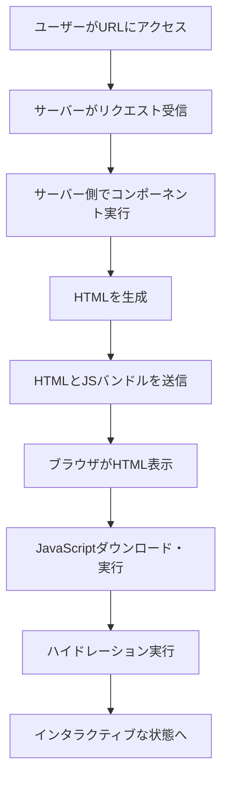
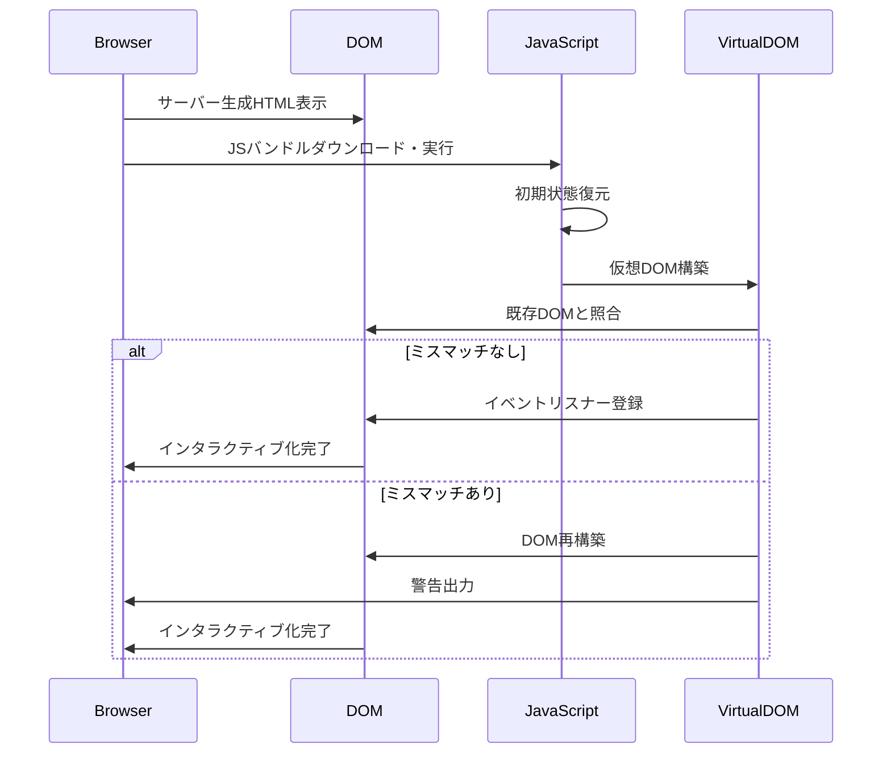
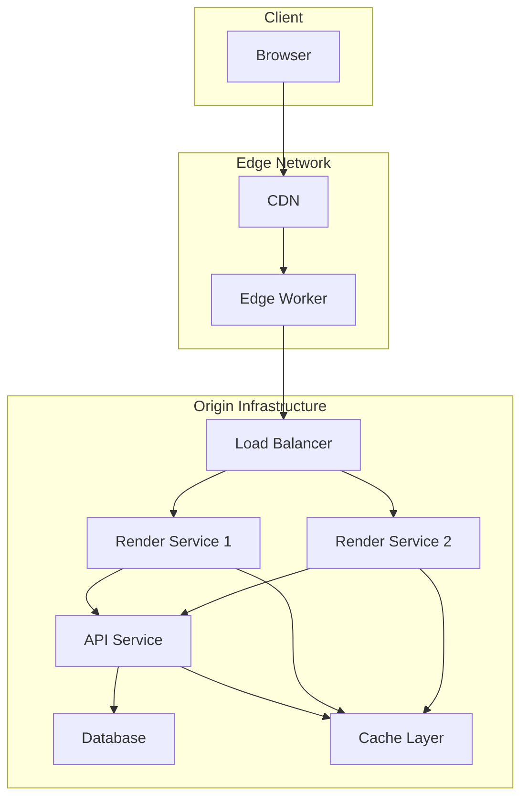
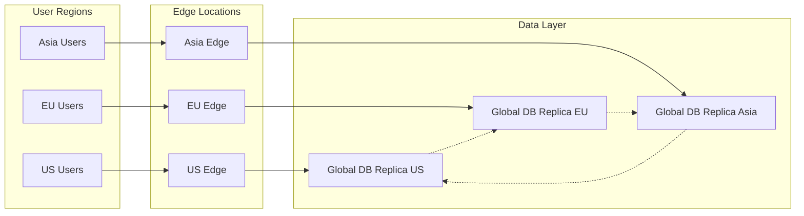

# Server-Side Rendering

Server-Side Rendering（SSR）は、Webアプリケーションのコンテンツをサーバー側でHTMLとして生成し、クライアントに送信するレンダリング手法である。この技術は、初期表示の高速化とSEOの最適化を実現する一方で、サーバーインフラストラクチャへの負荷増大やアーキテクチャの複雑化といったトレードオフを伴う。本稿では、SSRの技術的な仕組みから実装パターン、パフォーマンス特性、そして現代的なWebアプリケーション開発における設計判断まで、包括的に解説する。

## Webレンダリングの変遷とSSRの位置づけ

Webアプリケーションのレンダリング手法は、技術の進化とユーザー体験への要求の高まりとともに変遷してきた。初期のWebは、すべてのHTMLをサーバー側で生成する純粋なサーバーサイドレンダリングが主流であった。PHPやRuby on Rails、Djangoといった伝統的なWebフレームワークは、リクエストごとに動的にHTMLを生成し、完全に構築されたページをクライアントに送信していた。

2010年代に入ると、Ajax技術の普及とSingle Page Application（SPA）の台頭により、Client-Side Rendering（CSR）が注目を集めた。CSRでは、初期ロード時には最小限のHTMLとJavaScriptバンドルのみを送信し、実際のレンダリングはクライアント側で行う。この手法により、ページ遷移時のユーザー体験は大幅に向上したが、初期表示の遅延やSEOの課題が顕在化した。

現代のSSRは、これらの課題を解決するために再び注目されている技術である。ただし、伝統的なサーバーサイドレンダリングとは異なり、現代のSSRはJavaScriptフレームワークと統合され、サーバー側とクライアント側で同じコンポーネントコードを実行する「アイソモーフィック」または「ユニバーサル」なアプローチを採用している。



## SSRの動作原理

SSRの中核となる仕組みは、JavaScriptで記述されたコンポーネントをサーバー側で実行し、その結果をHTMLとして出力することである。Node.jsの登場により、サーバー側でもクライアント側と同じJavaScriptコードを実行できるようになったことが、現代的なSSRを可能にした重要な要因である。

SSRのプロセスは以下の段階で構成される。まず、クライアントからのHTTPリクエストを受信したサーバーは、リクエストされたルートに対応するコンポーネントを特定する。次に、必要なデータフェッチを実行し、コンポーネントの初期状態を構築する。この段階では、通常のAPIコールやデータベースクエリが同期的または非同期的に実行される。

データの準備が整うと、ReactのrenderToString()やVueのrenderToString()といったサーバーサイドレンダリング用のAPIを使用して、コンポーネントツリーをHTMLストリングに変換する。この過程で、コンポーネントのライフサイクルメソッドのうち、サーバー側で実行可能なものが呼び出される。たとえば、ReactではcomponentWillMount()は実行されるが、componentDidMount()は実行されない。

生成されたHTMLには、アプリケーションの初期状態を含むスクリプトタグが埋め込まれる。これは通常、グローバル変数（例：window.__INITIAL_STATE__）として注入され、クライアント側でのハイドレーション時に使用される。

```javascript
// Server-side rendering example with React
import { renderToString } from 'react-dom/server';
import { StaticRouter } from 'react-router-dom/server';

function handleRequest(req, res) {
  const context = {};
  
  // Fetch initial data
  const initialData = await fetchDataForRoute(req.url);
  
  // Render component to HTML string
  const html = renderToString(
    <StaticRouter location={req.url} context={context}>
      <App initialData={initialData} />
    </StaticRouter>
  );
  
  // Inject initial state
  const fullHTML = `
    <!DOCTYPE html>
    <html>
      <head>
        <title>SSR App</title>
      </head>
      <body>
        <div id="root">${html}</div>
        <script>
          window.__INITIAL_STATE__ = ${JSON.stringify(initialData)};
        </script>
        <script src="/bundle.js"></script>
      </body>
    </html>
  `;
  
  res.send(fullHTML);
}
```

## ハイドレーションの詳細メカニズム

ハイドレーション（Hydration）は、SSRにおいて最も複雑で重要なプロセスの一つである。サーバーで生成された静的なHTMLを、クライアント側でインタラクティブなアプリケーションに「復活」させる過程を指す。この用語は、乾燥した状態から水分を与えて元の状態に戻すという比喩から来ている[^1]。

ハイドレーションプロセスでは、クライアント側のJavaScriptが実行されると、まずサーバーから送信された初期状態を復元する。次に、仮想DOMツリーを構築し、既存のDOM要素と照合する。理想的には、サーバー側で生成されたHTMLとクライアント側で生成される仮想DOMは完全に一致するはずである。

しかし、実際にはハイドレーションミスマッチと呼ばれる問題が発生することがある。これは、サーバー側とクライアント側で異なるHTMLが生成される場合に起こる。典型的な原因としては、タイムスタンプやランダム値の使用、ブラウザ固有のAPIへの依存、非決定的なデータソースなどがある。



ハイドレーションの最適化は、SSRアプリケーションのパフォーマンスに大きな影響を与える。Progressive Hydrationや Selective Hydrationといった手法では、ページ全体を一度にハイドレートするのではなく、ユーザーのインタラクションに応じて部分的にハイドレートすることで、Time to Interactive（TTI）を改善する。

## パフォーマンス特性と測定指標

SSRのパフォーマンス特性を理解するには、Web Vitalsで定義される主要な指標を考慮する必要がある[^2]。First Contentful Paint（FCP）とLargest Contentful Paint（LCP）において、SSRは一般的にCSRよりも優れた性能を示す。サーバーで完全にレンダリングされたHTMLが送信されるため、ブラウザは即座にコンテンツを表示できる。

一方で、Time to Interactive（TTI）とTotal Blocking Time（TBT）については、SSRは必ずしも優位ではない。ハイドレーションプロセス中、ブラウザのメインスレッドがブロックされ、ユーザーインタラクションに応答できない期間が発生する。この「アンキャニーバレー」とも呼ばれる状態は、視覚的にはインタラクティブに見えるが実際には反応しないという、ユーザー体験上の問題を引き起こす。

サーバー側の観点では、SSRはCPUとメモリの消費が大きくなる。各リクエストに対してコンポーネントツリー全体をレンダリングする必要があるため、同時接続数が増加するとサーバーリソースが逼迫する可能性がある。Node.jsのシングルスレッドモデルでは、重いレンダリング処理がイベントループをブロックし、全体的なスループットに影響を与える。

```javascript
// Performance monitoring example
class SSRPerformanceMonitor {
  constructor() {
    this.metrics = {
      renderTime: [],
      dataFetchTime: [],
      totalRequestTime: []
    };
  }
  
  async measureSSR(renderFunction, dataFetchFunction) {
    const startTime = process.hrtime.bigint();
    
    // Measure data fetching
    const dataFetchStart = process.hrtime.bigint();
    const data = await dataFetchFunction();
    const dataFetchEnd = process.hrtime.bigint();
    
    // Measure rendering
    const renderStart = process.hrtime.bigint();
    const html = await renderFunction(data);
    const renderEnd = process.hrtime.bigint();
    
    const endTime = process.hrtime.bigint();
    
    // Record metrics
    this.metrics.dataFetchTime.push(Number(dataFetchEnd - dataFetchStart) / 1e6);
    this.metrics.renderTime.push(Number(renderEnd - renderStart) / 1e6);
    this.metrics.totalRequestTime.push(Number(endTime - startTime) / 1e6);
    
    return html;
  }
}
```

## 実装アーキテクチャとパターン

現代的なSSR実装では、複数のアーキテクチャパターンが存在する。最も基本的なパターンは、Node.jsサーバーで直接レンダリングを行う方式である。Express.jsやKoa.jsといったWebフレームワークと組み合わせて、リクエストハンドラ内でReactやVueのレンダリング関数を呼び出す。

より高度なパターンとしては、レンダリングサーバーを独立したマイクロサービスとして分離する手法がある。この場合、メインのAPIサーバーとは別に、レンダリング専用のサービスを構築し、必要に応じてスケールアウトできる。このアーキテクチャは、レンダリング負荷が高い大規模アプリケーションで特に有効である。

Next.jsやNuxt.jsといったメタフレームワークは、SSRの実装を大幅に簡素化する。これらのフレームワークは、ルーティング、コード分割、データフェッチング、キャッシングなど、SSRに必要な機能を統合的に提供する。特にNext.jsのgetServerSideProps()やNuxt.jsのasyncData()は、コンポーネントレベルでのデータフェッチングを宣言的に記述できる。



## キャッシング戦略

SSRにおけるキャッシングは、パフォーマンスとスケーラビリティを大幅に改善する重要な技術である。キャッシング戦略は、ページレベル、コンポーネントレベル、データレベルの3つの層で実装できる。

ページレベルキャッシングでは、完全にレンダリングされたHTMLをキャッシュする。静的なコンテンツや更新頻度の低いページに対して最も効果的である。CDNやReverse Proxyレベルで実装され、Cache-ControlヘッダーやETagを使用して制御される。ただし、パーソナライズされたコンテンツや動的なデータを含むページでは、キャッシュの有効性が制限される。

コンポーネントレベルキャッシングは、より細かい粒度でのキャッシングを可能にする。個々のコンポーネントのレンダリング結果をキャッシュし、ページ全体の再レンダリングを避けることができる。React Server Componentsのような新しい技術は、このアプローチをさらに推進している。

データレベルキャッシングでは、APIレスポンスやデータベースクエリの結果をキャッシュする。RedisやMemcachedといったインメモリデータストアを使用し、データフェッチングレイヤーで実装される。GraphQLのDataLoaderパターンは、N+1クエリ問題を解決しながら効率的なキャッシングを実現する例である。

```javascript
// Multi-level caching implementation
class SSRCacheManager {
  constructor(redisClient, cdnClient) {
    this.redis = redisClient;
    this.cdn = cdnClient;
    this.componentCache = new Map();
  }
  
  async renderWithCache(req, res, renderFunction) {
    const cacheKey = this.generateCacheKey(req);
    
    // Check page-level cache
    const cachedHTML = await this.redis.get(`page:${cacheKey}`);
    if (cachedHTML) {
      res.setHeader('X-Cache', 'HIT');
      return res.send(cachedHTML);
    }
    
    // Render with component-level caching
    const html = await this.renderWithComponentCache(req, renderFunction);
    
    // Store in page-level cache
    await this.redis.setex(`page:${cacheKey}`, 300, html); // 5 minutes TTL
    
    // Set CDN cache headers
    res.setHeader('Cache-Control', 'public, max-age=60, s-maxage=300');
    res.setHeader('X-Cache', 'MISS');
    res.send(html);
  }
  
  async renderWithComponentCache(req, renderFunction) {
    // Implementation of component-level caching
    // ...
  }
}
```

## Static Generation vs Server-Side Rendering

SSRと密接に関連する概念として、Static Generation（SG）がある。SGは、ビルド時にすべてのページを事前にレンダリングし、静的なHTMLファイルとして生成する手法である。Next.jsではgetStaticProps()、Gatsby.jsではビルドプロセス全体がこのアプローチを採用している。

SGとSSRの選択は、コンテンツの特性とユーザー要件に基づいて行われる。更新頻度が低く、すべてのユーザーに同じコンテンツを提供できる場合は、SGが優れた選択肢となる。一方、リアルタイムデータや個別化されたコンテンツが必要な場合は、SSRが適している。

Incremental Static Regeneration（ISR）は、SGとSSRの中間的なアプローチである。初回リクエスト時またはバックグラウンドで静的ページを生成し、一定期間キャッシュする。これにより、静的生成の性能利点を維持しながら、コンテンツの鮮度も保証できる。

## Edge SSRとDistributed Rendering

Edge SSRは、SSRの実行をCDNのエッジロケーションで行う新しいアプローチである。Cloudflare Workers、Vercel Edge Functions、Deno Deployなどのプラットフォームが、この機能を提供している。ユーザーに地理的に近い場所でレンダリングを実行することで、レイテンシを大幅に削減できる。

Edge SSRの実装には特有の制約がある。エッジ環境では、Node.js APIの完全なセットが利用できない場合が多く、メモリや実行時間の制限も厳しい。また、データソースへのアクセスパターンも考慮する必要がある。グローバルに分散したデータベースや、エッジ対応のKVストアの使用が推奨される。



## セキュリティ考慮事項

SSRアプリケーションには、特有のセキュリティ考慮事項が存在する。サーバー側でユーザー入力を処理し、HTMLとして出力するため、Cross-Site Scripting（XSS）攻撃のリスクが高まる。適切なエスケープ処理と、Content Security Policy（CSP）の実装が不可欠である。

また、SSRではサーバー側のコードとクライアント側のコードが混在するため、機密情報の漏洩に注意が必要である。環境変数やAPIキーなどは、サーバー側でのみアクセス可能にし、クライアントバンドルに含まれないようにする必要がある。

```javascript
// Security-aware SSR implementation
class SecureSSRRenderer {
  constructor(config) {
    this.config = config;
    this.cspNonce = crypto.randomBytes(16).toString('base64');
  }
  
  sanitizeUserInput(input) {
    // HTML entity encoding
    return input
      .replace(/&/g, '&amp;')
      .replace(/</g, '&lt;')
      .replace(/>/g, '&gt;')
      .replace(/"/g, '&quot;')
      .replace(/'/g, '&#x27;');
  }
  
  generateCSPHeader() {
    return `default-src 'self'; script-src 'self' 'nonce-${this.cspNonce}'; style-src 'self' 'unsafe-inline';`;
  }
  
  renderSecure(component, data) {
    // Ensure sensitive data is not exposed
    const sanitizedData = this.filterSensitiveData(data);
    
    // Render with security context
    const html = renderToString(
      <SecurityContext.Provider value={{ nonce: this.cspNonce }}>
        {component}
      </SecurityContext.Provider>
    );
    
    return {
      html,
      headers: {
        'Content-Security-Policy': this.generateCSPHeader(),
        'X-Content-Type-Options': 'nosniff',
        'X-Frame-Options': 'DENY'
      }
    };
  }
}
```

## トレードオフと設計判断

SSRの採用は、複数のトレードオフを伴う技術的決定である。初期表示の高速化とSEOの改善という利点は明確であるが、インフラストラクチャの複雑化、開発・デバッグの難易度上昇、サーバーコストの増大といった課題も考慮する必要がある。

アプリケーションの特性に基づいて、適切なレンダリング戦略を選択することが重要である。コンテンツ中心のWebサイトやEコマースサイトでは、SSRまたはSGが適している。一方、ダッシュボードやSaaSアプリケーションのような、認証後のインタラクティブなアプリケーションでは、CSRが依然として有効な選択肢である。

ハイブリッドアプローチも検討に値する。たとえば、パブリックなランディングページはSSRやSGで提供し、認証後のアプリケーション部分はCSRで実装するという戦略は、多くの実践的なシナリオで有効である。

パフォーマンス最適化の観点では、Critical Rendering Pathの最適化が重要である。インラインクリティカルCSS、リソースヒント（preload、prefetch）、適切なコード分割により、SSRアプリケーションのパフォーマンスを大幅に改善できる。また、Service WorkerとSSRを組み合わせることで、オフライン対応とパフォーマンスの両立も可能である。

最後に、開発者体験（DX）も重要な考慮事項である。SSRアプリケーションのデバッグは複雑になりがちであり、適切なロギング、エラーハンドリング、開発ツールの整備が不可欠である。ホットモジュールリプレースメント（HMR）やFast Refreshといった開発時の機能も、SSR環境で正しく動作するように構成する必要がある。

[^1]: "Hydration is Pure Overhead" by Miško Hevery, Builder.io Blog, 2021
[^2]: "Web Vitals" by Google Web Fundamentals, https://web.dev/vitals/