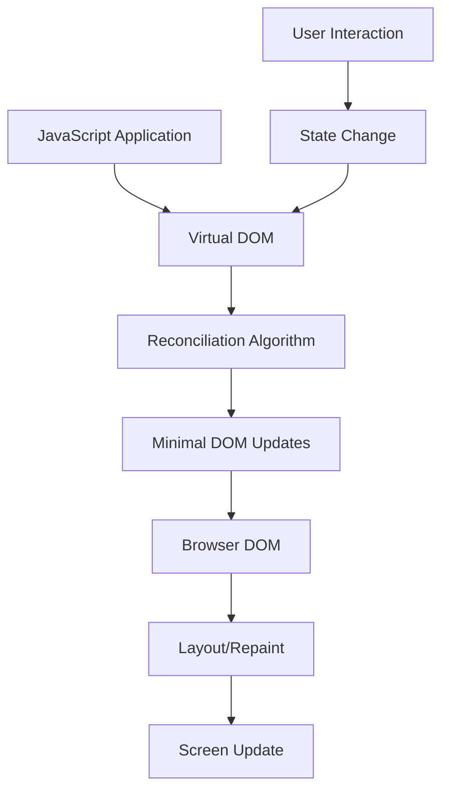
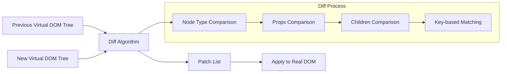
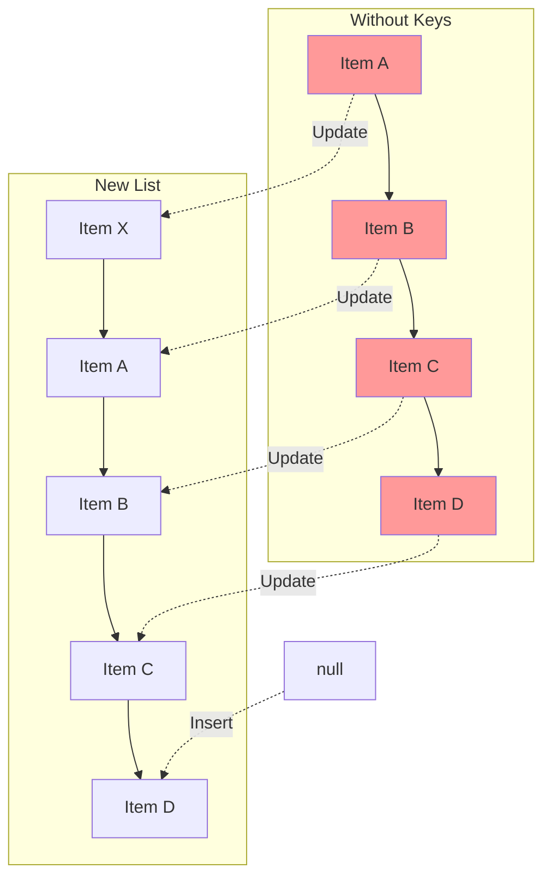
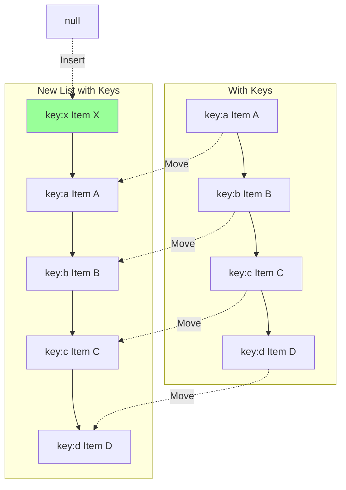
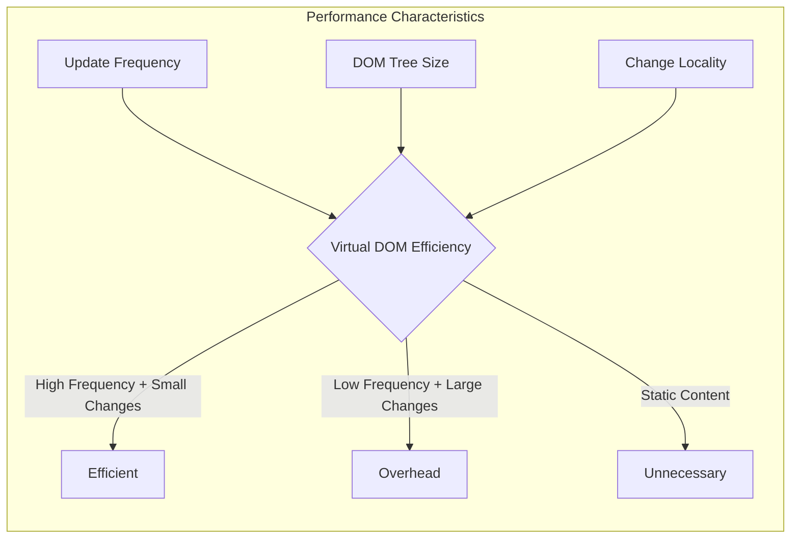
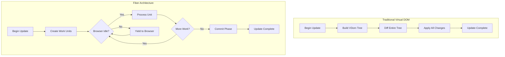

# Virtual DOM

Virtual DOMは、2013年にFacebookがReactフレームワーク[^1]を発表した際に広く知られるようになった概念である。その本質は、実際のDOM（Document Object Model）の軽量なJavaScriptオブジェクトによる表現であり、UIの状態管理と効率的な更新を実現するための抽象化レイヤーとして機能する。

Virtual DOMの登場背景には、Webアプリケーションの複雑化に伴うDOM操作のパフォーマンス問題がある。DOMはブラウザが提供するAPIであり、HTMLドキュメントの構造をプログラムから操作可能にするインターフェースだが、その操作は本質的に高コストである。これは、DOM操作がレンダリングエンジンとJavaScriptエンジンの境界を跨ぐため、またレイアウトの再計算やリペイントといった視覚的な更新処理が伴うためである。



Virtual DOMの中核的なアイデアは、DOM操作を直接行う代わりに、まず仮想的なツリー構造上で変更を行い、その後で実際のDOMへの最小限の更新を計算して適用するというものである。このアプローチにより、複数の状態変更をバッチ処理し、不要なDOM操作を排除できる。

## Virtual DOMの構造と表現

Virtual DOMノードは、実際のDOM要素を表現する単純なJavaScriptオブジェクトである。典型的なVirtual DOMノードは、要素のタイプ、属性、子要素のリストを含む。React[^2]の初期実装では、以下のような構造を持っていた：

```javascript
{
  type: 'div',
  props: {
    className: 'container',
    onClick: handleClick
  },
  children: [
    {
      type: 'h1',
      props: {},
      children: ['Hello, Virtual DOM']
    },
    {
      type: 'p',
      props: {},
      children: ['This is a paragraph']
    }
  ]
}
```

この表現は、実際のDOM要素と比較して極めて軽量である。DOM要素は数百のプロパティとメソッドを持つ重いオブジェクトであるのに対し、Virtual DOMノードは必要最小限の情報のみを保持する。この軽量性により、Virtual DOMツリー全体の再構築が高速に行える。

Virtual DOMの表現形式は、各フレームワークによって異なる最適化が施されている。Vue.js[^3]では、コンパイル時の静的解析を活用してVirtual DOMノードに追加のメタデータを付与し、実行時の差分検出を効率化している。一方、Preact[^4]のような軽量実装では、Virtual DOMノードの構造をさらに簡素化してメモリ使用量を削減している。

## 差分検出アルゴリズム（Reconciliation）

Virtual DOMの真価は、効率的な差分検出アルゴリズムにある。このプロセスは一般にReconciliation（調整）と呼ばれ、新旧のVirtual DOMツリーを比較して、実際のDOMに適用すべき最小限の変更セットを導出する。



理論的には、2つのツリー構造の最小編集距離を求める問題はO(n³)の時間計算量を要する[^5]。しかし、実用的なWebアプリケーションでは、このような厳密な解は必要ない。ReactのReconciliationアルゴリズムは、以下の2つの仮定に基づいてO(n)の時間計算量を実現している：

1. 異なるタイプの要素は異なるツリーを生成する
2. 開発者は`key`プロパティを使用して、異なるレンダリング間で子要素の同一性を示唆できる

差分検出は、ツリーのルートから深さ優先で進行する。各ノードで以下の比較を行う：

**ノードタイプの比較**：異なるタイプの要素（例：`<div>`と`<span>`）の場合、古いサブツリー全体を破棄して新しいサブツリーを構築する。これは、異なるコンポーネントが似た構造を生成する可能性が低いという経験則に基づく。

**属性の比較**：同じタイプの要素の場合、属性を比較して変更された属性のみを更新する。スタイル属性の場合は、オブジェクト全体ではなく変更されたプロパティのみを更新する。

**子要素の比較**：子要素のリストを比較する際、単純な位置ベースの比較では要素の並び替えを効率的に処理できない。そのため、`key`属性を使用して要素の同一性を追跡する。

```javascript
// Simplified reconciliation logic
function reconcile(oldNode, newNode, container) {
  if (!oldNode) {
    // Mount new node
    return mount(newNode, container);
  }
  
  if (!newNode) {
    // Unmount old node
    return unmount(oldNode, container);
  }
  
  if (oldNode.type !== newNode.type) {
    // Replace with different type
    unmount(oldNode, container);
    return mount(newNode, container);
  }
  
  // Update same type
  updateProps(oldNode, newNode);
  
  // Reconcile children
  const oldChildren = oldNode.children || [];
  const newChildren = newNode.children || [];
  
  // Key-based matching for efficient list reconciliation
  reconcileChildren(oldChildren, newChildren, oldNode.element);
}
```

## リスト要素の効率的な更新

リスト要素の更新は、Virtual DOMの差分検出において特に重要な課題である。単純な位置ベースの比較では、要素の挿入や削除が発生した場合に、後続のすべての要素が更新対象となってしまう。



この問題を解決するため、Virtual DOMは`key`属性を使用した要素の追跡を行う。`key`は各要素の一意な識別子として機能し、差分検出アルゴリズムが要素の移動を正確に検出できるようにする。



`key`を使用したリスト調整のアルゴリズムは、以下のステップで実行される：

1. 新旧のリストを走査し、`key`でマッピングを作成
2. 新しいリストの順序に従って、既存要素の移動、新規要素の挿入、不要要素の削除を計算
3. 計算された操作を最小限のDOM操作として実行

このアプローチにより、O(n)の時間計算量でリストの更新を処理できる。ただし、`key`の選択は重要であり、配列のインデックスを`key`として使用すると、要素の並び替え時に意図しない動作を引き起こす可能性がある。

## Virtual DOMの実装における最適化技術

実用的なVirtual DOM実装では、基本的な差分検出アルゴリズムに加えて、様々な最適化技術が適用されている。これらの最適化は、メモリ使用量の削減、差分検出の高速化、不要な再レンダリングの防止を目的としている。

**メモ化（Memoization）**：コンポーネントの出力をキャッシュし、入力が変わらない限り再計算を避ける。ReactのReact.memoやVue.jsのcomputed propertiesがこの技術を活用している。

```javascript
// React.memo example
const ExpensiveComponent = React.memo(({ data }) => {
  // This component only re-renders when 'data' changes
  return <ComplexVisualization data={data} />;
}, (prevProps, nextProps) => {
  // Custom comparison function
  return prevProps.data.id === nextProps.data.id;
});
```

**バッチ更新**：複数の状態変更を収集し、単一の更新サイクルでまとめて処理する。これにより、連続的な状態変更による冗長な再レンダリングを防ぐ。

**フラグメントとポータル**：Virtual DOMツリーの構造的な制約を緩和し、より柔軟なコンポーネント設計を可能にする。フラグメントは複数の要素を単一のノードとしてグループ化し、ポータルは要素を親コンポーネントのDOM階層外にレンダリングする。

**コンパイル時最適化**：Vue.jsやSvelteなどのフレームワークは、テンプレートのコンパイル時に静的解析を行い、実行時の処理を最適化する。静的な要素は差分検出から除外され、動的な部分のみが追跡される。

```javascript
// Vue.js compiled template with optimization hints
function render() {
  return _createVNode("div", null, [
    _createVNode("h1", null, "Static Title"), // Static, skipped in diff
    _createVNode("p", null, this.dynamicText, 1 /* TEXT */) // Dynamic, tracked
  ])
}
```

## Virtual DOMのパフォーマンス特性とトレードオフ

Virtual DOMは万能の解決策ではなく、特定のトレードオフを伴う技術である。その利点と制限を理解することは、適切な技術選択を行う上で重要である。

**利点**：

宣言的なプログラミングモデルにより、UIの状態管理が簡潔になる。開発者は「どのように」更新するかではなく、「何を」表示するかに集中できる。これにより、複雑なUIロジックの実装とメンテナンスが容易になる。

バッチ更新により、複数の状態変更を効率的に処理できる。従来の命令的なDOM操作では、各操作が即座に実行されるため、連続的な変更が非効率的だった。

クロスブラウザの互換性問題を抽象化できる。Virtual DOMライブラリが各ブラウザの差異を吸収するため、開発者はブラウザ固有の実装を意識する必要がない。

**制限とオーバーヘッド**：

Virtual DOMツリーの構築と差分検出には、計算コストとメモリ使用量が発生する。小規模なアプリケーションや、頻繁に更新される大規模なリストでは、このオーバーヘッドが無視できない場合がある。

初期レンダリング時には、Virtual DOMの恩恵は限定的である。すべての要素を新規作成する必要があるため、直接DOM操作と比較して追加のオーバーヘッドが発生する。

メモリ使用量は、アプリケーションの規模に比例して増加する。Virtual DOMツリーは実際のDOMのミラーであるため、大規模なアプリケーションではメモリ消費が問題となる可能性がある。



## 代替アプローチとの比較

Virtual DOMの登場以降、様々な代替アプローチが提案されている。これらの技術は、Virtual DOMの制限を克服し、特定のユースケースでより優れたパフォーマンスを実現することを目指している。

**Incremental DOM**（Google）[^6]は、Virtual DOMツリーを構築せずに、直接DOM操作を行うアプローチである。メモリ使用量が少なく、特にモバイルデバイスでの利点がある。ただし、Virtual DOMの宣言的なプログラミングモデルの一部を犠牲にしている。

**Fine-grained Reactivity**（SolidJS、Svelte）[^7]は、より細かい粒度での変更追跡を行う。各データの変更が影響する正確なDOM要素を事前に把握し、Virtual DOMの差分検出を完全に回避する。

```javascript
// SolidJS example - Fine-grained reactivity
function Counter() {
  const [count, setCount] = createSignal(0);
  
  // Only the text node updates, no diffing needed
  return <div>Count: {count()}</div>;
}
```

**Compile-time Optimization**（Svelte、Vue.js 3）は、ビルド時にテンプレートを解析し、最適化されたアップデート関数を生成する。実行時のオーバーヘッドを最小限に抑えながら、開発体験を維持する。

これらのアプローチは、Virtual DOMの概念を発展させたものであり、それぞれ異なるトレードオフを持つ。アプリケーションの要件、対象プラットフォーム、開発チームの経験に応じて、適切な技術を選択することが重要である。

## Virtual DOMの実装詳細：Fiber Architecture

React 16で導入されたFiber Architecture[^8]は、Virtual DOMの概念を大幅に拡張した実装である。従来のVirtual DOM実装では、差分検出と更新が同期的に実行されるため、大規模な更新時にメインスレッドがブロックされる問題があった。

Fiberは、レンダリング作業を小さな単位に分割し、ブラウザのアイドル時間を利用して段階的に処理を進める。これにより、アニメーションやユーザー入力への応答性を維持しながら、大規模な更新を処理できる。



Fiberの各作業単位は、Virtual DOMノードに対応するファイバーノードである。各ファイバーノードは、以下の情報を保持する：

- コンポーネントタイプと props
- 親、子、兄弟ファイバーへの参照
- 更新の優先度
- 実行済みの作業と残りの作業

この構造により、レンダリング作業を中断・再開でき、優先度に基づいて作業をスケジューリングできる。例えば、ユーザー入力への応答は、画面外の要素の更新よりも高い優先度で処理される。

## メモリ管理とガベージコレクション

Virtual DOMの実装において、メモリ管理は重要な考慮事項である。各レンダリングサイクルで新しいVirtual DOMツリーが作成されるため、適切なメモリ管理を行わないと、頻繁なガベージコレクションによるパフォーマンス低下が発生する。

多くのVirtual DOM実装では、オブジェクトプーリングやリサイクリングの技術を使用してメモリ割り当てを最適化している。例えば、Infernoフレームワーク[^9]は、Virtual DOMノードの再利用を積極的に行い、ガベージコレクションの頻度を削減している。

```javascript
// Object pooling example
const nodePool = [];
const MAX_POOL_SIZE = 10000;

function createVNode(type, props, children) {
  let node = nodePool.pop();
  if (!node) {
    node = {};
  }
  
  node.type = type;
  node.props = props;
  node.children = children;
  
  return node;
}

function recycleVNode(node) {
  if (nodePool.length < MAX_POOL_SIZE) {
    node.type = null;
    node.props = null;
    node.children = null;
    nodePool.push(node);
  }
}
```

また、WeakMapやWeakSetを使用して、コンポーネントインスタンスと関連データの参照を管理することで、不要になったコンポーネントのメモリが適切に解放されるようにしている。

## サーバーサイドレンダリングとハイドレーション

Virtual DOMは、クライアントサイドレンダリングだけでなく、サーバーサイドレンダリング（SSR）においても重要な役割を果たす。SSRでは、サーバー上でVirtual DOMツリーをHTML文字列に変換し、初期ページロードの高速化とSEOの改善を実現する。

ハイドレーションは、サーバーでレンダリングされたHTMLに対して、クライアント側でVirtual DOMを「接続」するプロセスである。このプロセスでは、既存のDOM要素を再利用しながら、イベントハンドラーの登録や状態の初期化を行う。

```javascript
// Simplified hydration process
function hydrate(vnode, container) {
  const existingNode = container.firstChild;
  
  if (canHydrate(vnode, existingNode)) {
    // Reuse existing DOM node
    attachEventHandlers(vnode, existingNode);
    hydrateChildren(vnode.children, existingNode);
  } else {
    // Fallback to client-side rendering
    container.innerHTML = '';
    render(vnode, container);
  }
}
```

ハイドレーションの課題は、サーバーとクライアントで生成されるVirtual DOMツリーが完全に一致する必要があることである。不一致が発生した場合、ハイドレーションエラーとなり、クライアント側での完全な再レンダリングが必要になる。

## 今後の発展方向

Virtual DOMの概念は、Web開発における重要なパラダイムシフトをもたらしたが、技術の進化は続いている。WebAssemblyの普及により、Virtual DOM実装の一部をより高速な言語で記述する試みが行われている。また、Web Componentsとの統合により、Virtual DOMベースのコンポーネントをネイティブなWeb標準として扱う可能性も探られている。

並行レンダリングやストリーミングSSRなどの新しい技術は、Virtual DOMの基本概念を拡張し、より高度なユーザー体験を実現している。これらの技術は、Virtual DOMの宣言的なプログラミングモデルを維持しながら、パフォーマンスと柔軟性を向上させている。

Virtual DOMは、その登場から10年以上が経過した現在でも、多くのフレームワークの中核技術として使用されている。その概念は、効率的なUI更新という具体的な問題を解決するだけでなく、宣言的プログラミングとパフォーマンスの両立という、より広範な課題への一つの解答を示している。技術の選択においては、Virtual DOMの利点と制限を理解し、アプリケーションの要件に応じた適切な判断を行うことが重要である。

[^1]: React: A JavaScript library for building user interfaces. https://reactjs.org/
[^2]: React's Design Principles. https://reactjs.org/docs/design-principles.html
[^3]: Vue.js: The Progressive JavaScript Framework. https://vuejs.org/
[^4]: Preact: Fast 3kB alternative to React. https://preactjs.com/
[^5]: Zhang, K., & Shasha, D. (1989). Simple fast algorithms for the editing distance between trees and related problems. SIAM journal on computing, 18(6), 1245-1262.
[^6]: Incremental DOM. https://google.github.io/incremental-dom/
[^7]: SolidJS: Simple and performant reactivity for building user interfaces. https://www.solidjs.com/
[^8]: Lin, A. (2017). React Fiber Architecture. https://github.com/acdlite/react-fiber-architecture
[^9]: Inferno: An extremely fast React-like JavaScript library. https://infernojs.org/