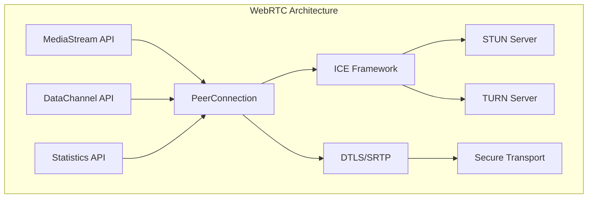
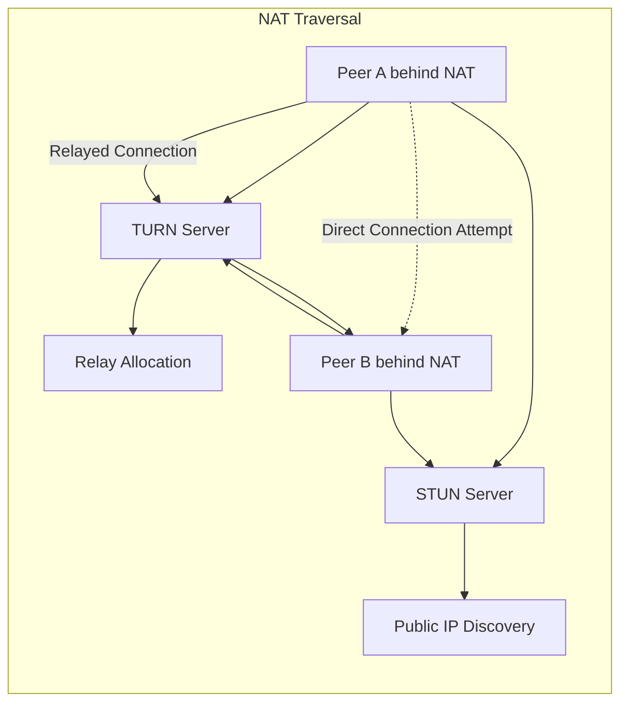
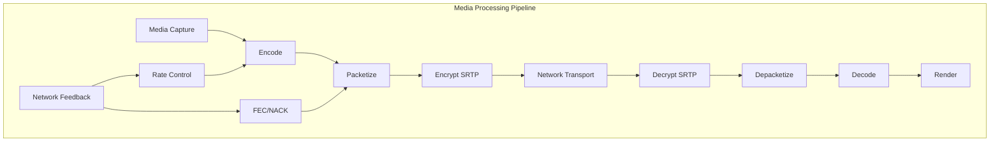
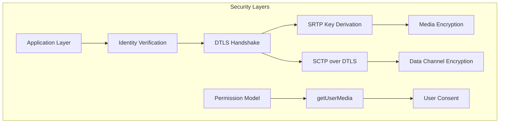
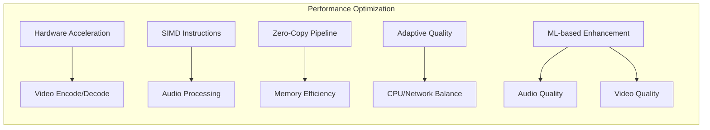

# WebRTC

WebRTC（Web Real-Time Communication）は、ウェブブラウザやモバイルアプリケーション間でリアルタイムにオーディオ、ビデオ、データを直接やり取りするためのオープンスタンダードであり、プラグインや外部ソフトウェアを必要とせずにピアツーピア通信を実現する技術体系である。W3CとIETFによって標準化されたこの技術は、シグナリングサーバーを介した初期接続確立後は、ピア間で直接的なメディアストリームの送受信を可能にし、低遅延かつ高品質なリアルタイム通信を実現する。

WebRTCの中核となる設計思想は、複雑なリアルタイム通信技術をウェブ開発者が簡単に利用できるようにすることであり、そのためにメディアキャプチャ、コーデック選択、ネットワーク最適化、セキュリティ、NAT越えといった低レベルの詳細を抽象化したAPIを提供している。この抽象化により、開発者はアプリケーションのビジネスロジックに集中でき、通信インフラストラクチャの複雑さから解放される。



## アーキテクチャと主要コンポーネント

WebRTCのアーキテクチャは、メディアプレーン、シグナリングプレーン、ネットワークプレーンの3つの論理的な層で構成される。メディアプレーンはオーディオとビデオの取得、エンコード、送受信を担当し、シグナリングプレーンはセッションの確立と管理を行い、ネットワークプレーンはNAT越えと接続性の確保を担当する。これらの層は相互に連携しながら、エンドツーエンドの通信を実現する。

RTCPeerConnectionは、WebRTCの中心的なAPIであり、ピア間の接続を表現するオブジェクトである。このオブジェクトは、メディアストリームの追加と削除、リモートピアとのオファー/アンサー交換、ICE候補の収集と交換、接続状態の監視といった機能を提供する。RTCPeerConnectionの内部では、複数のプロトコルスタックが協調して動作し、信頼性のあるリアルタイム通信を実現している[^1]。

メディアストリームトラックは、オーディオまたはビデオの単一のソースを表現する基本単位である。各トラックは、マイクロフォン、カメラ、画面共有などのメディアソースから生成され、RTCPeerConnectionを通じてリモートピアに送信される。トラックは動的に追加、削除、置換が可能であり、通信中のメディア構成の変更を柔軟に行うことができる。

```mermaid
sequenceDiagram
    participant A as Peer A
    participant S as Signaling Server
    participant B as Peer B
    
    A->>A: Create RTCPeerConnection
    B->>B: Create RTCPeerConnection
    A->>A: Add MediaStream
    A->>A: CreateOffer
    A->>S: Send Offer SDP
    S->>B: Forward Offer SDP
    B->>B: SetRemoteDescription
    B->>B: Add MediaStream
    B->>B: CreateAnswer
    B->>S: Send Answer SDP
    S->>A: Forward Answer SDP
    A->>A: SetRemoteDescription
    A->>S: ICE Candidate
    S->>B: Forward ICE Candidate
    B->>S: ICE Candidate
    S->>A: Forward ICE Candidate
    A<-->B: Direct P2P Connection
```

## シグナリングとセッション確立

WebRTCにおけるシグナリングは、ピア間の通信を確立するために必要なメタデータの交換プロセスである。興味深いことに、WebRTC仕様はシグナリングプロトコルを規定しておらず、開発者が自由に選択できるようになっている。この設計決定により、既存のシグナリングインフラストラクチャ（SIP、XMPP、独自プロトコルなど）との統合が容易になり、様々なユースケースに対応できる柔軟性を提供している。

セッション確立の中核となるのは、オファー/アンサーモデルである。このモデルでは、通信を開始するピア（オファラー）がセッション記述プロトコル（SDP）形式でオファーを生成し、それには利用可能なメディア形式、コーデック、ネットワーク情報が含まれる。受信側のピア（アンサラー）は、このオファーを検討し、自身の能力と制約に基づいてアンサーSDPを生成する。このネゴシエーションプロセスにより、両ピアが合意したメディアパラメータで通信が確立される。

SDPは、もともとマルチメディアセッションを記述するために設計されたテキストベースのプロトコルであるが、WebRTCでは拡張され、ICE候補、DTLSフィンガープリント、メディアストリームの識別子など、追加の情報を含むようになっている[^2]。SDPの各行は特定の意味を持ち、セッションレベルとメディアレベルの情報を階層的に記述する。

## ICEフレームワークとNAT越え

Interactive Connectivity Establishment（ICE）は、NAT（Network Address Translation）やファイアウォールが存在するネットワーク環境において、ピア間の最適な通信経路を発見するためのフレームワークである。現代のインターネットでは、大部分のデバイスがNATの背後に存在するため、直接的なピアツーピア接続の確立は技術的に困難である。ICEは、この問題を体系的に解決するために設計された。

ICEの動作プロセスは、候補収集、接続性チェック、候補ペアの優先順位付けという3つの主要なフェーズで構成される。候補収集フェーズでは、ローカルIPアドレス（ホスト候補）、STUNサーバーから取得したパブリックIPアドレス（サーバーリフレクシブ候補）、TURNサーバーから割り当てられたリレーアドレス（リレー候補）を収集する。これらの候補は、到達可能性の観点から異なる特性を持ち、ICEはすべての候補を試行して最適な経路を選択する。



STUNプロトコルは、クライアントが自身のパブリックIPアドレスとポート番号を発見するための軽量なプロトコルである。STUNサーバーは、受信したリクエストの送信元アドレスをレスポンスに含めて返すことで、クライアントがNATによって変換された後のアドレスを知ることができる。しかし、対称NAT（Symmetric NAT）の場合、宛先ごとに異なるポートマッピングが作成されるため、STUNだけでは接続を確立できない場合がある。

TURNプロトコルは、直接接続が不可能な場合のフォールバックメカニズムとして機能する。TURNサーバーは、クライアントに代わってデータをリレーし、実質的にプロキシとして動作する。これにより、最も制限的なネットワーク環境でも通信が可能になるが、すべてのメディアデータがTURNサーバーを経由するため、帯域幅とサーバーリソースのコストが発生する。そのため、ICEは可能な限り直接接続を優先し、TURNは最後の手段として使用される。

## メディア処理とコーデック

WebRTCのメディア処理パイプラインは、キャプチャ、エンコード、パケット化、送信、受信、デパケット化、デコード、レンダリングという一連のステージで構成される。各ステージは、リアルタイム性を維持しながら、ネットワーク条件の変動に適応する必要がある。この適応性は、動的なビットレート調整、フレームレート制御、解像度スケーリングなどの技術によって実現される。

音声コーデックとして、WebRTCは必須コーデックとしてOpusとG.711（PCMU/PCMA）をサポートする。Opusは、6 kbpsから510 kbpsまでの幅広いビットレートに対応し、音声と音楽の両方に最適化された汎用性の高いコーデックである。Opusの特徴的な機能として、ネットワーク条件に応じた動的なビットレート調整、前方誤り訂正（FEC）、不連続伝送（DTX）がある。これらの機能により、パケットロスが発生する不安定なネットワーク環境でも、音声品質を維持できる[^3]。

映像コーデックについては、VP8とH.264が必須コーデックとして規定されており、より新しいVP9やAV1のサポートも進んでいる。これらのコーデックは、時間的・空間的冗長性を利用した圧縮を行い、限られた帯域幅で高品質な映像を伝送する。特に重要なのは、リアルタイム通信に適したエラー耐性機能であり、参照フレームの管理、イントラリフレッシュ、スケーラブルビデオコーディング（SVC）などの技術が活用される。



## RTCDataChannel

RTCDataChannelは、任意のアプリケーションデータをピア間で直接交換するための双方向通信チャネルである。メディアストリームとは異なり、データチャネルはSCTP（Stream Control Transmission Protocol）over DTLSを使用し、信頼性のある順序付き配送、信頼性のある順序なし配送、部分的に信頼性のある配送など、様々な配送保証を提供する。この柔軟性により、チャット、ファイル転送、ゲームの状態同期など、多様なユースケースに対応できる。

SCTPの採用は、WebRTCにおける興味深い設計選択である。SCTPは、TCPの信頼性とUDPの低遅延性を組み合わせた特性を持ち、マルチストリーミング、マルチホーミング、部分的信頼性などの高度な機能を提供する。WebRTCでは、SCTPをDTLS上で動作させることで、暗号化されたデータグラム上で信頼性のあるデータ転送を実現している。各データチャネルは、SCTP内の独立したストリームとして実装され、ヘッドオブラインブロッキングを回避できる。

データチャネルの確立プロセスは、インバンドとアウトオブバンドの2つの方法がある。インバンド方式では、データチャネルの作成がSCTPアソシエーション上で直接ネゴシエートされ、追加のシグナリングを必要としない。一方、アウトオブバンド方式では、シグナリングチャネルを通じてデータチャネルのパラメータが交換される。実用上は、インバンド方式が簡潔で推奨される方法である。

## セキュリティアーキテクチャ

WebRTCのセキュリティは、多層防御の原則に基づいて設計されている。すべてのメディアとデータの通信は必須で暗号化され、中間者攻撃やパケット盗聴から保護される。この暗号化は、メディアストリームに対してはSRTP（Secure Real-time Transport Protocol）、データチャネルとシグナリングに対してはDTLS（Datagram Transport Layer Security）によって提供される。

DTLSは、TLSプロトコルをデータグラム転送に適応させたものであり、パケットロスや順序の入れ替わりに対して耐性を持つ。WebRTCでは、DTLS-SRTPと呼ばれる方式を使用し、DTLSハンドシェイクで鍵交換を行い、その鍵をSRTPで使用する。この方式により、シグナリングサーバーを信頼する必要がなく、エンドツーエンドのセキュリティが保証される[^4]。

認証メカニズムとして、WebRTCはアイデンティティプロバイダー（IdP）との統合をサポートする。IdPは、ユーザーの身元を検証し、その証明をRTCPeerConnectionに提供する。この仕組みにより、通信相手の真正性を暗号学的に検証でき、なりすましを防ぐことができる。ただし、IdPの実装は複雑であり、多くの実装では別の認証メカニズムを使用している。



## 適応的ストリーミングとQoS

リアルタイム通信において、ネットワーク条件は常に変動し、利用可能な帯域幅、遅延、パケットロス率が動的に変化する。WebRTCは、これらの変動に適応するための洗練されたメカニズムを実装している。送信側ビットレート適応（Sender Side BWE）と受信側ビットレート適応（Receiver Side BWE）の組み合わせにより、利用可能な帯域幅を継続的に推定し、送信レートを調整する。

輻輳制御アルゴリズムは、WebRTCの品質保証の中核である。Google Congestion Control（GCC）は、遅延ベースと損失ベースの両方のシグナルを使用して、ネットワークの輻輳を検出する。遅延の増加傾向（キューイング遅延）を検出すると送信レートを減少させ、安定した遅延が観測されると徐々にレートを増加させる。この適応的な振る舞いにより、ネットワークリソースを効率的に利用しながら、低遅延を維持できる。

ジッターバッファは、ネットワークジッター（パケット到着時間の変動）を吸収し、スムーズな再生を実現する重要なコンポーネントである。適応的ジッターバッファは、現在のネットワーク条件に基づいてバッファサイズを動的に調整し、遅延とパケットロスのトレードオフを最適化する。バッファが小さすぎるとパケットロスが増加し、大きすぎると遅延が増加するため、この調整は継続的に行われる必要がある。

前方誤り訂正（FEC）と再送要求（NACK）は、パケットロスに対する補完的な対策である。FECは、冗長データを送信することで、一定数のパケットロスを受信側で回復できるようにする。一方、NACKは、失われたパケットの再送を要求するメカニズムである。WebRTCは、ネットワーク条件とアプリケーション要件に基づいて、これらの技術を動的に選択・調整する。

## パフォーマンス最適化

WebRTCの性能は、CPU使用率、メモリ消費、ネットワーク効率、電力消費など、複数の側面から評価される。特にモバイルデバイスでは、電力効率が重要な考慮事項となる。ハードウェアアクセラレーションは、これらの課題に対する主要な解決策であり、専用のビデオエンコード/デコードハードウェアを活用することで、CPU負荷を大幅に削減できる。

メディアパイプラインの最適化として、ゼロコピー技術の活用が重要である。従来のメディア処理では、データが複数のバッファ間でコピーされることが多く、メモリ帯域幅とCPUサイクルを消費する。WebRTCの実装では、可能な限りデータのコピーを避け、ポインタの受け渡しによってデータを共有する。これにより、特に高解像度ビデオの処理において、大幅な性能向上が実現される。

エコーキャンセレーション、ノイズ抑制、自動ゲイン制御などの音声処理アルゴリズムも、計算集約的なタスクである。これらのアルゴリズムは、SIMD（Single Instruction Multiple Data）命令を活用して並列化され、リアルタイム処理の要件を満たす。さらに、機械学習ベースの音声強調技術の導入により、より高品質な音声体験が提供されるようになっている。



## スケーラビリティとマルチパーティ通信

WebRTCは基本的にピアツーピア技術として設計されているが、3人以上の参加者による会議には追加のアーキテクチャが必要となる。メッシュトポロジー、MCU（Multipoint Control Unit）、SFU（Selective Forwarding Unit）という3つの主要なアプローチがあり、それぞれ異なるトレードオフを持つ。

メッシュトポロジーでは、各参加者が他のすべての参加者と直接接続を確立する。このアプローチは、参加者数が少ない場合（通常4-5人まで）には効果的であるが、接続数がn(n-1)/2で増加するため、スケーラビリティに限界がある。各参加者は、n-1本のビデオストリームをエンコードして送信する必要があり、CPU使用率と上り帯域幅の要件が急速に増加する。

MCUアプローチでは、中央サーバーがすべてのメディアストリームを受信し、デコード、ミキシング、再エンコードを行って、各参加者に単一の合成ストリームを送信する。この方式は、クライアントの負荷を最小化し、レガシーシステムとの相互運用性を提供するが、サーバー側で高いCPU使用率が発生し、エンドツーエンドの暗号化が困難になる。

SFUは、メディアストリームをデコードせずに選択的に転送することで、スケーラビリティとリソース効率のバランスを実現する。SFUは、各参加者から受信したストリームを、他の参加者のネットワーク条件と要求に基づいて適切に配信する。サイマルキャスト（複数品質のストリームを同時送信）やSVC（Scalable Video Coding）との組み合わせにより、受信者ごとに最適な品質を提供できる。

## 実装の考慮事項

WebRTCアプリケーションの実装において、エラーハンドリングと状態管理は重要な課題である。RTCPeerConnectionは、複雑な状態機械を内部に持ち、接続状態、ICE収集状態、シグナリング状態などが独立して変化する。これらの状態遷移を適切に処理し、エラー条件から回復するロジックの実装が、堅牢なアプリケーションの鍵となる。

メモリリークは、長時間実行されるWebRTCアプリケーションで特に注意が必要な問題である。メディアストリーム、ピア接続、イベントリスナーなどのリソースは、明示的に解放する必要がある。特に、SPAやリアクティブフレームワークと組み合わせる場合、コンポーネントのライフサイクルに合わせた適切なクリーンアップが不可欠である。

ブラウザ間の互換性も継続的な課題である。WebRTC仕様は標準化されているが、実装の詳細や拡張機能はブラウザごとに異なる。統計情報API、画面共有API、コーデックサポートなどの領域で差異が存在し、クロスブラウザ対応のためのポリフィルやアダプターレイヤーが必要になることがある。adapter.jsのようなライブラリは、これらの差異を吸収し、一貫したAPIを提供する役割を果たす[^5]。

---

[^1]: RFC 8825: "Overview: Real-Time Protocols for Browser-Based Applications"
[^2]: RFC 8866: "SDP: Session Description Protocol"
[^3]: RFC 6716: "Definition of the Opus Audio Codec"
[^4]: RFC 5764: "Datagram Transport Layer Security (DTLS) Extension to Establish Keys for the Secure Real-time Transport Protocol (SRTP)"
[^5]: W3C WebRTC 1.0: "Real-time Communication Between Browsers"