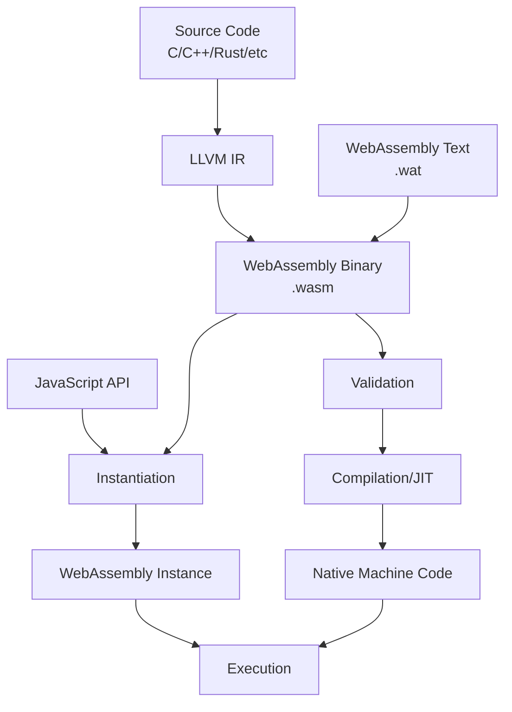
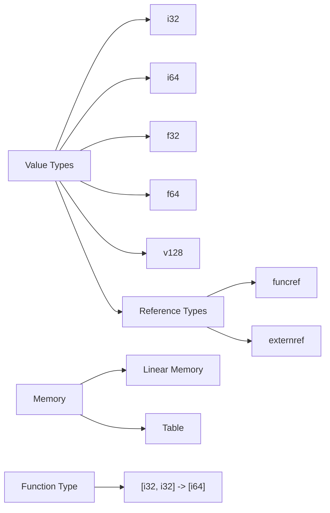
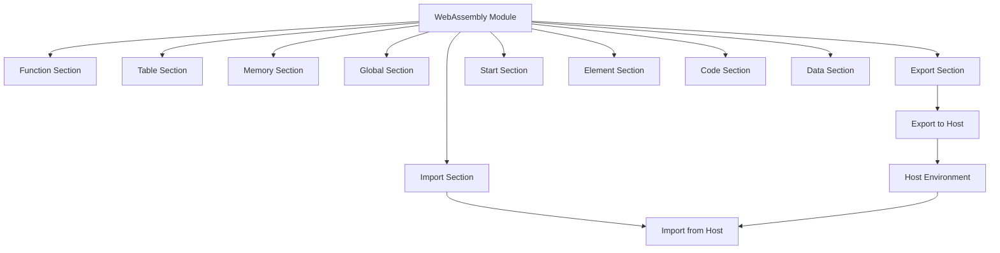
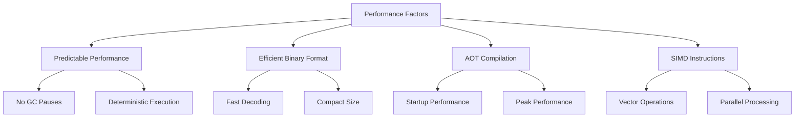
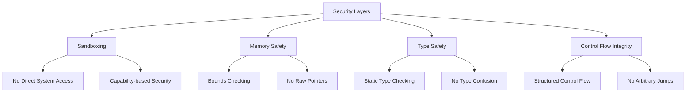
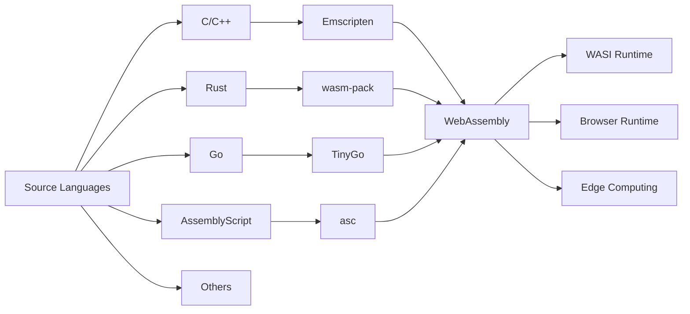

# WebAssembly

WebAssembly（略称：Wasm）は、Webブラウザ上でネイティブに近い実行速度を実現するために設計された低レベルバイナリ命令フォーマットである。2015年にMozilla、Google、Microsoft、Appleの主要ブラウザベンダーによって共同で開発が開始され、2017年にはW3Cによって正式に標準化された[^1]。WebAssemblyの登場は、Webプラットフォームにおける計算集約的なアプリケーションの実行可能性を大きく広げ、従来はネイティブアプリケーションの領域とされていた多くのユースケースをWebブラウザ上で実現可能にした。

WebAssemblyの設計は、いくつかの重要な原則に基づいている。第一に、高速な実行を可能にするための効率的なバイナリフォーマットである必要がある。第二に、既存のWebプラットフォームのセキュリティモデルと調和し、サンドボックス環境内で安全に実行される必要がある。第三に、様々なプログラミング言語からのコンパイルターゲットとして機能し、言語に依存しない実行環境を提供する必要がある。これらの原則は、WebAssemblyのアーキテクチャと実装に深く反映されている。

## アーキテクチャと実行モデル

WebAssemblyの実行モデルは、スタックベースの仮想マシンを基礎としている。この設計選択は、コンパクトなバイナリ表現と効率的な実行の両立を可能にしている。WebAssemblyの命令セットは、単純化されたセマンティクスを持ち、各命令は明確に定義された型付きのオペランドスタックに対して操作を行う。



WebAssemblyモジュールの実行は、複数の段階を経て行われる。まず、バイナリ形式（.wasm）またはテキスト形式（.wat）で表現されたモジュールがロードされる。次に、厳密な検証プロセスが実行され、型安全性とメモリ安全性が保証される。検証に成功したモジュールは、ブラウザのJavaScriptエンジンによってコンパイルされ、最適化された機械語コードに変換される。この過程では、多くの実装がTiered Compilationアプローチを採用しており、初期の高速なベースラインコンパイルと、後続の最適化コンパイルを組み合わせている[^2]。

WebAssemblyの命令セットアーキテクチャは、意図的に最小限に保たれている。基本的な算術演算、メモリアクセス、制御フロー、関数呼び出しなどの必須機能のみが含まれ、複雑な命令は含まれていない。この設計により、様々なハードウェアアーキテクチャへの効率的なマッピングが可能となり、クロスプラットフォームでの性能の予測可能性が向上している。

## 型システムとメモリモデル

WebAssemblyの型システムは、静的型付けに基づいており、実行時の型エラーを防ぐための強力な保証を提供する。基本的な値型として、32ビットおよび64ビットの整数型（i32、i64）と浮動小数点型（f32、f64）が定義されている。WebAssembly 2.0仕様では、これらに加えてベクトル型（v128）と参照型（funcref、externref）が追加された[^3]。



メモリモデルは、WebAssemblyの設計において特に重要な要素である。WebAssemblyは線形メモリモデルを採用しており、各モジュールは連続したバイト配列として表現されるメモリ空間を持つ。このメモリは、64KBのページ単位で管理され、実行時に動的に拡張可能である。重要な点として、WebAssemblyのメモリアクセスは常に境界チェックが行われ、範囲外アクセスはトラップ（実行時エラー）を引き起こす。

メモリの共有に関しては、WebAssembly Threads提案により、複数のWebAssemblyインスタンス間でのメモリ共有が可能となった[^4]。これにより、SharedArrayBufferを介してマルチスレッドプログラミングが可能となり、並列計算のユースケースが大きく広がった。ただし、共有メモリの使用には、アトミック操作命令の使用が必須であり、データ競合を防ぐための適切な同期機構が必要となる。

## モジュールシステム

WebAssemblyのモジュールシステムは、コードの再利用性とモジュラリティを実現するための重要な機構である。各WebAssemblyモジュールは、独立した名前空間を持ち、明示的にエクスポートされた関数、メモリ、テーブル、グローバル変数のみが外部から参照可能である。同様に、モジュールは必要な外部リソースをインポートとして宣言する必要がある。



モジュールの構造は、明確に定義されたセクションに分割されている。各セクションは特定の目的を持ち、決められた順序で配置される必要がある。この構造化されたフォーマットにより、効率的なストリーミングコンパイルが可能となり、モジュール全体のダウンロードを待つことなく、部分的にコンパイルを開始できる。

WebAssembly Component Model提案は、より高度なモジュール間の相互運用性を実現することを目的としている[^5]。この提案では、インターフェース定義言語（IDL）を使用して、より豊富な型システムとコンポーネント間の通信プロトコルを定義できるようになる。これにより、異なる言語で実装されたコンポーネント間での、より自然な相互運用が可能となる。

## JavaScriptとの相互運用

WebAssemblyとJavaScriptの相互運用性は、Webプラットフォームへの統合において最も重要な要素の一つである。WebAssembly JavaScript APIは、JavaScriptコードからWebAssemblyモジュールをロード、コンパイル、インスタンス化、実行するための標準的なインターフェースを提供する。

JavaScriptからWebAssemblyへの値の受け渡しは、型変換を伴う。数値型は直接変換されるが、より複雑なデータ構造の受け渡しには、線形メモリを介した手動のマーシャリングが必要となる。この制約は、WebAssembly Interface Types提案によって将来的に緩和される予定である[^6]。

```javascript
// WebAssembly module loading and instantiation
const response = await fetch('module.wasm');
const buffer = await response.arrayBuffer();
const module = await WebAssembly.compile(buffer);
const instance = await WebAssembly.instantiate(module, {
    env: {
        imported_func: (arg) => {
            console.log(`Called from WebAssembly: ${arg}`);
        }
    }
});

// Calling WebAssembly functions from JavaScript
const result = instance.exports.exported_func(42);
```

相互運用における性能面では、JavaScript-WebAssembly間の境界を越える関数呼び出しにはオーバーヘッドが存在する。このオーバーヘッドは、頻繁な相互呼び出しを避け、バッチ処理を行うことで最小化できる。また、SharedArrayBufferを使用することで、メモリコピーを避けながら大量のデータを共有することが可能である。

## 性能特性と最適化

WebAssemblyの性能特性は、その設計目標の中核をなすものである。ネイティブコードと比較して、WebAssemblyは一般的に50%から90%の実行速度を達成することができる[^7]。この性能は、いくつかの要因によって実現されている。

第一に、WebAssemblyのバイナリフォーマットは、高速なデコードと検証を可能にするよう設計されている。構造化された制御フローと明示的な型情報により、単一パスでの検証が可能であり、コンパイル時間が大幅に短縮される。第二に、レジスタ割り当てや命令スケジューリングなどの低レベル最適化の多くは、ソース言語のコンパイラ（LLVMなど）によって事前に実行されるため、ブラウザ側での最適化負荷が軽減される。



最適化の観点では、WebAssembly SIMDは特に注目に値する。128ビットのベクトル演算をサポートすることで、画像処理、音声処理、機械学習などの計算集約的なタスクにおいて、大幅な性能向上を実現している。SIMD命令は、多くのモダンなCPUアーキテクチャで直接サポートされているため、効率的な実行が可能である。

メモリ管理に関しては、WebAssemblyは現在ガベージコレクションを持たないため、手動でのメモリ管理が必要である。これは、予測可能な性能を実現する一方で、メモリリークのリスクを伴う。WebAssembly GC提案は、この問題に対処し、高レベル言語のより自然なサポートを可能にすることを目指している[^8]。

## セキュリティモデル

WebAssemblyのセキュリティモデルは、Webプラットフォームの既存のセキュリティ原則に基づいて構築されている。最も基本的なレベルでは、WebAssemblyコードは常にサンドボックス環境内で実行され、ホストシステムへの直接的なアクセスは持たない。すべてのシステムリソースへのアクセスは、明示的にインポートされたホスト関数を通じてのみ可能である。

メモリ安全性は、複数のメカニズムによって保証される。線形メモリへのすべてのアクセスは境界チェックされ、関数ポインタは間接呼び出しテーブルを介してのみアクセス可能である。これにより、バッファオーバーフローや任意コード実行などの一般的な脆弱性が防止される。



制御フローの完全性も、WebAssemblyの重要なセキュリティ機能である。構造化された制御フロー命令のみが許可され、任意のジャンプは不可能である。これにより、Return-Oriented Programming（ROP）などの攻撃手法が効果的に防止される。

サプライチェーンセキュリティの観点では、WebAssemblyモジュールの検証可能性が重要である。モジュールのハッシュ値を使用したIntegrity Checkや、WebAssembly Binary Toolkitなどのツールを使用した静的解析により、悪意のあるコードの混入を検出できる。

## ツールチェーンとエコシステム

WebAssemblyのエコシステムは、急速に成熟しており、多様なツールチェーンが利用可能である。Emscriptenは、C/C++コードをWebAssemblyにコンパイルするための最も成熟したツールチェーンであり、POSIXエミュレーション層を提供することで、既存のコードベースの移植を容易にしている[^9]。

Rustエコシステムは、WebAssemblyのファーストクラスサポートを提供しており、wasm-packやwasm-bindgenなどのツールにより、JavaScriptとの相互運用性が大幅に向上している。これらのツールは、型安全なバインディングの自動生成や、npm パッケージとしての配布を可能にしている。



WebAssembly System Interface（WASI）は、WebAssemblyをブラウザ外で実行するための標準化されたシステムインターフェースである[^10]。WASIにより、ファイルシステム、ネットワーク、その他のシステムリソースへの移植可能なアクセスが可能となり、サーバーサイドやエッジコンピューティングでのWebAssemblyの使用が現実的になった。

開発ツールの面では、Chrome DevToolsやFirefox Developer Toolsが、WebAssemblyのデバッグサポートを提供している。ソースマップのサポートにより、元のソースコードレベルでのデバッグが可能であり、パフォーマンスプロファイリングツールも利用できる。

WebAssemblyの将来的な発展として、いくつかの重要な提案が進行中である。Exception Handling提案は、より効率的な例外処理メカニズムを提供し、Tail Call提案は、関数型プログラミングパラダイムのより良いサポートを可能にする。これらの機能拡張により、WebAssemblyはより幅広いユースケースに対応できるようになることが期待される。

実装における現実的な課題としては、モジュールサイズの最適化が挙げられる。WebAssemblyバイナリは一般的にgzip圧縮後のJavaScriptコードよりも大きくなる傾向があり、ネットワーク帯域幅が制限される環境では問題となる可能性がある。wasm-optなどの最適化ツールや、動的リンキングによるコード共有が、この問題の緩和に役立っている。

パフォーマンスの予測可能性は、WebAssemblyの大きな利点であるが、完全ではない。特に、メモリアクセスパターンやキャッシュ効果は、実行環境によって大きく異なる可能性がある。また、JavaScriptとの頻繁な相互運用は、性能のボトルネックとなる可能性があるため、アーキテクチャ設計段階での慎重な検討が必要である。

[^1]: WebAssembly Core Specification, W3C Recommendation, 5 December 2019. https://www.w3.org/TR/wasm-core-1/

[^2]: Haas, A., Rossberg, A., Schuff, D. L., Titzer, B. L., Holman, M., Gohman, D., ... & Bastien, J. F. (2017). Bringing the web up to speed with WebAssembly. ACM SIGPLAN Notices, 52(6), 185-200.

[^3]: WebAssembly Core Specification Version 2.0, W3C Working Draft. https://webassembly.github.io/spec/core/

[^4]: WebAssembly Threads Proposal. https://github.com/WebAssembly/threads

[^5]: WebAssembly Component Model. https://github.com/WebAssembly/component-model

[^6]: WebAssembly Interface Types Proposal. https://github.com/WebAssembly/interface-types

[^7]: Jangda, A., Powers, B., Berger, E. D., & Guha, A. (2019). Not so fast: Analyzing the performance of WebAssembly vs. native code. In 2019 USENIX Annual Technical Conference (pp. 107-120).

[^8]: WebAssembly Garbage Collection Proposal. https://github.com/WebAssembly/gc

[^9]: Zakai, A. (2011). Emscripten: an LLVM-to-JavaScript compiler. In Proceedings of the ACM international conference companion on Object oriented programming systems languages and applications companion (pp. 301-312).

[^10]: WASI: WebAssembly System Interface. https://wasi.dev/