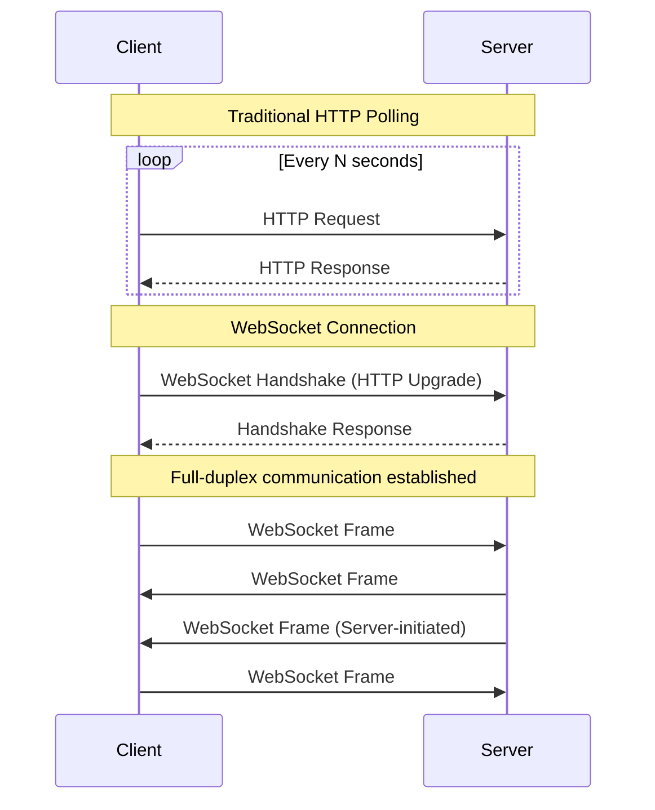
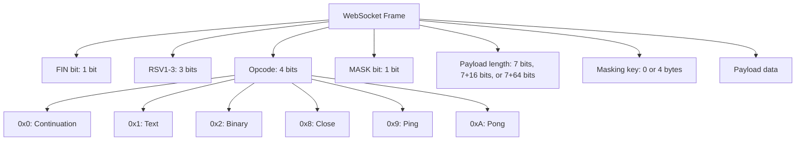
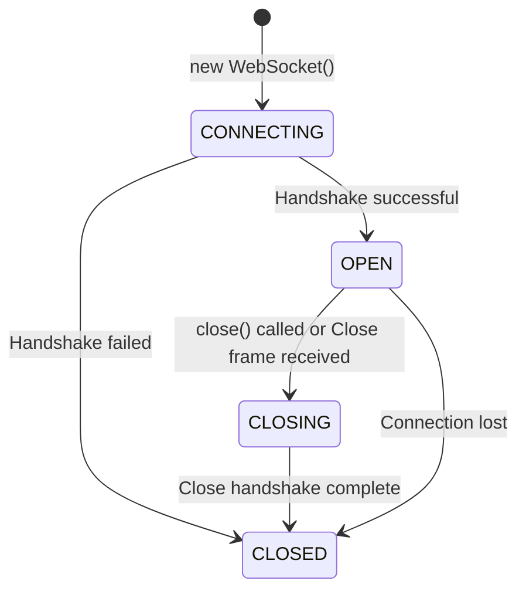
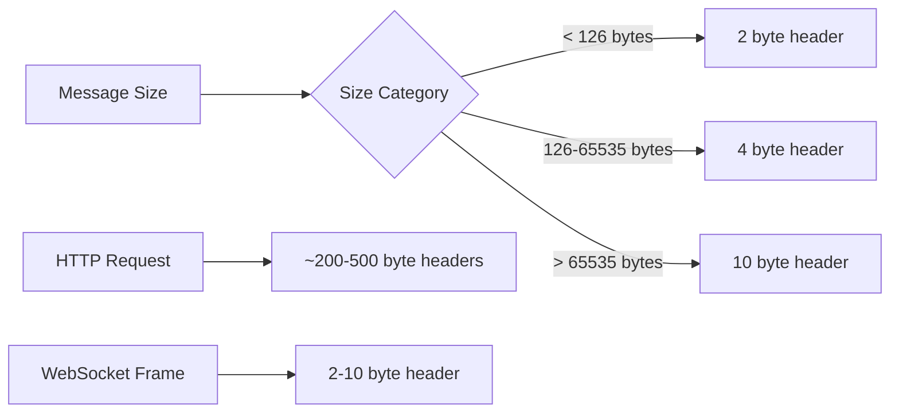
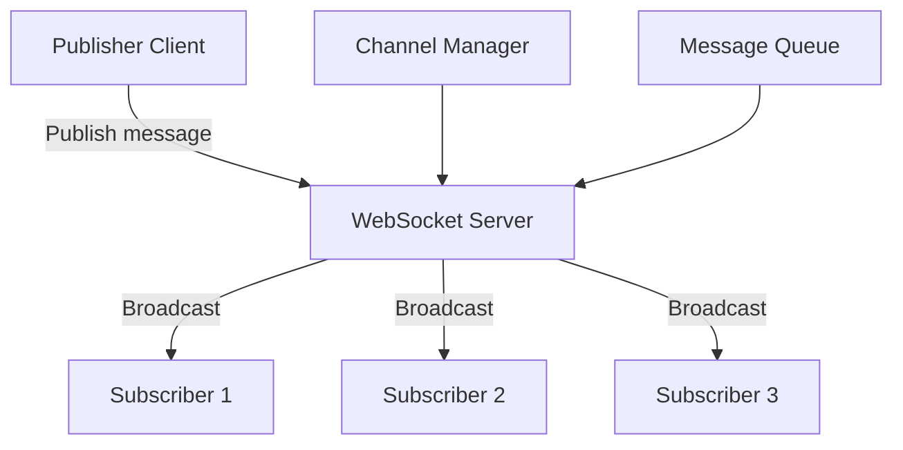
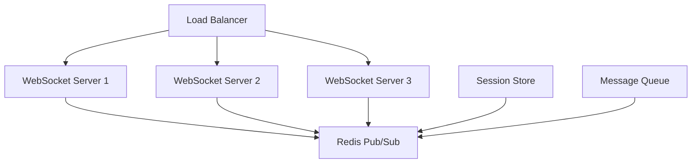

# WebSocket

WebSocketは、単一のTCP接続上で全二重通信チャネルを提供するプロトコルである。従来のHTTPリクエスト・レスポンスモデルが抱えていた制約を克服し、サーバーとクライアント間でリアルタイムかつ双方向のデータ交換を可能にする。RFC 6455[^1]として標準化されたこのプロトコルは、現代のWebアプリケーションにおいて、チャット、ゲーム、金融取引、協調編集といったリアルタイム性が要求される機能の実装に不可欠な技術となっている。

HTTPの制約として最も顕著なのは、クライアントが常に通信を開始しなければならない点である。サーバーからクライアントへの能動的なデータ送信が必要な場合、ポーリング、ロングポーリング、Server-Sent Events（SSE）といった回避策が使われてきた。しかし、これらの手法はそれぞれ遅延、リソース消費、単方向性といった課題を抱えている。WebSocketは、これらの問題を根本的に解決するために設計された。



WebSocketプロトコルは、HTTPのアップグレード機構を利用して接続を確立する。この設計により、既存のHTTPインフラストラクチャ（プロキシ、ファイアウォール、ロードバランサー）との互換性を保ちながら、永続的な接続を実現している。プロトコルレベルでは、最小限のフレーミングオーバーヘッドで効率的なデータ転送を実現し、テキストとバイナリの両方のデータタイプをネイティブにサポートする。

## プロトコルの詳細仕様

WebSocketプロトコルは、開始ハンドシェイクとデータ転送の2つのフェーズで構成される。ハンドシェイクフェーズでは、HTTPプロトコルを使用してWebSocket接続へのアップグレードを交渉する。このプロセスは、HTTPの`Upgrade`ヘッダーを使用して実現される。

クライアントは以下のようなHTTPリクエストを送信する：

```
GET /chat HTTP/1.1
Host: server.example.com
Upgrade: websocket
Connection: Upgrade
Sec-WebSocket-Key: dGhlIHNhbXBsZSBub25jZQ==
Origin: http://example.com
Sec-WebSocket-Protocol: chat, superchat
Sec-WebSocket-Version: 13
```

`Sec-WebSocket-Key`は、クライアントがランダムに生成した16バイトの値をBase64エンコードしたものである。このキーは、プロキシがキャッシュされたHTTPレスポンスを誤って返さないようにするための仕組みである。サーバーはこのキーを受け取ると、特定のGUID "258EAFA5-E914-47DA-95CA-C5AB0DC85B11"と連結し、SHA-1ハッシュを計算してBase64エンコードした値を`Sec-WebSocket-Accept`ヘッダーとして返す。

```
HTTP/1.1 101 Switching Protocols
Upgrade: websocket
Connection: Upgrade
Sec-WebSocket-Accept: s3pPLMBiTxaQ9kYGzzhZRbK+xOo=
Sec-WebSocket-Protocol: chat
```

この応答により、WebSocket接続が確立される。以降、両端はWebSocketフレームを使用してデータを交換する。

## フレーミングプロトコル

WebSocketのデータ転送は、フレームと呼ばれる単位で行われる。各フレームは、制御情報とペイロードデータで構成される。フレーム構造は効率性を重視して設計されており、最小2バイトのヘッダーから始まる。



FINビットは、メッセージの最終フレームを示す。大きなメッセージは複数のフレームに分割して送信でき、受信側はFINビットが1のフレームを受信するまでフレームを結合する。オペコードは、フレームの種類を示す。テキストフレーム（0x1）はUTF-8エンコードされたテキストデータを、バイナリフレーム（0x2）は任意のバイナリデータを含む。

クライアントからサーバーへ送信されるすべてのフレームは、マスキングが必須である。これは、プロキシやキャッシュサーバーが誤ってWebSocketトラフィックを解釈することを防ぐセキュリティ対策である。マスキングキーは各フレームごとにランダムに生成される4バイトの値で、ペイロードデータとXOR演算される。

```python
# Masking example (conceptual)
def mask_payload(payload, masking_key):
    masked = bytearray()
    for i, byte in enumerate(payload):
        masked.append(byte ^ masking_key[i % 4])
    return masked
```

制御フレーム（Close、Ping、Pong）は、接続の管理に使用される。Pingフレームは接続の生存確認に使用され、受信側は同じペイロードデータを含むPongフレームで応答する必要がある。Closeフレームは、接続の正常な終了を開始する。

## 接続の状態管理

WebSocket接続は、明確に定義された状態遷移を持つ。接続の確立から終了まで、各段階で適切な処理が必要である。



CONNECTING状態では、ハンドシェイクが進行中である。この間、クライアントはデータを送信できない。OPEN状態では、双方向のデータ転送が可能である。CLOSING状態は、クローズハンドシェイクが進行中であることを示す。一方がCloseフレームを送信すると、もう一方もCloseフレームで応答し、その後TCP接続を閉じる。

接続の異常終了を検出するため、アプリケーションレベルでのハートビート機構を実装することが推奨される。WebSocketプロトコル自体がPing/Pongフレームを提供しているが、これらの制御フレームがプロキシやファイアウォールで適切に処理されない場合がある。そのため、アプリケーションデータとして定期的なメッセージを送信する実装も一般的である。

## セキュリティ考慮事項

WebSocketは、通常のWebセキュリティモデルとは異なる特性を持つため、特別な注意が必要である。まず、Same-Origin Policy（同一オリジンポリシー）の適用が異なる。WebSocketでは、接続確立時にOriginヘッダーをチェックすることで、Cross-Origin接続を制御する。サーバー側でOriginヘッダーを検証し、許可されたオリジンからの接続のみを受け入れる実装が必要である。

```javascript
// Server-side origin validation example
function validateOrigin(origin) {
    const allowedOrigins = ['https://example.com', 'https://app.example.com'];
    return allowedOrigins.includes(origin);
}
```

入力検証も重要である。WebSocketを通じて受信したデータは、HTTPリクエストと同様に信頼できない入力として扱う必要がある。特に、受信したデータをDOMに挿入する場合は、XSS（Cross-Site Scripting）攻撃を防ぐため、適切なサニタイゼーションが必須である。

認証と認可の実装にも注意が必要である。WebSocket接続自体はステートフルだが、HTTPセッションとは独立している。一般的なパターンとして、ハンドシェイク時にHTTPクッキーやカスタムヘッダーで認証を行い、接続確立後は接続自体を認証済みとして扱う。ただし、長時間の接続では、定期的な再認証や権限の再確認が必要な場合がある。

TLS（Transport Layer Security）の使用は強く推奨される。wss://（WebSocket Secure）スキームを使用することで、通信の機密性と完全性が保証される。特に、認証情報や機密データを扱う場合は、TLSの使用が必須である。

## パフォーマンス特性と最適化

WebSocketの主要な利点の一つは、HTTPと比較して大幅に低いオーバーヘッドである。HTTPでは、各リクエスト・レスポンスに数百バイトのヘッダーが付随するが、WebSocketフレームのヘッダーは最小2バイトである。これにより、小さなメッセージを頻繁に送信するアプリケーションで特に効果的である。

レイテンシの観点でも、WebSocketは優れている。接続が確立された後は、TCP接続の確立やHTTPヘッダーの解析といったオーバーヘッドがない。これにより、リアルタイムゲームや金融取引アプリケーションで要求される低レイテンシ通信が実現できる。



メッセージのバッチング戦略も重要である。非常に小さなメッセージを高頻度で送信する場合、複数のメッセージを1つのフレームにまとめることで、フレーミングオーバーヘッドを削減できる。ただし、これはレイテンシとのトレードオフとなるため、アプリケーションの要件に応じて調整が必要である。

バックプレッシャー（背圧）の管理も考慮すべき点である。WebSocketは全二重通信をサポートするが、受信側の処理能力を超える速度でデータを送信すると、メモリ使用量の増加やパフォーマンス低下を引き起こす。アプリケーションレベルでのフロー制御メカニズムの実装が推奨される。

## 実装上の考慮事項

WebSocketの実装では、接続の復旧メカニズムが重要である。ネットワークの一時的な切断、プロキシのタイムアウト、モバイルネットワークの切り替えなど、様々な理由で接続が失われる可能性がある。自動再接続機能を実装する際は、エクスポネンシャルバックオフを使用して、サーバーへの負荷を避けることが重要である。

```javascript
// Reconnection with exponential backoff
class WebSocketClient {
    constructor(url) {
        this.url = url;
        this.reconnectDelay = 1000; // Start with 1 second
        this.maxReconnectDelay = 30000; // Max 30 seconds
        this.reconnectDecay = 1.5; // Exponential factor
        this.connect();
    }
    
    connect() {
        this.ws = new WebSocket(this.url);
        
        this.ws.onclose = () => {
            setTimeout(() => {
                this.reconnectDelay = Math.min(
                    this.reconnectDelay * this.reconnectDecay,
                    this.maxReconnectDelay
                );
                this.connect();
            }, this.reconnectDelay);
        };
        
        this.ws.onopen = () => {
            this.reconnectDelay = 1000; // Reset delay on successful connection
        };
    }
}
```

メッセージの順序保証も考慮すべき点である。WebSocketはTCPベースであるため、単一の接続内ではメッセージの順序が保証される。しかし、再接続が発生した場合、送信途中のメッセージが失われる可能性がある。重要なメッセージには、アプリケーションレベルでのシーケンス番号や確認応答メカニズムの実装が必要である。

プロキシとの互換性も実装上の課題である。企業環境では、HTTPプロキシがWebSocketトラフィックを適切に処理できない場合がある。この問題に対処するため、WebSocketの代替として、HTTPロングポーリングへのフォールバック機能を実装することが一般的である。Socket.IOなどのライブラリは、この種の自動フォールバック機能を提供している。

メモリ管理も重要な考慮事項である。長時間の接続では、メッセージバッファやイベントリスナーの蓄積によるメモリリークが発生する可能性がある。定期的なガベージコレクションの実行や、不要なリスナーの削除が必要である。

## プロトコルの拡張とサブプロトコル

WebSocketプロトコルは、拡張機能とサブプロトコルのメカニズムを提供している。拡張機能は、基本的なフレーミングレイヤーに追加の機能を提供する。最も一般的な拡張は、permessage-deflate[^2]で、メッセージレベルでの圧縮を提供する。

```
Sec-WebSocket-Extensions: permessage-deflate; client_max_window_bits
```

この拡張により、テキストデータを多く含むアプリケーションで帯域幅を大幅に削減できる。ただし、圧縮と解凍にはCPUリソースが必要であり、レイテンシセンシティブなアプリケーションでは慎重な検討が必要である。

サブプロトコルは、WebSocket接続上で使用されるアプリケーションレベルのプロトコルを指定する。これにより、同じWebSocketエンドポイントで複数のプロトコルをサポートできる。例えば、STOMPやMQTTなどのメッセージングプロトコルをWebSocket上で実装する場合に使用される。

## 実世界での応用パターン

WebSocketの応用は多岐にわたるが、いくつかの典型的なパターンが存在する。Pub/Subパターンは、チャットアプリケーションやリアルタイム通知システムで広く使用される。クライアントは特定のチャンネルやトピックを購読し、サーバーは該当するチャンネルの購読者全員にメッセージを配信する。



Request/Responseパターンも一般的である。HTTPとは異なり、WebSocketでは複数のリクエストを並行して送信し、応答を非同期に受信できる。各リクエストに一意のIDを付与し、応答時に対応付けを行う実装が必要である。

ストリーミングパターンは、ライブビデオ配信や金融データのリアルタイム配信で使用される。大量のデータを継続的に送信する場合、適切なバッファリングとフロー制御が重要となる。

## ブラウザAPIとの統合

ブラウザ環境でのWebSocket実装は、Web APIとの密接な統合を考慮する必要がある。WebSocket APIは、イベントドリブンのインターフェースを提供し、`open`、`message`、`error`、`close`の各イベントをハンドリングする。

```javascript
const ws = new WebSocket('wss://example.com/socket');

ws.binaryType = 'arraybuffer'; // or 'blob'

ws.addEventListener('open', (event) => {
    console.log('Connected to server');
    ws.send('Hello Server!');
});

ws.addEventListener('message', (event) => {
    if (event.data instanceof ArrayBuffer) {
        // Handle binary data
        const view = new DataView(event.data);
        // Process binary message
    } else {
        // Handle text data
        const message = JSON.parse(event.data);
        // Process text message
    }
});

ws.addEventListener('error', (event) => {
    console.error('WebSocket error:', event);
});

ws.addEventListener('close', (event) => {
    console.log(`Connection closed: ${event.code} ${event.reason}`);
});
```

バイナリデータの処理では、ArrayBufferまたはBlobとして受信できる。ArrayBufferは、型付き配列を使用した効率的な処理に適している。一方、Blobは大きなファイルの処理や、FileReader APIとの統合に便利である。

SharedWorkerやServiceWorkerとの統合も考慮すべき点である。複数のタブやウィンドウで同じWebSocket接続を共有することで、リソースの効率的な利用が可能となる。ただし、メッセージのルーティングや状態管理の複雑性が増すため、慎重な設計が必要である。

## サーバー側の実装考慮事項

サーバー側でのWebSocket実装では、スケーラビリティが主要な課題となる。各WebSocket接続は永続的なTCP接続を維持するため、従来のHTTPサーバーとは異なるリソース管理が必要である。C10K問題[^3]として知られる、大量の同時接続を処理する課題に対処する必要がある。

イベントドリブンアーキテクチャの採用が一般的である。Node.js、Go、Rustなどの言語は、非同期I/Oをネイティブにサポートし、効率的なWebSocketサーバーの実装を可能にする。エッジケースとして、スローリーダー（データの読み取りが遅いクライアント）への対処も重要である。

水平スケーリングの実装では、複数のサーバーインスタンス間でのセッション管理が課題となる。Sticky Session（同一クライアントを同じサーバーにルーティング）、またはRedisなどの共有ストアを使用したセッション共有が一般的な解決策である。



メトリクスとモニタリングも重要である。接続数、メッセージレート、レイテンシ、エラー率などの指標を継続的に監視し、パフォーマンスの問題を早期に検出する必要がある。Prometheusなどのモニタリングツールとの統合が推奨される。

WebSocketプロトコルは、現代のWebアプリケーションにおいてリアルタイム通信を実現する強力な技術である。その設計は、既存のWeb標準との互換性を保ちながら、効率的な双方向通信を可能にしている。適切な実装と運用により、スケーラブルで信頼性の高いリアルタイムアプリケーションを構築できる。プロトコルの詳細を理解し、セキュリティとパフォーマンスの考慮事項を適切に実装することが、成功の鍵となる。

[^1]: RFC 6455: The WebSocket Protocol, I. Fette, A. Melnikov, December 2011, https://tools.ietf.org/html/rfc6455
[^2]: RFC 7692: Compression Extensions for WebSocket, T. Yoshino, December 2015, https://tools.ietf.org/html/rfc7692
[^3]: The C10K problem, Dan Kegel, http://www.kegel.com/c10k.html